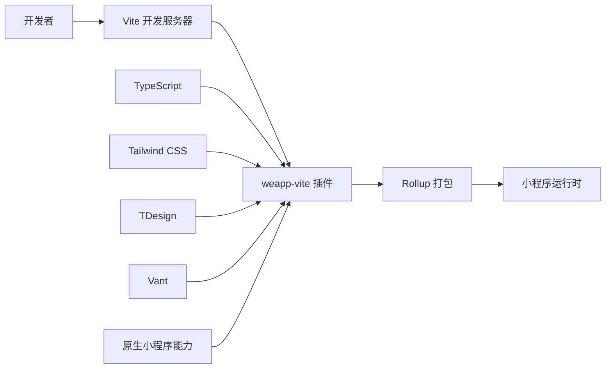
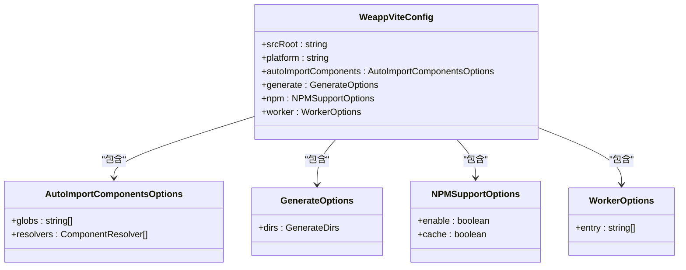
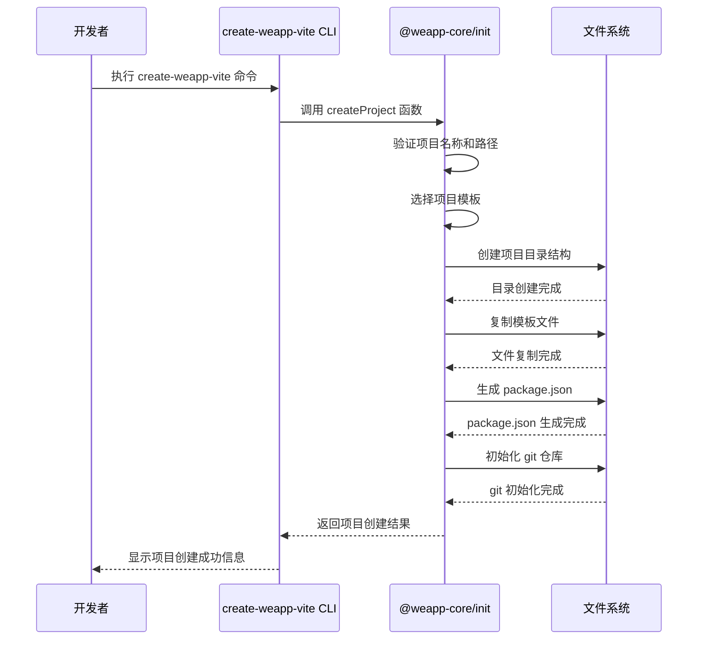
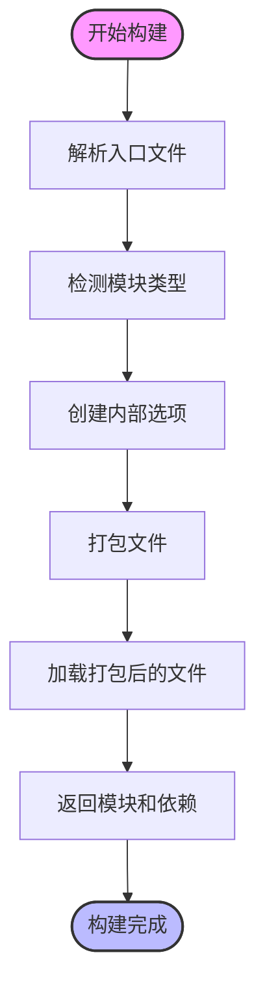
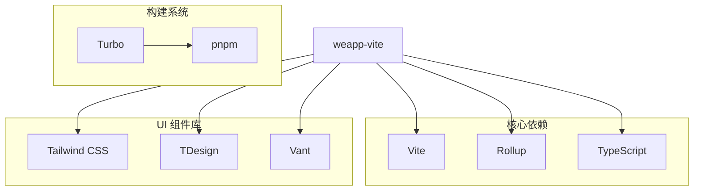

# 项目概述

<cite>
**本文档中引用的文件**  
- [README.md](file://README.md)
- [package.json](file://package.json)
- [monorepo.config.ts](file://monorepo.config.ts)
- [pnpm-workspace.yaml](file://pnpm-workspace.yaml)
- [turbo.json](file://turbo.json)
- [packages/weapp-vite/package.json](file://packages/weapp-vite/package.json)
- [packages/create-weapp-vite/package.json](file://packages/create-weapp-vite/package.json)
- [packages/weapp-vite/src/index.ts](file://packages/weapp-vite/src/index.ts)
- [packages/weapp-vite/src/config.ts](file://packages/weapp-vite/src/config.ts)
- [packages/weapp-vite/src/createContext.ts](file://packages/weapp-vite/src/createContext.ts)
- [packages/rolldown-require/src/index.ts](file://packages/rolldown-require/src/index.ts)
- [apps/vite-native-ts/vite.config.ts](file://apps/vite-native-ts/vite.config.ts)
- [apps/vite-native-ts-skyline/vite.config.ts](file://apps/vite-native-ts-skyline/vite.config.ts)
- [@weapp-core/init/package.json](file://@weapp-core/init/package.json)
- [templates/weapp-vite-tailwindcss-tdesign-template/package.json](file://templates/weapp-vite-tailwindcss-tdesign-template/package.json)
</cite>

## 目录
1. [引言](#引言)
2. [项目结构](#项目结构)
3. [核心组件](#核心组件)
4. [架构概述](#架构概述)
5. [详细组件分析](#详细组件分析)
6. [依赖分析](#依赖分析)
7. [性能考虑](#性能考虑)
8. [故障排除指南](#故障排除指南)
9. [结论](#结论)

## 引言
weapp-vite 是一个现代化的小程序开发工具链，旨在为微信小程序开发提供现代化的工程化能力。该项目基于 Vite 构建，结合了现代前端开发的最佳实践，为开发者提供了快速、高效的开发体验。weapp-vite 不仅保留了原生小程序的开发方式，还引入了现代前端工程化能力，如模块化、热更新、代码分割等特性。

## 项目结构
weapp-vite 项目采用 monorepo 架构，将多个相关的包和应用组织在一个代码仓库中。这种架构设计使得项目管理更加高效，便于跨包的依赖管理和版本控制。

```mermaid
graph TD
subgraph "Monorepo 核心"
weapp-vite[weapp-vite]
create-weapp-vite[create-weapp-vite]
rolldown-require[rolldown-require]
vite-plugin-performance[vite-plugin-performance]
end
subgraph "@weapp-core"
init[@weapp-core/init]
logger[@weapp-core/logger]
schematics[@weapp-core/schematics]
shared[@weapp-core/shared]
end
subgraph "应用示例"
vite-native-ts[vite-native-ts]
vite-native-ts-skyline[vite-native-ts-skyline]
end
subgraph "模板"
tailwindcss-tdesign[tailwindcss-tdesign-template]
end
weapp-vite --> init
weapp-vite --> logger
create-weapp-vite --> init
weapp-vite --> rolldown-require
weapp-vite --> vite-plugin-performance
init --> shared
init --> logger
```

**图示来源**
- [package.json](file://package.json)
- [pnpm-workspace.yaml](file://pnpm-workspace.yaml)

**本节来源**
- [package.json](file://package.json)
- [monorepo.config.ts](file://monorepo.config.ts)
- [pnpm-workspace.yaml](file://pnpm-workspace.yaml)

## 核心组件
weapp-vite 项目的核心组件包括：
- **weapp-vite**: 主要的打包工具，提供现代化的小程序开发体验
- **create-weapp-vite**: 项目初始化工具，帮助开发者快速创建新项目
- **@weapp-core/init**: 核心初始化模块，负责项目创建和配置
- **rolldown-require**: 模块打包和加载工具，支持动态导入
- **vite-plugin-performance**: 性能分析插件，帮助优化构建性能

这些组件共同构成了 weapp-vite 的核心功能体系，为开发者提供完整的开发工具链。

**本节来源**
- [packages/weapp-vite/package.json](file://packages/weapp-vite/package.json)
- [packages/create-weapp-vite/package.json](file://packages/create-weapp-vite/package.json)
- [@weapp-core/init/package.json](file://@weapp-core/init/package.json)

## 架构概述
weapp-vite 的架构设计基于 Vite 的核心理念，采用 ES 模块作为开发服务器的基础，实现了快速的冷启动和热模块替换（HMR）。项目通过 monorepo 架构组织多个相关包，使用 pnpm 作为包管理器，turbo 作为构建工具。



**图示来源**
- [packages/weapp-vite/src/index.ts](file://packages/weapp-vite/src/index.ts)
- [packages/weapp-vite/src/config.ts](file://packages/weapp-vite/src/config.ts)

## 详细组件分析

### weapp-vite 核心分析
weapp-vite 作为项目的核心组件，提供了现代化的小程序开发能力。它通过扩展 Vite 的配置，添加了专门针对小程序的构建选项。



**图示来源**
- [packages/weapp-vite/src/config.ts](file://packages/weapp-vite/src/config.ts)
- [apps/vite-native-ts/vite.config.ts](file://apps/vite-native-ts/vite.config.ts)

### 初始化流程分析
weapp-vite 的项目初始化流程通过 create-weapp-vite 工具实现，该工具依赖于 @weapp-core/init 模块。



**图示来源**
- [packages/create-weapp-vite/package.json](file://packages/create-weapp-vite/package.json)
- [@weapp-core/init/package.json](file://@weapp-core/init/package.json)

### 构建流程分析
weapp-vite 的构建流程基于 Rollup 打包器，通过 rolldown-require 模块实现高效的模块打包和加载。



**图示来源**
- [packages/rolldown-require/src/index.ts](file://packages/rolldown-require/src/index.ts)
- [packages/weapp-vite/src/createContext.ts](file://packages/weapp-vite/src/createContext.ts)

**本节来源**
- [packages/weapp-vite/src/index.ts](file://packages/weapp-vite/src/index.ts)
- [packages/weapp-vite/src/config.ts](file://packages/weapp-vite/src/config.ts)
- [packages/weapp-vite/src/createContext.ts](file://packages/weapp-vite/src/createContext.ts)
- [packages/rolldown-require/src/index.ts](file://packages/rolldown-require/src/index.ts)

## 依赖分析
weapp-vite 项目采用 monorepo 架构，通过 pnpm-workspace.yaml 文件定义工作区包的范围。项目使用 turbo 作为构建工具，通过 turbo.json 配置任务依赖关系。



**图示来源**
- [turbo.json](file://turbo.json)
- [pnpm-workspace.yaml](file://pnpm-workspace.yaml)
- [packages/weapp-vite/package.json](file://packages/weapp-vite/package.json)

**本节来源**
- [turbo.json](file://turbo.json)
- [pnpm-workspace.yaml](file://pnpm-workspace.yaml)
- [package.json](file://package.json)

## 性能考虑
weapp-vite 项目在性能方面做了多项优化：
1. 使用 Vite 的开发服务器，实现快速冷启动
2. 采用 Rollup 进行生产构建，支持代码分割和 tree-shaking
3. 通过 rolldown-require 实现高效的模块打包和加载
4. 提供 vite-plugin-performance 插件进行构建性能分析

这些优化措施确保了开发体验的流畅性和生产构建的高效性。

## 故障排除指南
当遇到问题时，可以参考以下步骤进行排查：
1. 检查 node.js 版本是否满足要求（>=20.0.0）
2. 确认 pnpm 版本是否正确
3. 检查项目依赖是否完整安装
4. 查看构建日志中的错误信息
5. 参考官方文档和示例项目

**本节来源**
- [package.json](file://package.json)
- [README.md](file://README.md)

## 结论
weapp-vite 项目通过现代化的工具链为微信小程序开发提供了全新的开发体验。其 monorepo 架构设计使得项目管理更加高效，支持 TypeScript、Tailwind CSS、TDesign 和 Vant 等现代技术栈。项目在保留原生小程序开发方式的同时，引入了现代前端工程化能力，为不同层次的开发者提供了价值。通过详细的配置选项和丰富的功能特性，weapp-vite 成为了一个强大而灵活的小程序开发工具。