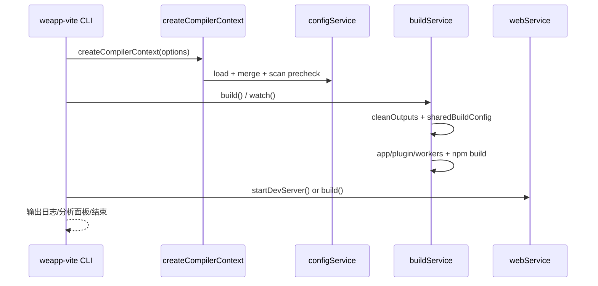

# weapp-vite Monorepo 架构地图

> 目标：给出 `weapp-vite` 仓库的包关系、关键入口、构建链路，作为后续改需求与排障的统一索引。

## 1. 仓库总体结构

`pnpm-workspace.yaml` 定义了本仓库是一个 Turbo + pnpm 的 monorepo，主要由以下工作区组成：

- `packages/*`：核心与周边可发布包
- `@weapp-core/*`：基础能力包（init/logger/shared/schematics）
- `apps/*`：示例与验证应用
- `templates/*`：脚手架模板
- `website`：文档站点（VitePress）

## 2. 核心包关系（依赖视角）

```mermaid
graph TD
  WC[@weapp-core/*\ninit/logger/shared/schematics]
  RR[rolldown-require]
  VPP[vite-plugin-performance]

  WVC[@wevu/compiler]
  WV[wevu]
  WEB[@weapp-vite/web]
  VOLAR[@weapp-vite/volar]
  WEAPI[@wevu/api]
  IDE[weapp-ide-cli]
  CWV[create-weapp-vite]

  WVP[weapp-vite]
  APPS[apps/*]
  TMPL[templates/*]
  SITE[website]

  WC --> WVC
  WC --> VOLAR
  WC --> IDE
  WC --> CWV
  WC --> WVP

  RR --> WVC
  RR --> WEB
  RR --> WVP
  VPP --> WVP

  WVC --> WV
  WV --> WVP
  WEB --> WVP
  VOLAR --> WVP
  WEAPI --> WVP
  IDE --> WVP

  WVP --> APPS
  WVP --> TMPL
  WVP --> SITE
  CWV --> SITE
```

### 关系总结

- `weapp-vite` 是主中枢：聚合构建、CLI、平台适配、插件装配。
- `wevu` 提供运行时能力，`@wevu/compiler` 提供 Vue/SFC 到小程序产物的编译能力。
- `@weapp-vite/web` 提供 Web 运行能力，支持 `-p h5/web` 分支。
- `create-weapp-vite` 与 `templates/*` 共同负责脚手架初始化与模板分发。

## 3. 关键入口地图（代码入口）

## 3.1 `weapp-vite` 包

- CLI 启动：`packages/weapp-vite/bin/weapp-vite.js`
- CLI 注册：`packages/weapp-vite/src/cli.ts`
- 公开 API 入口：`packages/weapp-vite/src/index.ts`
- 配置类型入口：`packages/weapp-vite/src/config.ts`
- 构建命令：`packages/weapp-vite/src/cli/commands/build.ts`
- 开发命令：`packages/weapp-vite/src/cli/commands/serve.ts`
- 运行目标路由（mini/web）：`packages/weapp-vite/src/cli/runtime.ts`

## 3.2 编译上下文与服务装配

- 上下文创建总入口：`packages/weapp-vite/src/createContext.ts`
- 服务注入顺序：`packages/weapp-vite/src/context/createCompilerContextInstance.ts`
  - `config -> watcher -> wxml -> json -> scan -> autoRoutes -> autoImport -> npm -> build -> web`

## 3.3 插件装配与构建执行

- Vite 插件总装配：`packages/weapp-vite/src/plugins/index.ts`
- 插件合并入口（config merge 阶段）：`packages/weapp-vite/src/runtime/config/internal/merge/plugins.ts`
- 构建服务执行主线：`packages/weapp-vite/src/runtime/buildPlugin/service.ts`
- Web 服务执行主线：`packages/weapp-vite/src/runtime/webPlugin.ts`

## 3.4 其他关键包入口

- Wevu 运行时：`packages/wevu/src/index.ts`
- Wevu 编译器：`packages/wevu-compiler/src/index.ts`
- Web 运行时插件：`packages/web/src/index.ts`
- WeAPI 入口：`packages/weapi/src/index.ts`
- Volar 插件：`packages/volar/src/index.ts`
- 脚手架入口：`packages/create-weapp-vite/dev/bin.ts`、`packages/create-weapp-vite/src/cli.ts`
- IDE CLI 入口：`packages/weapp-ide-cli/bin/weapp.js`、`packages/weapp-ide-cli/src/cli.ts`

## 4. 构建链路（从根命令到产物）

## 4.1 根任务编排

根 `package.json` 通过 Turbo 管理全仓构建：

- `pnpm build`：构建主包（排除 apps/templates/website）
- `pnpm build:pkgs`：仅构建 `packages/*` + `@weapp-core/*`
- `pnpm build:apps`：构建示例应用 + 模板
- `pnpm build:docs`：构建文档站

`turbo.json` 中 `build.dependsOn: ["^build"]` 表示依赖包优先构建。

## 4.2 包级构建器分布

- `tsup`：`weapp-vite`、`@weapp-vite/web`、`@weapp-vite/volar`、`weapp-ide-cli`、`create-weapp-vite`、`@weapp-core/*`
- `tsdown`：`wevu`、`@wevu/compiler`、`@wevu/api`
- `unbuild`：`vite-plugin-performance`（以及部分包 dev stub 场景）

## 4.3 `weapp-vite build/dev` 运行链路



### mini/web 分支规则

- 平台路由在 `src/cli/runtime.ts`：
  - 默认：mini（`weapp`）
  - `-p h5`/`-p web`：只走 Web 分支
  - 其他 mini 平台值（如 `weapp`、`tt` 等）：走 mini 分支

## 5. apps / templates / website 与核心包的关系

- `apps/*`：多数项目直接以 `weapp-vite` 作为 `dev/build` 命令入口。
- `templates/*`：作为 `create-weapp-vite` 的模板来源，创建项目时会同步注入当前 `weapp-vite` / `wevu` 版本。
- `website`：文档站 devDependencies 依赖 `weapp-vite` 与 `create-weapp-vite`，用于文档示例与生态联动。

## 6. 快速排查索引（按问题类型）

- CLI 参数/命令行为异常：`packages/weapp-vite/src/cli.ts`
- `build/dev` 平台走错分支：`packages/weapp-vite/src/cli/runtime.ts`
- 插件执行顺序/注入异常：`packages/weapp-vite/src/plugins/index.ts`
- 配置合并结果异常：`packages/weapp-vite/src/runtime/config/*`
- 分包/共享 chunk 行为异常：`packages/weapp-vite/src/runtime/sharedBuildConfig.ts`
- Wevu 编译产物异常：`packages/wevu-compiler/src/*`
- 创建项目模板内容不符合预期：`packages/create-weapp-vite/src/createProject.ts` + `templates/*`

---

如需“按改动类型直接定位文件”，请配合阅读：`docs/change-location-guide.md`。
