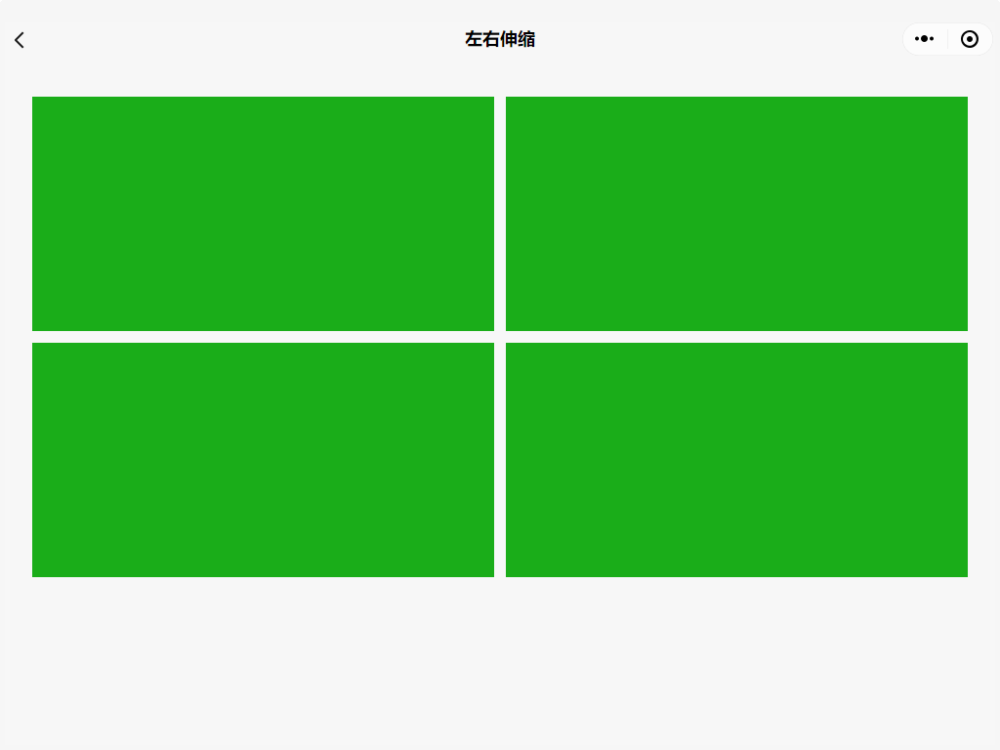
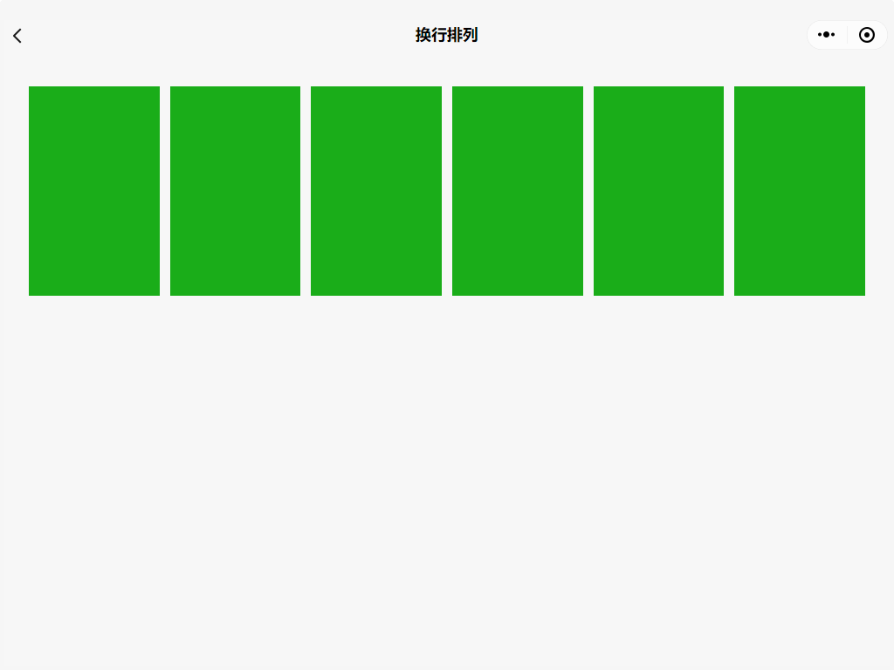
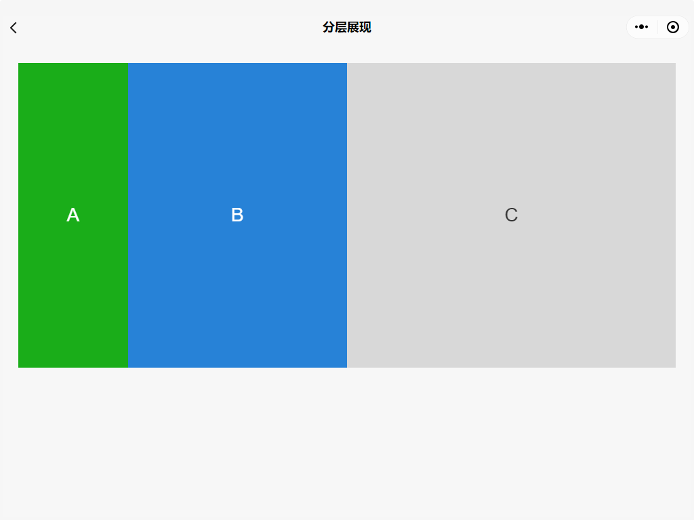

<!-- 来源: https://developers.weixin.qq.com/miniprogram/dev/framework/ability/adapt.html -->

# 大屏适配指南

目前市面上的用户设备大致可分为小屏的手机端、中屏的平板、大屏的 PC 端三类，而在这三类设备中又会有细小的尺寸差别，也称作屏幕碎片化。

随着小程序能够在越来越多的设备终端上运行，开发者也应该针对不同的屏幕尺寸进行相应的适配。

关于如何在设计、用户体验上实现更好的多端适配小程序，可参考 [小程序适配设计指南](https://developers.weixin.qq.com/miniprogram/design/adapt.html) 。

## 1. 适配场景

按照一般的适配原则，结合小程序特点，通常在以下三种情况中需要进行适配：

**同一类设备下，尺寸有细微差别**

使用小程序提供的 [rpx](../view/wxss.md#%E5%B0%BA%E5%AF%B8%E5%8D%95%E4%BD%8D) 单位，在尺寸差别不大的情况下对页面布局进行等比缩放。

**在允许屏幕旋转的情况下，可分为横屏与竖屏**

手机端设置 `"pageOrientation": "auto"` 或 iPad 上设置 `"resizable": true` 时会允许屏幕旋转，此时使用 Page 的 `onResize` 事件或者 `wx.onWindowResize` 方法可对该操作进行监听，进而判断是使用横屏还是竖屏布局。

**不同类设备或者能够自由拖拽窗口的 PC 小程序**

小程序目前是基于 Webview 实现，利用 CSS 媒体查询可实时监听屏幕尺寸大小，在不同的屏幕下展现不同的 UI 布局，结合 Flex 弹性布局、Grid 网格布局便能实现更加响应式的适配方案。

## 2. matchMedia - 抽象式媒体查询

小程序基础库基于 `window.matchMedia API` 新增了一组过程式与定义式接口 `match-media` 。开发者可以通过 [`<match-media>`](https://developers.weixin.qq.com/miniprogram/dev/component/match-media.html) 和 [`wx.createMediaQueryObserver`](https://developers.weixin.qq.com/miniprogram/dev/framework/ability/(wx.createMediaQueryObserver)) 来显式地使用媒体查询能力，对于多端适配来说，它有以下优势：

1. 开发者能够更方便、显式地使用 Media Query 能力，而不是耦合在 CSS 文件中，难以复用。
2. 能够在 WXML 中结合数据绑定动态地使用，不仅能做到组件的显示或隐藏，在过程式 API 中可塑性更高，例如能够根据尺寸变化动态地添加 class 类名，改变样式。
3. 能够嵌套式地使用 Media Query 组件，即能够满足局部组件布局样式的改变。
4. 组件化之后，封装性更强，能够隔离样式、模版以及绑定在模版上的交互事件，还能够提供更高的可复用性。
5. 浏览器内置 API ，能够在所有基于 Webview 的小程序上使用，兼容性良好。

match-media 具体使用方法可参考相关 [API 文档](https://developer.mozilla.org/zh-CN/docs/Web/API/Window/matchMedia) 。

## 3. 自适应布局

为了让开发者更好的自适应大屏，小程序提供了 [row/col 组件](https://developers.weixin.qq.com/miniprogram/dev/extended/component-plus/grid.html) 供开发者使用。

自适应的主要特性是：

- 整行最多只有 24 份，多余的排列会自动向下换行
- 每个尺寸设置并不会影响到其它尺寸的布局

**设计指引与代码示例**

同时我们也提供了 [多端适配示例](https://github.com/wechat-miniprogram/miniprogram-demo) ，体验路径：「扩展能力」 -> 「多端适配（需在PC端体验）」

示例小程序中，基于 [row/col 组件](https://developers.weixin.qq.com/miniprogram/dev/extended/component-plus/grid.html) 简单实现了常见的适配场景，例如：

- 屏幕越大，布局不变，模块左右伸缩

- 屏幕越大，内容越多，模块内容换行排列

- 屏幕越大，布局改变，模块内容可折叠 / 展现

## 4. 分栏模式

在 PC 等能够以较大屏幕显示小程序的环境下，小程序支持以 [分栏模式](../view/frameset.md) 展示。分栏模式可以将微信窗口分为左右两半，各展示一个页面。

