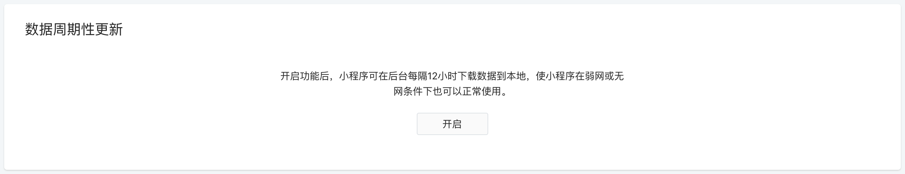
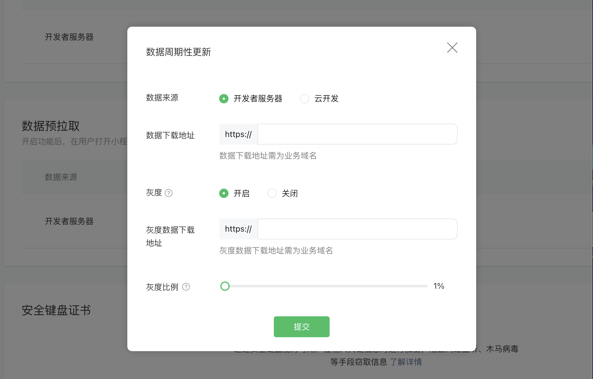

<!-- 来源: https://developers.weixin.qq.com/miniprogram/dev/framework/ability/background-fetch.html -->

# 周期性更新

> 基础库 2.8.0 开始支持，低版本需做 [兼容处理](../compatibility.md) 。

> 生效条件：用户七天内使用过的小程序

周期性更新能够在用户未打开小程序的情况下，也能从服务器提前拉取数据，当用户打开小程序时可以更快地渲染页面，减少用户等待时间，增强在弱网条件下的可用性。

## 使用流程

### 1. 配置数据下载地址

> 数据来源为开发者服务器时支持配置灰度比例，灰度数据下载地址可以区别于数据下载地址，灰度比例不可回退，且 100% 灰度视为更新数据地址为灰度数据地址, 如需进行测试，可将灰度比例改为百分之 0，即只对开发者体验者进行灰度。

1. 登录小程序 MP 管理后台，进入开发管理 -> 开发设置 -> 数据周期性更新，点击开启
2. 个人主体小程序仅支持配置云开发环境
3. 非个人主体小程序支持配置HTTPS数据下载地址、 云开发环境





### 2. 设置 TOKEN

用户登录小程序后，小程序可以调用 [wx.setBackgroundFetchToken()](https://developers.weixin.qq.com/miniprogram/dev/api/storage/background-fetch/wx.setBackgroundFetchToken.html) 设置一个自定义 TOKEN 字符串，可以跟用户态相关，TOKEN 会在下一次预拉取或周期性更新，向开发者服务器发起请求时带上，便于服务器校验请求合法性。

Tips: `wx.setBackgroundFetchToken` 是可选接口，不是必须调用的。

示例：

```javascript
App({
  onLaunch() {
    // 用户登录后
    wx.setBackgroundFetchToken({
      token: 'xxx'
    })
  }
})
```

### 3. 微信客户端定期拉取数据

微信客户端会在一定的网络条件下，每隔 12 小时（以上一次成功更新的时间为准）向配置的数据下载地址发起一个 HTTP GET 请求，其中包含的 query 参数如下，数据获取到后会将整个 HTTP body 缓存到本地。

<table><thead><tr><th>参数</th> <th>类型</th> <th>说明</th></tr></thead> <tbody><tr><td>appid</td> <td>String</td> <td>小程序标识</td></tr> <tr><td>token</td> <td>String</td> <td>前面设置的 TOKEN</td></tr> <tr><td>timestamp</td> <td>Number</td> <td>时间戳，微信客户端发起请求的时间</td></tr></tbody></table>

> query 参数会使用 urlencode 处理

> 开发者服务器接口返回的数据类型应为字符串，且大小应不超过 `256KB` ，否则将无法缓存数据

### 4. 读取数据

用户启动小程序时，调用 [wx.getBackgroundFetchData()](https://developers.weixin.qq.com/miniprogram/dev/api/storage/background-fetch/wx.getBackgroundFetchData.html) 获取已缓存到本地的数据。

示例：

```javascript
App({
  onLaunch() {
    wx.getBackgroundFetchData({
      fetchType: 'periodic',
      success(res) {
        console.log(res.fetchedData) // 缓存数据
        console.log(res.timeStamp) // 客户端拿到缓存数据的时间戳
      }
    })
  }
})
```

## 调试方法

由于微信客户端每隔 12 个小时才会发起一次请求，调试周期性更新功能会显得不太方便。 因此为了方便调试周期性数据，工具提供了下面的调试能力给到开发者，具体可查看 [周期性数据调试](https://developers.weixin.qq.com/miniprogram/dev/devtools/periodic-data.html) 。
