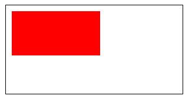
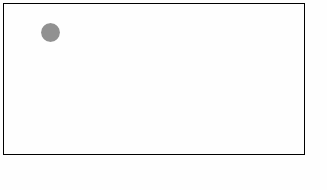
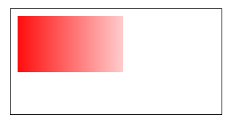
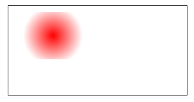

<!-- 来源: https://developers.weixin.qq.com/miniprogram/dev/framework/ability/canvas-legacy.html -->

# 旧版 Canvas 画布

> 本文档介绍的是旧版 Canvas 接口，不支持同层渲染，性能较差。
>
> 建议参考 [旧版 Canvas 迁移指南](./canvas-legacy-migration.md) 迁移至新版 [Canvas 2D 接口](https://developers.weixin.qq.com/miniprogram/dev/component/canvas.html) 。

## Canvas 绘制步骤

所有在 [canvas](https://developers.weixin.qq.com/miniprogram/dev/component/canvas.html) 中的画图必须用 JavaScript 完成：

WXML：（我们在接下来的例子中如无特殊声明都会用这个 WXML 为模板，不再重复）

```html
<canvas canvas-id="myCanvas" style="border: 1px solid;"/>
```

JS：（我们在接下来的例子中会将 JS 放在 onLoad 中）

```js
const ctx = wx.createCanvasContext('myCanvas')
ctx.setFillStyle('red')
ctx.fillRect(10, 10, 150, 75)
ctx.draw()
```

### 第一步：创建一个 Canvas 绘图上下文

首先，我们需要创建一个 Canvas 绘图上下文 [CanvasContext](https://developers.weixin.qq.com/miniprogram/dev/api/canvas/CanvasContext.html) 。

CanvasContext 是小程序内建的一个对象，有一些绘图的方法：

```js
const ctx = wx.createCanvasContext('myCanvas')
```

### 第二步：使用 Canvas 绘图上下文进行绘图描述

接着，我们来描述要在 Canvas 中绘制什么内容。

设置绘图上下文的填充色为红色：

```js
ctx.setFillStyle('red')
```

用 `fillRect(x, y, width, height)` 方法画一个矩形，填充为刚刚设置的红色：

```js
ctx.fillRect(10, 10, 150, 75)
```

### 第三步：画图

告诉 [canvas](https://developers.weixin.qq.com/miniprogram/dev/component/canvas.html) 组件你要将刚刚的描述绘制上去：

```js
ctx.draw()
```

### 结果：



## 坐标系

canvas 是在一个二维的网格当中。左上角的坐标为 `(0, 0)` 。

在上一节，我们用了这个方法 `fillRect(0, 0, 150, 75)` 。

它的含义为：从左上角 `(0, 0)` 开始，画一个 `150 x 75` px 的矩形。

## 代码示例

我们可以在 [canvas](https://developers.weixin.qq.com/miniprogram/dev/component/canvas.html) 中加上一些事件，来观测它的坐标系

```html
<canvas canvas-id="myCanvas"
  style="margin: 5px; border:1px solid #d3d3d3;"
  bindtouchstart="start"
  bindtouchmove="move"
  bindtouchend="end"/>

<view hidden="{{hidden}}">
  Coordinates: ({{x}}, {{y}})
</view>
```

```js
Page({
  data: {
    x: 0,
    y: 0,
    hidden: true
  },
  start (e) {
    this.setData({
      hidden: false,
      x: e.touches[0].x,
      y: e.touches[0].y
    })
  },
  move (e) {
    this.setData({
      x: e.touches[0].x,
      y: e.touches[0].y
    })
  },
  end (e) {
    this.setData({
      hidden: true
    })
  }
})
```

当你把手指放到 canvas 中，就会在下边显示出触碰点的坐标：



## 渐变

渐变能用于填充一个矩形，圆，线，文字等。填充色可以不固定为固定的一种颜色。

我们提供了两种颜色渐变的方式：

- [`createLinearGradient(x, y, x1, y1)`](https://developers.weixin.qq.com/miniprogram/dev/api/canvas/CanvasContext.createLinearGradient.html) 创建一个线性的渐变
- [`createCircularGradient(x, y, r)`](https://developers.weixin.qq.com/miniprogram/dev/api/canvas/CanvasContext.createCircularGradient.html) 创建一个从圆心开始的渐变

一旦我们创建了一个渐变对象，我们必须添加两个颜色渐变点。

[`addColorStop(position, color)`](https://developers.weixin.qq.com/miniprogram/dev/api/canvas/CanvasGradient.addColorStop.html) 方法用于指定颜色渐变点的位置和颜色，位置必须位于0到1之间。

可以用 [`setFillStyle`](https://developers.weixin.qq.com/miniprogram/dev/api/canvas/CanvasContext.setFillStyle.html) 和 [`setStrokeStyle`](https://developers.weixin.qq.com/miniprogram/dev/api/canvas/CanvasContext.setStrokeStyle.html) 方法设置渐变，然后进行画图描述。

### 使用 `createLinearGradient()`

```js
const ctx = wx.createCanvasContext('myCanvas')

// Create linear gradient
const grd = ctx.createLinearGradient(0, 0, 200, 0)
grd.addColorStop(0, 'red')
grd.addColorStop(1, 'white')

// Fill with gradient
ctx.setFillStyle(grd)
ctx.fillRect(10, 10, 150, 80)
ctx.draw()
```



### 使用 `createCircularGradient()`

```js
const ctx = wx.createCanvasContext('myCanvas')

// Create circular gradient
const grd = ctx.createCircularGradient(75, 50, 50)
grd.addColorStop(0, 'red')
grd.addColorStop(1, 'white')

// Fill with gradient
ctx.setFillStyle(grd)
ctx.fillRect(10, 10, 150, 80)
ctx.draw()
```


