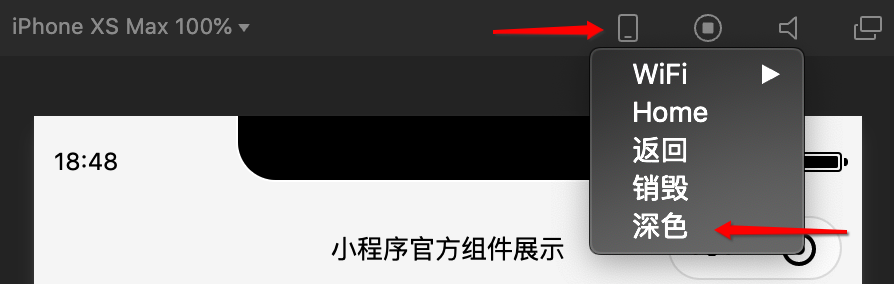

<!-- 来源: https://developers.weixin.qq.com/miniprogram/dev/framework/ability/darkmode.html -->

# DarkMode 适配指南

微信从iOS客户端 7.0.12、Android客户端 7.0.13 开始正式支持 DarkMode，小程序也从基础库 v2.11.0、开发者工具 1.03.2004271 开始，为开发者提供小程序内的 DarkMode 适配能力。

## 开启 DarkMode

在 `app.json` 中配置 `darkmode` 为 `true` ，即表示当前小程序已适配 DarkMode，所有基础组件均会根据系统主题展示不同的默认样式，navigation bar 和 tab bar 也会根据下面的配置自动切换。

## 相关配置

当 `app.json` 中配置 `darkmode` 为 `true` 时，小程序部分配置项可通过变量的形式配置，在变量配置文件中定义不同主题下的颜色或图标，方法如下：

1. 在 `app.json` 中配置 `themeLocation` ，指定变量配置文件 [theme.json](#%E5%8F%98%E9%87%8F%E9%85%8D%E7%BD%AE%E6%96%87%E4%BB%B6-theme-json) 路径，例如：在根目录下新增 `theme.json` ，需要配置 `"themeLocation":"theme.json"`
2. 在 `theme.json` 中定义相关变量；
3. 在 `app.json` 中以 `@` 开头引用变量。

支持通过变量配置的属性：

- 全局配置的 window 属性与页面配置下的属性
    - navigationBarBackgroundColor
    - navigationBarTextStyle
    - backgroundColor
    - backgroundTextStyle
    - backgroundColorTop
    - backgroundColorBottom
- 全局配置 window.tabBar 的属性
    - color
    - selectedColor
    - backgroundColor
    - borderStyle
    - list
          - iconPath
          - selectedIconPath

### 变量配置文件 theme.json

`theme.json` 用于颜色主题相关的变量定义，需要先在 `themeLocation` 中配置 `theme.json` 的路径，否则无法读取变量配置。

配置文件须包含以下属性：

<table><thead><tr><th>属性</th> <th>类型</th> <th>必填</th> <th>描述</th></tr></thead> <tbody><tr><td>light</td> <td>object</td> <td>是</td> <td>浅色模式下的变量定义</td></tr> <tr><td>dark</td> <td>object</td> <td>是</td> <td>深色模式下的变量定义</td></tr></tbody></table>

`light` 和 `dark` 下均可以 `key: value` 的方式定义变量名和值，例如：

```json
{
  "light": {
    "navBgColor": "#f6f6f6",
    "navTxtStyle": "black"
  },
  "dark": {
    "navBgColor": "#191919",
    "navTxtStyle": "white"
  }
}
```

完成定义后，可在全局配置或页面配置的相关属性中以 `@` 开头引用，例如：

```json
// 全局配置
{
  "window": {
    "navigationBarBackgroundColor": "@navBgColor",
    "navigationBarTextStyle": "@navTxtStyle"
  }
}
// 页面配置
{
  "navigationBarBackgroundColor": "@navBgColor",
  "navigationBarTextStyle": "@navTxtStyle"
}
```

配置完成后，小程序框架会自动根据系统主题，为小程序展示对应主题下的颜色。

### 配置示例

app.json（示例省略了主题相关以外的配置项）

```json
{
    "window": {
        "navigationBarBackgroundColor": "@navBgColor",
        "navigationBarTextStyle": "@navTxtStyle",
        "backgroundColor": "@bgColor",
        "backgroundTextStyle": "@bgTxtStyle",
        "backgroundColorTop": "@bgColorTop",
        "backgroundColorBottom": "@bgColorBottom"
    },
    "tabBar": {
        "color": "@tabFontColor",
        "selectedColor": "@tabSelectedColor",
        "backgroundColor": "@tabBgColor",
        "borderStyle": "@tabBorderStyle",
        "list": [{
            "iconPath": "@iconPath1",
            "selectedIconPath": "@selectedIconPath1"
        }, {
            "iconPath": "@iconPath2",
            "selectedIconPath": "@selectedIconPath2"
        }]
    }
}
```

theme.json

```json
{
    "light": {
        "navBgColor": "#f6f6f6",
        "navTxtStyle": "black",
        "bgColor": "#ffffff",
        "bgTxtStyle": "light",
        "bgColorTop": "#eeeeee",
        "bgColorBottom": "#efefef",
        "tabFontColor": "#000000",
        "tabSelectedColor": "#3cc51f",
        "tabBgColor": "#ffffff",
        "tabBorderStyle": "black",
        "iconPath1": "image/icon1_light.png",
        "selectedIconPath1": "image/selected_icon1_light.png",
        "iconPath2": "image/icon2_light.png",
        "selectedIconPath2": "image/selected_icon2_light.png",
    },
    "dark": {
        "navBgColor": "#191919",
        "navTxtStyle": "white",
        "bgColor": "#1f1f1f",
        "bgTxtStyle": "dark",
        "bgColorTop": "#191919",
        "bgColorBottom": "#1f1f1f",
        "tabFontColor": "#ffffff",
        "tabSelectedColor": "#51a937",
        "tabBgColor": "#191919",
        "tabBorderStyle": "white",
        "iconPath1": "image/icon1_dark.png",
        "selectedIconPath1": "image/selected_icon1_dark.png",
        "iconPath2": "image/icon2_dark.png",
        "selectedIconPath2": "image/selected_icon2_dark.png",
    }
}
```

## 获取当前系统主题

如果 `app.json` 中声明了 `"darkmode": true` ， `wx.getSystemInfo` 或 `wx.getSystemInfoSync` 的返回结果中会包含 `theme` 属性，值为 `light` 或 `dark` 。

如果 `app.json` 未声明 `"darkmode": true` ，则无法获取到 `theme` 属性（即 `theme` 为 `undefined` ）。

## 监听主题切换事件

支持2种方式：

1. 在 `App()` 中传入 `onThemeChange` 回调方法，主题切换时会触发此回调
2. 通过 [wx.onThemeChange](https://developers.weixin.qq.com/miniprogram/dev/api/base/app/app-event/wx.onThemeChange.html) 监听主题变化， [wx.offThemeChange](https://developers.weixin.qq.com/miniprogram/dev/api/base/app/app-event/wx.offThemeChange.html) 取消监听

## WXSS 适配

WXSS中，支持通过媒体查询 `prefers-color-scheme` 适配不同主题，与 Web 中适配方式一致，例如：

```css

/* 一般情况下的样式 begin */
.some-background {
    background: white;
}
.some-text {
    color: black;
}
/* 一般情况下的样式 end */

@media (prefers-color-scheme: dark) {
    /* DarkMode 下的样式 start */
    .some-background {
        background: #1b1b1b;
    }
    .some-text {
        color: #ffffff;
    }
    /* DarkMode 下的样式 end */
}
```

## 开发者工具调试

微信开发者工具 1.03.2004271 版本开始已支持 DarkMode 调试，在模拟器顶部可以切换 深色/浅色 模式进行，如图：



## Bug & Tip

1. `tip` : 需要注意的是，WXSS 中的媒体查询不受 `app.json` 中的 `darkmode` 开关配置影响，只要微信客户端（iOS 7.0.12、Android 7.0.13）支持 DarkMode，无论是否配置 `"darkmode": true` ，在系统切换到 DarkMode 时，媒体查询都将生效。
2. `tip` : 主题切换事件需要在配置 `"darkmode": true` 时，才会触发。
3. `bug` : iOS 7.0.12 在 light 模式中配置 tabBar 的 `borderStyle` 为 `white` 时可能会出现黑色背景的 bug，后续版本将会修复。
