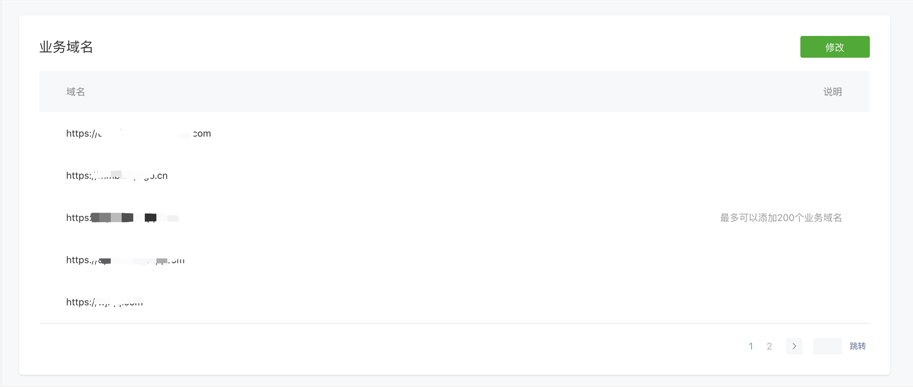

<!-- 来源: https://developers.weixin.qq.com/miniprogram/dev/framework/ability/domain.html -->

# 业务域名

> 基础库 1.6.4 开始支持，低版本需做 [兼容处理](../compatibility.md) 。

> 承载网页的容器。会自动铺满整个小程序页面，小游戏和个人类型的小程序暂不支持使用。 客户端 6.7.2 版本开始， [navigationStyle: custom](https://developers.weixin.qq.com/miniprogram/dev/reference/configuration/app.html) 对 [web-view](https://developers.weixin.qq.com/miniprogram/dev/component/web-view.html) 组件无效 小程序插件中不能使用。

为便于开发者灵活配置小程序，现开放小程序内嵌网页能力。

## 使用流程

### 1. 在管理后台配置业务域名

开发者登录小程序后台mp.weixin.qq.com，选择开发管理->开发设置->业务域名，点击新增，按照要求配置业务域名。目前小程序内嵌网页能力暂不开放给个人类型账号和小游戏账号。

### 2. 调用web-view组件实现小程序内嵌网页

在小程序管理后台成功配置业务域名后，才可使用web-view组件。小程序内调用web-view组件实现内嵌的网页，目前仅支持部分jsapi能力，关于web-view接口具体使用说明和限制，请 [点击查看](https://developers.weixin.qq.com/miniprogram/dev/component/web-view.html)

## 限制说明

1）每个小程序账号支持配置最多300个域名；

2）每个域名支持绑定最多100个主体的小程序；

3）域名只支持https协议，不支持IP地址；

4）业务域名需经过ICP备案，新备案域名需24小时后才可配置；

5）域名格式只支持英文大小写字母、数字及“- ”；

6）配置业务域名后，可打开任意合法的子域名；
