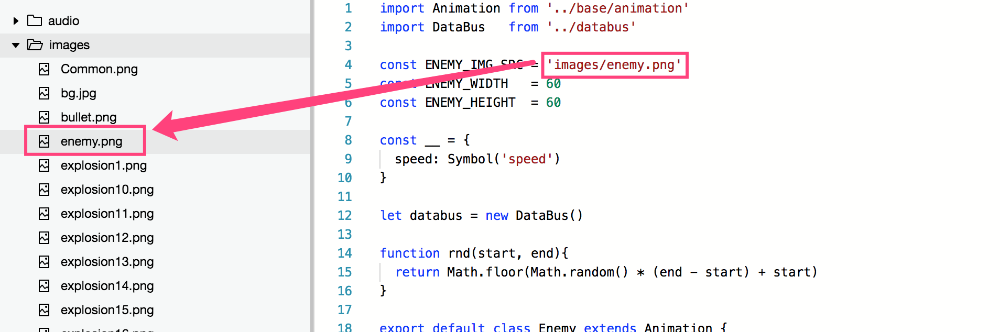
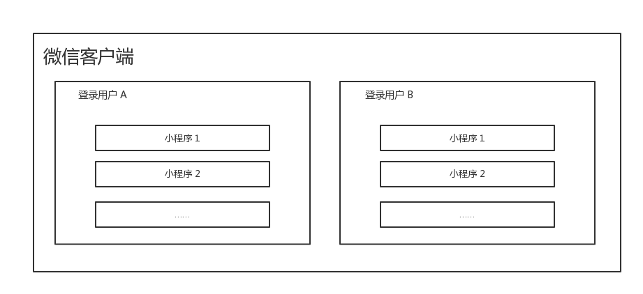

<!-- 来源: https://developers.weixin.qq.com/miniprogram/dev/framework/ability/file-system.html -->

# 文件系统

文件系统是小程序提供的一套以小程序和用户维度隔离的存储以及一套相应的管理接口。通过 [wx.getFileSystemManager()](https://developers.weixin.qq.com/miniprogram/dev/api/file/wx.getFileSystemManager.html) 可以获取到全局唯一的文件系统管理器，所有文件系统的管理操作通过 [FileSystemManager](https://developers.weixin.qq.com/miniprogram/dev/api/file/FileSystemManager.html) 来调用。

```javascript
var fs = wx.getFileSystemManager()
```

文件主要分为两大类：

- 代码包文件：代码包文件指的是在项目目录中添加的文件。
- 本地文件：通过调用接口本地产生，或通过网络下载下来，存储到本地的文件。

其中本地文件又分为三种：

1. 本地临时文件：临时产生，随时会被回收的文件。运行时最多存储 4GB，结束运行后，如果已使用超过 2GB，会以文件为维度按照最近使用时间从远到近进行清理至少于2GB。
2. 本地缓存文件：小程序通过接口把本地临时文件缓存后产生的文件，不能自定义目录和文件名。跟本地用户文件共计，小程序（含小游戏）最多可存储 200MB。
3. 本地用户文件：小程序通过接口把本地临时文件缓存后产生的文件，允许自定义目录和文件名。跟本地缓存文件共计，小程序（含小游戏）最多可存储 200MB。

## 代码包文件

由于代码包文件大小限制，代码包文件适用于放置首次加载时需要的文件，对于内容较大或需要动态替换的文件，不推荐用添加到代码包中，推荐在小游戏启动之后再用下载接口下载到本地。

### 访问代码包文件

代码包文件的访问方式是从项目根目录开始写文件路径，不支持相对路径的写法。如： `/a/b/c` 、 `a/b/c` 都是合法的， `./a/b/c` `../a/b/c` 则不合法。 

### 修改代码包文件

代码包内的文件无法在运行后动态修改或删除，修改代码包文件需要重新发布版本。

## 本地文件

本地文件指的是小程序被用户添加到手机后，会有一块独立的文件存储区域，以用户维度隔离。即同一台手机，每个微信用户不能访问到其他登录用户的文件，同一个用户不同 appId 之间的文件也不能互相访问。 

本地文件的文件路径均为以下格式：

```
{{协议名}}://文件路径
```

> 其中，协议名在 iOS/Android 客户端为 `"wxfile"` ，在开发者工具上为 `"http"` ，开发者无需关注这个差异，也不应在代码中去硬编码完整文件路径。

### 本地临时文件

本地临时文件只能通过调用特定接口产生，不能直接写入内容。本地临时文件产生后，仅在当前生命周期内保证有效，重启之后不一定可用。如果需要保证在下次启动时无需下载，可通过 [FileSystemManager.saveFile()](https://developers.weixin.qq.com/miniprogram/dev/api/file/FileSystemManager.saveFile.html) 或 [FileSystemManager.copyFile()](https://developers.weixin.qq.com/miniprogram/dev/api/file/FileSystemManager.copyFile.html) 接口把本地临时文件转换成本地缓存文件或本地用户文件。

临时文件的清理策略为：小程序退出后系统会检查该小程序的临时文件占用，若不超过2GB则不进行清理，超过上限则以文件为维度按照最近使用时间从远到近进行清理。同时也会检查所有小程序的临时文件占用，若超过6GB则以小程序为维度进行清理。

因此，开发者在下载临时文件时，可先通过 [FileSystemManager.access()](https://developers.weixin.qq.com/miniprogram/dev/api/file/FileSystemManager.access.html) 检查该文件是否存在，减少重复文件下载，提升用户体验。

#### 示例

```javascript
wx.chooseImage({
  success: function (res) {
    var tempFilePaths = res.tempFilePaths // tempFilePaths 的每一项是一个本地临时文件路径
  }
})
```

### 本地缓存文件

本地缓存文件只能通过调用特定接口产生，不能直接写入内容。本地缓存文件产生后，重启之后仍可用。本地缓存文件只能通过 [FileSystemManager.saveFile()](https://developers.weixin.qq.com/miniprogram/dev/api/file/FileSystemManager.saveFile.html) 接口将本地临时文件保存获得。

#### 示例

```javascript
fs.saveFile({
  tempFilePath: '', // 传入一个本地临时文件路径
  success(res) {
    console.log(res.savedFilePath) // res.savedFilePath 为一个本地缓存文件路径
  }
})
```

**注意：本地缓存文件是最初的设计， `1.7.0` 版本开始，提供了功能更完整的本地用户文件，可以完全覆盖本地缓存文件的功能，如果不需要兼容低于 `1.7.0` 版本，可以不使用本地缓存文件。**

### 本地用户文件

本地用户文件是从 `1.7.0` 版本开始新增的概念。我们提供了一个用户文件目录给开发者，开发者对这个目录有完全自由的读写权限。通过 `wx.env.USER_DATA_PATH` 可以获取到这个目录的路径。

#### 示例

```javascript
// 在本地用户文件目录下创建一个文件 hello.txt，写入内容 "hello, world"
const fs = wx.getFileSystemManager()
fs.writeFileSync(`${wx.env.USER_DATA_PATH}/hello.txt`,  'hello, world', 'utf8')
```

## 读写权限

<table><thead><tr><th>接口、组件</th> <th>读</th> <th>写</th></tr></thead> <tbody><tr><td>代码包文件</td> <td>有</td> <td>无</td></tr> <tr><td>本地临时文件</td> <td>有</td> <td>无</td></tr> <tr><td>本地缓存文件</td> <td>有</td> <td>无</td></tr> <tr><td>本地用户文件</td> <td>有</td> <td>有</td></tr></tbody></table>

## 清理策略

- 本地临时文件只保证在小程序当前生命周期内，一旦小程序被关闭就可能被清理，即下次冷启动不保证可用。
- 本地缓存文件和本地用户文件的清理时机跟代码包一样，只有在代码包被清理的时会被清理。
