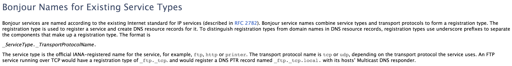
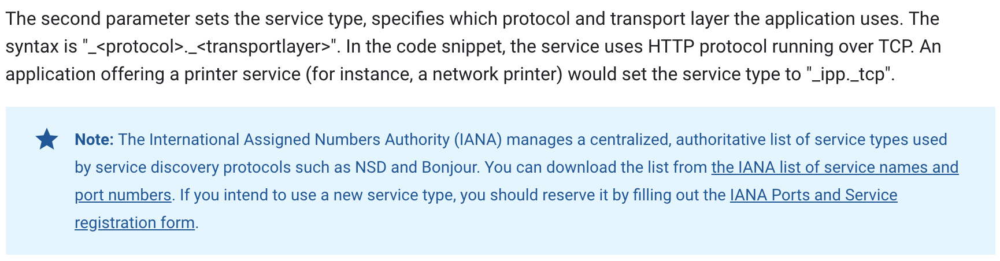

<!-- 来源: https://developers.weixin.qq.com/miniprogram/dev/framework/ability/mDNS.html -->

# 局域网通信

基础库 2.4.0 提供了 [wx.startLocalServiceDiscovery](https://developers.weixin.qq.com/miniprogram/dev/api/network/mdns/wx.startLocalServiceDiscovery.html) 等一系列 mDNS API，可以用来获取局域网内提供 mDNS 服务的设备的 IP。 [wx.request](https://developers.weixin.qq.com/miniprogram/dev/api/network/request/wx.request.html) / [wx.connectSocket](https://developers.weixin.qq.com/miniprogram/dev/api/network/websocket/wx.connectSocket.html) / [wx.uploadFile](https://developers.weixin.qq.com/miniprogram/dev/api/network/upload/wx.uploadFile.html) / [wx.downloadFile](https://developers.weixin.qq.com/miniprogram/dev/api/network/download/wx.downloadFile.html) 的 url 参数允许为 `${IP}:${PORT}/${PATH}` 的格式，当且仅当 IP 与手机 IP 处在同一网段且不与本机 IP 相同（一般来说，就是同一局域网，如连接在同一个 wifi 下）时，请求/连接才会成功。

在这种情况下，不会进行安全域的校验，不要求必须使用 https/wss，也可以使用 http/ws。

```js
wx.request({
  url: 'http://10.9.176.40:828'
  // 省略其他参数
})

wx.connectSocket({
  url: 'ws://10.9.176.42:828'
  // 省略其他参数
})
```

基础库 2.7.0 开始，提供了 [wx.createUDPSocket](https://developers.weixin.qq.com/miniprogram/dev/api/network/udp/wx.createUDPSocket.html) 接口用于进行 UDP 通信。通信规则同上，仅允许同一局域网下的非本机 IP。

## mDNS

目前小程序只支持通过 mDNS 协议获取局域网内其他设备的 IP。iOS 上 mDNS API 的实现基于 [Bonjour](https://developer.apple.com/bonjour/) ，Android 上则是基于 [Android 系统接口](https://developer.android.com/training/connect-devices-wirelessly/nsd) 。

> 由于操作系统相关能力变更，iOS 微信客户端 7.0.18 及以上版本无法使用 mDNS 相关接口，安卓版本不受影响

**serviceType**

发起 mDNS 服务搜索 [wx.startLocalServiceDiscovery](https://developers.weixin.qq.com/miniprogram/dev/api/network/mdns/wx.startLocalServiceDiscovery.html) 的接口有 serviceType 参数，指定要搜索的服务类型。

serviceType 的格式和规范，iOS [Bonjour Overview](https://developer.apple.com/library/archive/documentation/Cocoa/Conceptual/NetServices/Articles/domainnames.html) 在 **Bonjour Names for Existing Service Types** 有提及。



[Android 文档](https://developer.android.com/training/connect-devices-wirelessly/nsd) 对此也有提及。


