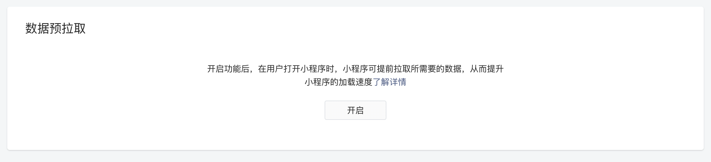
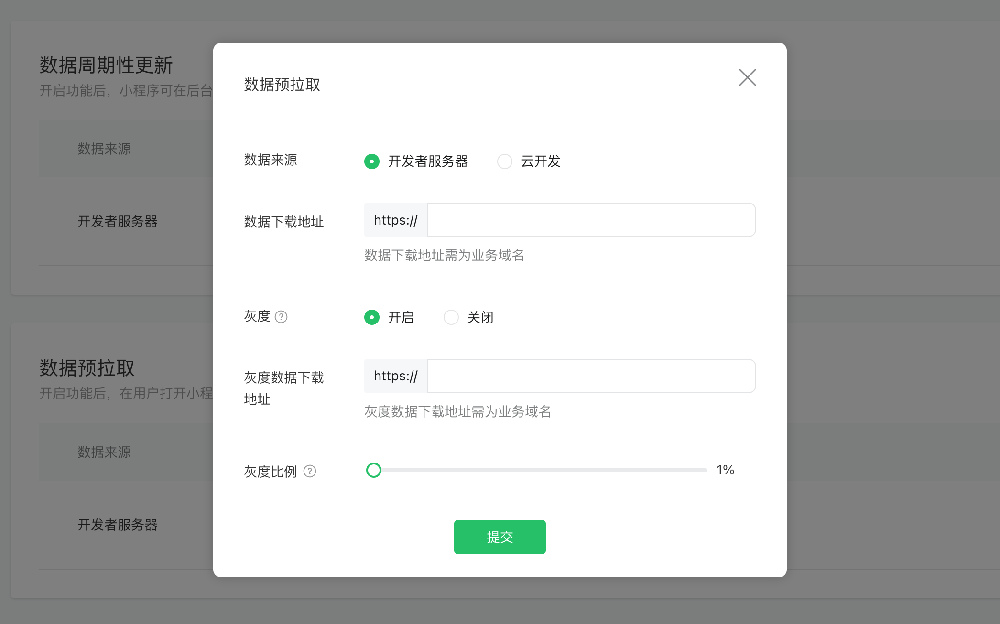

<!-- 来源: https://developers.weixin.qq.com/miniprogram/dev/framework/ability/pre-fetch.html -->

# 数据预拉取

预拉取能够在小程序冷启动的时候通过微信后台提前向第三方服务器拉取业务数据，当代码包加载完时可以更快地渲染页面，减少用户等待时间，从而提升小程序的打开速度 。

## 使用流程

### 1. 配置数据下载地址

> 数据来源为开发者服务器时支持配置灰度比例，灰度数据下载地址可以区别于数据下载地址，灰度比例不可回退，且 100% 灰度视为更新数据地址为灰度数据地址, 如需进行测试，可将灰度比例改为百分之 0，即只对开发者体验者进行灰度。

1. 登录小程序 MP 管理后台，进入开发管理 -> 开发设置 -> 数据预加载，点击开启
2. 个人主体小程序仅支持配置云开发环境
3. 非个人主体小程序支持配置HTTPS数据下载地址、 云开发环境





### 2. 设置 TOKEN

用户登录小程序后，小程序可以调用 [wx.setBackgroundFetchToken()](https://developers.weixin.qq.com/miniprogram/dev/api/storage/background-fetch/wx.setBackgroundFetchToken.html) 设置一个自定义 TOKEN 字符串，可以跟用户态相关，TOKEN 会在下一次预拉取或周期性更新，向开发者服务器发起请求时带上，便于服务器校验请求合法性。

Tips: `wx.setBackgroundFetchToken` 是可选接口，不是必须调用的。

示例：

```javascript
App({
  onLaunch() {
    // 用户登录后
    wx.setBackgroundFetchToken({
      token: 'xxx'
    })
  }
})
```

### 3. 微信客户端提前拉取数据

当用户打开小程序时，微信服务器将向开发者服务器（上面配置的数据下载地址）发起一个 HTTP GET 请求，其中包含的 query 参数如下，数据获取到后会将整个 HTTP body 缓存到本地。

参数中 token 和 code 只会存在一个，用于标识用户身份。 **注意：如果选择使用 code，触发数据预拉取时可能会刷新用户登录态，详见 [checkSessionKey](https://developers.weixin.qq.com/miniprogram/dev/framework/ability/(user-login/checkSessionKey))** 。

<table><thead><tr><th>参数</th> <th>类型</th> <th>必填</th> <th>说明</th></tr></thead> <tbody><tr><td>appid</td> <td>String</td> <td>是</td> <td>小程序标识。</td></tr> <tr><td>token</td> <td>String</td> <td>否</td> <td>前面设置的 TOKEN。</td></tr> <tr><td>code</td> <td>String</td> <td>否</td> <td>用户登录凭证，未设置TOKEN时由微信侧预生成，可在开发者后台调用 auth.code2Session，换取 openid 等信息。</td></tr> <tr><td>timestamp</td> <td>Number</td> <td>是</td> <td>时间戳，微信客户端发起请求的时间</td></tr> <tr><td>path</td> <td>String</td> <td>否</td> <td>打开小程序的路径。</td></tr> <tr><td>query</td> <td>String</td> <td>否</td> <td>打开小程序的query。</td></tr> <tr><td>scene</td> <td>Number</td> <td>否</td> <td>打开小程序的场景值。</td></tr> <tr><td>customMiniprogramVersion</td> <td>String</td> <td>否</td> <td>小程序版本号</td></tr></tbody></table>

> query 参数会使用 urlencode 处理

> 开发者服务器接口返回的数据类型应为字符串，且大小应不超过 `256KB` ，否则将无法缓存数据

### 4. 读取数据

用户启动小程序时，调用 [wx.getBackgroundFetchData](https://developers.weixin.qq.com/miniprogram/dev/api/storage/background-fetch/wx.getBackgroundFetchData.html) 和 [wx.onBackgroundFetchData](https://developers.weixin.qq.com/miniprogram/dev/api/storage/background-fetch/wx.onBackgroundFetchData.html) 获取已缓存到本地的数据。

示例：

```javascript
App({
  onLaunch() {
    wx.onBackgroundFetchData(() => {
      console.log(res.fetchedData) // 缓存数据
      console.log(res.timeStamp) // 客户端拿到缓存数据的时间戳
    })
    wx.getBackgroundFetchData({
      fetchType: 'pre',
      success(res) {
        console.log(res.fetchedData) // 缓存数据
        console.log(res.timeStamp) // 客户端拿到缓存数据的时间戳
        console.log(res.path) // 页面路径
        console.log(res.query) // query 参数
        console.log(res.scene) // 场景值
      }
    })
  }
})
```

## 调试方法

为了方便调试数据预拉取，工具提供了下面的调试能力给到开发者，具体可查看 [预拉取数据调试](https://developers.weixin.qq.com/miniprogram/dev/devtools/prefetch-data.html) 。
