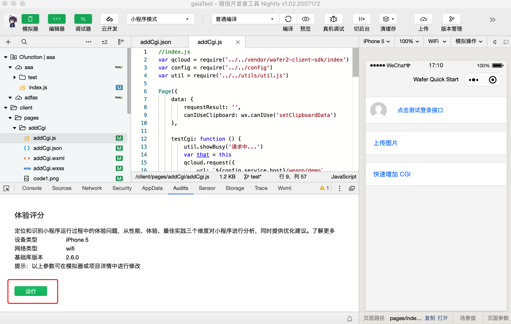
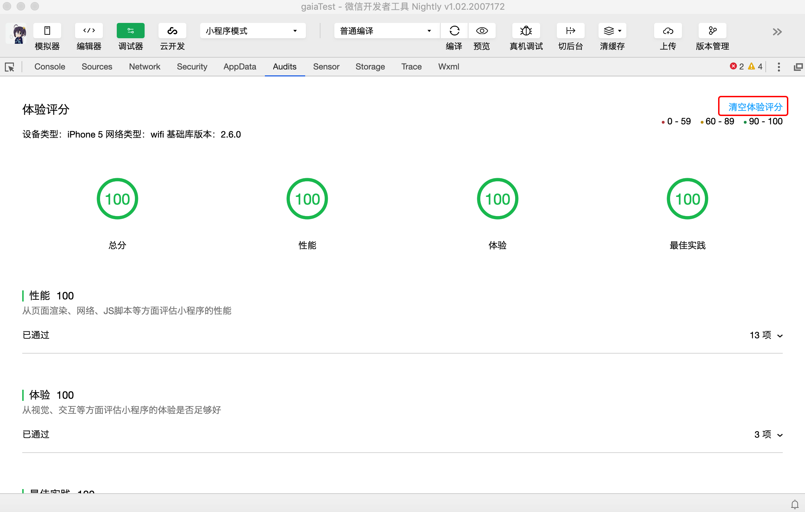
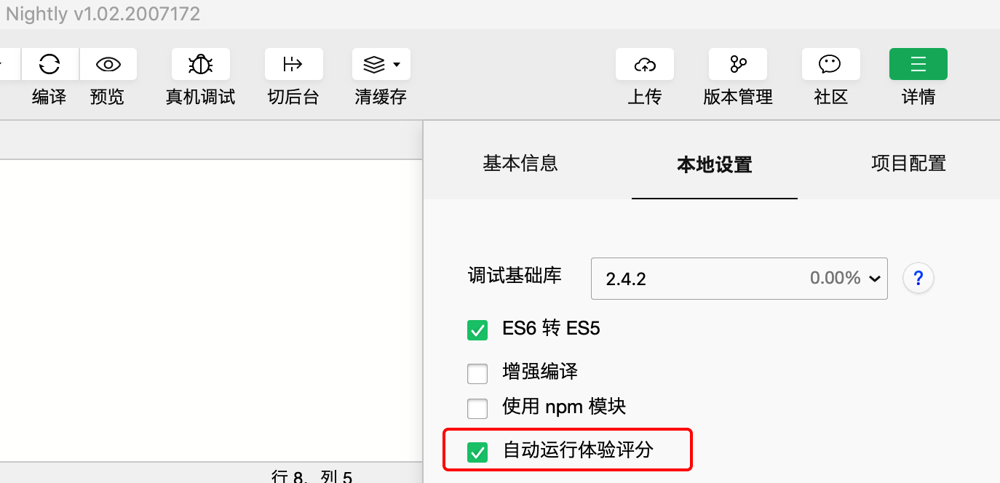

<!-- 来源: https://developers.weixin.qq.com/miniprogram/dev/framework/audits/audits.html -->

# 体验评分

体验评分是一项给小程序的体验好坏打分的功能，它会在小程序运行过程中实时检查，分析出一些可能导致体验不好的地方，并且定位出哪里有问题，以及给出一些优化建议。

基础库 `3.7.0` 版本推出了 [小程序性能诊断工具](../performance/perf_diagnostic_tool.md) ，作为体验评分的升级，可直接在真机进行性能测试。

## 运行环境要求

- 下载并安装 1.02.1808300 或以上版本的开发者工具， [下载地址](https://developers.weixin.qq.com/miniprogram/dev/devtools/download.html) 。
- 基础库需要切到 2.2.0 或以上版本。

## 使用流程

1. 打开开发者工具，在详情里切换基础库到 2.2.0 或以上版本。
2. 在调试器区域切换到 Audits 面板。
3. 点击”开始“按钮，然后自行操作小程序界面，运行过的页面就会被“体验评分”检测到。

1. 点击 “停止" 则结束检测，在当前面板显示相应的检测报告，开发者可根据报告中的建议对相应功能进行优化。
2. 如需再次运行体验评分，可点击报告上方的“清空体验评分”恢复初始状态。请注意，目前系统不提供报告存储服务，一旦清空体验评分，将无法再查看本次评分结果。

## 自动运行

为了方便开发者能够及时发现小程序的体验问题，从开发者工具 1.02.1811150 版本起支持体验评分的 “自动运行” 功能。

该功能会在开发调试小程序时，实时检查，一旦发现体验分数低于 70 分时，系统会在 console 面板打印一个 warning 信息提示开发者，此时开发者可以切到 Audits 面板查看详情。

开发者在工具的右上角 “详情” 面板的 本地设置 中勾选 “自动运行体验评分” 选项即可开启。

## 评分规则

具体的评分细则和详情的规则说明可参考下列文档：

- [评分方法](./scoring.md)
- [性能](./performance.md)
- [体验](./accessibility.md)
- [最佳实践](./best-practice.md)
