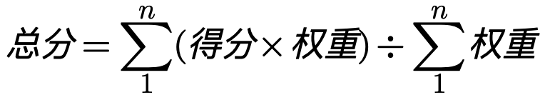

<!-- 来源: https://developers.weixin.qq.com/miniprogram/dev/framework/audits/scoring.html -->

# 评分方法

目前体验评分共有27条规则，共分为三类：性能、体验、最佳实践，满足规则要求得分（100分），否则不得分（0分），最后根据各规则权重和公式计算出总得分。

> 权重为0的规则，表示该规则不参与评分，仅作为提示项。开发者可在开发者工具中可以点击“忽略”。
>
> 各规则的得分条件也可能会随小程序的版本更新有一定的调整。

## 权重如下表

<table><thead><tr><th>分类</th> <th>规则</th> <th>权重</th></tr></thead> <tbody><tr><td>性能</td> <td>脚本执行时间</td> <td>7</td></tr> <tr><td></td> <td>首屏时间</td> <td>6</td></tr> <tr><td></td> <td>渲染时间</td> <td>6</td></tr> <tr><td></td> <td>setData调用频率</td> <td>6</td></tr> <tr><td></td> <td>setData数据大小</td> <td>6</td></tr> <tr><td></td> <td>WXML节点数</td> <td>6</td></tr> <tr><td></td> <td>请求耗时</td> <td>5</td></tr> <tr><td></td> <td>网络请求数</td> <td>5</td></tr> <tr><td></td> <td>图片请求数</td> <td>5</td></tr> <tr><td></td> <td>图片缓存</td> <td>4</td></tr> <tr><td></td> <td>图片大小</td> <td>4</td></tr> <tr><td></td> <td>网络请求缓存</td> <td>2</td></tr> <tr><td>体验</td> <td>开启惯性滚动</td> <td>8</td></tr> <tr><td></td> <td>避免使用<code>:active</code>伪类来实现点击态</td> <td>8</td></tr> <tr><td></td> <td>保持图片大小比例</td> <td>4</td></tr> <tr><td></td> <td>可点击元素的响应区域</td> <td>3</td></tr> <tr><td></td> <td>iPhone X兼容</td> <td>3</td></tr> <tr><td></td> <td>窗口变化适配</td> <td>3</td></tr> <tr><td></td> <td>合理的颜色搭配</td> <td>0</td></tr> <tr><td>最佳实践</td> <td>避免JS异常</td> <td>3</td></tr> <tr><td></td> <td>避免网络请求异常</td> <td>3</td></tr> <tr><td></td> <td>废弃接口</td> <td>2</td></tr> <tr><td></td> <td>使用HTTPS</td> <td>1</td></tr> <tr><td></td> <td>避免setData数据冗余</td> <td>1</td></tr> <tr><td></td> <td>最低基础库版本</td> <td>0</td></tr> <tr><td></td> <td>移除不可访问到的页面</td> <td>0</td></tr> <tr><td></td> <td>WXSS使用率</td> <td>0</td></tr> <tr><td></td> <td>及时回收定时器</td> <td>0</td></tr></tbody></table>

## 规则说明

详细的规则说明可参考下列文档：

- [性能](./performance.md)
- [体验](./accessibility.md)
- [最佳实践](./best-practice.md)
