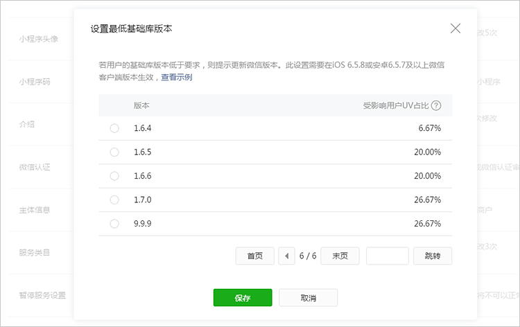
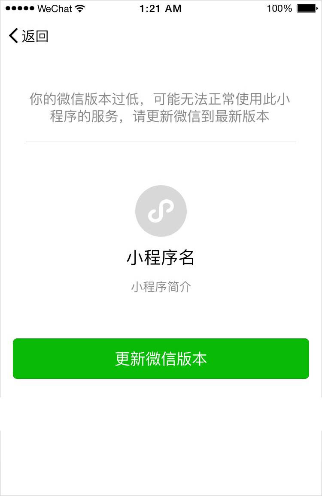

<!-- 来源: https://developers.weixin.qq.com/miniprogram/dev/framework/compatibility.html -->

# 兼容

小程序的功能不断的增加，但是旧版本的微信客户端并不支持新功能，所以在使用这些新能力的时候需要做兼容。

开发者可以通过以下方式进行低版本的兼容：

## 1. 版本号比较

微信客户端和小程序基础库的版本号风格为 Major.Minor.Patch（主版本号.次版本号.修订版本号）。

文档中会在组件，API等页面描述中带上各个功能所要求的最低基础库版本号。

开发者可以在小程序中通过调用 [wx.getAppBaseInfo](https://developers.weixin.qq.com/miniprogram/dev/framework/(wx.wx.getAppBaseInfo)) 获取到当前小程序运行的基础库的版本号。通过版本号比较的方式进行运行低版本兼容逻辑。

版本号比较适用于所有情况。部分场景下也可以使用后面提到的方法完成。

> <=2.20.1 的基础库请使用 [wx.getSystemInfo](https://developers.weixin.qq.com/miniprogram/dev/api/base/system/wx.getSystemInfo.html) ]((wx.getSystemInfo)) 或者 [wx.getSystemInfoSync](https://developers.weixin.qq.com/miniprogram/dev/api/base/system/wx.getSystemInfoSync.html) 获取基础库版本

**注意：不可以直接使用字符串比较的方法进行版本号比较。例如 '2.29.1' > '2.3.0' 是 false 的**

版本号比较可以参考以下代码：

```js
function compareVersion(v1, v2) {
  v1 = v1.split('.')
  v2 = v2.split('.')
  const len = Math.max(v1.length, v2.length)

  while (v1.length < len) {
    v1.push('0')
  }
  while (v2.length < len) {
    v2.push('0')
  }

  for (let i = 0; i < len; i++) {
    const num1 = parseInt(v1[i])
    const num2 = parseInt(v2[i])

    if (num1 > num2) {
      return 1
    } else if (num1 < num2) {
      return -1
    }
  }

  return 0
}

compareVersion('1.11.0', '1.9.9') // 1
```

```js
const version = wx.getAppBaseInfo().SDKVersion

if (compareVersion(version, '1.1.0') >= 0) {
  wx.openBluetoothAdapter()
} else {
  // 如果希望用户在最新版本的客户端上体验您的小程序，可以这样子提示
  wx.showModal({
    title: '提示',
    content: '当前微信版本过低，无法使用该功能，请升级到最新微信版本后重试。'
  })
}
```

## 2. API 存在判断

对于新增的 API，可以通过判断该API是否存在来判断是否支持用户使用的基础库版本。例如：

```js
if (wx.openBluetoothAdapter) {
  wx.openBluetoothAdapter()
} else {
  // 如果希望用户在最新版本的客户端上体验您的小程序，可以这样子提示
  wx.showModal({
    title: '提示',
    content: '当前微信版本过低，无法使用该功能，请升级到最新微信版本后重试。'
  })
}
```

## 3. wx.canIUse

除了直接通过版本号判断，也可以通过 [wx.canIUse](https://developers.weixin.qq.com/miniprogram/dev/api/base/wx.canIUse.html) 来判断是否可以在该基础库版本下直接使用。例如：

**API 参数或返回值**

对于 API 的参数或者返回值有新增的参数，可以判断用以下代码判断。

```js
wx.showModal({
  success: function(res) {
    if (wx.canIUse('showModal.success.cancel')) {
      console.log(res.cancel)
    }
  }
})
```

**组件**

对于组件，新增的组件或属性在旧版本上不会被处理，不过也不会报错。如果特殊场景需要对旧版本做一些降级处理，可以这样子做。

```js
Page({
  data: {
    canIUse: wx.canIUse('cover-view')
  }
})
```

```html
<video controls="{{!canIUse}}">
  <cover-view wx:if="{{canIUse}}">play</cover-view>
</video>
```

> canIUse 的数据文件随基础库进行更新，新版本中的新功能可能出现遗漏的情况，建议开发者在使用时提前测试。

## 设置最低基础库版本

> 需要 iOS 6.5.8 / 安卓 6.5.7 及以上版本微信客户端支持

为便于开发者解决低版本基础库无法兼容小程序的新功能的问题，开发者可设置小程序最低基础库版本要求。

开发者可以登录小程序管理后台，进入「设置 - 基本设置 - 基础库最低版本设置」进行配置。在配置前，开发者可查看近 30 天内访问当前小程序的用户所使用的基础库版本占比，以帮助开发者了解当前用户使用的情况。



设置后，若用户基础库版本低于设置值，则无法正常打开小程序，并提示用户更新客户端版本。


