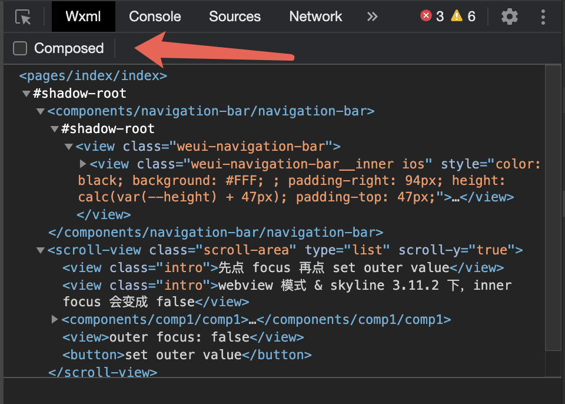

<!-- 来源: https://developers.weixin.qq.com/miniprogram/dev/framework/custom-component/component-system.html -->

# 组件系统

小程序的组件系统与常见的前端框架有所不同，小程序的运行时组织结构包含了一些独特的设计和概念。

## Shadow 树与组件封装

小程序采用了类似 Shadow DOM 的概念来实现组件的封装。每个自定义组件都拥有自己的 Shadow 树，从而将组件的样式和结构与外部环境隔离。这种隔离机制使得组件更加模块化，可以独立管理自己的样式和逻辑，避免受到全局样式的干扰。

基本概念：

- Host Element: 即自定义组件本身，拥有一个 Shadow Root 节点。
- Shadow Root: Shadow 树的根节点，通常包含组件的 WXML 内容。
- Shadow Tree: 被 Shadow Root 包裹的子树，里面内容通常为 WXML 内写的内容。
- Slot Element: WXML 中写的 `<slot>` 节点，用于插入 Host 元素的子节点到 Shadow 树中的指定位置。

**代码示例：**

```html
<!-- 这是自定义组件 comp 的 WXML 结构 -->
<view class="inner">
  {{innerText}}
</view>
<slot></slot>
```

```html
<!-- 这是使用 comp 的 WXML 结构 -->
<comp>
  <view class="outer"></view>
</comp>
```

最终所构造出的树结构为：

```html
<comp> <!-- 这是 Host Element -->
  #shadow-root <!-- 这里是 comp 组件的 Shadow 树 -->
    <view class="inner">{{innerText}}</view>
    <slot></slot> <!-- outer 会被插入到这里 -->
  <view class="outer"></view> <!-- outer 不属于 comp 组件的 Shadow 树 -->
</comp>
```

### Shadow 树的限制

通过 Shadow 树提供的封装能力，组件间的样式和逻辑得到了更明确的隔离，从而避免了外部的干扰。具体来说，Shadow 树有以下几个限制：

#### 1. 样式隔离

组件的样式被与其他组件的 WXSS 以及全局的 `app.wxss` 隔离开来，彼此间无法互相覆盖或影响，也无法直接使用全局的 `class` 。

**提示:** 你可以通过 [组件样式隔离](./wxml-wxss.md#%E7%BB%84%E4%BB%B6%E6%A0%B7%E5%BC%8F%E9%9A%94%E7%A6%BB) 或 [外部样式类](./wxml-wxss.md#%E5%A4%96%E9%83%A8%E6%A0%B7%E5%BC%8F%E7%B1%BB) 等方式，灵活地控制样式的隔离。

#### 2. 事件隔离

通过 [triggerEvent](./events.md#%E8%A7%A6%E5%8F%91%E4%BA%8B%E4%BB%B6) 触发的事件会被限制在 Shadow 树内进行捕获和冒泡，外部组件无法直接监听这些事件。

**提示:** 你可以通过设置 `composed` 参数，改变事件的冒泡和捕获行为，从而允许外部监听。

#### 3. SelectQuery 隔离

使用 [SelectorQuery](https://developers.weixin.qq.com/miniprogram/dev/api/wxml/SelectorQuery.html) 获取节点时，只能获取当前 Shadow 树内的节点，无法访问其他组件的 Shadow 树或外部元素。

#### 4. slot 状态

默认情况下，Host 节点的子节点的 `attached` 和 `detached` 状态仅与节点本身的挂载状态相关，而与 Shadow 树中的 `<slot>` 节点挂载状态无关。

```html
<comp> <!-- 这是 Host Element -->
  #shadow-root <!-- 这里是 comp 组件的 Shadow 树 -->
    <view class="inner">{{innerText}}</view>
    <slot wx:if="{{showSlot}}"></slot> <!-- outer 会被插入到这里 -->
  <view class="outer"></view> <!-- 即使 showSlot 为 false，outer 也是 attached 状态 -->
</comp>
```

**提示:** 你可以设置 [动态 slot](./glass-easel/dynamic-slots.md) 改变此行为。

## Composed 树

在页面和组件渲染结构中，经过剔除虚拟节点和 Shadow Root 节点后，子节点会插入到对应的 `<slot>` 位置，最终形成 Composed 树。

它更加贴近实际的渲染结果，可以帮助开发者更清晰地看到组件和节点之间的真实关系。

**提示:** 你可以在调试面板中切换 Shadow 树和 Composed 树的展示


