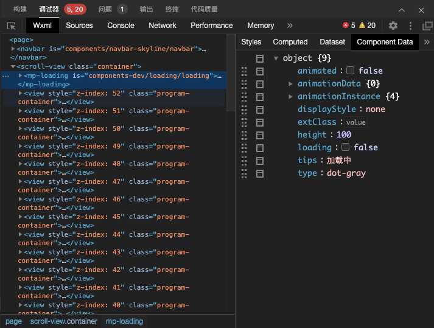

<!-- 来源: https://developers.weixin.qq.com/miniprogram/dev/framework/custom-component/debug.html -->

# 调试自定义组件

wxml 面板中可以查看自定义组件在渲染时的 Data 数据。 在 wxml 中先选中需要查看的自定义组件，然后切换到 `Component Data` 即可实时查看当前自定义组件的数据

