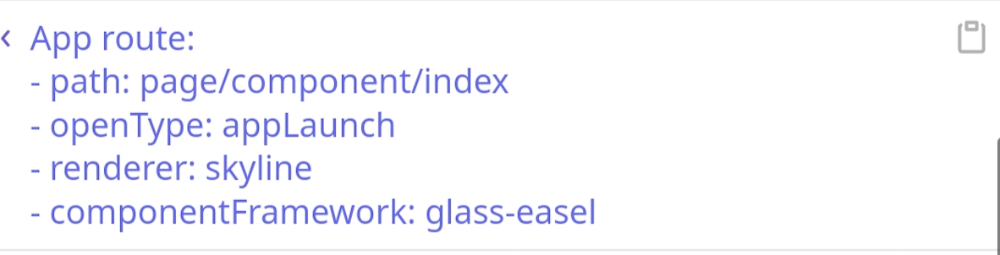

<!-- 来源: https://developers.weixin.qq.com/miniprogram/dev/framework/custom-component/glass-easel/migration.html -->

# glass-easel 适配指引

[*glass-easel*](https://github.com/wechat-miniprogram/glass-easel) 是一个新的组件框架，是对旧版组件框架 *exparser* 的一个重写，拥有 **比旧版组件框架更好的性能和更多的特性** 。

将现有的运行在 *exparser* 上的小程序迁移到 *glass-easel* 需要少量的适配，下面的文档会为适配提供一些指引。

## 运行环境

**[*Skyline* 渲染引擎](../../runtime/skyline/introduction.md)** 目前全量运行在 *glass-easel* 上，因此页面 **必须** 适配 *glass-easel* 才能正常运行，在开发者工具中预览或上传时会有相应的提示和检查；

*WebView* 后端的 *glass-easel* 适配正在进行中，目前正在进行小范围的测试与灰度。

使用微信开发者工具进行调试时， *glass-easel* 需要 1.06.2308142 或更高版本的工具；当工具版本不支持使用 *glass-easel* 时，基础库将中断渲染并提示升级。

在运行过程中， *vConsole* 内的路由日志可以协助确认当前正在使用的组件框架：



## JSON 配置

通过在页面或自定义组件的 JSON 配置中添加以下配置开始适配：

```json
{ "componentFramework": "glass-easel" }
```

添加后，WXML 模板将被编译为适配 *glass-easel* 的新格式 *ProcGen* ，并同时保持对旧版组件框架 *exparser* 兼容。

为一个页面或自定义组件添加这个配置后，所有它依赖的组件也将自动被标记为 *glass-easel* 适配（包括 `usingComponents` 依赖和 `componentGenerics#default` 依赖）

在 `app.json` 中添加这个配置可以全局开启 *glass-easel* 支持。但需要注意的是，配置后编译生成的模板虽然也能在 *exparser* 上运行，但兼容版本在 *exparser* 上有可能遇到边界情况下的兼容性问题，因此除非不需要兼容旧版本基础库或者小程序整体都以 *Skyline* 运行，否则应该更谨慎地使用全局配置。

插件暂未支持页面或自定义组件级别的 `componentFramework` 配置项，可以在 `plugin.json` 中添加这个配置项来开始适配。

## 变更点适配

*glass-easel* 在设计上兼容绝大多数的旧版组件框架 *exparser* 的接口，仅有少数地方需要变更：

1. [必须] 模板中数据绑定外的转义改为标准 XML 转义，数据绑定内的转义现在无需转义
    - 兼容性： [需要手动兼容] *exparser* 上不能使用新的转义写法
    - 旧例：
      ```html
      <view prop-a="\"test\"" prop-b="{{ test === \"test\" }}" />
      ```
    - 新例：
      ```html
      <view prop-a="&quot;test&quot;" prop-b="{{ test === "test" }}" />
      ```
2. [必须] 模板中不再支持 `wx-if` , `wx-for` 两种写法，仅支持 `wx:if` , `wx:for`
    - 兼容性： [推荐直接变更] *exparser* 同样可以使用 `wx:if` , `wx:for`
    - 旧例：
      ```html
      <view wx-if="{{ arr }}" />
      ```
    - 新例：
      ```html
      <view wx:if="{{ arr }}" />
      ```
3. [必须] 在 `wx:for` 中使用 `<include>` 时，被引入的模板中的 , 不再有效，需要改为 `<template>`
    - 兼容性： [推荐直接变更] *exparser* 同样可以使用 `<template>`
    - 旧例：
      ```html
      <block wx:for="{{ arr }}">
         <include src="inc.wxml" />
      </block>

      <!-- inc.wxml -->
      <view>{{ index }}. {{ item }}</view>
      ```
    - 新例：
      ```html
      <import src="inc.wxml" />
      <block wx:for="{{ arr }}">
         <template is="wx-for-content" data="{{ index, item }}" />
      </block>

      <!-- inc.wxml -->
      <template name="wx-for-content">
         <view>{{ index }}. {{ item }}</view>
      </template>
      ```
4. [可选] 由于兼容需要， `wx.createSelectorQuery` 性能不如 `this.createSelectorQuery` ，应尽量使用后者
    - 兼容性： [推荐直接变更] *exparser* 同样支持 `this.createSelectorQuery`
    - 旧例：
      ```typescript
      wx.createSelectorQuery()
        .in(this)
        .select('#webgl')
        .exec(res => { })
      ```
    - 新例：
      ```typescript
      this.createSelectorQuery()
        .select('#webgl')
        .exec(res => { })
      ```
5. [必须] `SelectorQuery` 等接口中的选择器现在和 CSS 选择器一样，不再支持以数字开头
    - 兼容性： [推荐直接变更]
    - 旧例：
      ```typescript
      this.createSelectorQuery()
        .select('#1')
        .exec(res => { })
      ```
    - 新例：
      ```typescript
      this.createSelectorQuery()
        .select('#element-1')
        .exec(res => { })
      ```
6. [必须] [仅 Skyline] Skyline 渲染后端上的 Worklet 回调函数名称变更
    - 兼容性： [推荐直接变更] 旧版本基础库同样支持这些事件名称
    - 变更对应：
      <table><thead><tr><th>组件名</th> <th>原 Worklet 事件名</th> <th>新 Worklet 事件名</th></tr></thead> <tbody><tr><td><a href="../../runtime/skyline/gesture.html#%E9%80%9A%E7%94%A8%E5%B1%9E%E6%80%A7">pan-gesture-handler</a></td> <td><code>on-gesture-event</code></td> <td><code>worklet:ongesture</code></td></tr> <tr><td><a href="../../runtime/skyline/gesture.html#%E9%80%9A%E7%94%A8%E5%B1%9E%E6%80%A7">pan-gesture-handler</a></td> <td><code>should-response-on-move</code></td> <td><code>worklet:should-response-on-move</code></td></tr> <tr><td><a href="../../runtime/skyline/gesture.html#%E9%80%9A%E7%94%A8%E5%B1%9E%E6%80%A7">pan-gesture-handler</a></td> <td><code>should-accept-gesture</code></td> <td><code>worklet:should-accept-gesture</code></td></tr> <tr><td><a href="../../../component/scroll-view.html">scroll-view</a></td> <td><code>bind:scroll-start</code></td> <td><code>worklet:onscrollstart</code></td></tr> <tr><td><a href="../../../component/scroll-view.html">scroll-view</a></td> <td><code>bind:scroll</code></td> <td><code>worklet:onscrollupdate</code></td></tr> <tr><td><a href="../../../component/scroll-view.html">scroll-view</a></td> <td><code>bind:scroll-end</code></td> <td><code>worklet:onscrollend</code></td></tr> <tr><td><a href="../../../component/scroll-view.html">scroll-view</a></td> <td><code>adjust-deceleration-velocity</code></td> <td><code>worklet:adjust-deceleration-velocity</code></td></tr> <tr><td><a href="../../../component/swiper.html">swiper</a></td> <td><code>bind:transition</code><br><code>bind:animationfinish</code></td> <td><code>worklet:onscrollstart</code><br><code>worklet:onscrollupdate</code><br><code>worklet:onscrollend</code></td></tr> <tr><td><a href="../../../component/share-element.html">share-element</a></td> <td><code>on-frame</code></td> <td><code>worklet:onframe</code></td></tr></tbody></table>
    - 旧例：
      ```html
      <scroll-view bindscroll="onScrollWorklet" />
      <swiper bind:transition="onTransitionWorklet" />
      ```
    - 新例：
      ```html
      <scroll-view worklet:onscrollupdate="onScrollWorklet" />
      <swiper
         worklet:onscrollstart="onTransitionWorklet"
         worklet:onscrollupdate="onTransitionWorklet"
         worklet:onscrollend="onTransitionWorklet"
      />
      ```
7. [必须] [仅 Skyline] *Skyline 渲染引擎* 暂不支持以下组件实例方法：
    - `animate`
    - `applyAnimation`
    - `clearAnimation`
    - `setInitialRenderingCache`

## 已知问题

1. 运行在 `exparser` 兼容模式上时， `text` 组件无法换行

## 更新记录

1. `2023-06-01` 支持 WXS
    - 重新预览或上传即可，无版本依赖
2. `2023-06-02` 修复 嵌套的 `wx:for` 可能导致异常 [[wechat-miniprogram/glass-easel#45]](https://github.com/wechat-miniprogram/glass-easel/issues/45)
    - 重新预览或上传即可，无版本依赖
3. `2023-06-02` 修复 `<template name>` 中使用的 WXS 在引用到其他文件中时可能失效 [[wechat-miniprogram/glass-easel#47]](https://github.com/wechat-miniprogram/glass-easel/issues/47)
    - 重新预览或上传即可，无版本依赖
4. `2023-06-12` 修复 `<template>` , `<include>` , `<slot>` 节点上不支持 `wx:` 指令 [[wechat-miniprogram/glass-easel#30]](https://github.com/wechat-miniprogram/glass-easel/issues/30)
    - 重新预览或上传即可，无版本依赖
5. `2023-07-28` 支持兼容模式下 WXS 事件响应中 `ComponentDescriptor` 的 `getState` 方法
    - 需要基础库版本 [3.0.0](../../compatibility.md) 或以上，正在逐步支持到版本 [2.19.2](../../compatibility.md)
6. `2024-05-20` 支持全空的数据绑定
    - 重新预览或上传即可，无版本依赖
7. `2024-10-18` 支持在组件 JS 的 options 中定义 `styleIsolation` 和 `addGlobalClass`
    - 需要基础库版本 [3.6.3](../../compatibility.md) 或以上，后续争取兼容到版本 [3.0.0](../../compatibility.md)
8. `2024-10-28` 支持 WXS 事件响应函数
    - 需要基础库版本 [3.6.4](../../compatibility.md) 或以上，后续争取兼容到版本 [3.0.0](../../compatibility.md)
9. `2024-11-28` Skyline 现全量运行在 *glass-easel* 上，因此不再需要进行 CSS `input` 标签选择器的兼容
    - 开发者无需任何操作
