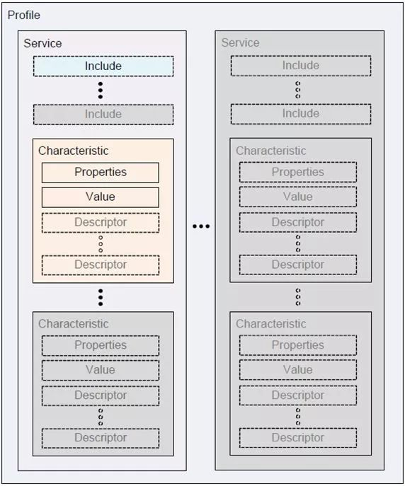

<!-- 来源: https://developers.weixin.qq.com/miniprogram/dev/framework/device/ble.html -->

# 蓝牙低功耗 (Bluetooth Low Energy, BLE)

> 主机模式：基础库 1.1.0（微信客户端 iOS 6.5.6，Android 6.5.7）开始支持。
>
> 从机模式：基础库 2.10.3 开始支持。

蓝牙低功耗是从蓝牙 4.0 起支持的协议，与经典蓝牙相比，功耗极低、传输速度更快，但传输数据量较小。常用在对续航要求较高且只需小数据量传输的各种智能电子产品中，比如智能穿戴设备、智能家电、传感器等，应用场景广泛。

## 1. 角色/工作模式

蓝牙低功耗协议给设备定义了若干角色，或称工作模式。小程序蓝牙目前支持的有以下几种：

### 1) 中心设备/主机 (Central)

中心设备可以扫描外围设备，并在发现有外围设备存在后与之建立连接，之后就可以使用外围设备提供的服务（Service）。

一般而言，手机会担任中心设备的角色，利用外围设备提供的数据进行处理或展示等等。小程序提供低功耗蓝牙接口是默认设定手机为中心设备的。

### 2) 外围设备/从机 (Peripheral)

外围设备一直处于广播状态，等待被中心设备搜索和连接，不能主动发起搜索。例如智能手环、传感器等设备。

如果外围设备广播时被设置为不可连接的状态，也被称为广播模式 (Broadcaster)，常见的例子是 [蓝牙信标 (Beacon)](./beacon.md) 设备。

### 注意

在小程序中，蓝牙设备可以同时处于主机和从机模式。在安卓设备上，只需要调用 [wx.openBluetoothAdapter](https://developers.weixin.qq.com/miniprogram/dev/api/device/bluetooth/wx.openBluetoothAdapter.html) 初始化一次蓝牙适配器；而在 iOS 设备上，需要分别使用两种不同的 `mode` 参数分别初始化中心设备和外围设备的蓝牙适配器。建议统一对于主机和从机模式分别进行一次初始化。 [wx.closeBluetoothAdapter](https://developers.weixin.qq.com/miniprogram/dev/api/device/bluetooth/wx.closeBluetoothAdapter.html) 会同时关闭两种模式的蓝牙适配器。

## 2. 通信协议

在两个蓝牙低功耗设备建立连接之后，双方的数据交互是基于 GATT (Generic Attribute Profile) 规范，根据该规范可以定义出一个个配置文件 (Profile)，描述该蓝牙设备提供的服务 (Service)。

在整个通信过程中，有几个最主要的概念：

- **配置文件 (Profile)** : Profile 是被蓝牙标准预先定义的一些 Service 的集合，并不真实存在于蓝牙设备中。如果蓝牙设备之间要相互兼容，它们只要支持相同的 Profile 即可。一个蓝牙设备可以支持多个 Profile。
- **服务 (Service)** : Service 是蓝牙设备对外提供的服务，一个设备可以提供多个服务，比如电量信息服务、系统信息服务等。每个服务由一个 UUID 唯一标识。
- **特征 (Characteristic)** : 每个 Service 包含 0 至多个 Characteristic。比如，电量信息服务就会有个 Characteristic 表示电量数据。Characteristic 包含一个 **值 (value) **和 0 至多个** 描述符 (Descriptor)** 组成。 **在与蓝牙设备通信时，主要就是通过读写 Characteristic 的 value 完成。** 每个 Characteristic 由一个 UUID 唯一标识。
- **描述符 (Descriptor)** : Descriptor 是描述特征值的已定义属性。例如，Descriptor 可指定人类可读的描述、特征值的取值范围或特定于特征值的度量单位。每个 Descriptor 由一个 UUID 唯一标识。

如下图所示，我们可以简单地理解为：每个蓝牙设备可能提供多个 Service，每个 Service 可能有多个 Characteristic，我们根据蓝牙设备的协议对对应 Characteristic 的值进行读写即可达到与其通信的目的。



## 3. UUID (Universally Unique Identifier)

根据蓝牙 4.2 协议规范(Vol 3, Part B, section 2.5.1 UUID)，UUID 是一个 128 位的唯一标识符，用来标识 Service 和 Characteristic 等。

为了减少存储和传输 128 位 UUID 值的负担，蓝牙技术联盟预分配了一批 UUID，这一批 UUID 拥有一个共同部分，被称为 Bluetooth Base UUID，即 `00000000-0000-1000-8000-00805F9B34FB` 。因此，预分配的 UUID 也可以使用 16 位或 32 位表示，其中 16 位 UUID 最为常用。使用 16/32 位的 UUID 可以降低存储和传输的负载。开发者自定义的 UUID 应注意不能与预分配的 UUID 冲突。

在小程序中， [wx.startBluetoothDevicesDiscovery](https://developers.weixin.qq.com/miniprogram/dev/api/device/bluetooth/wx.startBluetoothDevicesDiscovery.html) 和 [wx.getConnectedBluetoothDevices](https://developers.weixin.qq.com/miniprogram/dev/api/device/bluetooth/wx.getConnectedBluetoothDevices.html) 的参数支持 16/32/128 位 UUID。在其他接口的参数中，

- iOS 支持直接使用 16 位 和 128 位的 UUID；
- Android 8.0.9 版本开始，支持直接使用 16/32/128 位 UUID；
- Android 8.0.9 以下版本，只支持 128 位的 UUID，需要开发者手动补位到 128 位。补位方式如下 例如
  ```
  128位UUID = 16位UUID * 2^96 + Bluetooth Base UUID
  128位UUID = 32位UUID * 2^96 + Bluetooth Base UUID
  ```
  ```
  0x180F -> 0000180F-0000-1000-8000-00805F9B34FB
  ```

所有接口的返回值统一为 128 位 UUID。

## 4. 中心设备的使用流程

### 4.1 初始化蓝牙模块

在使用蓝牙接口前，必须首先调用 [wx.openBluetoothAdapter](https://developers.weixin.qq.com/miniprogram/dev/api/device/bluetooth/wx.openBluetoothAdapter.html) 初始化蓝牙适配器模块，其他接口必须在初始化后成功方可调用。

当蓝牙开关未开启或手机不支持蓝牙时，会返回错误 (errCode=10001)。此时小程序蓝牙模块已经初始化完成，可通过 [wx.onBluetoothAdapterStateChange](https://developers.weixin.qq.com/miniprogram/dev/api/device/bluetooth/wx.onBluetoothAdapterStateChange.html) 监听手机蓝牙状态的改变，也可以调用蓝牙模块的所有API。开发者在开发中应该考虑兼容用户在使用小程序过程中打开/关闭蓝牙开关的情况，并给出必要的提示，提高可用性。

### 4.2 扫描并发现蓝牙外围设备

蓝牙模块初始化成功后，一般需要通过 [wx.startBluetoothDevicesDiscovery](https://developers.weixin.qq.com/miniprogram/dev/api/device/bluetooth/wx.startBluetoothDevicesDiscovery.html) 扫描外围设备。当蓝牙外围设备被扫描到时，会回调 [wx.onBluetoothDeviceFound](https://developers.weixin.qq.com/miniprogram/dev/api/device/bluetooth/wx.onBluetoothDeviceFound.html) 事件，返回扫描到的设备。扫描设备比较耗费系统资源，请在搜索到需要的设备后及时调用 [wx.stopBluetoothDevicesDiscovery](https://developers.weixin.qq.com/miniprogram/dev/api/device/bluetooth/wx.stopBluetoothDevicesDiscovery.html) 停止搜索。

> 若之前已连接过某个设备，获取到了 deviceId，可跳过扫描步骤。

```js
// 监听扫描到新设备事件
wx.onBluetoothDeviceFound((res) => {
  res.devices.forEach((device) => {
    // 这里可以做一些过滤
    console.log('Device Found', device)
  })
  // 找到要搜索的设备后，及时停止扫描
  wx.stopBluetoothDevicesDiscovery()
})

// 初始化蓝牙模块
wx.openBluetoothAdapter({
  mode: 'central',
  success: (res) => {
    // 开始搜索附近的蓝牙外围设备
    wx.startBluetoothDevicesDiscovery({
      allowDuplicatesKey: false,
    })
  },
  fail: (res) => {
    if (res.errCode !== 10001) return
    wx.onBluetoothAdapterStateChange((res) => {
      if (!res.available) return
      // 开始搜寻附近的蓝牙外围设备
      wx.startBluetoothDevicesDiscovery({
        allowDuplicatesKey: false,
      })
    })
  }
})
```

### 4.3 连接设备

蓝牙低功耗设备间要进行通信，必须首先建立连接。

```js
wx.createBLEConnection({
  deviceId, // 搜索到设备的 deviceId
  success: () => {
    // 连接成功，获取服务
    wx.getBLEDeviceServices({
      deviceId,
    })
  }
})
```

### 4.4 获取蓝牙外围设备的服务

```js
wx.getBLEDeviceServices({
  deviceId, // 搜索到设备的 deviceId
  success: (res) => {
    for (let i = 0; i < res.services.length; i++) {
      if (res.services[i].isPrimary) {
        // 可根据具体业务需要，选择一个主服务进行通信
      }
    }
  }
})
```

### 4.5 读写服务的特征值

```js
wx.getBLEDeviceCharacteristics({
  deviceId, // 搜索到设备的 deviceId
  serviceId, // 上一步中找到的某个服务
  success: (res) => {
    for (let i = 0; i < res.characteristics.length; i++) {
      let item = res.characteristics[i]
      if (item.properties.write) { // 该特征值可写
        // 本示例是向蓝牙设备发送一个 0x00 的 16 进制数据
        // 实际使用时，应根据具体设备协议发送数据
        let buffer = new ArrayBuffer(1)
        let dataView = new DataView(buffer)
        dataView.setUint8(0, 0)
        wx.writeBLECharacteristicValue({
          deviceId,
          serviceId,
          characteristicId: item.uuid,
          value: buffer,
        })
      }
      if (item.properties.read) { // 该特征值可读
        wx.readBLECharacteristicValue({
          deviceId,
          serviceId,
          characteristicId: item.uuid,
        })
      }
      if (item.properties.notify || item.properties.indicate) {
        // 必须先启用 wx.notifyBLECharacteristicValueChange 才能监听到设备 onBLECharacteristicValueChange 事件
        wx.notifyBLECharacteristicValueChange({
          deviceId,
          serviceId,
          characteristicId: item.uuid,
          state: true,
        })
      }
    }
  }
})
// 操作之前先监听，保证第一时间获取数据
wx.onBLECharacteristicValueChange((result) => {
  // 使用完成后在合适的时机断开连接和关闭蓝牙适配器
  wx.closeBLEConnection({
    deviceId,
  })
  wx.closeBluetoothAdapter({})
})
```

### 4.6 断开连接和关闭蓝牙适配器

使用完成后，应该在合适的时机断开连接，并关闭蓝牙适配器。

## 5. 注意事项

- iOS 上，对特征值的 `read` 、 `write` 、 `notify` 操作，由于系统需要获取特征值实例，传入的 `serviceId` 与 `characteristicId` 必须由 [wx.getBLEDeviceServices](https://developers.weixin.qq.com/miniprogram/dev/api/device/bluetooth-ble/wx.getBLEDeviceServices.html) 与 [wx.getBLEDeviceCharacteristics](https://developers.weixin.qq.com/miniprogram/dev/api/device/bluetooth-ble/wx.getBLEDeviceCharacteristics.html) 中获取到后才能使用。建议统一在建立连接后先执行 [wx.getBLEDeviceServices](https://developers.weixin.qq.com/miniprogram/dev/api/device/bluetooth-ble/wx.getBLEDeviceServices.html) 与 [wx.getBLEDeviceCharacteristics](https://developers.weixin.qq.com/miniprogram/dev/api/device/bluetooth-ble/wx.getBLEDeviceCharacteristics.html) 后再进行与蓝牙设备的数据交互。
- 考虑到蓝牙功能可以间接进行定位，安卓 6.0 及以上版本，无定位权限或定位开关未打开时，无法进行设备搜索。
- 安卓上，部分机型获取设备服务时会多出 `00001800` 和 `00001801` UUID 的服务，这是系统行为，注意不要使用这两个服务。
- 建立连接和关闭连接必须要成对调用。如果未能及时关闭连接释放资源，安卓上容易导致 state 133 GATT ERROR 的异常。
- 在与蓝牙设备传输数据时，需要注意 MTU（最大传输单元）。如果数据量超过 MTU 会导致错误，建议根据蓝牙设备协议进行分片传输。安卓设备可以调用 [wx.setBLEMTU](https://developers.weixin.qq.com/miniprogram/dev/api/device/bluetooth-ble/wx.setBLEMTU.html) 进行 MTU 协商。在 MTU 未知的情况下，建议使用 20 字节为单位传输。
