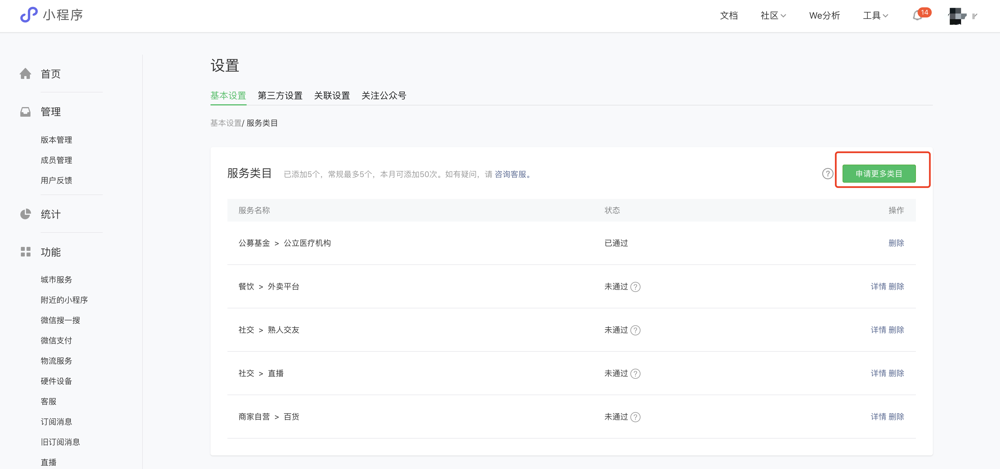
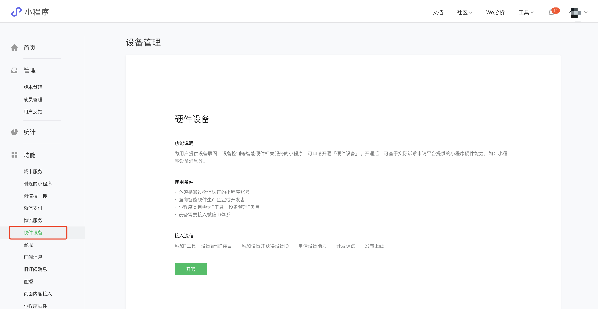
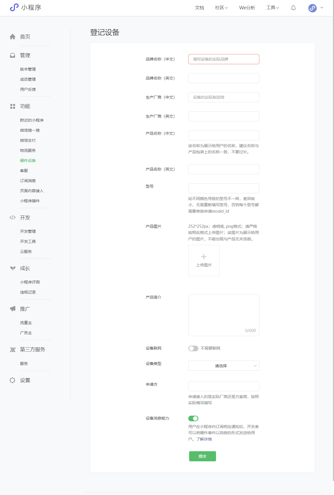
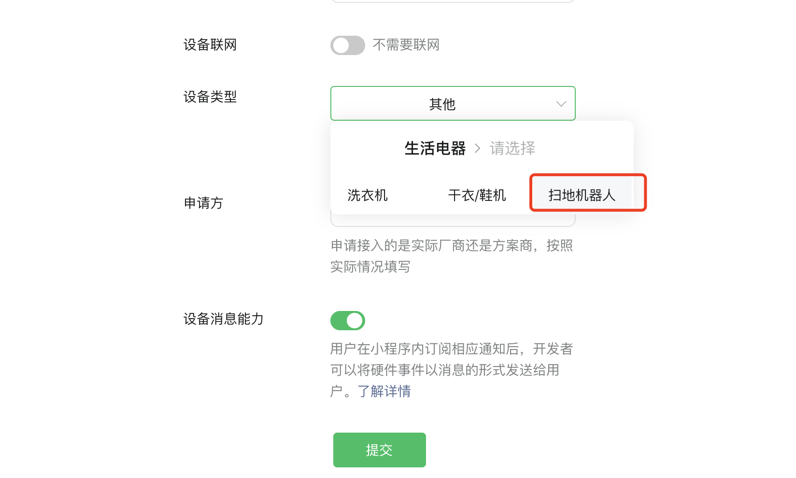

<!-- 来源: https://developers.weixin.qq.com/miniprogram/dev/framework/device/device-access.html -->

# 硬件设备接入指引

提供硬件设备联网、控制、通讯等能力的小程序，在完成设备接入后，才可以使用小程序提供的硬件能力（例如「 [设备消息](./device-message.md) 」、「 [音视频通话](./device-voip.md) 」）等。

## 接入条件

经过微信认证的非个人主体小程序。

面向智能硬件生产企业或开发者。

## 接入步骤

### 1. 申请设备类目

登录「小程序管理后台」——「设置」——「基本设置/服务类目」，点击「申请更多类目」（一个小程序最多可申请5个服务类目）。

添加「工具——设备管理」为小程序类目。

### 2. 开通硬件设备能力

登录「小程序管理后台」——「功能」——「硬件设备」，阅读设备使用条件和接入流程等，点击「开通」。

管理员扫码确认后开通成功，进入设备管理页面。

### 3. 添加设备类型

点击添加设备，按照每个字段对应的说明填写信息，如实填写设备相关信息，否则会导致审核不通过。

每次可注册一种设备类型，如 “空调—空调1号” 和 “空调—空调2号” 要分别进行注册。

#### 注意：

- 选择设备类型时，请认真判断注册设备类型是否为已有设备类型，如“洗拖一体机”隶属于“生活电器——扫地机器人”，请勿重复添加平台设备库已有的设备品类。若是设备库中缺失的设备类型，可选择“其他”。

### 4. 获取设备 model\_id

设备注册成功后，可获得平台分配的 model\_id ，model\_id 是调用小程序设备能力相关接口的重要凭证。获取 model\_id 后，小程序可按照相关文档指引调用「 [设备消息](./device-message.md) 」等硬件能力。
