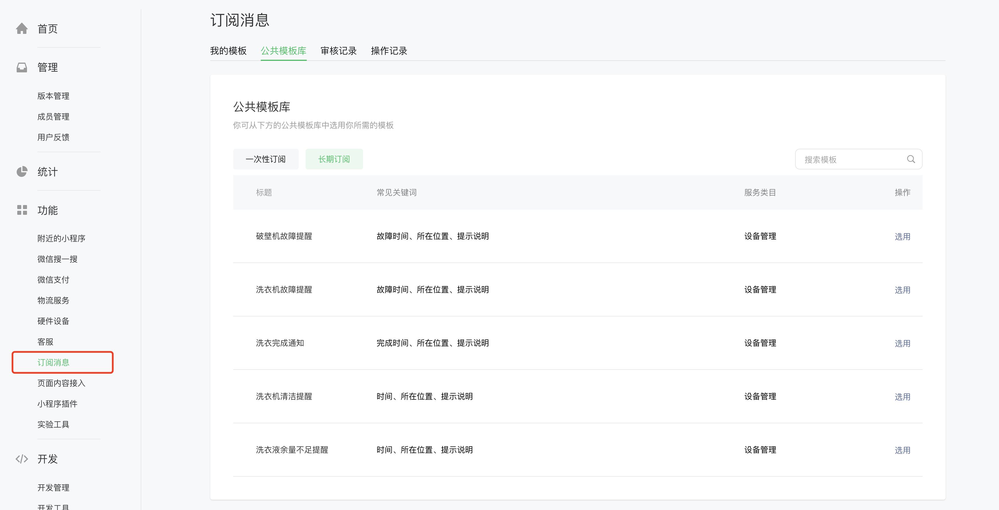
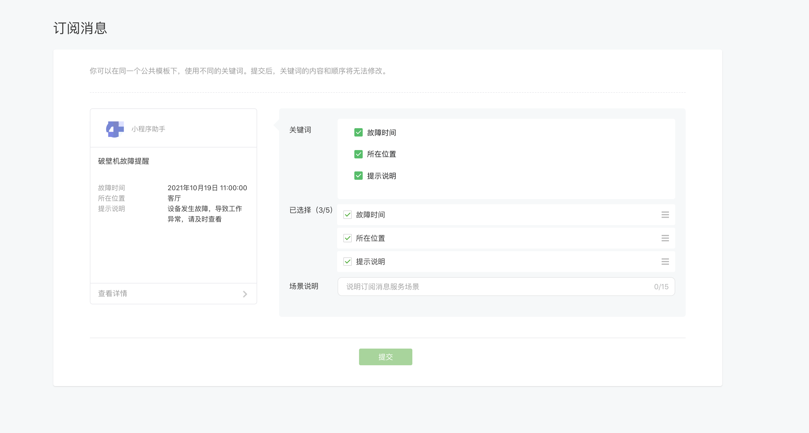
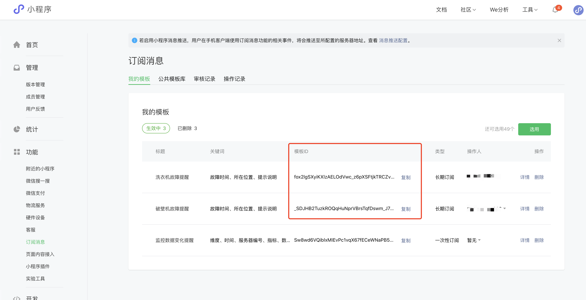
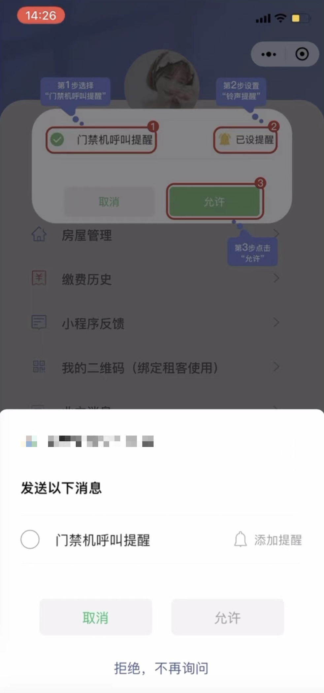
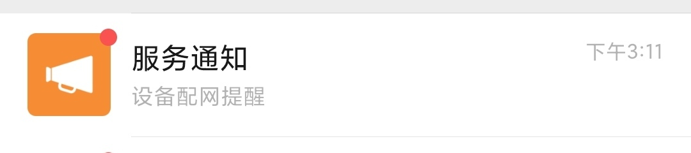
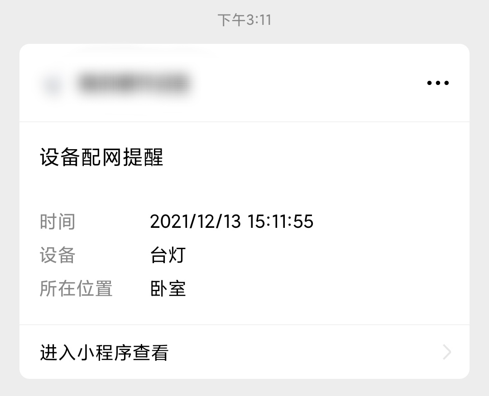

<!-- 来源: https://developers.weixin.qq.com/miniprogram/dev/framework/device/device-message.html -->

# 小程序设备消息

## 能力介绍

「小程序设备消息」是一种长期订阅类型的「 [小程序订阅消息](../open-ability/subscribe-message.md) 」，且需要完成「 [设备接入](./device-access.md) 」才能够使用。

用户在使用设备过程中，需要关注某些由设备触发且需要人工介入的事件。例如安防摄像头检测到异常，设备耗材不足，设备发生故障等等。

「小程序设备消息」能力指的是，只要用户在小程序内订阅通知，开发者就可以将这些事件以订阅消息的形式发送给用户。消息在微信内的产品形态，目前以「服务通知」形式呈现。

## 开发流程

### 1. 设备接入

小程序想要使用设备消息能力，首先需要接入设备，详见「 [设备接入](./device-access.md) 」文档。

完成接入后，开发者可获得由平台分配的 model\_id 。model\_id 对应一种设备类型，也是调用小程序设备能力相关接口的重要凭证。

### 2. 获取模版 ID

登录「小程序管理后台」——「功能」——「订阅消息」——「公共模板库」——「长期订阅」，查看可选用的设备消息模板。



选择设备消息模板中需要的关键词，并提交。

**注意：设备消息模版的关键词内容由平台生成，为枚举值，开发者不能够自定义内容。**



提交后，可在「我的模板」中找到对应模板的模板 ID ，每个模板以 `template_id` 标记。



### 3. 获取设备票据

获取 snTicket 用于「发起订阅」步骤。

详见服务端设备票据接口 [hardwareDevice.getSnTicket](https://developers.weixin.qq.com/miniprogram/dev/api-backend/open-api/hardware-device/hardwareDevice.getSnTicket.html) 。

### 4. 发起订阅

调用 [`wx.requestSubscribeDeviceMessage`](https://developers.weixin.qq.com/miniprogram/dev/api/open-api/subscribe-message/wx.requestSubscribeDeviceMessage.html) 接口会有以下授权弹窗出现，用户同意订阅消息后，才会有设备消息发送至用户的微信会话。

**小程序内完成设备消息订阅**

用户订阅设备消息时，需要手动点击“添加提醒”，设备触发消息后才会出现“响铃+振动”的强提醒状态，开发者可以在前端界面进行引导。



#### 示例代码

```js
wx.requestSubscribeDeviceMessage({
    sn: 'xxxx',
    snTicket: 'xxxxx',
    modelId: 'xxxxx',
    tmplIds: ['xxxxx'],
    success(res) {
        console.log('[wx.requestSubscribeDeviceMessage success]: ', res)
        // { 'QCpBsp1TGJ1ML-UIwAIMkdXpPGzxSfwJqsKsvMVs3io': 'accept' }
    },
    fail(res) {
        console.log('[wx.requestSubscribeDeviceMessage fail]: ', res)
    }
})
```

### 5. 发送设备消息

开发者通过微信服务端接口向用户推送设备消息。

详见服务端设备消息发送接口 [hardwareDevice.send](https://developers.weixin.qq.com/miniprogram/dev/api-backend/open-api/hardware-device/hardwareDevice.send.html) 。

**服务通知 - 设备消息**



**设备消息具体形式**


