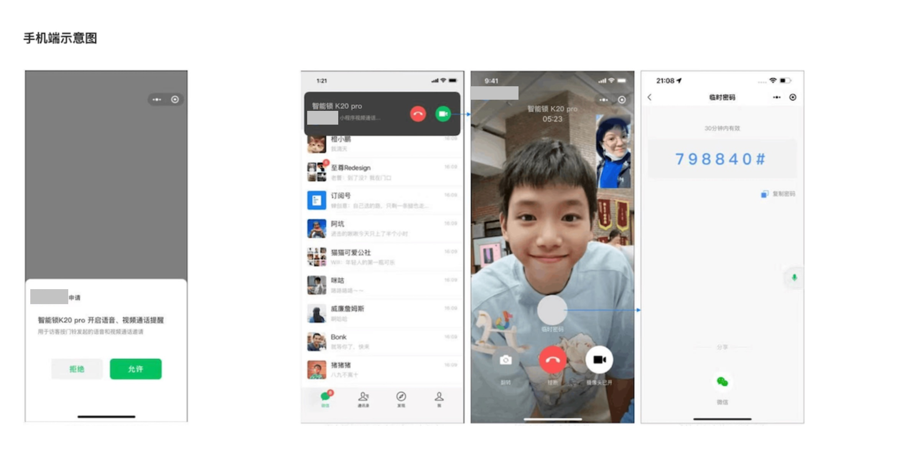
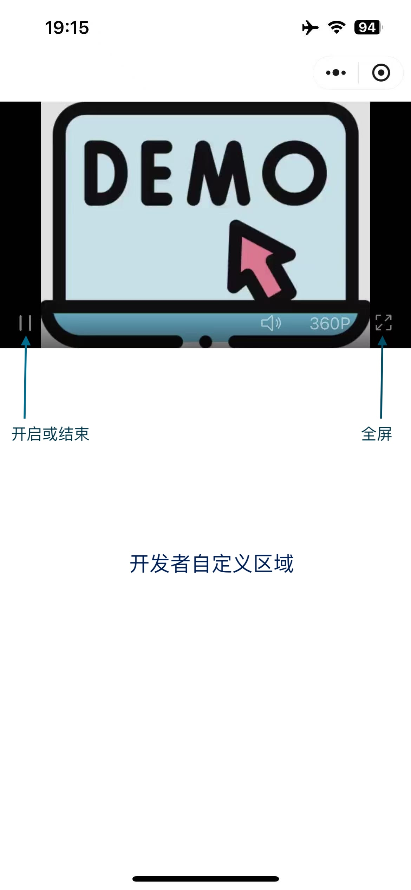
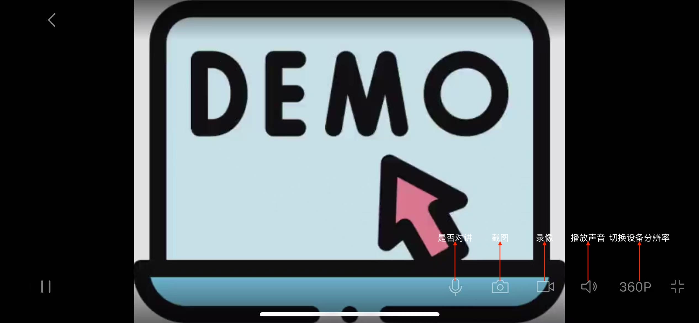

<!-- 来源: https://developers.weixin.qq.com/miniprogram/dev/framework/device/device-voip.html -->

# 小程序音视频通话+摄像头（for 硬件）

> 接入流程和常见问题也可参考 [微信小程序音视频通话（for 硬件） 使用手册](https://developers.weixin.qq.com/community/minihome/doc/0008c27a1c87105df45fcab665b001)

## 1. 产品介绍

### 1.1 小程序 Voip

借助微信 [小程序音视频通话插件](./voip-plugin/README.md) ，硬件开发者可以通过 [小程序硬件框架(WMPF)](https://developers.weixin.qq.com/doc/oplatform/Miniprogram_Frame/) 、Linux SDK 接入、云云接入三种方式实现智能设备和手机微信端的一对一音视频通话，满足实时触达场景，提升通话体验。

下图为手机端的示意图，授权弹窗、通话提醒、通话界面为微信提供的统一界面，硬件小程序接入微信 VOIP 通话插件后，可实现上述功能。



适用于校园话机、门禁机、智能门锁、智慧中控屏、智能电视、智能摄像头、智能音箱、智慧养老等多种设备和场景，支持硬件设备和手机端双向通话，实现通话强提醒。

### 1.2 小程序摄像头

借助微信小程序音视频通话插件里的 [摄像头能力](./voip-plugin/index_camera.md) ，开发者能够快速的将摄像头类产品接入微信小程序生态( **云对云的方式** ），用户查看摄像头流媒体也更加方便，培养用户小程序观看摄像头的习惯。

针对摄像头涉及的功能，分成组件必选、组件可选、自定义等部分。

<table><thead><tr><th>类型</th> <th>模块</th> <th>功能点</th> <th>描述</th></tr></thead> <tbody><tr><td>组件必选</td> <td>播放器</td> <td>播放</td> <td>播放、暂停</td></tr> <tr><td>组件必选</td> <td>播放器</td> <td>画面缩放</td> <td>放大、缩小</td></tr> <tr><td>组件必选</td> <td>播放器</td> <td>音量</td> <td>音量、静音</td></tr> <tr><td>组件必选</td> <td>播放器</td> <td>屏幕</td> <td>小屏、全屏</td></tr> <tr><td>组件必选</td> <td>对讲</td> <td>设备呼叫手机</td> <td>VoIP功能</td></tr> <tr><td>组件可选</td> <td>播放器</td> <td>清晰度</td> <td>开发者传入</td></tr> <tr><td>组件可选</td> <td>对讲</td> <td>手机呼叫设备</td> <td>呼叫、挂断</td></tr> <tr><td>自定义（举例）</td> <td>轮盘</td> <td>方向控制</td> <td>一般用来控制摄像头转动</td></tr> <tr><td>自定义（举例）</td> <td>增值服务</td> <td>云存储</td> <td></td></tr> <tr><td>自定义（举例）</td> <td>增值服务</td> <td>AI服务</td> <td></td></tr></tbody></table>

**小程序界面** ：



**全屏界面** ：



## 2. 设备要求

目前支持安卓系统、Linux 系统、RTOS 系统的设备。 **每台设备只能绑定一个小程序，只能和一个小程序进行通话。**

目前支持 **「设备直连」和「云对云」** 两种接入模式：

- 设备直连：支持 **安卓和 Linux 设备** 。由设备端直接向微信后台发送并接受音视频流和信令，与用户手机微信内的小程序进行通话。
- 云对云：支持无法满足设备直连硬件需要的 **低功耗 Linux、RTOS 等系统设备** 。设备端仅进行设备验证，由开发者后台（服务端）向微信后台转发音视频流和信令，与用户手机微信内的小程序进行通话。

### 2.1 设备直连（安卓）

安卓系统设备端运行小程序硬件框架(WMPF)，WMPF 内运行开发者小程序，直接与用户手机微信内的小程序进行通话；

设备应满足下列基本要求：

- 具有音视频能力（麦克风、摄像头等硬件设备）；
- 满足 [小程序设备认证的设备要求](./device-register.md) ；
- 满足 [安卓小程序硬件框架运行要求](https://developers.weixin.qq.com/doc/oplatform/Miniprogram_Frame/#_2-%E4%BA%A7%E5%93%81%E8%83%BD%E5%8A%9B)
    - 系统版本：建议安卓 7.1 及以上版本
    - CPU：至少四核 2GHz，视频通话对 CPU 有更高要求
    - 内存：至少 2GB RAM + 8GB ROM
- 建议使用 **小程序硬件框架 v2.1.0 及以上版本** 。

### 2.2 设备直连（Linux）

Linux 系统设备端调用 [小程序音视频通话 SDK (Linux)](./voip/voip-sdk.md) ，直接与用户手机微信内的小程序进行通话。

设备应满足下列基本要求：

- 具有音视频能力（麦克风、摄像头等硬件设备）；
- 满足 [小程序设备认证的设备要求](./device-register.md) ；
- 满足运行 [小程序音视频通话 SDK (Linux)](./voip/voip-sdk.md) 的设备要求。

### 2.3 云对云

目前支持部分低功耗 Linux、RTOS 等系统的设备。设备端进行设备验证，经由开发者后台中转，与用户手机微信内的小程序进行通话。

设备应满足下列基本要求：

- HTTPS 通信能力
- 存储能力
- 音(视)频能力

## 3. 开发前准备

以下几个环节可以同时进行，涉及到多个平台侧的审核流程，请提前预留时间。

### 3.1 【仅安卓直连设备】接入微信硬件平台

> 注册微信终端合作平台和微信开放平台账号、登记设备信息等环节均涉及平台审核，请提早准备。

参考 [文档](https://developers.weixin.qq.com/doc/oplatform/Miniprogram_Frame/process.html) 指引，完成「微信终端合作平台 (wecooper)」企业主体账号注册、移动应用绑定和硬件注册的流程。

本步骤主要是将设备接入微信的设备体系，完成设备与 APP，以及 APP 与小程序之间的关联。

- 为避免混淆，移动应用的 appId 一般被称为 hostAppId；
- 每一台硬件设备都需要使用 hostAppId 身份调用 [addDevice](https://developers.weixin.qq.com/doc/oplatform/Miniprogram_Frame/api/backend/addDevice.html) 接口完成注册，才可以使用 安卓 WMPF。

### 3.2 设备接入和申请设备能力

> 此环节涉及平台审核，请提早准备。

小程序想要使用音视频通话能力能力，需要在小程序管理平台 **申请开通「小程序音视频能力」设备能力** 。详见「 [设备接入](./device-access.md) 」文档和 [微信小程序音视频通话（for 硬件） 使用手册](https://developers.weixin.qq.com/community/minihome/doc/0008c27a1c87105df45fcab665b001) 中的流程指引，并关注 [《硬件 VoIP 审核验证要求》](https://developers.weixin.qq.com/community/minihome/doc/00002e131e8cc8ae8a7f5473f56c01) 。

完成接入后，开发者可获得由平台分配的 model\_id。model\_id 对应一种设备类型，是调用小程序设备能力相关接口的重要凭证。

获取 model\_id 后，开发者可以调用 [获取设备票据](https://developers.weixin.qq.com/miniprogram/dev/framework/device/(getSnTicket)) 接口获取 snTicket，用于后续的 [设备验证](./device-register.md) 流程。

### 3.3 接入 VOIP 插件

小程序音视频通话的主要功能通过「 [VOIP 通话](./voip-plugin/README.md) 」这一 [小程序插件](../plugin/using.md) （appId: wxf830863afde621eb）提供。

在小程序管理后台完成「小程序音视频能力」申请并通过后，小程序可以直接使用 VOIP 通话插件，无需额外申请。

如果开发者想要提前进行调试，可以手动进行申请：登录「小程序管理后台」——「设置」——「第三方设置」——「插件管理」，点击「添加插件」，搜索并添加「VOIP 通话」插件。

## 4. 设备端开发

- 安卓设备端需要运行一个开发者提供的安卓应用，用来进行设备注册、运行小程序进行 VOIP 通话。请参考 [《开发设备端应用（安卓）》](./voip/device-app-android.md)
- Linux 设备端需要集成 [小程序音视频通话 SDK (Linux)](./voip/voip-sdk.md)
- RTOS 设备端需要集成 [SDK](https://git.weixin.qq.com/wxa_iot/cloudvoipsdk) 用于进行呼叫。

## 5. 小程序开发

开发者需要开发（或使用现有）小程序，接入 [「VOIP 通话」](./voip-plugin/README.md) 插件，实现拨打和接听音视频通话的能力。

- 与安卓设备通话时，开发者需要使用同一个小程序，既运行在安卓设备端（设备发起或接听通话），也运行在手机端微信客户端（手机用户发起或接听通话）。
- 与 Linux 设备通话时，设备端运行「小程序音视频通话 SDK (Linux)」，手机端微信客户端内运行小程序（手机用户发起或接听通话）。
- 与 RTOS 设备通话时，设备端的 SDK 用于发起呼叫，服务端的 SDK 用于通过过程中的视频流转，手机端微信客户端内运行小程序（手机用户发起或接听通话）。

## 5.1 核心流程

**至少使用微信客户端 8.0.30 及以上版本，建议使用当前最新版本。**

小程序开发主要有以下环节，请参考各环节的文档：

1. 接入「VOIP 通话」插件：参考 [插件文档](./voip-plugin/README.md) 在小程序中引入插件；
2. 设备呼叫手机微信：

- 需要用户在 **手机微信端** 先对设备进行授权，请参考 [《用户授权》](./voip/auth.md) ；
- 适用于已注册并且用户授权过的设备发起通话，用户在手机微信内接听，请参考 [《设备呼叫手机微信》](./voip/call-wechat.md) ；

1. 手机微信呼叫设备：适用于用户在手机微信内发起通话，已注册并且用户授权过的设备接听，请参考 [《手机微信呼叫设备(安卓)》](./voip/call-wmpf.md) 和 [《手机微信呼叫设备(Linux)》](./voip/call-device.md) ；
2. 性能与体验优化：请参考 [《性能与体验优化》](./voip/performance.md) 。

**通话相关异常，请参考 [《通话异常排查指南》](./voip/guide.md)**

## 5.2 调试说明

**VoIP 通话流程暂不支持在微信开发者工具进行调试，请使用真机进行。**

### 5.2.1 设备端使用「开发版/体验版小程序」

安卓设备端可指定使用「开发版/体验版小程序」进行调试。请参考 [《开发设备端应用（安卓）》](./voip/device-app-android.md) 「3.2 运行开发版/体验版小程序」。

### 5.2.2 使用开发版/体验版小程序接听通话

接听方收到消息推送点击接听后，默认打开的是正式版的小程序。

在开发阶段，建议在调用 [`wmpfVoip.initByCaller`](./voip-plugin/api/initByCaller.md) 时额外传入 `miniprogramState` 参数指定打开开发版/体验版小程序。

```js
const result = await wmpfVoip.initByCaller({
  // 其他参数省略
  miniprogramState: 'developer', // formal/正式版（默认）；trial/体验版；developer/开发版
})
```

使用小程序音视频通话 SDK (Linux)时，可以在初始化时设置 wxa\_flavor 指定使用开发版/体验版接听通话。

**注意：**

- 接听方为手机微信时，应提前扫微信开发者工具生成的开发版二维码下载开发版。
- 接听方为运行 WMPF 的设备时，应提前按照 5.2.1 的步骤下载开发版。
- 正式上线时应注意切换为正式版，可以使用 [`wx.getAccountInfoSync`](https://developers.weixin.qq.com/miniprogram/dev/api/open-api/account-info/wx.getAccountInfoSync.html) 接口判断当前的小程序版本。

## 6. 服务端开发

RTOS 设备使用云对云方案时，需要进行 [服务端开发](./voip/cloud-server-sdk.md) 。设备直连(Linux、Android) 无需服务端开发。

## 7. 常见问题

请参考 [《常见问题（FAQ）》](./voip/voip-faq.md)
