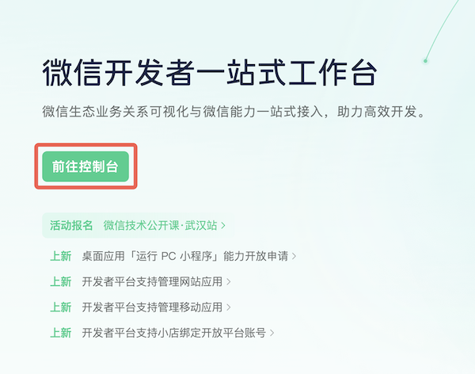
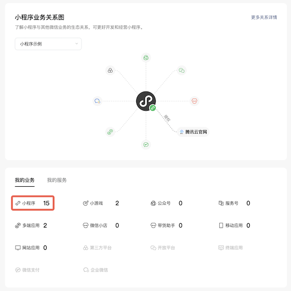
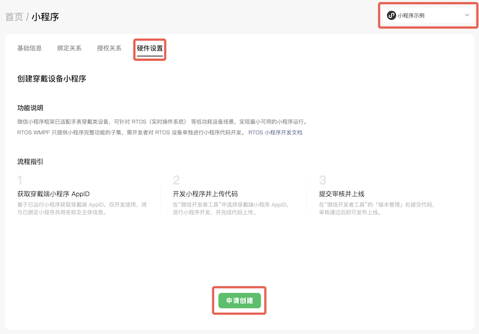
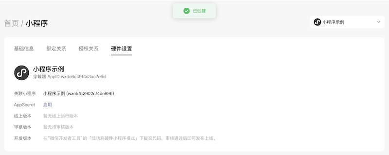
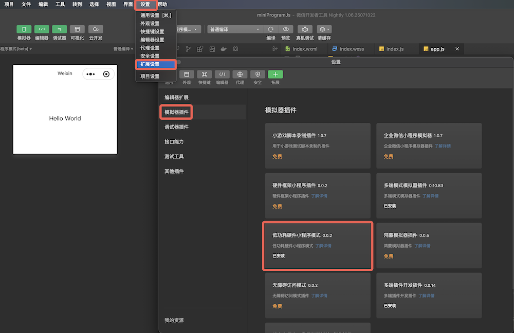
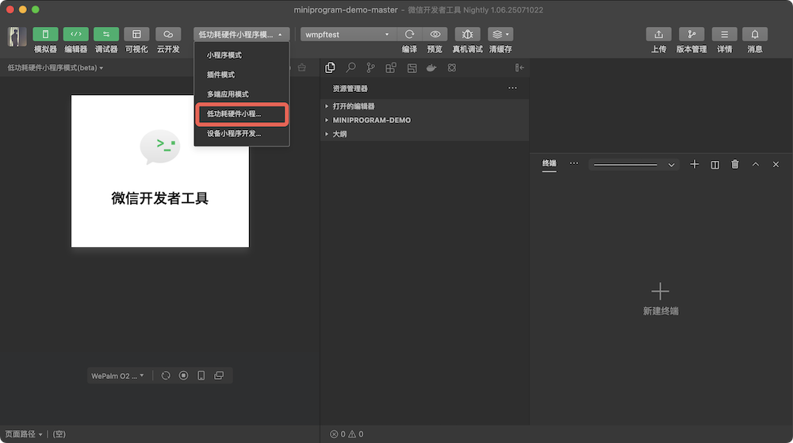
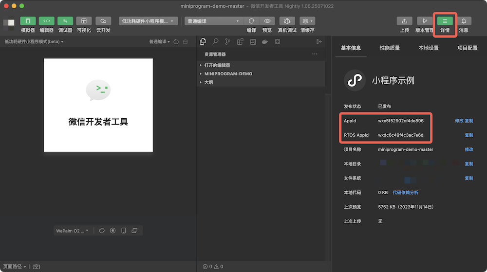

<!-- 来源: https://developers.weixin.qq.com/miniprogram/dev/framework/device/rtos.html -->

# 穿戴设备小程序框架

## 1. 产品介绍

微信小程序框架已适配手表穿戴类设备，可针对 RTOS（实时操作系统）等低功耗设备场景，实现最小可用的小程序运行。

## 2. 技术方案

由于市场主流穿戴设备的 CPU 性能和内存大小十分有限（整机内存小于 8M），我们针对性实现了最小可用的小程序框架，提供：

1. 熟悉的 WXML + WXSS + JS 的小程序开发体验
2. 最必要的小程序 wx 接口
3. 基本完整的小程序页面框架和组件系统
4. 基础的 WXSS 样式和内置组件支持
5. 小程序代码包编译器
6. 模拟调试环境

穿戴设备的硬件资源十分有限。为减小存储占用，该小程序框架只提供普通小程序的功能子集，请开发者严格按照本文档提供的特性列表实现小程序。由于接口能力的差异较大，一般需要开发者针对穿戴设备单独开发新的小程序。

### 2.1 UI能力

#### 2.1.1 组件框架

可以使用小程序中 Page、Component能力。支持完整的 WXML、WXSS 语法。

##### 2.1.1.1 支持的特性

可以在小程序中使用 App、getApp、Page、getCurrentPages、Component。支持 ES6 import / export 与 CommonJS require 两种 JS 模块加载机制。

##### 2.1.1.2 使用差异

使用小程序组件框架时应注意下列差异：

- 组件的 styleIsolation 需在 JSON 中配置，不支持在组件 options 中指定
- 不再支持 addGlobalClass，请使用 styleIsolation 代替
- 当使用 [组件间通信与事件](../custom-component/events.md#%E8%87%AA%E5%AE%9A%E4%B9%89%E7%9A%84%E7%BB%84%E4%BB%B6%E5%AE%9E%E4%BE%8B%E8%8E%B7%E5%8F%96%E7%BB%93%E6%9E%9C) 时，可以直接定义 export 属性，不需要声明 `wx://component-export` 。

##### 2.1.1.3 暂未支持的特性

以下能力暂未支持

- [Chaining API](../custom-component/glass-easel/chaining-api.md)
- behavior
- WXS
- 暂不支持 [自定义组件](https://developers.weixin.qq.com/miniprogram/dev/reference/api/Component.html) 的下列方法：
    - createSelectorQuery
    - createIntersectionObserver
    - createMediaQueryObserver
    - getTabBar
    - animate
    - clearAnimation
    - applyAnimatedStyle
    - clearAnimatedStyle
    - setUpdatePerformanceListener

#### 2.1.2 内置组件

目前仅支持下列内置组件

##### 2.1.2.1 view

属性：无

##### 2.1.2.2 image

属性：

<table><thead><tr><th>属性</th> <th>类型</th> <th>默认值</th> <th>必填</th> <th>说明</th></tr></thead> <tbody><tr><td>src</td> <td>string</td> <td></td> <td>否</td> <td>图片资源地址。如果使用代码包内图片资源，src需为绝对路径。</td></tr></tbody></table>

说明：

- 不建议显示高清图片。部分穿戴设备的屏幕分辨率边长仅 200～300 像素，且内存有限，过大图片无法清晰渲染且可能导致内存溢出。
- 不建议使用图片组件显示小程序码、二维码、条形码等，建议使用 qrcode 组件。

##### 2.1.2.3 text

属性：无

##### 2.1.2.4 qrcode

穿戴设备小程序框架的专属组件，能够根据输入的文本生成并渲染二维码。

考虑到资源消耗，穿戴设备不建议使用图片展示二维码。 对于需要展示小程序码的情况，可以参考 [扫普通链接二维码打开小程序](https://developers.weixin.qq.com/miniprogram/introduction/qrcode.html#%E5%8A%9F%E8%83%BD%E4%BB%8B%E7%BB%8D) 。

<table><thead><tr><th>属性</th> <th>类型</th> <th>必填</th> <th>默认值</th> <th>说明</th></tr></thead> <tbody><tr><td>value</td> <td>string</td> <td>否</td> <td>""</td> <td>二维码文本内容</td></tr> <tr><td>light-color</td> <td>HexColor</td> <td>否</td> <td>#000000</td> <td>二维码颜色</td></tr> <tr><td>dark-color</td> <td>HexColor</td> <td>否</td> <td>#FFFFFF</td> <td>二维码背景颜色</td></tr></tbody></table>

##### 2.1.2.5 scroll-view

<table><thead><tr><th>属性</th> <th>类型</th> <th>默认值</th> <th>必填</th> <th>说明</th></tr></thead> <tbody><tr><td>enable-flex</td> <td>boolean</td> <td>false</td> <td>否</td> <td>启用 flexbox 布局。开启后，当前节点声明了 display: flex 就会成为 flex container，并作用于其孩子节点。</td></tr></tbody></table>

##### 2.1.2.6 swiper/swiper-item

swiper 支持属性：

<table><thead><tr><th>属性</th> <th>类型</th> <th>默认值</th> <th>必填</th> <th>说明</th></tr></thead> <tbody><tr><td>current</td> <td>number</td> <td>0</td> <td>否</td> <td>当前所在滑块的 index</td></tr> <tr><td>bind:change</td> <td>eventhandle</td> <td></td> <td>否</td> <td>current 改变时会触发 change 事件，event.detail = {current, source}</td></tr></tbody></table>

#### 2.1.3 WXSS样式

- display: block/flex（支持弹性盒子布局），不支持 inline/inline-block/inline-flex/grid
- position 绝对布局（top、right、bottom、left）
- width、height、margin、padding 等组件尺寸设置
- color 等文本属性
- border 相关属性：border-radius 不支持分别设置四角圆角大小，不支持百分比写法。
- background 相关属性: background-image, background-color
- font-size 等字体设置暂不支持

不支持子元素选择器、后代选择器、接续兄弟选择器、后续兄弟选择器，若有相关开发需求，请通过普通选择器实现。 注意：WXML支持内联样式，但不支持binding（不可以通过setData()修改WXML组件的style属性值）。

### 2.2 小程序配置

#### 2.2.1 app.json

##### 配置项：

<table><thead><tr><th>属性</th> <th>类型</th> <th>必填</th> <th>说明</th></tr></thead> <tbody><tr><td>entryPagePath</td> <td>string</td> <td>否</td> <td>小程序默认启动首页</td></tr> <tr><td>pages</td> <td>string[]</td> <td>是</td> <td>页面路径列表</td></tr> <tr><td>networkTimeout</td> <td>Object</td> <td>否</td> <td>网络超时时间</td></tr> <tr><td>window</td> <td>Object</td> <td>否</td> <td>全局的默认窗口表现</td></tr> <tr><td>usingComponents</td> <td>Object</td> <td>否</td> <td>全局自定义组件配置</td></tr></tbody></table>

##### window:

用于设置小程序的状态栏、导航条、标题、窗口背景色。穿戴设备小程序框架只支持设置窗口背景色。

<table><thead><tr><th>属性</th> <th>类型</th> <th>必填</th> <th>默认值</th> <th>说明</th></tr></thead> <tbody><tr><td>backgroundColor</td> <td>HexColor</td> <td>否</td> <td>#FFFFFF</td> <td>窗口的背景色</td></tr></tbody></table>

##### networkTimeout

各类网络请求的超时时间，单位均为毫秒。穿戴设备小程序框架只支持设置request的超时时间。

<table><thead><tr><th>属性</th> <th>类型</th> <th>必填</th> <th>默认值</th> <th>说明</th></tr></thead> <tbody><tr><td>request</td> <td>number</td> <td>否</td> <td>60_000</td> <td>wx.request 的超时时间，单位：毫秒。</td></tr></tbody></table>

#### 2.2.2 component.json

##### 配置项

<table><thead><tr><th>属性</th> <th>类型</th> <th>必填</th> <th>说明</th></tr></thead> <tbody><tr><td>component</td> <td>boolean</td> <td>否</td> <td>一个自定义组件由 json、wxml、wxss、js 4个文件组成。如设置component为true，将声明这一组文件为自定义组件</td></tr> <tr><td>styleIsolation</td> <td>string</td> <td>否</td> <td>样式隔离</td></tr> <tr><td>usingComponents</td> <td>Object</td> <td>否</td> <td>全局自定义组件配置</td></tr></tbody></table>

##### styleIsolation

<table><thead><tr><th>值</th> <th>说明</th></tr></thead> <tbody><tr><td>isolated</td> <td>启用样式隔离，在自定义组件内外，使用 class 指定的样式将不会相互影响（一般情况下的默认值）</td></tr> <tr><td>apply-shared</td> <td>表示页面 wxss 样式将影响到自定义组件，但自定义组件 wxss 中指定的样式不会影响页面</td></tr> <tr><td>shared</td> <td>表示页面 wxss 样式将影响到自定义组件，自定义组件 wxss 中指定的样式也会影响页面和其他设置了 apply-shared 或 shared 的自定义组件。</td></tr></tbody></table>

#### 2.2.3 page.json

每一个小程序页面可以使用同名 `.json` 文件来对本页面的窗口表现进行配置，页面中配置项会覆盖 app.json 的 window 中相同的配置项。

##### 配置项：

<table><thead><tr><th>属性</th> <th>类型</th> <th>必填</th> <th>默认值</th> <th>说明</th></tr></thead> <tbody><tr><td>backgroundColor</td> <td>HexColor</td> <td>否</td> <td>#FFFFFF</td> <td>窗口的背景色</td></tr></tbody></table>

### 2.3 接口能力

- JSAPI 调用方式与完整版一致，支持回调和 Promise 两种调用形式，详情请参考相关文档。
- 本节仅说明和完整版的差异部分，完整的 API 接口说明请参考官网文档。为避免重复，本文省略参数中 success/fail/complete 回调函数的说明，如无特殊说明，均提供与完整版一致的 success/fail/complete 回调接口

#### 2.3.1 微信生态能力

- wx.login：一致
- wx.checkSession: 一致
- wx.getAccountInfoSync：一致

#### 2.3.2 系统信息

- wx.getWindowInfo：一致。额外增加返回值 screenShape。
- wx.getDeviceInfo: 仅支持返回 brand、model、system、platform、cpuType、memorySize。额外增加返回值 deviceType。

wx.getWindowInfo 新增返回值

<table><thead><tr><th>属性</th> <th>类型</th> <th>说明</th></tr></thead> <tbody><tr><td>screenShape</td> <td>string</td> <td>rect: 方形屏幕；round 圆形屏幕</td></tr></tbody></table>

wx.getDeviceInfo 新增返回值

<table><thead><tr><th>属性</th> <th>类型</th> <th>说明</th></tr></thead> <tbody><tr><td>deviceType</td> <td>string</td> <td>可选值：watch, phone, tv, vehicle, pc</td></tr></tbody></table>

注意：

本框架不提供 `wx.getSystemInfo` 系列接口，请使用 `getWindowInfo/getDeviceInfo` 代替。

#### 2.3.3 网络请求

wx.request()

- 参数仅支持 url、data、header、timeout、method(仅支持GET, POST)、dataType、responseType、redirect。
- 返回的 RequestTask 仅支持 abort
- success 回调参数仅支持 data、statusCode、header
- fail 回调参数一致

注意

- 目前暂未提供文件系统支持，故暂未支持 wx.downloadFile/wx.uploadFile。
- 目前仅支持https，不支持TCP、UDP、WebSocket等其他类型的网络请求。

#### 2.3.4 页面路由

- wx.navigateTo：参数仅支持 url
- wx.navigateBack：一致
- wx.redirectTo：一致
- wx.reLaunch：一致

注意：暂未提供 `tabBar`

#### 2.3.5 数据存储

- wx.getStorageInfo(sync)：一致
- wx.setStorage(Sync)：参数仅支持 key、data
- wx.getStorage(Sync)：参数仅支持 key
- wx.removeStorage(Sync)：一致
- wx.clearStorage(Sync)：一致

注意

1. 目前只提供KV存储，暂不提供文件存储。
2. 暂不支持加密存储

#### 2.3.6 UI

- wx.showToast：一致
- wx.hideToast：参数不支持 noConflict，toast 和 loading 默认不可混用
- wx.showLoading：一致
- wx.hideLoading：参数不支持 noConflict，toast 和 loading 默认不可混用
- wx.showModal：参数不支持 editable 和 placeholderText
- wx.getMenuButtonBoundingClientRect：一致

注意：暂无 navigationBar、tabBar、homeButton

#### 2.3.7 生命周期

- wx.getLaunchOptionsSync：参数仅支持 path、scene、query
- wx.getEnterOptionsSync：参数仅支持 path、scene、query
- wx.onUnhandledRejection：一致
- wx.onError：一致
- wx.onPageNotFound：一致
- wx.onAppShow：参数仅支持 path、scene、query
- wx.onAppHide：一致

#### 2.3.8 事件

- bind:touchstart
- bind:touchend
- bind:tap
- bind:longpress

其中事件对象仅支持 type, target, currentTarget 字段，target/currentTarget 仅支持 dataset 字段。

#### 2.3.9 其他

- console.log/info/error/warn/debug：输出会打印在模拟器的命令行窗口中，可以通过 console.log 调试小程序逻辑。
- setTimeout/clearTimeout
- setInterval/clearInterval

### 2.4 其他差异

- 暂不支持小程序插件
- 暂不支持小程序分包

## 3. 开发流程

### 3.1 注册穿戴设备小程序框架专属AppID

前置条件：名下需有普通小程序的AppID，并作为该小程序的管理员。 步骤：

1. 打开 [微信开发者平台](https://developers.weixin.qq.com/platform/)
2. 扫码登录
3. 点击「前往控制台」

1. 选择「我的业务--小程序」

1. 页面右上角，切换到穿戴设备小程序要挂靠的普通小程序。
2. 切换到「硬件设置」
3. 点击「申请创建」

1. 创建成功，获得「穿戴端AppID」

### 3.2 安装开发者工具拓展

1. 打开「微信开发者工具」(需使用版本号 ≥ 2.01.2507252,建议下载最新 nightly 版开发者工具进行使用)
2. 在「工具栏」选择「设置--拓展设置」
3. 在弹出的页面中，左侧选择「模拟器插件」，右侧选择安装「低功耗硬件小程序模式」

### 3.3 启用低功耗小程序模式

装好插件后，将开发模式切换到「低功耗硬件小程序模式」

### 3.4 开发调试

点击「详情」，确保其中设置的AppID与微信开发者平台一致。

我们不建议开发者将JS代码编译为ES5。穿戴设备小程序框架支持ES2023，减少不必要的polyfill有助于显著节省最终小程序代码包体积，进而节省运行时内存占用。

### 3.5 体验与发布

完成开发后，可在「微信开发者工具」中点击「上传」。新上传的版本将覆盖旧的「开发版小程序」。 开发者可以前往 [微信开发者平台](https://developers.weixin.qq.com/platform/) ，管理小程序版本、提交审核、发布上线。

## 4. 联系我们

有合作意向的硬件厂商、小程序开发者，欢迎发送邮件联系我们： `wx_iot@tencent.com` 。
