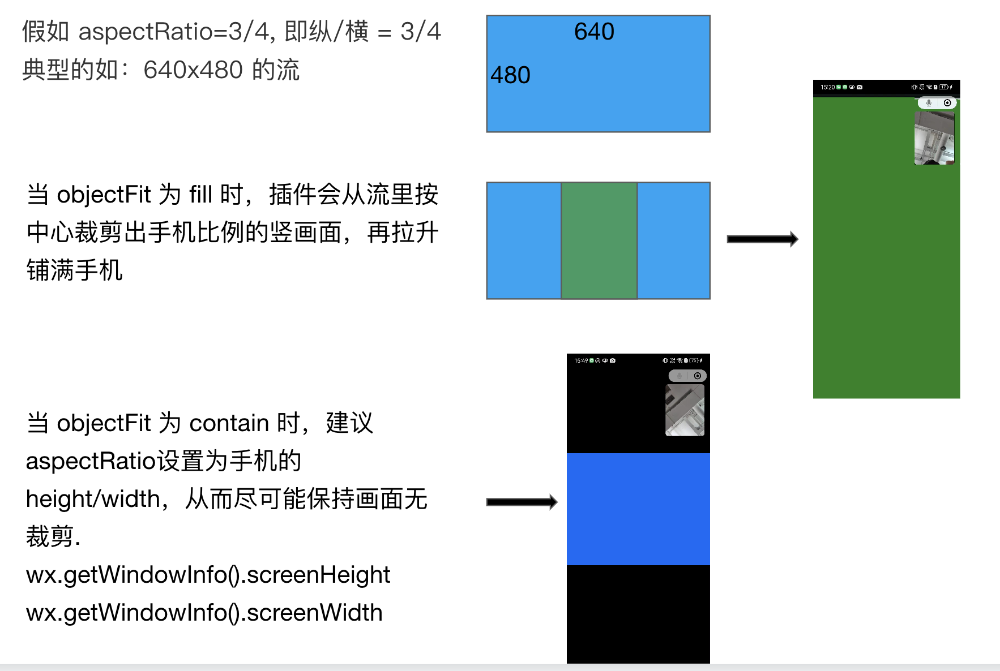

<!-- 来源: https://developers.weixin.qq.com/miniprogram/dev/framework/device/voip-plugin/api/setUIConfig.html -->

# void setUIConfig(Object config)

设置插件通话界面， **需保证在通话开始前设置** 。

## 参数

### Object req

<table><thead><tr><th>属性</th> <th>类型</th> <th>默认值</th> <th>必填</th> <th>说明</th> <th>最低版本</th></tr></thead> <tbody><tr><td>btnText</td> <td>string</td> <td></td> <td>否</td> <td>接听页面按钮文案，与使用<a href="./setCustomBtnText.html">setCustomBtnText</a> 一致</td> <td></td></tr> <tr><td>callerUI</td> <td>UIConfig</td> <td></td> <td>否</td> <td>caller 通话 UI 设置</td> <td></td></tr> <tr><td>listenerUI</td> <td>UIConfig</td> <td></td> <td>否</td> <td>listener 通话 UI 设置</td> <td></td></tr> <tr><td>handsFree</td> <td>boolean</td> <td>true</td> <td>否</td> <td>是否开启免提（true 为扬声器输出，false 为听筒输出）。<br><strong>仅在设备端生效</strong></td> <td>插件 2.3.0，WMPF &gt;= 2.0</td></tr> <tr><td>isSelfWindowMax</td> <td>boolean</td> <td>false</td> <td>否</td> <td>视频通话时，控制主窗口默认是否显示本端。（true 为本端，false 为对端）</td> <td>2.3.4</td></tr> <tr><td>customBoxHeight</td> <td>string</td> <td>'90vh'</td> <td>否</td> <td>接听页自定义按钮点击后弹层高度。仅支持 70vh 或 90vh。</td> <td>2.3.10</td></tr></tbody></table>

**UIConfig**

<table><thead><tr><th>属性</th> <th>类型</th> <th>默认值</th> <th>必填</th> <th>说明</th> <th>最低版本</th></tr></thead> <tbody><tr><td>cameraRotation</td> <td>number</td> <td>0</td> <td>否</td> <td>视频画面旋转角度，有效值为 0, 90, 180, 270</td> <td></td></tr> <tr><td>aspectRatio</td> <td>number</td> <td>4/3</td> <td>否</td> <td>视频画面画面纵横比，使用方法见示例</td> <td></td></tr> <tr><td>horMirror</td> <td>boolean</td> <td>false</td> <td>否</td> <td>视频画面水平镜像</td> <td></td></tr> <tr><td>vertMirror</td> <td>boolean</td> <td>false</td> <td>否</td> <td>视频画面垂直镜像</td> <td></td></tr> <tr><td>enableToggleCamera</td> <td>boolean</td> <td>true</td> <td>否</td> <td>视频通话是否支持切换摄像头。false 时不显示切换摄像头按钮。<br><strong>仅在手机微信内生效</strong>。WMPF 默认开摄像头，且不显示开关按钮。</td> <td></td></tr> <tr><td>objectFit</td> <td>string</td> <td>'fill'</td> <td>否</td> <td>视频画面与容器比例不一致时的表现形式。支持 fill/contain,使用方法见示例</td> <td>2.3.8</td></tr></tbody></table>

**aspectRatio 与 objectFit 的设置示例：**



## 返回值

无

## 示例代码

```js
const wmpfVoip = requirePlugin('wmpf-voip').default

wmpfVoip.setUIConfig({
  btnText: '去开门',
  callerUI: {
    aspectRatio: 16 / 9,
  },
  handsFree: false,
})
```
