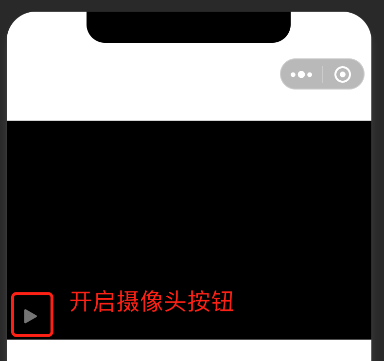

<!-- 来源: https://developers.weixin.qq.com/miniprogram/dev/framework/device/voip-plugin/index_camera.html -->

# 小程序摄像头插件

[本插件](https://mp.weixin.qq.com/wxopen/pluginbasicprofile?action=intro&appid=wxf830863afde621eb&token=&lang=zh_CN) 主要用于提供「小程序摄像头」的部分基础能力和统一的界面。

插件接入可参考： [小程序示例代码](https://git.weixin.qq.com/wxa_iot/voip-wxapp-demo)

**设备侧 SDK 的接入与小程序 Voip 的纯云接入完全一致，请参考相关文档。**

## 1. 小程序引入插件

> 关于小程序插件详细说明请参考 [小程序使用插件文档](../../plugin/using.md)

在「小程序管理后台」添加插件后，使用者还需要要在小程序的 `app.json` 中声明本插件。可以在主包引入，也可以在分包引入。

```json
// 主包引入
{
  "plugins": {
    "wmpf-voip": {
      "version": "latest", // latest 表示自动使用最新版本。也可使用具体版本，如 2.3.8
      "provider": "wxf830863afde621eb"
    }
  }
}
```

```json
// 分包引入
{
  "subpackages": [
    {
      "root": "xxxx",
      "pages": [],
      "plugins": {
        "wmpf-voip": {
          "version": "latest", // latest 表示自动使用最新版本。也可使用具体版本，如 2.3.8
          "provider": "wxf830863afde621eb"
        }
      }
    }
  ]
}
```

完成声明后，可以在小程序中来确认是否引入成功

```js
const wmpfVoip = requirePlugin('wmpf-voip').default
console.log(wmpfVoip) // 有结果即表示引入插件成功
```

## 2. 引入摄像头组件

插件引入成功后，需引入摄像头组件。

页面或者组件的 json 文件中声明：

```
"usingComponents": {
    "camera-device": "plugin-private://wxf830863afde621eb/publicComponents/camera-device/camera-device"
  },
```

wxml 中使用组件：传入sn、model-id，device-name

```
// page.wxml
<camera-device sn="{{sn}}" device-name="{{deviceName}}" model-id="{{modelId}}" class="camera-deivce" bind:changeQuality="changeQuality"></camera-device>
```

wxss 中自定义 camera-deivce.

```
// page.wxss
.camera-deivce {
  width: 100vw;
  height: 300px;
}
```

预期： 

## 3. 组件属性

<table><thead><tr><th>属性</th> <th>类型</th> <th>默认值</th> <th>必填</th> <th>说明</th></tr></thead> <tbody><tr><td>sn</td> <td>String</td> <td></td> <td>是</td> <td>设备</td></tr> <tr><td>model-id</td> <td>String</td> <td></td> <td>是</td> <td>MP申请的model-id</td></tr> <tr><td>device-name</td> <td>String</td> <td></td> <td>是</td> <td>设备名称</td></tr> <tr><td>video-quality-list</td> <td>String[]</td> <td>['360P', '480P', '720P', '1080P', '4K']</td> <td>否</td> <td>个数不超过 5 个。当用户切换清晰度时，会显示在面板上，切换后会触发组件事件'changeQuality'</td></tr></tbody></table>

事件：切换清晰度 changeQuality

<table><thead><tr><th></th> <th>类型</th> <th>说明</th></tr></thead> <tbody><tr><td>index</td> <td>Number</td> <td>用户选择的清晰度在传入的video-quality-list数组中的index。</td></tr></tbody></table>

示例：

```
<camera-device
    sn="{{sn}}"
    device-name="{{deviceName}}"
    model-id="{{modelId}}"
    class="camera-deivce"
    bind:changeQuality="changeQuality"
>
</camera-device>
```

```
Page({
    changeQuality(res) {
        console.log(res)
    }
})
```

## 4. 更新日志

请参考 [《小程序音视频通话插件更新日志》](./changelog.md)
