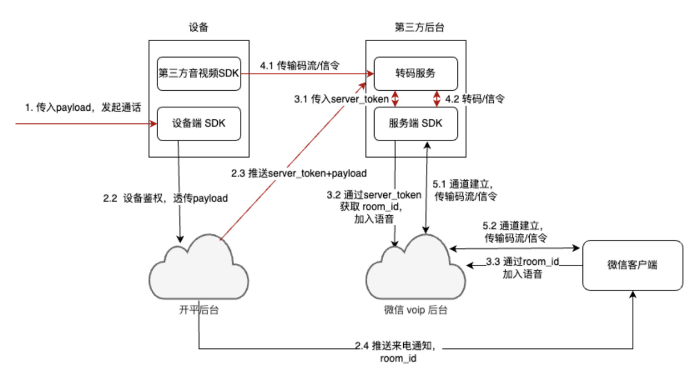

<!-- 来源: https://developers.weixin.qq.com/miniprogram/dev/framework/device/voip/le-device-sdk.html -->

# RTOS 设备

针对 RTOS 设备，我们推出云对云的方案，也就是云端代理的方案。

云对云方案主要面向无法跑起完整 VoIP SDK 的低功耗设备，通过设备商后台转发音视频数据流和信令，打通低功耗设备与微信VoIP服务器的通信链路。

呼叫流程：



SDK 下载地址；https://git.weixin.qq.com/wxa\_iot/cloudvoipsdk

## 1. 设备要求

- HTTPS 通信能力
- 存储能力
- 音(视)频能力

## 2. 设备端开发

在低功耗设备上需要集成 设备端 SDK，用于向手机微信内的小程序拨打 VoIP 通话。

设备 SDK 需先使用小程序 appid，modelid，设备 id，数据文件夹路径调用 wx\_init 函数初始化.

如果设备第一次运行设备 SDK，还需要调用 wx\_device\_register 函数向微信后台注册当前设备. 注册设备时需要小程序的 snticket .

如果注册成功，那么此时可以调用 wx\_cloudvoip\_client\_call 函数发起微信 voip 通话，需要传入设备要拨打的微信用户的 openid 和音视频云后台识别 voip 所需的信息 payload（内容由厂商和云服务器后台自行决定，会被传输给云服务器后台）. 如果呼叫成功，说明设备被允许拨打音视频通话给指定的微信用户，厂商此时可以自行创建到厂商的云服务器后台的音视频数据流并开始传输（此步骤也可以在 call 函数之前发起），总之，payload 就是提供给厂商设备到其云服务器通道的标识，方便云服务器接收到微信后台通知后找到设备传输的音视频流.

需要注意，微信用户必须先在厂商的小程序内对指定的设备发起通话的权限进行授权，而且未在小程序设置内关闭授权或删除小程序（清理小程序所有数据和授权信息），否则设备将无权发起通话. call 函数将返回没有权限.

## 3. 接口说明

具体接口如下，使用方法请参考 sdk 包中 example 目录下的 demo 代码。

```
/**
 * @brief 初始化 voip
 *
 * 调用其它接口之前需要调用 wx_init() 初始化
 *
 *
 * @param stack (nonnull) 开发者实现 TLS 连接、关闭、读、写接口。
 * @param hal (nonnull) 开发者实现 OS 相关的接口
 * @param config (nonnull) 设备配置信息
 * @return
 *  - WXERROR_RESOURCE_EXHAUSTED: 内存资源分配失败
 *  - WXERROR_INVALID_DEVICEID: 设备已注册，但当前 sdk 用的 deviceid、modelid 不对
 */
wx_error_t wx_init(wxvoip_network_https_impl_t *stack, wxvoip_os_impl_t *hal, wx_cloudvoip_config_t *config);

/**
 * @brief 销毁 voip
 *
 * 进行资源释放
 */
void wx_destory(void);

/**
 * @brief 注册设备
 *
 * 需要调用一次此接口，若设备已经注册，则立即返回，若设备未注册或注册数据错误，会再注册。
 *
 * @param sn_ticket (nonnull) 小程序对应的 snticket，参考：
 * https://developers.weixin.qq.com/miniprogram/dev/OpenApiDoc/hardware-device/getSnTicket.html
 * @return
 *  - WXERROR_RESOURCE_EXHAUSTED: 内存资源分配失败
 *  - WXERROR_RESPONSE: 后台返回失败，一般是网络问题
 *  - WXERROR_IO: IO 失败，一般是写文件接口返回失败
 *  - 其它：
 *       -10008: snticket 有问题
 */
wx_error_t wx_device_register(const char *sn_ticket);

/**
 * @brief 检测设备是否已经被注册
 * 需要在 wx_init 调用完成之后才能调用本函数.
 *
 * @param is_registered_out 输出设备注册情况.
 * @return 检测过程中是否出现错误, 比如数据文件夹不可读写, 或者 rpmb
 * 设备不能被正常访问.
 *   - WXERROR_OK: 正确返回, 可以正确使用 is_registered_out 的值来判断设备是否注册过
 *   - WXERROR_FAILED_PRECONDITION: wx_init 未被调用
 *   - WXERROR_INVALID_ARGUMENT: 参数为空
 *   - WXERROR_INVALID_DEVICEID: 设备已注册，但当前 sdk 用的 deviceid、modelid 不对
 *   - WXERROR_UNKNOWN: 注册信息被破坏，这种情况下，一般可以清理设备重新注册
 */
wx_error_t wx_device_is_registered(int* is_registered_out);

/**
 * @brief 拨打 VoIP 通话给指定的微信用户
 *
 * 厂商需要自行实现用户的通讯录功能.
 * 厂商需要在自己的小程序内提示用户向指定的设备 (设备 ID) 授权 VoIP 通话权限后,
 * 方可在携带该设备 ID 的设备上向该用户拨打 VoIP 通话.
 *
 * @param room_type 通话类型，有音频和音视频两种
 * @param caller 本设备的 VoIP 角色设置.
 * @param callee 要拨打的微信用户的 VoIP 角色设置
 * @param custom_query 小程序页面自定义参数, 可以传 NULL
 * @param payload 第三方云 SDK 标记 VoIP 流的标识符（比如 json）
 * @return
 *   - WXERROR_FAILED_PRECONDITION: 不能发起通话请求，比如获取 token 不对等.
 *   - WXERROR_RESOURCE_EXHAUSTED: 内存资源分配失败
 *   - WXERROR_RESPONSE: 后台返回失败，一般是网络问题
 *   - 负数：请求通话时后台返回了失败码取负，可参考https://mp.weixin.qq.com/wxopen/plugindevdoc?appid=wxf830863afde621eb
 *       1	roomid 错误
 *       2	设备 deviceId 错误
 *       3	voip_id 错误
 *       4	校园场景支付刷脸模式，voipToken 错误
 *       5	生成 voip 房间错误
 *       7	openId 错误
 *       8	openId 未授权
 *       9	校园场景支付刷脸模式：openId 不是 userId 的联系人；硬件设备模式：openId 未绑定设备
 *       12	小程序音视频能力审核未完成，正式版中暂时无法使用
 *       13	硬件设备拨打手机微信模式，voipToken 错误
 *       14	手机微信拨打硬件设备模式，voipToken 错误
 *       15	音视频费用包欠费
 *       17	voipToken 对应 modelId 错误
 *       19	openId 与小程序 appId 不匹配。请注意同一个用户在不同小程序的 openId 是不同的
 *       20	openId 无效
 *       10008 snticket 过期
 */
wx_error_t
wx_cloudvoip_client_call(wx_cloudvoip_session_type_t room_type,
                         const wx_cloudvoip_member_t* caller,
                         const wx_cloudvoip_member_t* callee,
                         const char* custom_query,
                         const char* payload);

/**
 * @brief 微信拨打设备，设备使用 roomid 加入通话
 *
 * 厂商需要自行将小程序端呼叫设备时的 roomid 流转到设备上.
 *
 * @param roomid 微信小程序端插件发起通话后，获取本次通话的roomid
 * @param payload 第三方云 SDK 标记 VoIP 流的标识符（比如 json）
 * @return
 *   - WXERROR_FAILED_PRECONDITION: 不能发起通话请求，比如获取 token 不对等.
 *   - WXERROR_RESOURCE_EXHAUSTED: 内存资源分配失败
 *   - WXERROR_RESPONSE: 后台返回失败，一般是网络问题
 *   - 负数：请求通话时后台返回了失败码取负，可参考https://developers.weixin.qq.com/miniprogram/dev/framework/device/voip-plugin/api/errCode.html
 *       1	roomid 错误
 *       2	设备 deviceId 错误
 *       3	voip_id 错误
 *       4	校园场景支付刷脸模式，voipToken 错误
 *       5	生成 voip 房间错误
 *       7	openId 错误
 *       8	openId 未授权
 *       9	校园场景支付刷脸模式：openId 不是 userId 的联系人；硬件设备模式：openId 未绑定设备
 *       12	小程序音视频能力审核未完成，正式版中暂时无法使用
 *       13	硬件设备拨打手机微信模式，voipToken 错误
 *       14	手机微信拨打硬件设备模式，voipToken 错误
 *       15	音视频费用包欠费
 *       17	voipToken 对应 modelId 错误
 *       19	openId 与小程序 appId 不匹配。请注意同一个用户在不同小程序的 openId 是不同的
 *       20	openId 无效
 */
wx_error_t
wx_cloudvoip_client_join(const char* roomid,
                          const char* payload);
```
