<!-- 来源: https://developers.weixin.qq.com/miniprogram/dev/framework/device/voip/notification.html -->

# 通话提醒异常排查指南

发起通话成功后，微信后台会使用微信消息通道向用户推送通话提醒。要收到通话提醒，手机端需要满足下列条件：

- **至少需微信客户端 8.0.30 支持，为保证最佳效果，建议使用 >= 8.0.39 版本** 。Mac/Windows 微信暂不支持通话提醒；
- 设备端网络通畅。 **断网、弱网环境，或受到安卓系统省流、省电策略的限制，会导致通知接收有概率发生延迟或一段时间内无法收到** 。
    - iOS 系统，微信在后台时，推送由苹果统一进行；微信在前台时，推送走微信的消息通道。
    - 安卓系统通知统一走微信的消息通道。某些系统设置（如「智能省流量」、「休眠时始终保持网络连接」、「电池优化」、「省电策略」等）可能影响应用的网络情况（参考第 4 节），使微信消息通道中断，导致无法收到消息或消息延迟。
- 当前用户已登录手机微信客户端。

通知推送到手机端后，也可能因为微信内的功能设置和一些系统设置限制产生不同的表现，导致提醒强度不符合预期，例如锁屏未提醒、未响铃、未震动等。具体可能影响到通话提醒的配置如下所述。

## 1. iOS 微信配置

### 1.1 消息通知开关

用户未开启「微信客户端」-「我」-「设置」-「消息通知」中的下列开关：

- **【无提醒】** （微信未打开时）「语音和视频通话提醒」开关。这种情况下，微信在后台时不会弹出通话提醒。
- **【无响铃】** （微信打开时）「语音和视频通话来电铃声」开关。这种情况下，微信在前台时会弹出通知，但是不会响铃。
- **【无振动】** （微信打开时）「振动」开关。这种情况下，微信在前台时会弹出通知，但是不会振动。

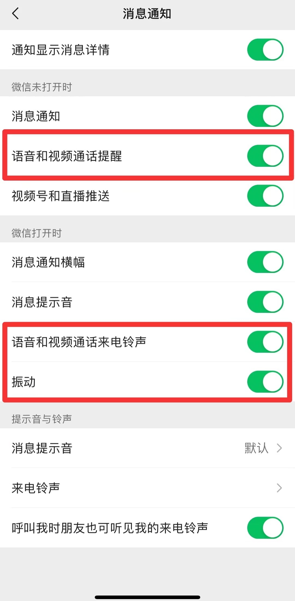

## 2. iOS 系统配置

### 2.1 静音模式

**【无响铃】** 用户开启了「静音模式」时，微信在后台时会弹出通话提醒，但是不会响铃。

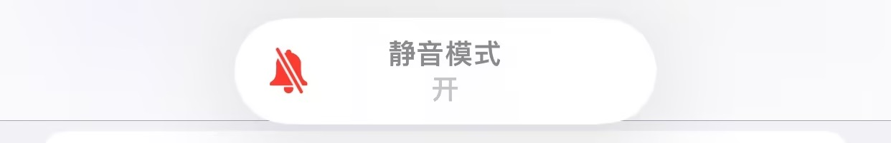

### 2.2 勿扰模式

**【无提醒】** 用户开启了「勿扰模式」或「专注模式」时，微信在后台时无法弹出通话提醒。

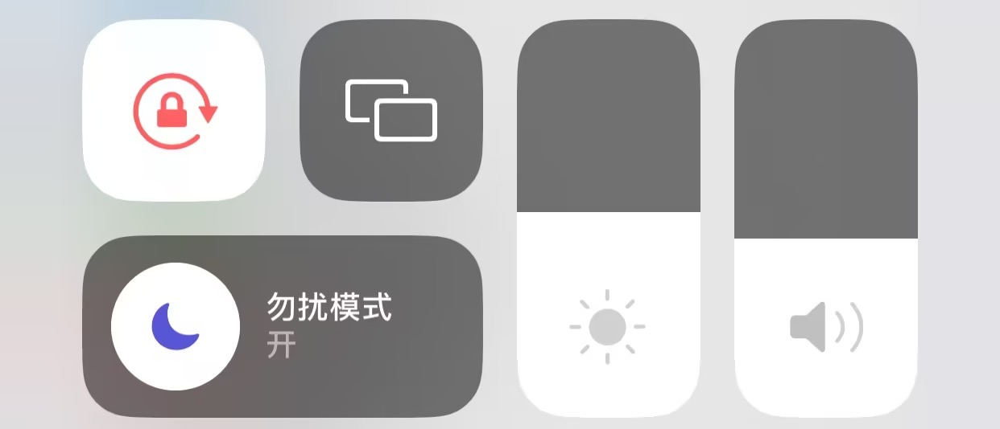

### 2.3 触感反馈

**【无振动】** 用户关闭了「设置」-「声音与触感」-「响铃模式下提供触感反馈」或「静音模式下提供触感反馈」时，微信在后台时会弹出通话提醒，但是在对应模式下不会振动。

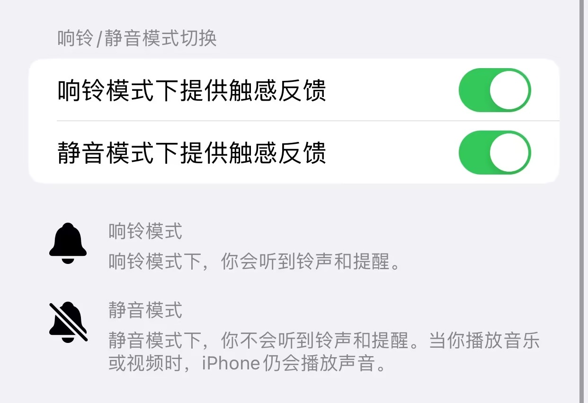

### 2.4 提醒音量

**【响铃音量】** 「铃声和提醒音量」影响微信在后台时的提醒音量，如果用户调低了「铃声和提醒音量」，微信在后台时会弹出通话提醒，但是可能响铃声音较小。微信在前台时，提醒音量受媒体音量控制。

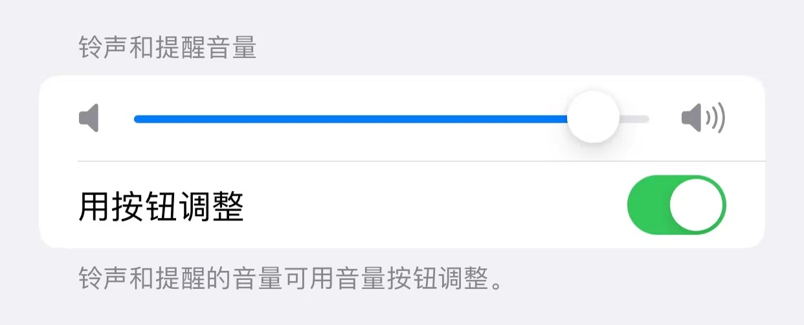 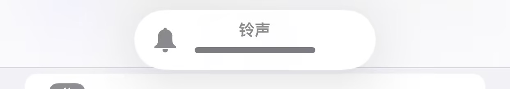

### 2.5 微信通知设置

**【无提醒】** 用户关闭了微信应用的通知时，微信在后台时无法弹出通话提醒；

**【提醒形态异常】** 用户限制了微信通知的提醒形式时，微信在后台时可能无法按预期形态弹出通话提醒。

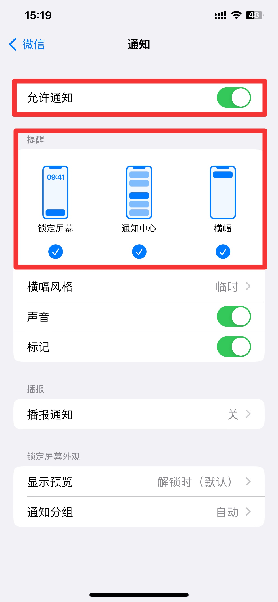

## 3. 安卓微信配置

### 3.1 消息通知开关

**【无提醒】** 用户未开启「微信客户端」-「我」-「设置」-「新消息通知」-「接收语音和视频通话邀请提醒」时，微信在后台时不会弹出通话提醒。

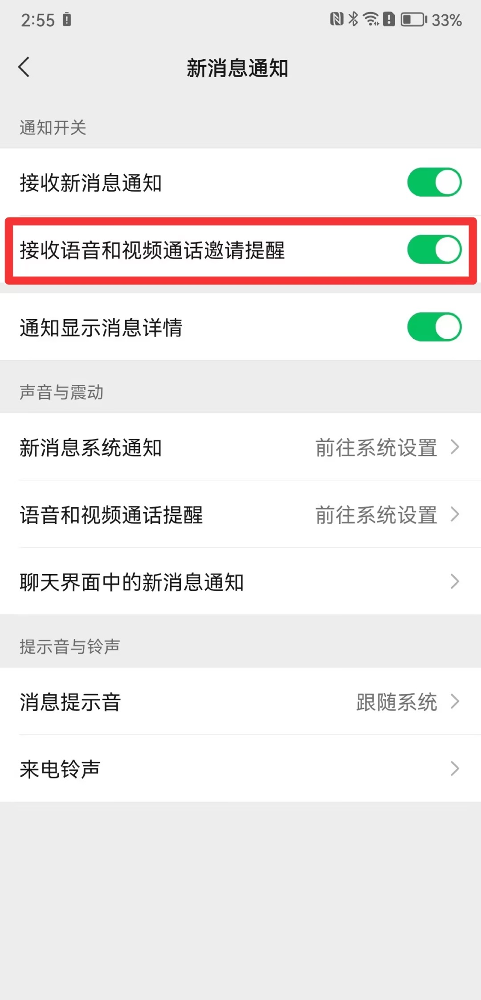

## 4. 安卓系统配置

**安卓不同系统的开关类型和入口可能存在差异，这里仅举例说明。**

### 4.1 微信通知设置

**【无提醒】** 用户关闭了微信应用的通知时，微信在后台时无法弹出通话提醒。

某些厂商提供的「智能通知」或类似可能影响通知形态的能力，也可能影响通知的展示形式。

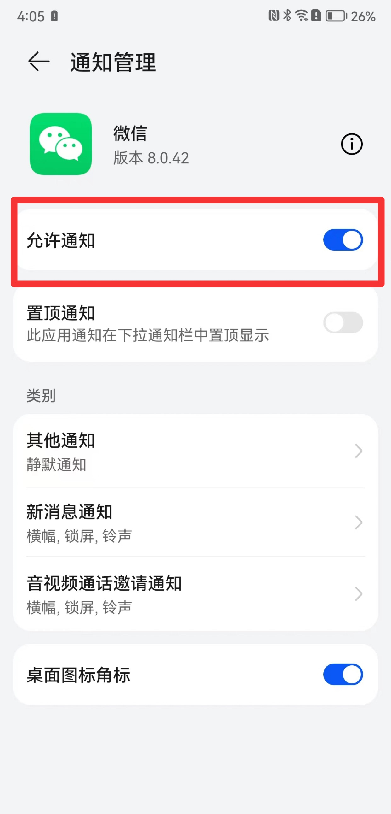

### 4.2 微信「音视频通话邀请通知」设置

**【无提醒】** 用户关闭了微信「音视频通话邀请通知」时，微信在后台时无法弹出通话提醒；

**【提醒形态异常】** 用户限制了通知的提醒形式时，微信在后台时可能无法按预期形态弹出通话提醒。

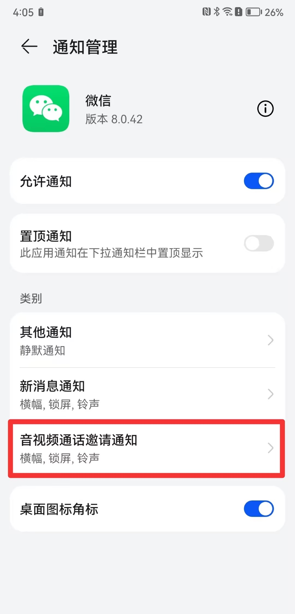 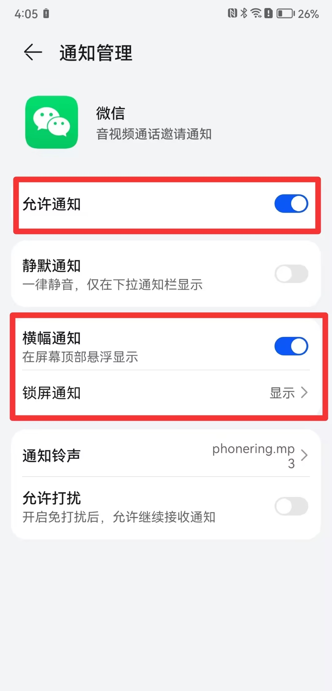

例1： oppo 手机关闭了这个选项，在锁屏场景下也会收不到小程序 Voip 通知：

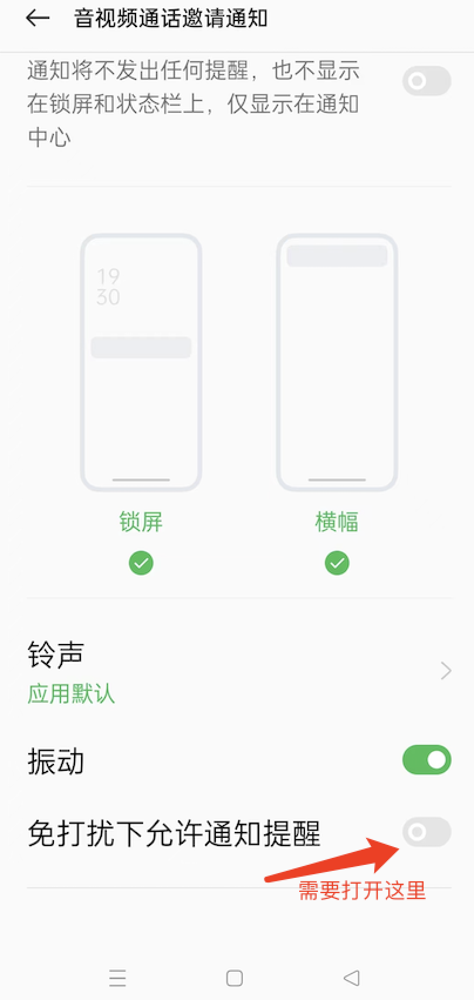

例2: 某些手机有「智能静默」功能，也可以排查是否有小程序 Voip 通知有影响：

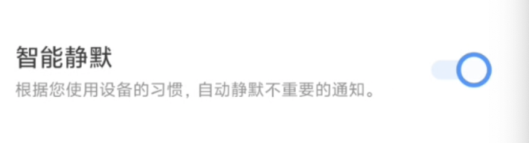

### 4.3 免打扰

**【无提醒】** 用户开启了「免打扰模式」、「勿扰模式」等类似会屏蔽通知的系统模式，且未开启微信「允许打扰」时，微信在后台时无法弹出通话提醒。

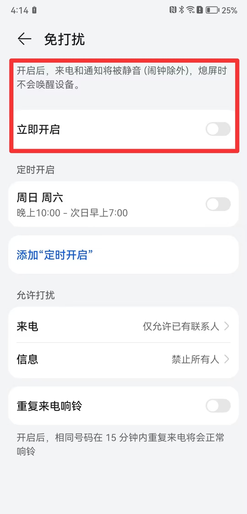 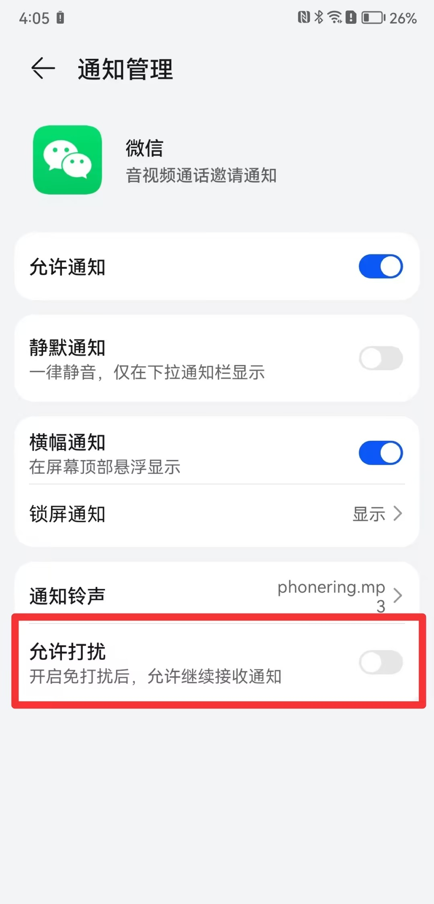

### 4.4 锁屏通知

**【提醒形态异常】** 用户未开启「锁屏通知」（例如华为「设置」-「通知和状态栏」-「锁屏通知」）时，锁屏可能只有响铃和振动，需要进入通知中心才能看到通知内容。

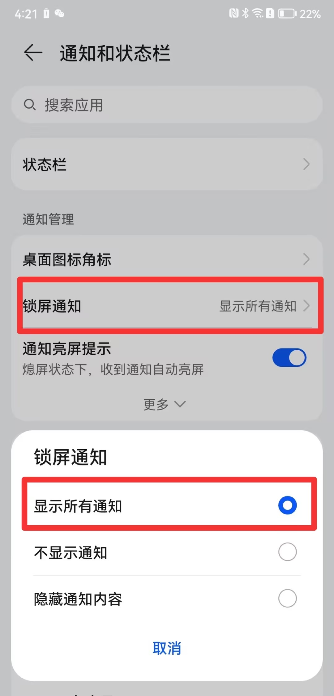

### 4.5 智能省流量

**【可能无提醒或延迟提醒】** 系统设置中开启了「智能省流量」（例如华为「设置」-「移动网络」-「流量管理」-「智能省流量」）或类似模式，且未排除微信应用时，微信在后台时可能因网络中断而无提醒或提醒延迟。

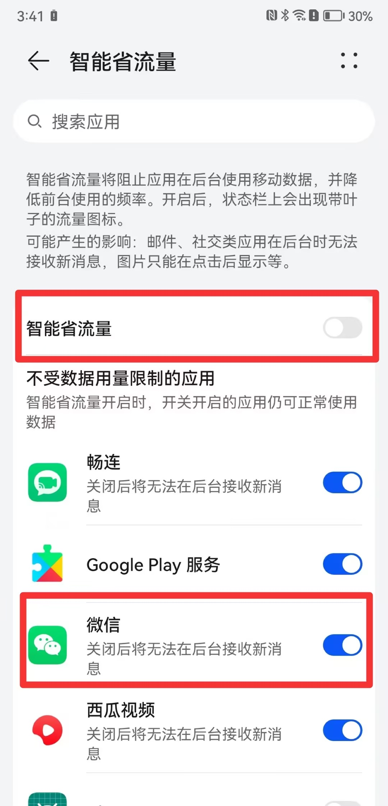

### 4.6 休眠时始终保持网络连接

**【可能无提醒或延迟提醒】** 用户未开启「休眠时始终保持网络连接」（例如华为「设置」-「电池」-「更多电池设置」-「休眠时始终保持网络连接」）或类似开关时，在系统休眠后，微信在后台时可能因网络中断而无提醒或提醒延迟。

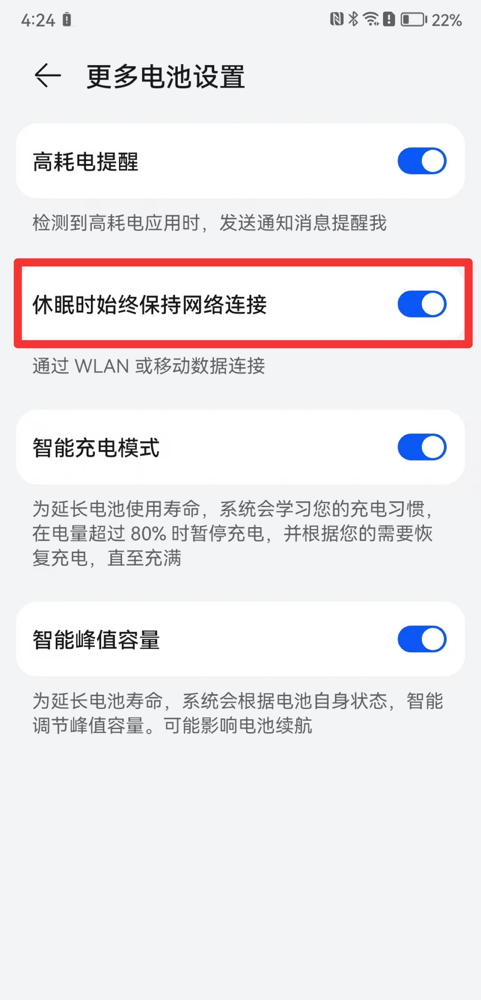

### 4.7 应用启动管理

**【可能无提醒或延迟提醒】** 用户未开启微信「允许后台活动」（例如华为「设置」-「应用和服务」-「应用启动管理」，开启「手动管理」并关闭了微信「允许后台活动」）或类似开关时，微信在后台时可能无提醒或提醒延迟。

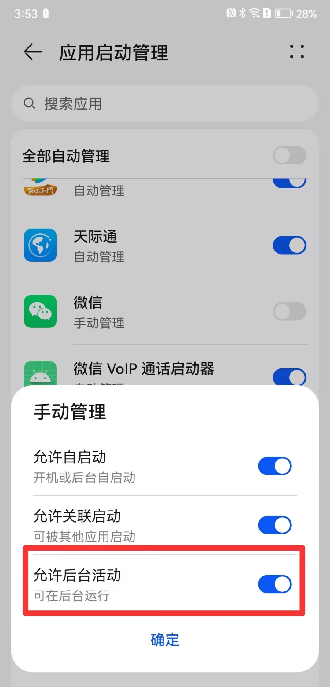

### 4.8 电池优化或省电策略

**【可能无提醒或延迟提醒】** 用户开启了微信「电池优化」或「省电策略」等类似开关时，微信在后台时可能无提醒或提醒延迟。

例1：华为「设置」- 搜索「电池优化」，可以考虑不允许对微信进行电池优化

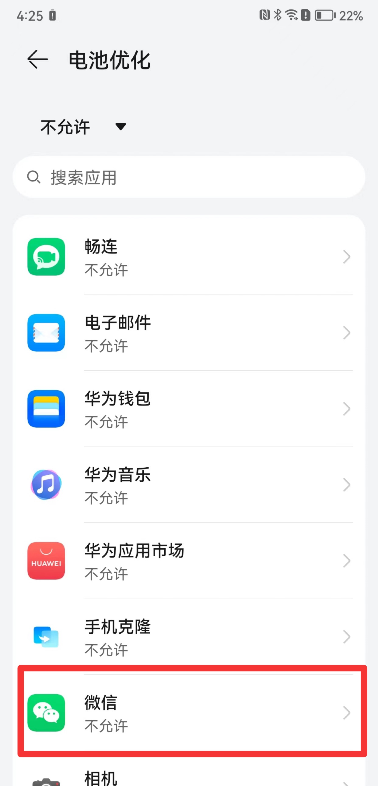

例2：小米设置中搜索「微信」-「省电策略」，可以考虑对微信开启「无限制」

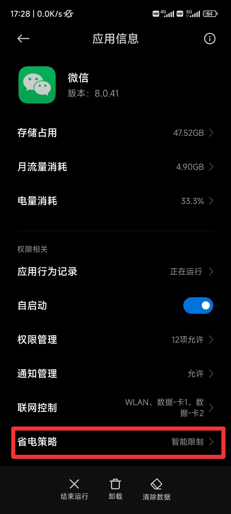 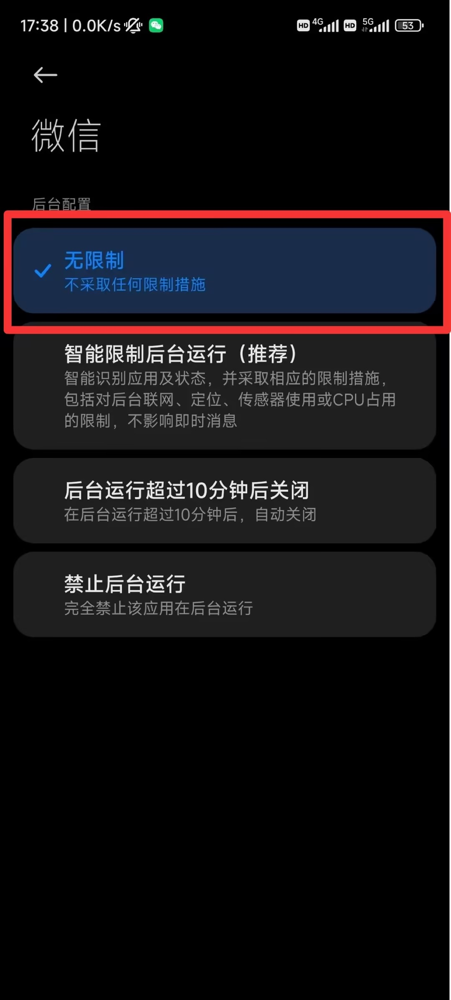

### 4.9 静音/振动模式

**【无响铃或振动】** 用户开启了「静音/振动」时，微信在后台时会弹出通话提醒，但是不会响铃或振动。

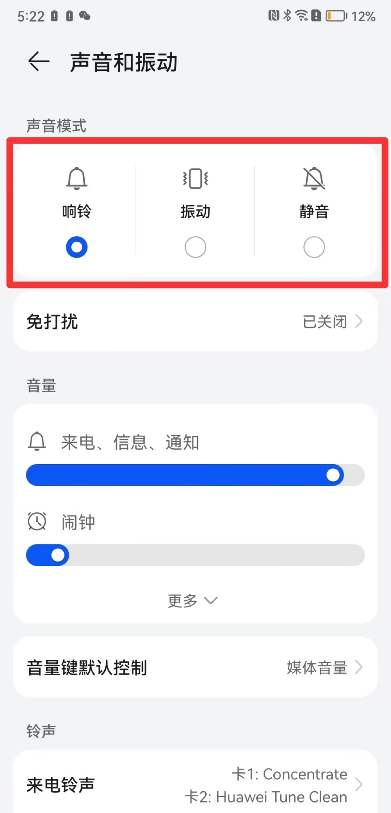

### 4.10 提醒音量

**【响铃音量】** 「来电、信息、通知音量」影响微信的提醒音量，如果用户调低了这一音量，微信会弹出通话提醒，但是可能响铃声音较小。

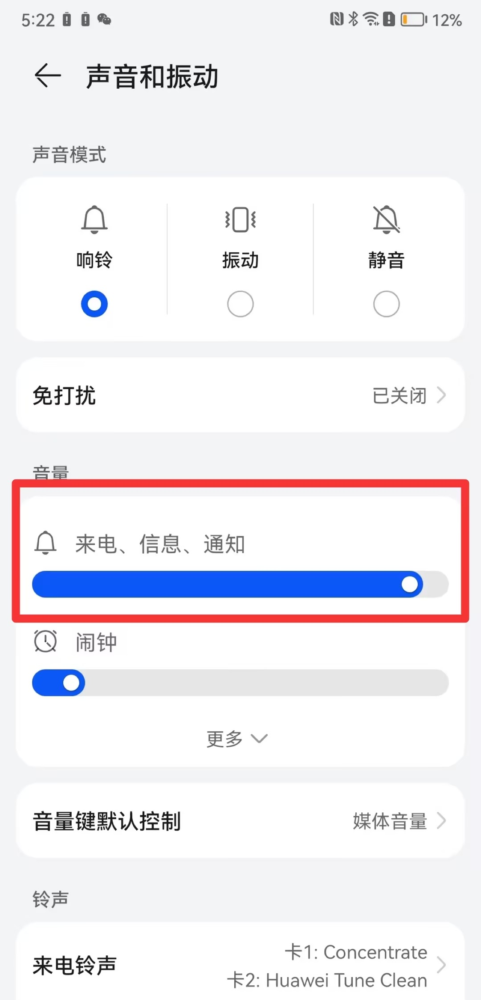

## 5. 通知提醒的形式

受产品形态、系统版本和权限控制的影响，在不同情况下，通知的表现形式会有所差异

### 5.1 iOS 平台通话提醒形式

- 微信在前台：微信内弹出通话提醒浮窗。
- 微信在后台/锁屏：弹出系统通知。

### 5.2 安卓平台通话提醒形式

- 微信在前台：
    - 微信有「悬浮窗」权限：微信内弹出通话提醒浮窗。
    - 微信无「悬浮窗」权限：直接拉起小程序接听页面。
- 微信在后台/锁屏：
    - 安卓 10 及以上版本：弹出系统通知；如果系统允许，也可能直接拉起小程序接听页面。
    - 安卓 10 以下版本：直接拉起小程序接听页面。锁屏时可能需要手动点亮屏幕。

## 6. 对照实验

由于可能影响通知表现的开关较多，而且不同的系统间也存在差异性，请用户协助逐个排查是比较困难的。这种情况下，我们建议可以进行对照实验，即：

在 **相同设备和网络环境** 下，分别测试「硬件设备拨打微信」、「微信好友拨打微信」、「微信聊天消息」是否能收到提醒。

- 如果均无法收到提醒，考虑到用户一般不会完全屏蔽微信聊天消息，此时大概率是网络问题，导致消息无法按时收到。
- 如果「微信聊天消息」能收到，「硬件设备拨打微信」和「微信好友拨打微信」收不到，此时大概率是用户的配置有问题，导致消息收到后未能正确展示。对于 iOS 用户，建议优先确认是否是「1.1 PC 微信关闭手机通知」的情况。
- 如果「微信聊天消息」和「微信好友拨打微信」能收到，「硬件设备拨打微信」收不到，此时可能是「硬件设备拨打微信」的提醒存在问题（例如小程序启动失败等情况），建议参考第 7 节反馈给我们。

**如果是测试锁屏后一段时间的情况，测试期间应避免操作手机。以免设备退出省电或休眠模式导致测试环境变化。**

## 7. 仍未解决

如果仍无法确定原因，可以在 [微信开放社区「硬件服务」板块](https://developers.weixin.qq.com/community/minihome/mixflow/2351405025148862470) 发帖联系我们分析。

**如果帖子发在其他板块，可能会被反馈到其他团队，没办法及时处理，请在「硬件服务」板块重新发帖。**

帖子中请提供标识一次通话的信息（二选一）

1. 该次通话插件返回的 roomId 及通话发生的日期。
2. 至少通话一方的信息（设备 SN 或微信用户 openId/微信号），以及通话开始的具体时间点（越精确越好）。

如果有条件的话，也请一并提供手机微信端日志，方法如下：

微信客户端「我」->「设置」->「帮助与反馈」->「右上角扳手🔧」->「上传日志」-> 选择「异常当天的日志」上传，并提供问题发生的 **时间** 和 **微信号** 。

如果可以重现问题，请尽量和日志一并提供操作视频（拍摄或录屏），以便我们更好的还原当时的情况。
