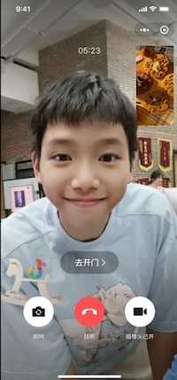
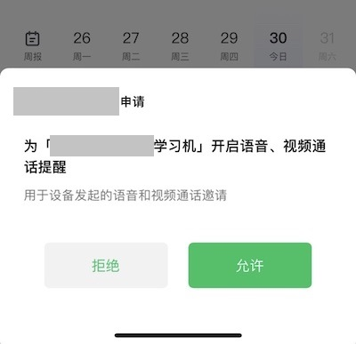
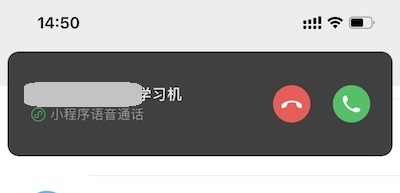
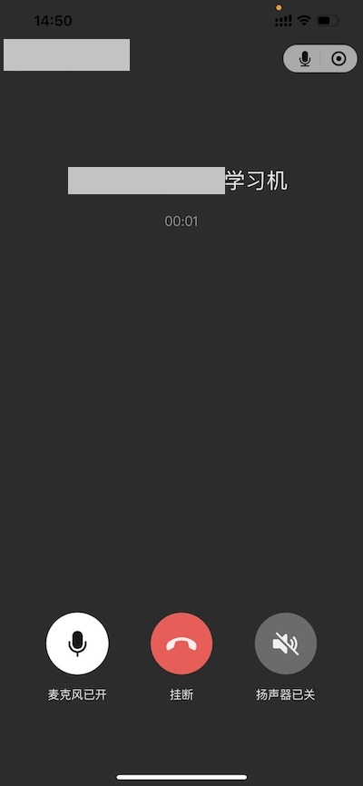

<!-- 来源: https://developers.weixin.qq.com/miniprogram/dev/framework/device/voip/voip-faq.html -->

# 常见问题（FAQ）

#### 通话相关异常，请参考 [《通话异常排查指南》](./guide.md)

## 1. 功能相关（通用）

##### 1.1 如何限制用户的单次通话时长？

建议使用 [`initByCaller`](../voip-plugin/api/initByCaller.md) 的 `timeLimit` 参数。插件低版本也可以根据 `calling` 事件的 `keepTime` 字段计算通话时长。超过限制后可以调用插件 [`forceHangUpVoip`](../voip-plugin/api/forceHangUpVoip.md) 中断通话。

**不建议使用定时器实现此功能，容易出现一些异常情况导致定时器没有被清理的情况。导致影响后续通话。**

##### 1.2 在门禁、门锁场景，如何在手机端通话页面实现「开门」等功能？

插件提供了 [`setCustomBtnText`](../voip-plugin/api/setCustomBtnText.md) 接口在手机端接听页面自定义按钮，开发者可配置一个自定义的弹层来实现具体功能。

C 端用户体验如下图所示：



##### 1.3 用户如何取消授权？

用户可以在小程序设置页里取消授权，或通过在最近使用中删除小程序来清空授权记录。请参考「 [处理授权失效的情况](./voip/auth.md#_2-%E5%A4%84%E7%90%86%E6%8E%88%E6%9D%83%E5%A4%B1%E6%95%88%E7%9A%84%E6%83%85%E5%86%B5) 」。

##### 1.4 如何查询用户是否已授权设备（组）？

请参考「 [授权状态查询](./voip/auth.md#_4-%E6%8E%88%E6%9D%83%E7%8A%B6%E6%80%81%E6%9F%A5%E8%AF%A2) 」。

##### 1.5 如何设置呼叫超时时长（长时间不接听时停止呼叫）？是否支持轮询呼叫？

开发者可以自行控制超时时间，超时后调用插件 [`forceHangUpVoip`](../voip-plugin/api/forceHangUpVoip.md) 接口中断通话。

超时后，开发者可以根据业务场景，选择自动拨打给其他用户，实现轮询呼叫的能力。例如 101 号房有 A、B、C 三位业主，打给 A 业主 30 秒未接听，可自动打给 B 业主，依此类推。

##### 1.6 如何自定义手机端看到的设备端来电名称？

为强化设备通话的认知、保证用户体验统一，手机端用户授权设备名称、接听设备来电的名称需保持一致。

`授权设备名称 = 来电方名称 = 开发者自定义名称 + 设备类型名称` 。如「艾玛的希沃网课学习机」。开发者需要考虑名称显示，对名称做好规范。

 



（案例示意：订阅设备名称、来电方名称、语音通话中设备名称）

##### 1.7 使用物联网卡时，如何配置域名和 IP 白名单？

VoIP 业务依赖于微信基础服务和小程序相关的业务内容，涉及比较多的 IP（在几千的量级）和域名，暂时未能提供完整的域名和 IP 列表，目前建议使用非定向的流量。

如有定向流量的需求，可在 [微信开放社区「硬件服务」板块](https://developers.weixin.qq.com/community/minihome/mixflow/2351405025148862470) 发帖联系我们。

**注意：IP 本身会随着业务的变更而增添或者裁撤，因而暂时没办法提供稳定的列表。**

##### 1.8 音视频通话的流量使用情况？

根据测算，语音通话大概是 2MB/分钟，视频是 10-30MB/分钟。

##### 1.9 设备无摄像头或因隐私等原因不希望传画面（门禁、门锁的用户端），如何默认禁用摄像头？

插件发起通话时可以设置 caller.cameraStatus 或 listener.cameraStatus，设置两端是否默认开启摄像头，参见 [`initByCaller`](../voip-plugin/api/initByCaller.md) 接口文档。

如果要禁止用户切换摄像头，可以用插件的 [setUIConfig](../voip-plugin/api/setUIConfig.md) 设置 callerUI/listenerUI 的 enableToggleCamera 选项。

##### 1.10 为何推送消息显示的通话时长和通话结束或者 endVoip 事件获取的不一致？应该如何获取准确的通话时长？

VOIP 插件 2.2.1 及以下版本，通话结束页显示的时间为本地定时器计算的时间，endVoip 事件的 keepTime 提供的也是这个时间。但是由于通话双方之间存在一定网络延迟，这里的时间可能与实际扣费时长并不一致（一般要多于实际扣费的时长）。

VOIP 插件 2.2.2 版本开始，会在通话结束后（即 endVoip 事件后）从后台获取实际扣费时长，并通过 finishVoip 事件的 keepTime 返回给开发者。通话结束页也会更新显示实际的扣费时长。

## 2. 功能相关（安卓设备）

##### 2.1 安卓应用和小程序之间如何进行参数传递和通信？安卓应用如何接收小程序发来的消息？

1. 简单的「安卓应用 -> 小程序」单向单此传递参数的场景，可以直接在启动小程序的 path 中拼接 query。
2. 如果安卓应用要接收小程序发来的事件、需要双向通信或者数据量大时可以通过 WMPF 提供的 [通信通道(Invoke Channel)](https://developers.weixin.qq.com/doc/oplatform/Miniprogram_Frame/invoke-channel.html)

##### 2.2 通话完成后如何关闭小程序？

当设备端小程序只承载 VOIP 通话能力时，可能需要在通话结束后将小程序切后台或关闭。

小程序收到插件的 `endVoIP` 事件后，通过 WMPF 提供的 [通信通道(Invoke Channel)](https://developers.weixin.qq.com/doc/oplatform/Miniprogram_Frame/invoke-channel.html) 通知 App。

收到通知后，App 可以选择调用 [closeWxaApp](https://developers.weixin.qq.com/doc/oplatform/Miniprogram_Frame/api/cli/miniprogram/closeWxaApp.html) 将小程序切后台或关闭（可参考 [《性能与体验优化指南》](./voip/performance.md#_4-%E5%AE%89%E5%8D%93-WMPF-%E5%85%B3%E9%97%AD%E5%B0%8F%E7%A8%8B%E5%BA%8F%E6%97%B6%E5%88%87%E5%90%8E%E5%8F%B0) 的说明选择）。

##### 2.3 如何判断当前小程序是在设备端（WMPF）还是手机端打开

在 WMPF 运行时，小程序能可以访问到 `wmpf` 这个全局变量。可以通过是否存在这个全局变量来判断： `typeof wmpf !== 'undefined'` 即为设备端。

**注意：调用 wmpf 上的方法前，应提前判断 wmpf 这个全局变量是否存在，否则在手机微信端走到这段逻辑时会报错。**

## 3. 异常相关（通用）

##### 3.1 手机端未收到微信通话强提醒或提醒强度不符合预期（锁屏未提醒、未响铃、未震动等）

请参考 [《通话提醒异常排查指南》](./notification.md) 。

##### 3.2 获取设备票据 getSnTicket 接口返回 48001 (api unauthorized)

小程序 appId 未完成 [硬件设备接入](./device-access.md) 导致。请确认：

- appId 对应小程序已在「小程序管理后台」完成硬件设备接入。
- 请求时使用的 access\_token 通过是完成申请小程序的 appId 申请的，而不是其他小程序的 appId 或者移动应用的 hostAppId。

##### 3.3 `wx.requestDeviceVoIP` 报错 `invalid scope`

小程序 appId 未完成 [硬件设备接入](./device-access.md) 或接入后未申请「小程序音视频能力」设备能力导致。请确认小程序已在「小程序管理后台」完成硬件设备接入并申请通过小程序音视频能力。

##### 3.4 `wx.getEnterOptionsSync` 或插件的 `getPluginEnteroptions` 无法获取到进入小程序的 query

一般有以下几种情况：

- 这两个函数只能获得小程序启动时（冷启动或热启动）的参数，如果是通过 `wx.navigateTo` 等路由方式跳转页面的情况，则需要在对应页面的 `onLoad` 生命周期获取。
- 由于插件和宿主小程序的安全策略限制，当小程序启动路径为插件页面时，需要通过 VOIP 插件提供的 `getPluginEnteroptions` 获取 query；当小程序启动路径为小程序页面时，需要通过 `wx.getEnterOptionsSync` 获取 query。

建议排查时同时打印返回值中的 `path` 字段，确认是否是预期的传入 `query` 的 `path` 。

##### 3.5 接听方接听时提示「页面不存在」

一般有以下几种情况：

- 调用插件 `initByCaller` 时未设置 `miniprogramState` ，或设置了 `miniprogramState: formal` ，此时接听方会打开正式版小程序。而设备 VOIP 能力尚未发布正式版。
- 调用插件 `initByCaller` 时设置了 `miniprogramState: trial` ，此时接听方会打开体验版小程序。而当前设置为体验版的小程序中并未支持设备 VOIP 能力。
- 调用插件 `initByCaller` 时设置了 `miniprogramState: developer` ，此时接听方会打开开发版小程序。此时接听方需要提前扫码下载与拨打方相同的开发版小程序方可使用。

##### 3.6 发起通话后，插件页面一直停留在「等待进行通话」界面无反应

一般有以下几种情况：

- 小程序未调用插件 `initByCaller` 发起通话。可能是前置逻辑异常或未走到发起通话的分支。开发者应首先确定调用了该接口。
- 小程序调用插件 `initByCaller` 失败，可能会抛出异常或者返回了非 0 的 errCode。开发者应正确的捕获和处理接口异常，并给用户必要的提示。

##### 3.7 为什么我在 wecopper 的设备管理里找不到公钥？

这是因为你的设备类型是微信支付刷脸设备，目前这类设备不支持硬件 Voip 模式，需要重新申请设备类型。

## 4. 异常相关（安卓设备）

##### 4.1 WMPF 获取不到正确的摄像头，或摄像头画面旋转

可以使用 [`InitGlobalConfig`](https://developers.weixin.qq.com/doc/oplatform/Miniprogram_Frame/api/client/InitGlobalConfig.html) 接口指定小程序使用的摄像头，也可以指定摄像头画面的旋转角度。

```kotlin
fun initGlobalConfig() {
    val jsonConfig = JSONObject()
        // 请注意：USB 摄像头和内置摄像头使用的参数名称是不一样的。
    try {
        // 案例 1：微信端画面颠倒
        jsonConfig.put("cameraPushFlip", true) // USB 摄像头需使用 usbCameraPushFlip 参数

        // 案例 2：使用内置摄像头，微信端显示画面旋转
        jsonConfig.put("cameraRotationAngle", 90) // 根据实际情况调整角度

        // 案例 3：通过指定 internalCameraName 使用设备内置摄像头（需 WMPF 2.0.0 支持）
        jsonConfig.put("internalCameraName", "xxxx")

        // 案例 4：通过指定 cameraId 使用设备内置摄像头
        jsonConfig.put("cameraId", 0)

        // 案例 5：通过直接指定摄像头设备路径使用 USB 摄像头（与案例 5 的情况二选一）
        jsonConfig.put("usbCameraName", "/dev/xx/xx/xx")

        // 案例 6：通过指定三元组使用 USB 摄像头（与案例 4 的情况二选一）
        jsonConfig.put("usbCameraProductId", 0)
        jsonConfig.put("usbCameraVendorId", 0)
        jsonConfig.put("usbSerialNumber", "xxx")

        // 案例 7：使用 USB 摄像头，WMPF 预览和微信端显示画面旋转
        jsonConfig.put("usbCameraRotationAngle", 90) // 根据实际情况调整角度

        val json = jsonConfig.toString()
        LogUtils.d(TAG, "initGlobalConfig", json)
        Api.initGlobalConfig(json)
            .subscribe({
                LogUtils.d(TAG, GsonUtils.toJson(it))
                warmLaunch()
            }, {
                LogUtils.d(TAG, GsonUtils.toJson(it))
                warmLaunch()
            })
    } catch (e: Exception) { }
}
```

如果设置摄像头画面旋转未生效，建议按照下列指引检查：

- `InitGlobalConfig` 必须在 `ActivateDevice` 回调成功后、启动小程序前调用。建议在 `ActivateDevice` 的 onSuccess 回调后调用。
- `InitGlobalConfig` 设置是一次性的，在每次 WMPF 启动后都需要调用。
- 请确认设备使用的是 **USB 摄像头还是内置摄像头** 。
    - 如果通过 `usbCameraName` ，或 `usbCameraProductId + usbCameraVendorId + usbSerialNumber` 指定使用 USB 摄像头，需使用 `usbCameraPushFlip` 和 `usbCameraRotationAngle` 设置画面旋转
    - 其他情况下使用内置摄像头，可以使用 `internalCameraName` 指定摄像头 cameraId。此时需使用 `cameraPushFlip` 和 `cameraRotationAngle` 设置画面旋转。此时只能设置微信客户端看到的推流画面的旋转，不能改变设备端看到的预览画面。

##### 4.2 设备端有时收不到推送的通话提醒

可以根据下列指引排查

- 确认 WMPF 升级到 v1.1.5 及以上版本；
- 确认设备端已联网，并确认网络畅通；
- 确认设备端 WMPF 已启动并且以及完成激活（ActivateDevice），确保 WMPF 正常运行
- WMPF 因 crash 等原因异常退出后，需要重新拉起。建议监听 `IPCInvoker.addRemoteProcDiedListener(WMPFService.WMPF_SERVICE_PROCESS_NAME, listener)` ，在 WMPF 退出后重新拉起。

##### 4.3 设备端为什么会需要用户微信扫码登录？

使用小程序音视频通话（for 硬件）能力时，用户无需在设备端扫码登录。但是如果小程序内调用了与微信登录态相关的接口，例如 `wx.login` ，会弹出扫码界面要求用户登录。

建议开发者参考 2.3，判断小程序在 WMPF 环境内运行时，避免调用相关接口。

##### 4.4 WMPF ActivateDevice 报错 `signature err 1`

signature err 是指后台发现签名中的参数与 ActivateDevice 传入的参数不匹配。建议按照下列指引检查：

> 请注意，签名校验成功只能说明签名中包含的参数和校验时提供的参数一致，并不代表 ActivateDevice 不会报错。

- 确认 WMPF 升级到 v1.1.5 及以上版本；
- 确认生成签名时的 productId、deviceId 和所使用密钥的版本(keyVersion) 与 ActivateDevice 传入的参数一致。
- 确认生成签名时使用的密钥对与 wecooper 上登记的一致。如密钥对更换，请及时在 wecooper 上更新，并使用新的密钥对和 keyVersion 进行签名。
- 在开发者后台生成签名时，生成签名环境的 openssl 版本推荐使用 1.1.1，已确定 1.0.x 和 3.0.x 版本会有问题，其它版本开发者可自行尝试。
- WMPF 文档中提供的 [辅助工具](https://developers.weixin.qq.com/doc/oplatform/Miniprogram_Frame/utils.html) 只适用于调试，mmIoT\_ecdsa\_sign.sh 脚本或 java 接口生成签名时，不支持并发操作。

##### 4.5 WMPF 调用接口时回调 onBridgeNotFound，或提示 `bridge not found`

此报错说明 WMPF Service 未运行。WMPF Client 会尝试在调用接口时自动拉起 WMPF Service，但可能因为一些原因导致失败。建议按照下列指引检查：

- 确认 WMPF Service APK 已安装；
- 确认系统设置中已开启 WMPF Service 的自启动权限。否则需要手动启动 WMPF Service。
- 确认 WMPF 当前为存活状态（未被系统杀死）

##### 4.6 WMPF 调用时报错 `Failed to find provider info for com.tencent.wmpf.comm.provider`

应用 targetSdkVersion >= 30 时，安卓要求在应用的清单文件中添加 `<queries>` 元素，请参考 [安卓文档](https://developer.android.com/about/versions/11/privacy/package-visibility?hl=zh-cn) 进行配置。

```xml
<manifest>
    ...
    <queries>
        <provider android:authroities="com.tencent.wmpf.comm.provider"/>
    </queries>
    ...
</manifest>
```

##### 4.7 WMPF ActivateDevice 报错 `10013 request timeout`

请按下列步骤排查

- 确认设备网络正常；
- 确认设备安卓系统为 7.1 及以上版本（WMPF 要求最低 7.1）；
- 如果设备为支付刷脸设备，使用硬件 VOIP 时，应确保支付相关的应用和服务已全部删除或禁用，否则会有冲突。

##### 4.8 WMPF 调用 v2 版接口时报错 `call WMPF.apk fail, is it installed? (errCode=10001)`

- WMPFDevice 不能被继承，否则可能导致数据反序列化失败。
- 如果 v1 版接口能调用成功，则一般是 wmpf-cli 和 WMPF Service APK 版本不匹配导致。二者应都升级到 >= 2.1.0 **正式版** 。
- 如果 v1 版也无法成功，则参考 4.5 进行排查。

##### 4.9 WMPF 报错 `err:TRANSFER errCode:33`

此错误表示 WMPF 与微信后台的网络请求超时（30s），可能有以下原因

- 网络连接本身出现异常，如设备断网或网络不稳定。
- 设备登录态超时后，WMPF 会自动进行重新登录，若重新登录失败会导致此问题。
- 相同的 deviceId 在另一台设备上激活，会导致其他使用此 deviceId 的设备登录态被踢。被踢后 WMPF 会自动进行重新登录，若重新登录失败会导致此问题。

##### 4.10 小程序运行时报错 `wmpf is undefined`

`wmpf` 是小程序硬件框架(WMPF) 特有的全局变量，仅能在 WMPF 内访问到，手机微信客户端不存在这个全局变量。

出现这个报错，通常是开发者没有判断当前环境就直接访问这个全局变量，导致小程序在手机微信客户端内运行时报错。

如果使用 wmpf 全局变量的逻辑会同时运行在 WMPF 和手机微信，建议使用前先判断当前运行环境，例如：

```js
if (typeof wmpf !== 'undefined') {
  // WMPF，可以使用 wmpf 环境变量
  wmpf.Channel.invoke({
    command: 'test',
    success: function(res) {
      console.log(res.data)
    }
  })
} else {
  // 手机微信
}
```

##### 4.11 在 WMPF 里使用错误的 SN 等信息激活失败后，修改为正确的 SN 仍异常。

wmpf 作为服务运行，是会对第一次注册的一些信息做缓存的，一般碰到这种异常，清理掉 wmpf 缓存再重试。
