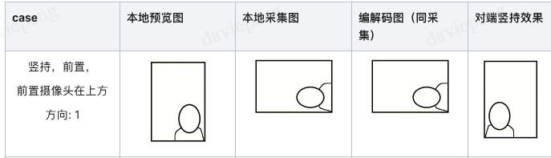
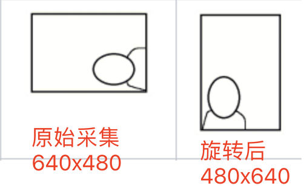
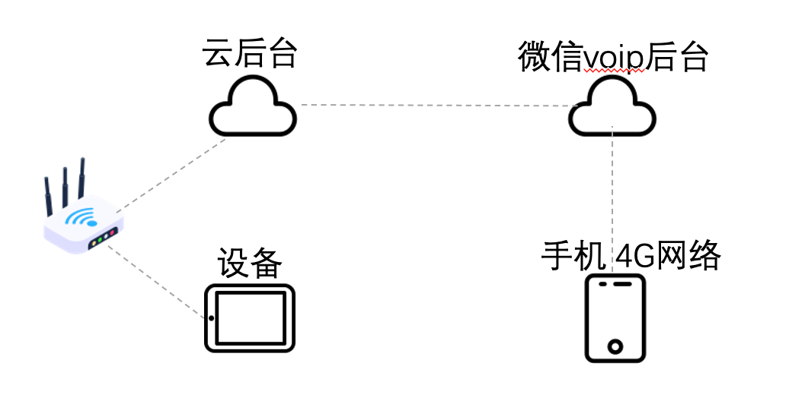

<!-- 来源: https://developers.weixin.qq.com/miniprogram/dev/framework/device/voip/voip-video.html -->

# VoIP 视频流指南

小程序 Voip 的视频流默认为 H264 编码流，从设备端看，分为设备上行流与微信下行流，分辨率目前最大为 640x480。

对于上行流，是设备采集 -> 设备编码 -> 网络传输 -> 微信接收 -> 微信解码 -> 小程序渲染。 对于下行流，是微信采集 -> 微信编码 -> 网络传输 -> 设备接收 -> 设备解码 -> 设备渲染。

需要注意的是，微信客户端使用摄像头采集视频流的原始分辨率为 640x480，并且它的方向与物理方向并不一致，所以针对 RTOS 和 Linux 设备，它们收到流后，需要进行后处理才能渲染正确。



## 1. Android 设备

**Android 设备的开发者无需关心视频流的方向问题。WMPF 会对接收的视频流进行旋转，小程序渲染输出即可（objectFit 为 fill)。**

## 2. Linux/RTOS 设备

此类型设备无法运行 WMPF，直接使用 SDK 进行视频流的接收和发送。

#### 2.1 设备发送视频流

手机摄像头的本地采集为上图所示的逆时针旋转 90 度方向，但嵌入式设备一般不会有这种情况，所以当嵌入式设备上的摄像头采集流直接使用 SDK 发送出去后，微信端小程序 Voip 插件在不使用 setUIConfig 配置旋转时，反而会渲染出旋转的画面。

有两种方案解决：

- 旋转嵌入式设备摄像头的视频流为逆时针旋转 90 的视频流。
- 微信小程序上使用插件的 [setUIConfig](../voip-plugin/api/setUIConfig.md) 配置 **对方** 的旋转方向为 270。

**SDK 端如何发送视频流才能使小程序端尽早的展示图像?**

- 需要在开发者实现的 camera\_device->open\_stream 调用完成后，才能发送 H264/H265 流。
- 保证前几桢发送的为信息桢及关键桢，顺序应该如下：
  sps -> pps -> i-frame -> p-frame -> p-frame -> ......
- 不要使用带有 B 桢的流
- 需要在状态为 TALKING 时再开始发送，不然前面的信息桢可能会被抛弃导致 p-frame 发送失败，只有等下一个周期的信息桢才能成功。

**需要注意的是，设备发送的视频流分辨率，长、宽的数值都需要与 8 对齐**

#### 2.2 设备接收视频流

设备接收到的是微信客户端利用摄像头采集并编码的视频流，Android 和 IOS 的摄像头采集时，原始流都是逆时针旋转 90 的流，设备接收到的正是如此。

有两种方案解决：

- **推荐:** 嵌入式设备在收到流后，在输出时顺时针旋转 90 即可。
- 使用 >= 8.0.54 版本的微信客户端，使用 >= 2.4.5 版本的前端 VoIP 插件，使用支持详细订阅参数的 SDK 版本。详细方法见 2.4

### 2.3 视频流分辨率

微信小程序 Voip 视频的分辨率不是固定的，它会随着网络质量的变化而变化。

- 设备上行视频流：分辨率不应该超过 1080p。通话过程中允许分辨率发生变化，但需要及时的发送 SPS 、I 桢等。典型的分辨率是 320x240、640x480。
- 微信下行视频流：微信下行视频流都是从 320x240/240x320 分辨率开始的，然后根据网络情况，会提升至 640x480/480x640。

针对微信下行视频流，有些 RTOS 设备不支持处理分辨率变化流的能力。开发者可以使用 2.4 的方法固定分辨率。

### 2.4 微信视频编码定制方法

针对 RTOS 或 Linux 设备，当设备对于微信发过来的 h264/h265 码流要求比较苛刻时，可以使用如下方法来定制微信编码行为，从而获取自定义的视频流。

我们需要了解四个参数：

- **encodeVideoFixedLength** 编码的长边值固定起来，不要随着网络质量变化而变化，可取 320、480、640
- **encodeVideoRotation** 编码的视频旋转方向。1: 发出正向流. 2: 保持发出旋转流
- **encodeVideoRatio** 视频的比例, 宽/高\*100
- **encodeVideoMaxFPS** 视频的最大 FPS。最小 8，最大 15.

这些参数需要在两个地方同时设置：

- **微信端** ：当前端 VoIP 插件版本 >= 2.4.5 时，插件会从 query 参数中解析出这些字段设置到微信里。不管哪种形式的呼叫接口里都有 query 参数，在 query 里正确设置好这些字段即可。
- **SDK 端** ：使用支持这些参数的 SDK 版本并正确设置。SDK 端的设置入口为 wx\_init\_config\_t 中的 subscribe\_video\_length、subscribe\_video\_rotation、subscribe\_video\_ratio、subscribe\_video\_maxfps

**我们看一个案例, 某设备希望收到 240x320 的正常方向流**

<table><thead><tr><th>参数</th> <th>取值</th> <th>说明</th></tr></thead> <tbody><tr><td>encodeVideoFixedLength</td> <td>320</td> <td>240x320 的长边为 320</td></tr> <tr><td>encodeVideoRotation</td> <td>1</td> <td>1 为正常方向，2 为旋转方向</td></tr> <tr><td>encodeVideoRatio</td> <td>75</td> <td>宽/高*100 = 240/320 * 100 = 75</td></tr></tbody></table>

- 在呼叫时，可以传 query 这样的参数：

```c
encodeVideoFixedLength=320&encodeVideoRotation=1&encodeVideoRatio=75
```

- SDK 端，给 config.subscribe\_video\_length、config.subscribe\_video\_rotation、config.subscribe\_video\_ratio 也传入对应的值。
- 前端小程序建议做一个微信版本判断的逻辑，大于 8.0.54 才能使用此功能。

其它的分辨率也能定制出来，但需要注意的是，小程序 VoIP 场景的微信摄像头原始采集分辨率为 640x480 且为物理方向逆时针旋转 90 的流，这意味着，你不能定制出 640x480 的正常方向流，而只能定制出 480x640 的正常方向流。



### 2.5 性能参考

#### 2.5.1 微信响铃延时

- wx\_cloudvoip\_client\_call 接口正常需要 600ms 左右。如果在 RTOS 设备上运行，根据不同的网络侧实现，接口的返回时间会有所不同。
- wx\_cloudvoip\_client\_call 接口返回成功后，微信侧即响铃。当然，对于不同的手机，延时情况会不一样。对于 iphone，还依赖于 apple 的消息推送，对于 android，各种系统设置还可能导致手机消息异常，可参考 [通话提醒异常排查指南](./notification.md)

#### 2.5.2 视频流延时

以下几种场景下的延时与网络质量有很大关系，以下数据都基于网络正常的情况。

- 接听成功后，设备端首次收到视频流的时延约 1s ~ 2s 左右，对端不同性能的手机、不同的微信版本，时间会有少许差异。
- 接听成功后，手机端首次收到视频流的时延约 1s ~ 2s 左右。需要注意的是，手机端如果从悬浮通知直接接听，会经历（1）打开小程序与（2）加入通话 两个过程，这里的 1s ~ 2s 指的是（2）加入通话这个过程。打开小程序的耗时与手机性能强相关。
- 典型的场景，设备采集视频 -> 传送到云端 -> 送入云端 SDK 接口 -> 微信小程序端出图:  整个过程的延时大约在 200 ~ 300ms。
