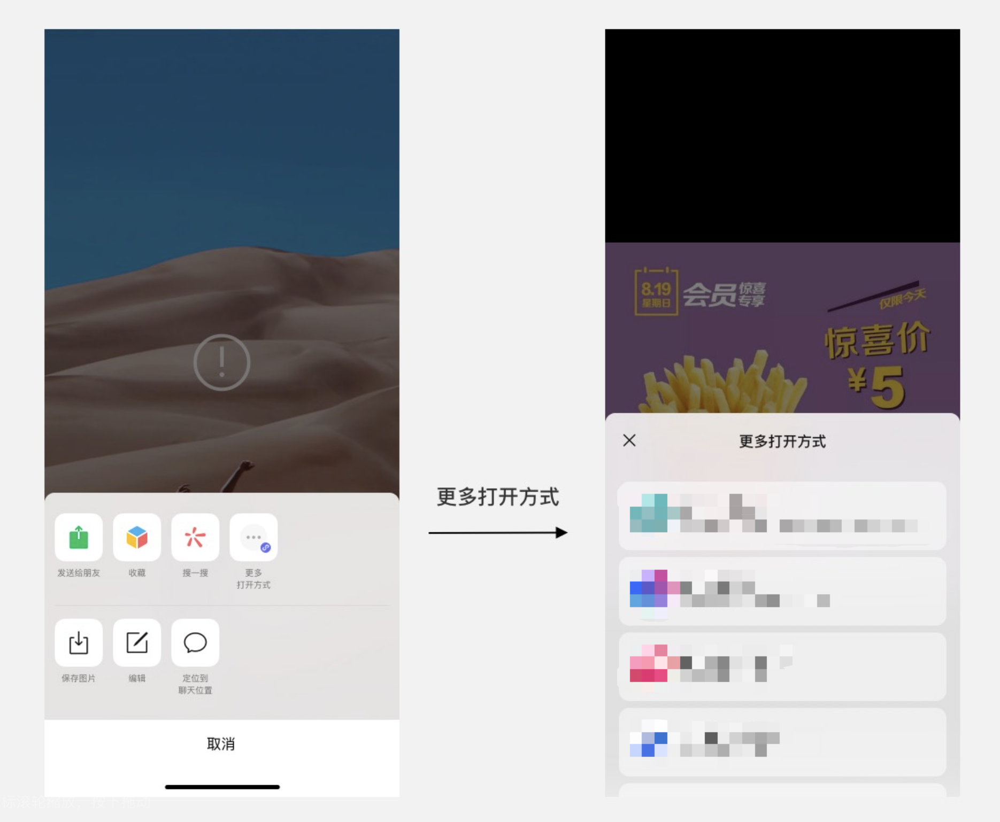

<!-- 来源: https://developers.weixin.qq.com/miniprogram/dev/framework/material/support_material.html -->

# 聊天素材支持小程序打开

从基础库 [2.14.3](../compatibility.md) 开始支持

支持平台： Android

客户端版本： webview打开小程序需要升级至微信7.0.22及以上版本，文件和视频打开小程序需要升级至微信8.0.0 及以上版本，图片打开小程序需要升级至微信8.0.1及以上版本

支持类型： 仅小程序，小游戏暂不支持

## 功能介绍

微信聊天内素材（文件、图片、视频和webview）的打开方式增加使用小程序打开的入口。用户可通过小程序处理聊天内的文件、图片、视频和webview。例如用小程序将文件存储到网盘、给图片加滤镜、进行视频剪辑或者将webview保存到笔记等。目前仅支持不带二维码的图片直接通过小程序打开。



用户在打开微信聊天内的素材时，如果小程序配置了支持打开该类型的素材并审核通过，而且用户曾经使用过该小程序，则打开该类型的素材时会出现使用小程序打开的入口。

在 PC 端基础库大于 3.7.6 的环境下，用户可以通过拖入文件的方式来触发小程序打开。当拖入符合规则的文件后，框架侧将会 reLaunch 小程序。当拖入不符合规则的文件，框架侧将会提示用户文件不支持。

## 使用说明

开发者需要在 [小程序全局配置](../config.md) (app.json)中声明支持打开的文件类型，对一种文件类型只能声明一种处理方式。

```json
{
    "supportedMaterials": [
        {
            "materialType": "text/html",
            "name": "用${nickname}打开",
            "desc": "描述",
            "path": "pages/index/"
        },
        {
            "materialType": "video/*",
            "name": "用${nickname}播放",
            "desc": "描述",
            "path": "pages/index/"
        },
        {
            "materialType": "video/mp4",
            "name": "用${nickname}播放",
            "desc": "描述",
            "path": "pages/index/"
        }
    ]
}
```

<table><thead><tr><th>属性</th> <th>类型</th> <th>必填</th> <th>描述</th></tr></thead> <tbody><tr><td>materialType</td> <td>String</td> <td>是</td> <td>支持文件类型的<code>MimeType</code>，音频，视频支持二级配置的通配模式，例如: <code>video/*</code>。通配模式配置和精确类型配置同时存在时，则优先使用精确类型的配置(例如<code>video/*</code>和<code>video/mp4</code>同时存在，会优先使用<code>video/mp4</code>的配置)。</td></tr> <tr><td>name</td> <td>String</td> <td>是</td> <td>开发者配置的标题，在素材页面会展示该标题，配置中必须包含<code>${nickname}</code>, 代码包编译后会自动替换为小程序名称，如果声明了简称则会优先使用<a href="https://kf.qq.com/faq/170109umMvm6170109MZNnYV.html" target="_blank" rel="noopener noreferrer">简称<span></span></a>。除去<code>${nickname}</code>其余字数不得超过6个。</td></tr> <tr><td>desc</td> <td>String</td> <td>是</td> <td>用途描述，会在推荐列表展示该描述，限定字数不超过22个。</td></tr> <tr><td>path</td> <td>String</td> <td>是</td> <td>在该场景下打开小程序时跳转页面</td></tr></tbody></table>

**最新客户端版本** 支持的 `MimeType` 类型：

<table><thead><tr><th>MimeType</th> <th>文件后缀</th> <th>说明</th></tr></thead> <tbody><tr><td>video/*</td> <td></td> <td>视频类文件</td></tr> <tr><td>audio/*</td> <td></td> <td>音频类文件</td></tr> <tr><td>image/*</td> <td></td> <td>图片类文件</td></tr> <tr><td>text/html</td> <td></td> <td>webview</td></tr> <tr><td>text/plain</td> <td>.txt</td> <td></td></tr> <tr><td>application/*</td> <td></td> <td>通用文件配置</td></tr> <tr><td>application/pdf</td> <td>.pdf</td> <td></td></tr> <tr><td>application/msword</td> <td>.doc</td> <td></td></tr> <tr><td>application/vnd.openxmlformats-officedocument.wordprocessingml.document</td> <td>.docx</td> <td></td></tr> <tr><td>application/vnd.ms-word.document.macroEnabled.12</td> <td>.docm</td> <td></td></tr> <tr><td>application/vnd.ms-excel</td> <td>.xls</td> <td></td></tr> <tr><td>application/vnd.openxmlformats-officedocument.spreadsheetml.sheet</td> <td>.xlsx</td> <td></td></tr> <tr><td>application/vnd.ms-excel.sheet.macroEnabled.12</td> <td>.xlsm</td> <td></td></tr> <tr><td>application/vnd.ms-powerpoint</td> <td>.ppt</td> <td></td></tr> <tr><td>application/vnd.openxmlformats-officedocument.presentationml.presentation</td> <td>.pptx</td> <td></td></tr> <tr><td>application/zip</td> <td>.zip</td> <td></td></tr> <tr><td>application/vnd.rar</td> <td>.rar</td> <td></td></tr> <tr><td>application/x-7z-compressed</td> <td>.7z</td> <td></td></tr> <tr><td>application/x-photoshop</td> <td>.psd</td> <td></td></tr> <tr><td>application/acad</td> <td>.dwg</td> <td></td></tr> <tr><td>application/x-cdr</td> <td>.cdr</td> <td></td></tr> <tr><td>application/dxf</td> <td>.dxf</td> <td></td></tr> <tr><td>application/step</td> <td>.stp</td> <td></td></tr> <tr><td>application/rtf</td> <td>.rtf</td> <td></td></tr> <tr><td>application/postscript</td> <td>.ai</td> <td></td></tr></tbody></table>

### 小程序启动参数

[小程序启动参数](https://developers.weixin.qq.com/miniprogram/dev/api/base/app/app-event/wx.onAppShow.html) 里场景值为 `1173` ，该场景下启动参数和query同一级有一个数组 `forwardMaterials` ，代表转发的文件信息，数组中每一个对象包含属性 `{type,name,path,size}` 分别代表文件类型，文件名，文件路径或url，文件大小

## 发布

小程序提审时会审核声明的 `supportedMaterials` 是否合规，小程序发布上线后相应文件类型打开入口才会出现小程序。

如果小程序实现的功能价值较低将不会被通过审核，包括但不限于以下情况：

1. 打开小程序后的功能与对应的素材没有任何关系：只是通过这个入口打开了自己的小程序，而并没有对素材做任何的处理。
2. 打开小程序后处理素材的方式过于简单：比如只是播放视频或只是查看.docx文件等通过微信聊天就能实现的简单功能。

请开发者结合自身小程序的功能与用户需求进行适配。

## 调试

### 体验版

体验版小程序支持单独配置 `supportedMaterials` ，和正式版的小程序配置相互独立，上述相应的入口小程序列表也会单独展示体验版小程序。

### 开发者工具

开发者可在自定义编译模式下通过场景值 `1173` 调试该功能。
