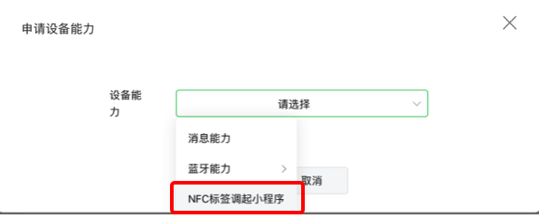

<!-- 来源: https://developers.weixin.qq.com/miniprogram/dev/framework/open-ability/NFC.html -->

# NFC 标签打开小程序

> 安卓微信客户端 8.0.14 开始支持，iOS 现网版本均已覆盖。

基于小程序 [URL Scheme](./url-scheme/README.md) ，在现有短信、邮件、网页等场景外，微信还支持通过 NFC 卡片快捷拉起小程序页面的能力。可用于智能设备的快速配网、快捷控制等场景。

该能力不受 URL Scheme 30 天有效期限制，且允许多个用户访问。

## NFC 标签格式

要实现直接打开小程序，NFC 标签需要按照以下格式写入：

NFC 标签必须是 `NFC Data Exchange Format (NDEF)` 类型，标签中需要包含两条 Record ：

- URI Record
    - Type Name Format (TNF): `0x01` (Well-Known)
    - Type: `U`
    - Payload: 小程序 [URL Scheme](./url-scheme/README.md)
- [Android Application Record, AAR](https://developer.android.com/guide/topics/connectivity/nfc/nfc#aar)
    - Type Name Format (TNF): `0x04` (NFC Forum external type)
    - Type: `android.com:pkg`
    - Payload: 微信安卓包名 `com.tencent.mm`

> iOS 只识别 URI Record，安卓还需要 AAR 来指定拉起微信。

## 使用流程

### 1. 设备接入

小程序想要使用 NFC 标签打开小程序能力，首先需要接入设备，详见「 [设备接入](../device/device-access.md) 」文档。 完成接入后，开发者可获得由平台分配的 model\_id 。model\_id 对应一种设备类型，也是调用小程序设备能力相关接口的重要凭证。

### 2. 申请能力

设备接入审核通过后，在「小程序管理后台--功能--硬件设备--设备管理」页点击“申请设备能力”，选择“NFC 标签调起小程序”。

### 3. 申请 URL Scheme

申请能力通过后，通过 [获取 NFC 的小程序 scheme](https://developers.weixin.qq.com/miniprogram/dev/framework/open-ability/(generateNFCScheme)) 接口可以获取 NFC 场景下打开小程序任意页面的 URL Scheme 。

### 4. 开始使用

1. 准备满足要求格式的 NFC 标签。
2. 使用支持 NFC 功能的设备，安装最新版本微信客户端，靠近 NFC 标签即可打开 scheme 中对应小程序的对应页面。

## 使用限制

- 需要设备支持 NFC 方可使用。iPhone 需要 XS 及以上机型。
- 需要解锁设备后才能使用。
- 在使用系统钱包、相机，或打开飞行模式时无法使用。

## 注意事项

- 安卓可以直接打开小程序，iOS 系统需要用户额外点击一次系统的通知横幅确认。
- 安卓微信 8.0.14 以下版本能够拉起微信，但无法打开小程序。

### 5. 常见问题

#### 5.1 NFC 标签无法拉起微信（安卓）

使用 AAR 标签打开应用是安卓系统提供的能力。

如果部分设备无法拉起微信，可能有下列原因

1. 设备不支持 NFC 或 NFC 功能被关闭
2. 设备未安装微信
3. 设备设置中禁用了 NFC 拉起应用的能力

如果所有设备均无法拉起微信，可能有下列原因

1. AAR 包名写入错误或未按规定格式写入

#### 5.2 NFC 标签能拉起微信，但是未拉起小程序，或是拉起了公交卡页面

- 填入的 Scheme 无效（不完整、格式错误或已失效等）或未按规定格式写入
- 微信版本过低，建议升级后再试（安卓至少要求 8.0.14）
