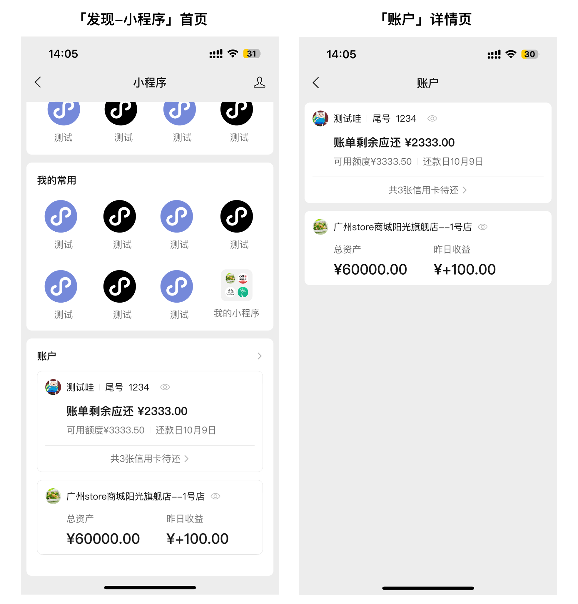
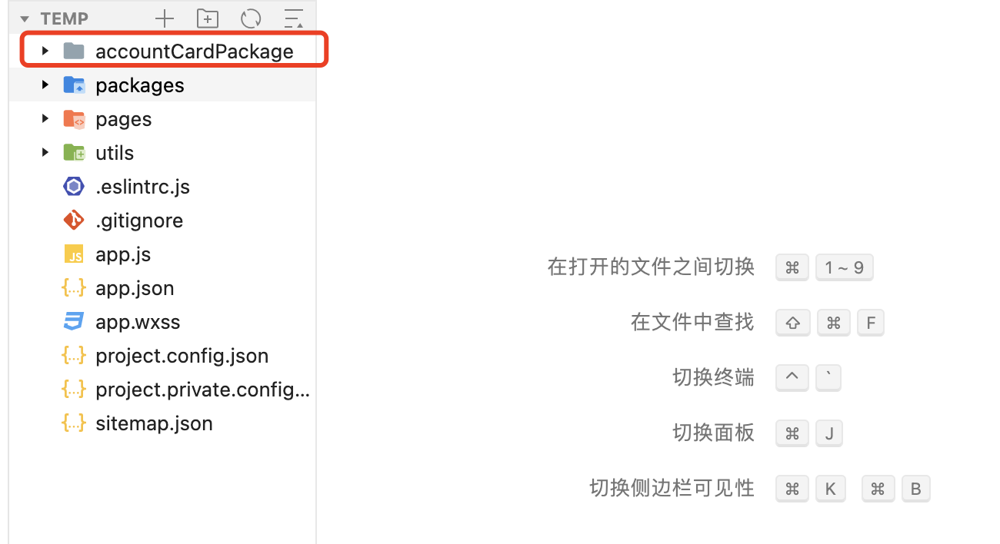
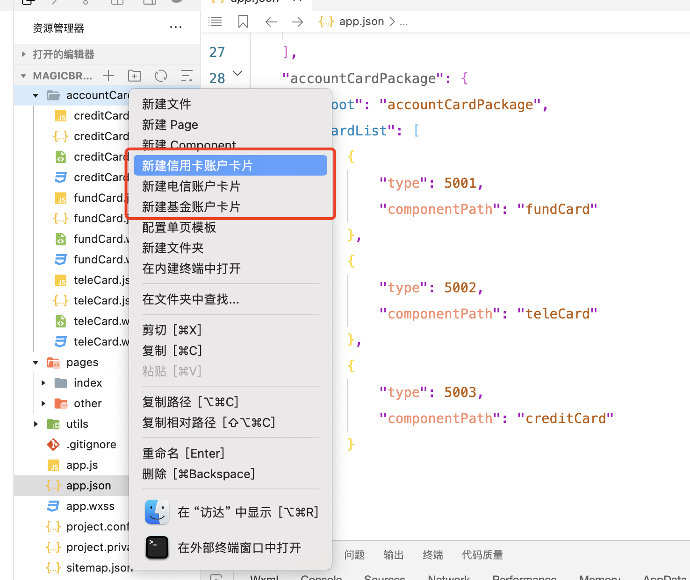
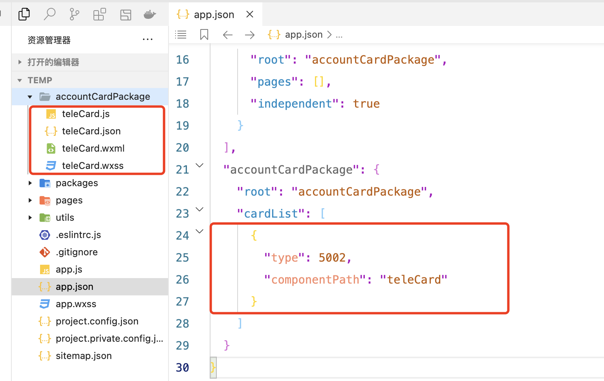
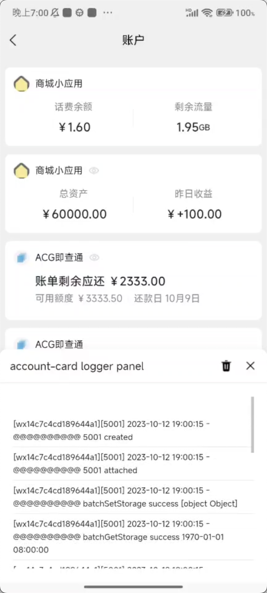

<!-- 来源: https://developers.weixin.qq.com/miniprogram/dev/framework/open-ability/account-card.html -->

# 账户卡片

## 一、功能介绍

为了方便用户查看、操作自己在小程序中的资金类账户，一键触达小程序，微信在「发现-小程序」入口新增「我的账户」板块。

具体功能示意图如下：



## 二、功能介绍

支持微信版本：8.0.41 for Android 及以上；8.0.46 for ios及以上

支持基础库版本：3.1.1 及以上

### 1. 开通功能

开发者首先需要明确自己的服务业态，当前账户卡片支持的业态包括：

<table><thead><tr><th>卡片id</th> <th>卡片名称</th> <th>类目要求</th> <th>使用场景</th> <th>展示字段</th></tr></thead> <tbody><tr><td>5001</td> <td>基金账户</td> <td>金融业-公募基金、私募基金</td> <td>向用户展示资产、收益情况等信息</td> <td>总资产、昨日收益</td></tr> <tr><td>5002</td> <td>电信账户</td> <td>IT科技-基础电信运营商、电信业务代理商</td> <td>向用户展示话费余额、剩余流量等信息</td> <td>话费余额、流量余额</td></tr> <tr><td>5003</td> <td>信用卡账户</td> <td>金融业-银行、信用卡</td> <td>向用户账单、可用额度、还款日等信息</td> <td>账单剩余应还、可用额度、还款日</td></tr> <tr><td>5004</td> <td>贷款账户</td> <td>金融业-银行、消费金融、非金融机构自营小额贷款、贷款信息服务</td> <td>向用户展示本期账单、总计应还，还款日等信息</td> <td>本期应还、总计应还、还款日</td></tr> <tr><td>5005</td> <td>个人养老金卡片账户</td> <td>金融业-银行、金融业-信用卡</td> <td>向用户展示养老金资产、收益情况等信息</td> <td>总资产、昨日收益</td></tr> <tr><td>5006</td> <td>保险卡片</td> <td>金融业-保险、第三方互联网保险</td> <td>向用户展示已购买保险名称、保险状态、有限期</td> <td>保险名、是否生效、保险日期</td></tr> <tr><td>5007</td> <td>证券卡片</td> <td>金融业-证券/期货、证券/期货投资资讯、股票信息平台、股票信息服务平台（港股/美股）</td> <td>向用户展示已购买总资产、今日盈亏、证券名称</td> <td>总资产、今日盈亏</td></tr></tbody></table>

登录 [微信公众平台](https://mp.weixin.qq.com/) ，符合类目要求即可在开发管理-其他接口找到「发现页账户卡片」，点击开通，即可开通该功能开发权限

### 2. 在代码包中创建卡片分包

账户卡片为小程序代码包中的独立组件分包。为保证 UI 统一，微信侧会提供不同类型的账户卡片模板，页面样式（ WXML 与 WXSS ）是由微信提供的固定的代码，JS 逻辑由开发者控制，包括数据请求、渲染、缓存等。

开发者需使用 [微信开发者工具开发版 Nightly Build 1.06.2309062](https://developers.weixin.qq.com/miniprogram/dev/devtools/nightly.html) 及以上版本进行创建。具体步骤如下：

#### 2.1 创建分包目录 accountCardPackage



1. 在 app.json 中开启小程序「按需注入」特性（lazyCodeLoading）、声明一个独立分包 accountCardPackage 并进行配置：

```
{
  // app.json
  // ...
  "lazyCodeLoading": "requiredComponents",
  "subpackages": [
    {
      "root": "accountCardPackage",
      "pages": [],
      "independent": true
    }
  ],
  "accountCardPackage": {
    "root": "accountCardPackage",
    "cardList": []
  }
}
```

1. 在accountCardPackage 分包目录中右键，点击新建卡片，输入组件名后创建（图为示例，所有类型卡片都从该入口新建）



1. 完成以上步骤后，可在 accountCardPackage 目录下看到创建好的卡片，同时 app.json 中也会出现相关配置



注意事项：

1. 一个小程序若符合对应卡片类目要求，可以接入多个不同类型的卡片，但是同一类型的卡片只能接入一个。
2. 卡片分包的目录结构取决于卡片被添加时的 `app.json` 的配置，卡片一旦被普通用户添加过，就不能再改动其目录结构，否则已添加过的用户就无法正常使用卡片。
3. 卡片是运行在一个独立的环境中，卡片之间相互隔离。用户提供的卡片组件在渲染时，其 `wxml` 、 `wxss` 和 `json` 会被替换成固定模板，只有开发者的 `js` 代码会被注入执行。

#### 2.2 实现卡片JS逻辑

创建卡片分包后，开发者可在js文件中实现卡片组件逻辑，包括获取登录态、请求数据、加解密数据等。一个卡片组件逻辑示例如下：

```
// 以 5001 为例
Component({
  data: {
    totalAmount: 0,
    yesterdayEarnings: 0,
  },
  lifetimes: {
    attached() {
      // 更新卡片数据
      this.setData({
        totalAmount: 6000000,
        yesterdayEarnings: 10000,
      })
      // 数据已准备完毕，通知嵌入卡片方
      this.updateStatus('loaded')
    },
  },
})
```

具体实现步骤如下：

1. 设置卡片展示的变量信息。由于WXML文件不支持开发者自定义，因此每种卡片支持显示的字段由平台定义，开发者实现获取与加密逻辑后通过 setData 变更变量信息。不同卡片类型支持的变量信息通过可参考下表：

<table><thead><tr><th>卡片id</th> <th>卡片名称</th> <th>字段</th> <th>描述</th> <th>是否可隐藏</th></tr></thead> <tbody><tr><td>5001</td> <td>基金账户</td> <td>totalAmount</td> <td>总资产，单位为分</td> <td>否</td></tr> <tr><td></td> <td></td> <td>yesterdayEarnings</td> <td>昨日收益，单位为分</td> <td>否</td></tr> <tr><td>5002</td> <td>电信账户</td> <td>telephoneBalance</td> <td>话费余额，单位为分</td> <td>否</td></tr> <tr><td></td> <td></td> <td>residualData</td> <td>剩余流量，单位为 MB</td> <td>否</td></tr> <tr><td>5003</td> <td>信用卡账户</td> <td>remainingRepayment</td> <td>本期账单剩余应还款金额，单位为分</td> <td>否</td></tr> <tr><td></td> <td></td> <td>availableCreditLimit</td> <td>信用卡可用额度，单位为分</td> <td>是</td></tr> <tr><td></td> <td></td> <td>dueDateMonth</td> <td>还款日期中的月</td> <td>是</td></tr> <tr><td></td> <td></td> <td>dueDateDay</td> <td>还款日期中的日</td> <td>是</td></tr> <tr><td></td> <td></td> <td>cardNumber</td> <td>卡片尾号，仅展示后四位，默认不显示</td> <td>是</td></tr> <tr><td></td> <td></td> <td>pendingRepayCardCnt</td> <td>（多卡情况）共有多少张卡，默认不展示</td> <td>是</td></tr> <tr><td></td> <td></td> <td>allCardsEnterPath</td> <td>（多卡情况）若调用了“pendingRepayCardCnt”，则需设置多卡显示区域设置对应的跳转路径</td> <td></td></tr> <tr><td>5004</td> <td>贷款账户</td> <td>currentRepayment</td> <td>本期账单剩余应还款金额，单位为分</td> <td>否</td></tr> <tr><td></td> <td></td> <td>totalDebt</td> <td>贷款总计应还金额，单位为分</td> <td>是</td></tr> <tr><td></td> <td></td> <td>dueDateMonth</td> <td>还款日期中的月</td> <td>是</td></tr> <tr><td></td> <td></td> <td>dueDateDay</td> <td>还款日期中的日</td> <td>是</td></tr> <tr><td></td> <td></td> <td>cardNumber</td> <td>卡片尾号，仅展示后四位，默认不显示</td> <td>是</td></tr> <tr><td></td> <td></td> <td>loanAccountCardCnt</td> <td>（多卡情况）共x个贷款账户代还，默认不展示</td> <td>是</td></tr> <tr><td></td> <td></td> <td>allCardsEnterPath</td> <td>（多卡情况）若调用了“loanAccountCardCnt”，则需设置多卡显示区域设置对应的跳转路径，必填</td> <td></td></tr> <tr><td>5005</td> <td>个人养老金账户</td> <td>totalAmount</td> <td>总资产，单位为分</td> <td>否</td></tr> <tr><td></td> <td></td> <td>yesterdayEarnings</td> <td>昨日收益，单位为分</td> <td>否</td></tr> <tr><td></td> <td></td> <td>cardNumber</td> <td>卡片尾号，仅展示后四位，默认不显示</td> <td>是</td></tr> <tr><td></td> <td></td> <td>pensionAccountCnt</td> <td>（多卡情况）共x个养老金账户，默认不展示</td> <td>是</td></tr> <tr><td></td> <td></td> <td>allCardsEnterPath</td> <td>（多卡情况）若调用了“pensionAccountCnt”，则需设置多卡显示区域设置对应的跳转路径，必填</td> <td></td></tr> <tr><td>5006</td> <td>保险账户</td> <td>insurance_name</td> <td>保险名称</td> <td>否</td></tr> <tr><td></td> <td></td> <td>insurance_status</td> <td>分为三种状态：1 未生效 2 生效中 3 已过期</td> <td>否</td></tr> <tr><td></td> <td></td> <td>start_date</td> <td>时间戳，保险开始日期</td> <td>否</td></tr> <tr><td></td> <td></td> <td>end_date</td> <td>时间戳，保险结束日期</td> <td>否</td></tr> <tr><td></td> <td></td> <td>cardNumber</td> <td>卡片尾号，仅展示后四位，默认不显示</td> <td>是</td></tr> <tr><td></td> <td></td> <td>insuranceAccountCnt</td> <td>（多卡情况）共x个保险，默认不展示</td> <td>是</td></tr> <tr><td></td> <td></td> <td>allCardsEnterPath</td> <td>（多卡情况）若调用了“insuranceAccountCnt”，则需设置多卡显示区域设置对应的跳转路径，必填</td> <td></td></tr> <tr><td>5007</td> <td>证券账户</td> <td>totalAmount</td> <td>总资产，单位为分</td> <td>是</td></tr> <tr><td></td> <td></td> <td>todayEarnings</td> <td>今日盈亏，单位为分</td> <td>是</td></tr> <tr><td></td> <td></td> <td>securitiesName</td> <td>证券名称，默认不显示</td> <td>是</td></tr> <tr><td></td> <td></td> <td>securitiesCnt</td> <td>（多证券情况）全部x个证券账户，默认不展示</td> <td>是</td></tr> <tr><td></td> <td></td> <td>allSecuritiesEnterPath</td> <td>（多卡情况）若调用了“securitiesCnt”，则需设置多卡显示区域设置对应的跳转路径</td> <td></td></tr></tbody></table>

1. 更新卡片状态。为了满足不同情况下的展示诉求，卡片自身是存在状态的，开发者根据需求可以通过组件的 updateStatus 接口来更新状态。目前支持的状态与变更状态的方法如下：

```
// 目前支持四种状态：loading、loaded、nologin，默认为 loading 态
this.updateStatus('loading') // 数据准备中，卡片会显示 loading 动画
this.updateStatus('loaded') // 数据准备完毕，卡片会正常显示
this.updateStatus('nologin') // 需要用户进入小程序登录，卡片会展示引导文案
this.updateStatus('error') //卡片状态异常，需要用户进入小程序检查卡片状态，卡片会展示引导文案
```

1. 更新卡片点击跳转路径。卡片被点击时，默认是跳转至小程序首页，如果需要跳转到其他路径，可以通过组件的 updateEnterPath 接口来调整点击跳转路径：

```
this.updateEnterPath('pages/other/index')
```

1. 隐藏/显示部分字段。由于业务原因，部分字段无法展示，开发者可以隐藏/显示该字段的展示，具体方法为：

```
this.showField('cardNumber')
this.hideField('remainingRepayment')
```

其中，需要注意的是，如5003/5004卡片有可隐藏日期的能力，需要隐藏整个日期字段

```
this.hideField('dueDate')
```

1. 开发业务逻辑。目前在卡片组件内仅支持以下 wx 接口，开发者可通过以下接口实现业务逻辑：

- wx.login
- wx.checkSession
- wx.getStorage
- wx.setStorage
- wx.batchGetStorage
- wx.batchSetStorage
- wx.getStorageInfo
- wx.removeStorage
- wx.clearStorage
- wx.request
- wx.getUserCryptoManager （基础库 3.3.3 版本开始支持）
- wx.cloud.init （基础库 3.3.3 版本开始支持）
- wx.cloud.callFunction （基础库 3.3.3 版本开始支持））

注意事项：

1. wx 接口调用上下文与卡片所属小程序一致，即在卡片中调用 wx 接口和在小程序中调用效果一致
2. 卡片通过 wx.setStorage 或 wx.batchSetStorage 写入的数据不建议小程序侧直接依赖，因为小程序侧存在一层读缓存，可能读取不到最新写入的数据

### 3. 调试逻辑

1. 开发过程中，开发者可以进入「账户详情页」，长按导航栏中的“账户”二字，打开调试面板：



1. 只有体验版卡片支持输出内容到调试面板，若列表中没有体验版卡片，调试面板便无法打开。开发者可调用卡片组件的 debugLog 接口输出内容到调试面板中：

```
// 输出内容到调试面板上
// 目前只支持 String、Number、Boolean 等基本类型，Object 等类型则需要开发者自行进行序列化处理
if (this.debugLog) this.debugLog('str1', 'str2', 123, false, ...)
```

1. 支持云函数，基础库版本需要3.3.3以上：示例

```
Component({
  data: {
    totalAmount: 0,
    yesterdayEarnings: 0,
  },

  lifetimes: {
    created() {
      if (wx.cloud) {
        wx.cloud.init({
          env: 'xxxx', // 换成真实的云环境
          traceUser: true,
        })
      }
    },

    attached() {
      this.setData({
        totalAmount: 6000000,
        yesterdayEarnings: 10000,
      })
      this.updateStatus('loaded')

      if (wx.cloud) {
        // promise 形式
        wx.cloud.callFunction({
          name: 'xxx', // 换成真实的云函数
          data: {},
        }).then(res => {
          console.log('[Cloud Function Call Success] Result:', res)
        }).catch(err => {
          console.log('[Cloud Function Call Failure] Error Message:', err)
        })

        // callback 形式
        wx.cloud.callFunction({
          name: 'xxx', // 换成真实的云函数
          data: {},
          success: res => {
            console.log('[Cloud Function Call Success] Result:', res)
          },
          fail: err => {
            console.log('[Cloud Function Call Failure] Error Message:', err)
          },
        })
      }
    },
  },
})
```

注意事项：

1. 卡片组件内支持组件基础生命周期（如 created、attached 等）和页面生命周期 show 和 hide，但不支持如 selectorQuery 等接口，故开发者的代码逻辑中只需要关心数据即可。
2. 卡片组件内不支持使用 setTimeout、setInterval 等定时器。
3. 在卡片隐藏阶段不允许调用 wx 接口。

### 4. 向用户添加卡片

1. 卡片准备完成后，需要通过 addAccountCard 接口让用户主动触发添加卡片：

```
wx.addAccountCard({
  type: 5001, // 卡片类型
  success(res) {
    console.log(res)
  },
})
```

以下情况会导致用户添加失败：

- 用户已添加过该小程序同一类型的卡片
- 用户添加过，但后续从「发现-小程序」中删除卡片
- 用户添加过，但后续从「小程序右上角“…”-设置」中关闭展示开关
- 用户当前微信版本不支持此功能（需为8.0.41 for Android 及以上或8.0.46 for iOS及以上）

1.开发者可以提前通过 checkAccountCardAddState 检测卡片是否可添加、是否已添加：

```
wx.checkAccountCardAddState({
  type: 5001, // 卡片类型
  success(res) {
    // res.couldAdd - 当前是否可以调用接口添加
    // res.hasAdded - 当前是否已添加对应卡片组件
    console.log(res)
  },
})
```

返回的结果对应的情况：

<table><thead><tr><th>状态描述</th> <th>couldAdd</th> <th>hasAdded</th></tr></thead> <tbody><tr><td>正常添加，且开启</td> <td>true</td> <td>true</td></tr> <tr><td>正常添加，手动在设置里关闭了卡片/在发现页账户里删除了卡片</td> <td>false</td> <td>false</td></tr> <tr><td>正常添加，又完全删除小程序（在最近使用删除）</td> <td>true</td> <td>false</td></tr> <tr><td>未添加过，且符合类目要求，已经开通权限的小程序</td> <td>true</td> <td>false</td></tr></tbody></table>

注意事项：

1. wx.addAccountCard 必须在触发点击行为后才可以调用。
2. wx.addAccountCard 当前仅支持在体验版/正式版小程序中调用。
3. 不支持重复添加同一张卡片。如果当前用户已添加卡片，必须先删除小程序后才可以触发添加。
4. 目前 wx.addAccountCard 仅支持在体验版/正式版调用。如果在体验版调用，那么发现页则会拉取体验版的卡片组件分包进行展示，如果此时要重新添加正式版卡片，需要先删除体验版小程序，反之同理。

### 5. 用户取消卡片展示

用户有2个方式取消展示：

- 在小程序的设置中关闭对应卡片的开关
- 在「发现-小程序」中的账户卡片中长按可展示「删除卡片」入口，用户点击后可删除卡片的展示

注意事项：

- 若用户直接从「最近使用」中删除小程序，则会同步完全删除账户卡片。若想重新展示账户卡片，用户需要重新添加。
