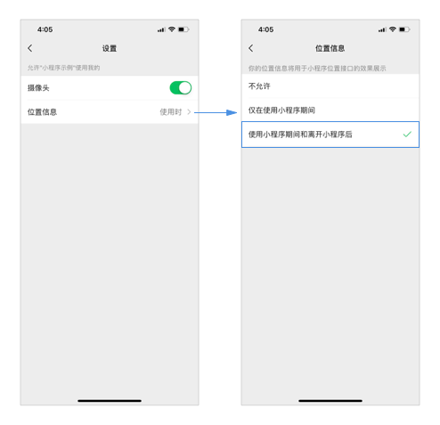

<!-- 来源: https://developers.weixin.qq.com/miniprogram/dev/framework/open-ability/authorize.html -->

# 授权

部分接口需要经过用户授权同意才能调用。我们把这些接口按使用范围分成多个 `scope` ，用户选择对 `scope` 来进行授权，当授权给一个 `scope` 之后，其对应的所有接口都可以直接使用。

此类接口调用时：

- 如果用户未接受或拒绝过此权限，会弹窗询问用户，用户点击同意后方可调用接口；
- 如果用户已授权，可以直接调用接口；
- 如果用户已拒绝授权，则不会出现弹窗，而是直接进入接口 fail 回调。 **请开发者兼容用户拒绝授权的场景。**

## 获取用户授权设置

开发者可以使用 [wx.getSetting](https://developers.weixin.qq.com/miniprogram/dev/api/open-api/setting/wx.getSetting.html) 获取用户当前的授权状态。

## 打开设置界面

用户可以在小程序设置界面（「右上角」 - 「关于」 - 「右上角」 - 「设置」）中控制对该小程序的授权状态。

开发者可以调用 [wx.openSetting](https://developers.weixin.qq.com/miniprogram/dev/api/open-api/setting/wx.openSetting.html) 打开设置界面，引导用户开启授权。

## 提前发起授权请求

开发者可以使用 [wx.authorize](https://developers.weixin.qq.com/miniprogram/dev/api/open-api/authorize/wx.authorize.html) 在调用需授权 API 之前，提前向用户发起授权请求。

## scope 列表

<table><thead><tr><th>scope</th> <th>对应接口</th> <th>描述</th></tr></thead> <tbody><tr><td>scope.userLocation</td> <td><a href="../../api/location/wx.getLocation.html">wx.getLocation</a>, <a href="../../api/location/wx.startLocationUpdate.html">wx.startLocationUpdate</a>, <a href="../../api/media/map/MapContext.moveToLocation.html">MapContext.moveToLocation</a></td> <td>精确地理位置</td></tr> <tr><td>scope.userFuzzyLocation</td> <td><a href="../../api/location/wx.getFuzzyLocation.html">wx.getFuzzyLocation</a></td> <td>模糊地理位置</td></tr> <tr><td>scope.userLocationBackground</td> <td><a href="../../api/location/wx.startLocationUpdateBackground.html">wx.startLocationUpdateBackground</a></td> <td>后台定位</td></tr> <tr><td>scope.record</td> <td><a href="../../component/live-pusher.html">live-pusher</a>组件, <a href="../../api/media/recorder/wx.startRecord.html">wx.startRecord</a>, <a href="../../api/media/voip/wx.joinVoIPChat.html">wx.joinVoIPChat</a>, <a href="../../api/media/recorder/RecorderManager.start.html">RecorderManager.start</a></td> <td>麦克风</td></tr> <tr><td>scope.camera</td> <td><a href="../../component/camera.html">camera</a>组件, <a href="../../component/live-pusher.html">live-pusher</a>组件, <a href="../../api/ai/visionkit/wx.createVKSession.html">wx.createVKSession</a></td> <td>摄像头</td></tr> <tr><td>scope.bluetooth</td> <td><a href="../../api/device/bluetooth/wx.openBluetoothAdapter.html">wx.openBluetoothAdapter</a>, <a href="../../api/device/bluetooth-peripheral/wx.createBLEPeripheralServer.html">wx.createBLEPeripheralServer</a></td> <td>蓝牙</td></tr> <tr><td>scope.writePhotosAlbum</td> <td><a href="../../api/media/image/wx.saveImageToPhotosAlbum.html">wx.saveImageToPhotosAlbum</a>, <a href="../../api/media/video/wx.saveVideoToPhotosAlbum.html">wx.saveVideoToPhotosAlbum</a></td> <td>添加到相册</td></tr> <tr><td>scope.addPhoneContact</td> <td><a href="../../api/device/contact/wx.addPhoneContact.html">wx.addPhoneContact</a></td> <td>添加到联系人</td></tr> <tr><td>scope.addPhoneCalendar</td> <td><a href="../../api/device/calendar/wx.addPhoneRepeatCalendar.html">wx.addPhoneRepeatCalendar</a>, <a href="../../api/device/calendar/wx.addPhoneCalendar.html">wx.addPhoneCalendar</a></td> <td>添加到日历</td></tr> <tr><td>scope.werun</td> <td><a href="../../api/open-api/werun/wx.getWeRunData.html">wx.getWeRunData</a></td> <td>微信运动步数</td></tr> <tr><td>scope.address</td> <td><a href="../../api/open-api/address/wx.chooseAddress.html">wx.chooseAddress</a></td> <td>通讯地址（已取消授权，可以直接调用对应接口）</td></tr> <tr><td>scope.invoiceTitle</td> <td><a href="../../api/open-api/invoice/wx.chooseInvoiceTitle.html">wx.chooseInvoiceTitle</a></td> <td>发票抬头（已取消授权，可以直接调用对应接口）</td></tr> <tr><td>scope.invoice</td> <td><a href="../../api/open-api/invoice/wx.chooseInvoice.html">wx.chooseInvoice</a></td> <td>获取发票（已取消授权，可以直接调用对应接口）</td></tr> <tr><td>scope.userInfo</td> <td><a href="../../api/open-api/user-info/wx.getUserInfo.html">wx.getUserInfo</a></td> <td>用户信息（小程序已回收，请使用<a href="./userProfile.html">头像昵称填写</a>，小游戏可继续调用）</td></tr></tbody></table>

## 授权有效期

一旦用户明确同意或拒绝过授权，其授权关系会记录在后台，直到用户主动删除小程序。

## 最佳实践

在真正需要使用授权接口时，才向用户发起授权申请，并在授权申请中说明清楚要使用该功能的理由。

## 注意事项

1. 需要授权 `scope.userLocation` 、 `scope.userLocationBackground` 、 `scope.userFuzzyLocation` 时必须 [配置地理位置用途说明](https://developers.weixin.qq.com/miniprogram/dev/reference/configuration/app.html#permission) 。
2. 授权弹窗会展示小程序在 [小程序用户隐私保护指引](../user-privacy/README.md) 中填写的说明，请谨慎填写。

## 后台定位

开发者首先需要在后台运行的能力中声明 [后台定位](https://developers.weixin.qq.com/miniprogram/dev/reference/configuration/app.html#requiredBackgroundModes) 。

安卓 8.0.0 , iOS 8.0.0 起，若开发者可支持通过 `wx.authorize({scope: 'scope.userLocationBackground'})` 唤起后台使用地理位置授权窗口。

低于以上版本，scope.userLocationBackground 不会弹窗提醒用户。需要用户在设置页中，主动将“位置信息”选项设置为“使用小程序期间和离开小程序后”。开发者可以通过调用 [wx.openSetting](https://developers.weixin.qq.com/miniprogram/dev/api/open-api/setting/wx.openSetting.html) ，打开设置页。

