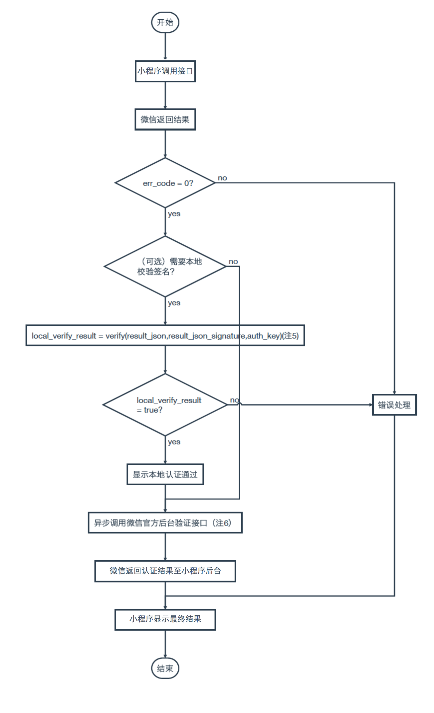

<!-- 来源: https://developers.weixin.qq.com/miniprogram/dev/framework/open-ability/bio-auth.html -->

# 生物认证

小程序通过 [SOTER](https://github.com/Tencent/soter) 提供以下生物认证方式。

目前支持指纹识别、人脸识别认证。设备支持的生物认证方式可使用 [wx.checkIsSupportSoterAuthentication](https://developers.weixin.qq.com/miniprogram/dev/api/open-api/soter/wx.checkIsSupportSoterAuthentication.html) 查询

## 调用流程



## 流程步骤说明

1. 调用 [wx.startSoterAuthentication](https://developers.weixin.qq.com/miniprogram/dev/api/open-api/soter/wx.startSoterAuthentication.html) ，获取 `resultJSON` 和 `resultJSONSignature`
2. （可选）签名校验。此处 `resultJSONSignature` 使用 SHA256withRSA/PSS 作为签名算法进行验签。此公式数学定义如下: `bool 验签结果=verify(用于签名的原串，签名串，验证签名的公钥)`
3. 微信提供后台接口用于可信的密钥验签服务，微信将保证该接口返回的验签结果的正确性与可靠性，并且对于 Android root 情况下该接口具有上述特征（将返回是否保证root情况安全性）。

接口地址：

```
POST http://api.weixin.qq.com/cgi-bin/soter/verify_signature?access_token=%access_token
```

post 数据内容（JSON 编码）:

```json
{"openid":"$openid", "json_string" : "$resultJSON", "json_signature" : "$resultJSONSignature" }
```

请求返回数据内容（JSON 编码）:

```
// 验证成功返回
{"is_ok":true}
// 验证失败返回
{"is_ok":false}
// 接口调用失败
{"errcode":"xxx,"errmsg":"xxxxx"}
```
