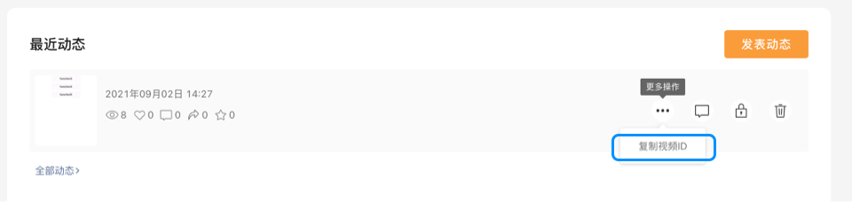
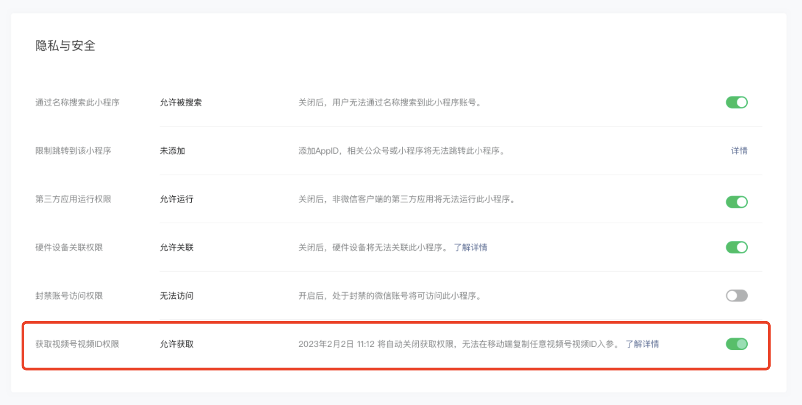
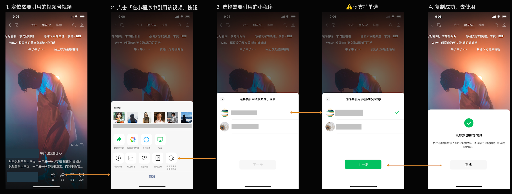
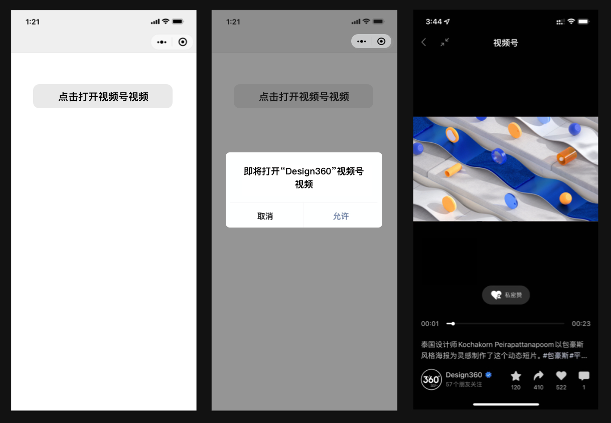
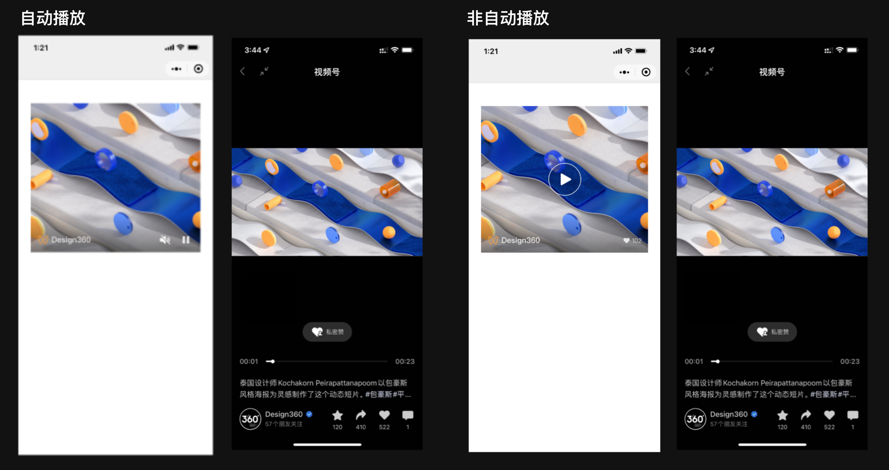

<!-- 来源: https://developers.weixin.qq.com/miniprogram/dev/framework/open-ability/channels-activity.html -->

## 小程序打开视频号视频

为满足不同开发者的诉求，小程序提供2种打开视频号视频的方式：

1. 跳转打开视频号视频：无主体限制
2. 内嵌视频号视频：

- 从基础库版本2.25.1至2.31.1，小程序需与视频号视频相同主体或关联主体
- 从基础库版本2.31.1开始，非个人主体小程序可内嵌非同主体/关联主体视频号视频

## 获取参数

### finderUserName

代表视频号ID，获取视频号ID的需要登录 [视频号助手](https://channels.weixin.qq.com/) ，在首页可以查看自己的视频号ID。

### feedId

代表视频号视频的唯一标识，获取视频的feedId需要登录 [视频号助手](https://channels.weixin.qq.com/) ，在「动态管理」模块可以复制自己发表的每个视频对应的feedId。

### feed-token

从基础库 [2.31.1](../compatibility.md) 开始支持

代表非同主体视频号视频的标识，非个人主体小程序可以通过 [channel-video](https://developers.weixin.qq.com/miniprogram/dev/component/channel-video.html) 组件，在小程序中内嵌非同主体视频号的视频。

获取feed-token步骤如下：

1. 登陆 [MP平台](https://mp.weixin.qq.com/) ，在「设置-基本设置-隐私与安全」找到「获取视频号视频ID权限」，并将开关打开 
2. 移动端找到想要内嵌的视频号视频，并复制该视频的feed-token，图示如下： 

使用该能力时，开发者需要注意：

1. 时间限制：打开开关后24小时内生效，失效后移动端将不展示「在小程序中引用该视频」的入口，如要继续获取，则需要再次打开开关；
2. 生效范围：开关打开状态仅对当前操作者生效。即上述步骤1和步骤2需为同一操作者，若开发者A在MP平台中打开「获取视频号视频ID权限」开关，仅有A能够在移动端能够复制视频号视频的feed-token，同小程序的其他开发者移动端不展示「在小程序中引用该视频」入口

## 使用方法

### 跳转打开视频号视频

从基础库 [2.19.2](../compatibility.md) 开始支持

小程序可以通过 [wx.openChannelsActivity](https://developers.weixin.qq.com/miniprogram/dev/api/open-api/channels/wx.openChannelsActivity.html) 接口跳转到指定视频号的视频页观看视频，无主体要求。

### 内嵌视频号视频

从基础库 [2.25.1](../compatibility.md) 开始支持

小程序可以通过 [channel-video](https://developers.weixin.qq.com/miniprogram/dev/component/channel-video.html) 组件在小程序中内嵌视频号视频，且支持无弹窗跳转打开视频号对应视频，使用该组件时需注意：

1. 组件调用无资质要求
2. 暂不支持纯图片视频号内容
3. 基础库2.31.1之前，仅可引用和小程序同主体或关联主体的视频号视频，从基础库2.31.1开始，支持非个人主体小程序内嵌非同主体或关联主体的视频号视频

## 主体判断

### 主体信息查询

小程序主体信息可通过小程序资料页-开发团队进行查询，视频号主体信息可通过视频号首页-认证进行查询。

### 主体判断逻辑

若小程序与视频号的主体相同，则可以调用相关接口。 若小程序与视频号的主体不同，需同时满足以下3个条件则可以调用相关接口：

1. 小程序绑定了 [微信开放平台](https://open.weixin.qq.com/) 账号
2. 小程序与微信开放平台账号的关系为同主体或 [关联主体](https://kf.qq.com/faq/190726rqmE7j190726BbeIFR.html)
3. 微信开放平台账号的主体与关联主体列表中包含视频号的主体 关联主体申请流程可以参考：https://kf.qq.com/faq/190726e6JFja190726qMJBn6.html
