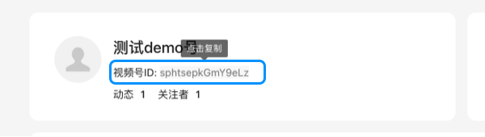
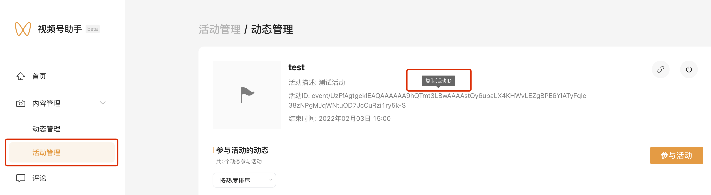

<!-- 来源: https://developers.weixin.qq.com/miniprogram/dev/framework/open-ability/channels-event.html -->

# 视频号活动

从基础库 [2.21.0](../compatibility.md) 开始支持

若小程序与视频号的主体相同或为关联主体，可以通过 [wx.openChannelsEvent](https://developers.weixin.qq.com/miniprogram/dev/api/open-api/channels/wx.openChannelsEvent.html) 跳转到视频号发起的活动。

## 主体判断逻辑

若小程序与视频号的主体相同，则可以调用相关接口。 若小程序与视频号的主体不同，需同时满足以下3个条件则可以调用相关接口：

1. 小程序绑定了 [微信开放平台](https://open.weixin.qq.com/) 账号
2. 小程序与微信开放平台账号的关系为同主体或 [关联主体](https://kf.qq.com/faq/190726rqmE7j190726BbeIFR.html)
3. 微信开放平台账号的主体与关联主体列表中包含视频号的主体 关联主体申请流程可以参考：https://kf.qq.com/faq/190726e6JFja190726qMJBn6.html

## 参数获取

finderUserName表示视频号ID，获取视频号ID的需要登录 [视频号助手](https://channels.weixin.qq.com/) ，在首页可以查看自己的视频号ID。

eventId唯一标识某一个活动，获取活动的eventId需要登录 [视频号助手](https://channels.weixin.qq.com/) ，在「内容管理」-「活动管理」模块可以复制自己发起的每个活动对应的eventId。

