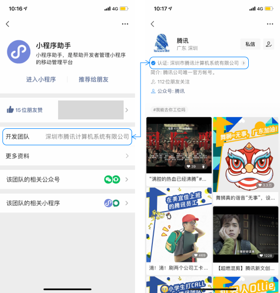
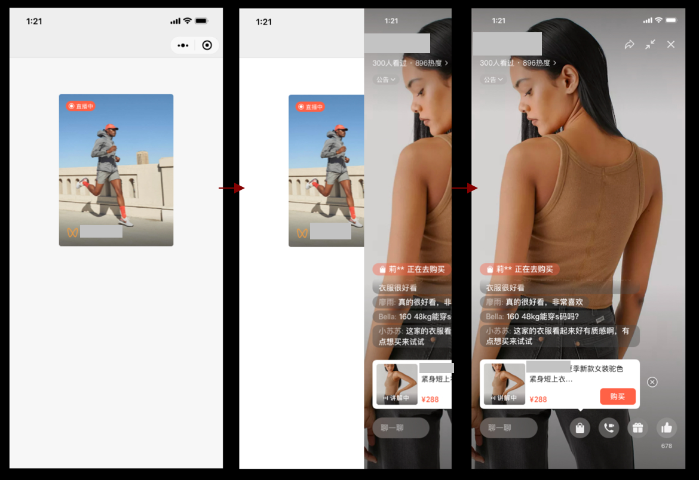

<!-- 来源: https://developers.weixin.qq.com/miniprogram/dev/framework/open-ability/channels-live.html -->

# 视频号直播

若小程序与视频号的主体相同或为关联主体，可以跳转到视频号直播间或在小程序内发起视频号直播预约。

## 主体判断

### 主体信息查询

小程序主体信息可通过小程序资料页-开发团队进行查询，视频号主体信息可通过视频号首页-认证进行查询。

视频号id需通过 [视频号助手](https://channels.weixin.qq.com/login) 获取。

### 主体判断逻辑

若小程序与视频号的主体相同，则可以调用相关接口。 若小程序与视频号的主体不同，需同时满足以下3个条件则可以调用相关接口：

1. 小程序绑定了 [微信开放平台](https://open.weixin.qq.com/) 账号
2. 小程序与微信开放平台账号的关系为同主体或 [关联主体](https://kf.qq.com/faq/190726rqmE7j190726BbeIFR.html)
3. 微信开放平台账号的主体与关联主体列表中包含视频号的主体 关联主体申请流程可以参考：https://kf.qq.com/faq/190726e6JFja190726qMJBn6.html

## 获取视频号直播信息

开发者可以通过 [wx.getChannelsLiveInfo](https://developers.weixin.qq.com/miniprogram/dev/api/open-api/channels/wx.getChannelsLiveInfo.html) 接口获取视频号直播id、直播状态、直播主题、视频号头像昵称等直播信息，具体使用方法如下：

从基础库 [2.15.0](../compatibility.md) 开始支持

开发者传入视频号id（finderUserName参数），可获取当前或最近一次直播的直播信息，具体如下：

- status=2，直播中：返回的feedId与nonceId为当前直播id，description为当前直播主题
- status=3，直播已结束：返回的feedId与nonceId为最近一次直播id，description为最近一次直播主题

从基础库 [2.29.0](../compatibility.md) 开始支持

开发者上传视频号id（finderUserName参数）和起止时间（startTime和endTime参数），获取指定时间段内的全部直播信息。其中正在直播或最近一场的直播信息会直接在出参中返回，其余直播信息会在otherInfos中以列表形式返回。

## 使用方法

### 小程序跳转视频号直播间

从基础库 [2.15.0](../compatibility.md) 开始支持

1. 开发者首先通过 [wx.getChannelsLiveInfo](https://developers.weixin.qq.com/miniprogram/dev/api/open-api/channels/wx.getChannelsLiveInfo.html) 传入视频号id用于获取视频号直播信息，包括直播id（feedId与nonceId两个参数）与直播状态。
2. 获取直播信息后，开发者可以通过 [wx.openChannelsLive](https://developers.weixin.qq.com/miniprogram/dev/api/open-api/channels/wx.openChannelsLive.html) 打开视频号直播。若当前未在直播，则会跳转到最近一场直播的结束页。该接口使用限制如下：

- 需要用户触发跳转，若用户未点击小程序页面任意位置，则开发者将无法调用此接口。
- 需要用户确认跳转，在跳转至视频号直播前，将统一增加弹窗，询问是否跳转，用户确认后才可以跳转视频号直播。

### 小程序内嵌视频号直播

从基础库 [2.29.0](../compatibility.md) 开始支持

1. 开发者首先通过 [wx.getChannelsLiveInfo](https://developers.weixin.qq.com/miniprogram/dev/api/open-api/channels/wx.getChannelsLiveInfo.html) 传入视频号id和起止时间（startTime和endTime参数），用于获取指定时间段的视频号直播信息，包括直播id（feedId）、直播状态和直播回放状态。
2. 获取直播信息后，开发者可以通过 [channel-live](https://developers.weixin.qq.com/miniprogram/dev/component/channel-live.html) 在小程序中展示直播封面，用户点击后可无弹窗直接跳转至视频号直播。不同的直播状态，跳转至视频号的承接页页有所不同，具体如下：

- 直播未开始：上一场直播的结束页
- 直播中：直播页面
- 直播已结束（无回放）：直播结束页
- 直播已结束（有回放）：直播回放页

### 小程序内发起预约视频号直播

从基础库 [2.19.0](../compatibility.md) 开始支持

1. 开发者首先通过 [wx.getChannelsLiveNoticeInfo](https://developers.weixin.qq.com/miniprogram/dev/api/open-api/channels/wx.getChannelsLiveNoticeInfo.html) 传入视频号id用于获取视频号直播预告id（noticeId），若当前没有可预约的直播预告，将返回失败。
2. 获取直播预告信息后，开发者可以通过 [wx.reserveChannelsLive](https://developers.weixin.qq.com/miniprogram/dev/api/open-api/channels/wx.reserveChannelsLive.html) 唤起预约弹窗，用户可以进行预约操作。成功唤起弹窗即为接口调用成功，通过state可以获取用户具体操作行为：

- state = 1，正在直播中，用户点击“取消”拒绝前往直播
- state = 2，正在直播中，用户点击“允许”前往直播
- state = 3，预告已取消
- state = 4，直播已结束
- state = 5，用户此前未预约，在弹窗中未预约直播直接收起弹窗
- state = 6，用户此前未预约，在弹窗中预约了直播
- state = 7，用户此前已预约，在弹窗中取消了预约
- state = 8，用户此前已预约，直接收起弹窗
- state = 9，弹窗唤起前用户直接取消
- state = 10，直播预约已过期

## 使用规范

1. wx.getChannelsLiveInfo与wx.getChannelsLiveNoticeInfo会调用到微信后台系统资源，为了保护系统，开发者请遵守 [《接口调用频率规范》](../performance/api-frequency.md) 对接口做适度的频率限制，不能无节制地调用。
2. 平台将坚决打击诱导跳转视频号直播、诱导预约视频号直播等行为，使用此功能时请严格遵守 [《微信小程序平台运营规范》](https://developers.weixin.qq.com/miniprogram/product/) 。

## 注意事项

1. 该接口在开发版与体验版中均可调用。开发者在调试过程中，可以在视频号选择可见范围进行开播，方便测试。
2. 若小程序与视频号主体信息不一致，会返回100008错误码。
3. wx.getChannelsLiveInfo与wx.getChannelsLiveNoticeInfo回调函数不继承用户点击事件，无法在wx.getChannelsLiveInfo的success回调中再调用wx.openChannelsLive。
4. 开发者工具暂未支持此能力，请先使用真机调试。
