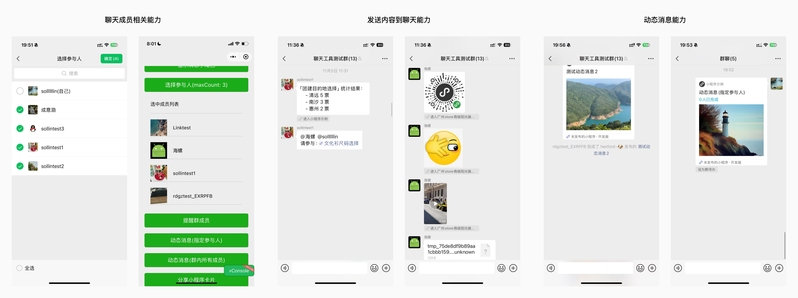

<!-- 来源: https://developers.weixin.qq.com/miniprogram/dev/framework/open-ability/chatTool.html -->

# 小程序聊天工具模式开发指南Beta

## 一、功能介绍

聊天工具模式是为了帮助小程序更好与微信聊天结合而推出的模式，可用于实现群问卷、群拼单、群任务等功能。其与小程序普通模式相比开放更多与聊天紧密结合的能力：

1. 聊天成员相关能力：开发者可调用聊天成员选择器并获取成员相关id，通过开放数据域渲染聊天成员的头像昵称
2. 发送内容到聊天能力：开发者可发送文本、提醒、图片、表情、视频等内容类型到聊天中
3. 动态消息能力：小程序卡片上的辅标题可以动态更新，在用户完成/参与了活动后下发系统消息



同时，聊天工具模式需要使用独立分包基于skyline开发，该分包也可被普通模式打开。开发者可通过「小程序示例-接口Tab-聊天工具」入口体验平台推出的Demo：


## 二、开发指南

从基础库 [3.7.8](../compatibility.md) 开始支持

支持平台： Android：微信8.0.56及以上版本 、 iOS：微信8.0.56及以上版本

### 1. 聊天工具分包配置

开发者需要在 [小程序全局配置](https://developers.weixin.qq.com/miniprogram/dev/reference/configuration/app.html) (app.json)中声明 `subPackages` 与 `chatTools` ：

1. `subPackages` 为分包的基本配置，属性说明可参考分包结构配置
2. `chatTools` 为聊天工具配置，类型为 `Object[]` ，字段包括：

<table><thead><tr><th>属性</th> <th>类型</th> <th>必填</th> <th>说明</th></tr></thead> <tbody><tr><td>root</td> <td>string</td> <td>是</td> <td>分包根目录</td></tr> <tr><td>entryPagePath</td> <td>string</td> <td>是</td> <td>聊天工具启动路径</td></tr> <tr><td>desc</td> <td>string</td> <td>是</td> <td>聊天工具描述</td></tr> <tr><td>scopes</td> <td>string[]</td> <td>否</td> <td>分包中会使用的<a href="https://developers.weixin.qq.com/miniprogram/dev/framework/open-ability/authorize.html" target="_blank" rel="noopener noreferrer">scope<span></span></a>权限</td></tr></tbody></table>

**注意事项** ：

1. `desc` 字段请按照自己的功能设计填写，不得包含虚假、营销信息； `scopes` 字段请如实填写；否则将影响小程序审核的结果
2. 开发者需保证分包的首页路径进入后可以使用聊天工具的完整功能，否则将影响小程序审核的结果
3. 每个小程序目前仅支持配置一个聊天工具，后续可能放开
4. 聊天工具的分包体积需不超过 500KB
5. 聊天工具分包页需使用 skyline 渲染，若开发者未配置，微信会在预览/上传代码包时提示出错

配置示例：

```json
{
  "subPackages": [
    {
      "root": "packageA",
      "name": "alias",
      "pages": ["pages/cat"],
      "independent": true,
      "entry": "index.js",
      "componentFramework": "glass-easel",
      "renderer": "skyline",
    },
  ],
  "chatTools": [{
    "root": "packageA",
    "entryPagePath": "x",
    "desc": "功能描述",
    "scopes": ["scope.userLocation"]
  }],
  "rendererOptions": {
    "skyline": {
      "disableABTest": true,
      "defaultDisplayBlock": true,
      "defaultContentBox": true,
      "tagNameStyleIsolation": "legacy",
      "sdkVersionBegin": "3.7.0",
      "sdkVersionEnd": "15.255.255"
    }
  }
}
```

### 2. 聊天工具模式的进入与退出

#### 2.1 进入聊天模式

聊天工具模式在进入时需要绑定一个微信单聊或群聊的聊天室，目前有三种进入方式：

1. 当小程序处于普通模式时，开发者调用 [`wx.openChatTool`](https://developers.weixin.qq.com/miniprogram/dev/api/chattool/wx.openChatTool.html) 但不传入聊天室id，微信会拉起聊天列表让用户选择，用户选择后绑定聊天室进入聊天工具模式
2. 当小程序处于普通模式时，开发者调用 [`wx.openChatTool`](https://developers.weixin.qq.com/miniprogram/dev/api/chattool/wx.openChatTool.html) 并在接口中传入聊天室id（群聊为opengid，单聊为open\_single\_roomid），会直接绑定该聊天室进入
3. 用户在聊天工具模式里发送各种类型内容到绑定的聊天后，当用户从同一个聊天的这些内容入口再此回到小程序中，会使用聊天工具模式打开，此时绑定的聊天不变

#### 2.2 退出聊天模式

聊天工具目前有三种退出方式：

1. 在聊天工具中回到非聊天工具分包页面中（包括用户自己触发返回、开发者调用 `wx.navigateBack` / `wx.switchTab` ），会触发退出聊天工具模式
2. 小程序 reLaunch 到普通页面（包括用户点击其他非聊天工具模式入口、开发者调用 `wx.reLaunch` 等），会触发退出聊天工具模式

注意：在聊天工具分包页，无法通过 `wx.navigateTo` 或者 `wx.redirectTo` 跳转到非聊天工具分包页。如需跳转，先通过 `wx.navigateBack` 退出当前聊天工具分包，在使用路由接口进行跳转。

#### 2.3 聊天工具模式的判定

开发者可通过 [`wx.getApiCategory`](https://developers.weixin.qq.com/miniprogram/dev/api/base/app/life-cycle/wx.getApiCategory.html) 中的 `apiCategory` 字段是否为 `chatTool` ，判断当前是否处于聊天工具模式。

### 3. 聊天成员相关能力

#### 3.1 获取相关id接口

聊天工具模式下有以下3种id信息：

1. `opengid` ：微信群的唯一标识id
2. `open_single_roomid` ：单聊的唯一标识id
3. `group_openid` ：微信用户在此聊天室下的唯一标识，同一个用户在不同的聊天室下id不同

相关接口如下：

1. [`wx.getGroupEnterInfo`](https://developers.weixin.qq.com/miniprogram/dev/api/open-api/group/wx.getGroupEnterInfo.html) ：进入聊天工具模式前，获取群聊id信息
2. [`wx.getChatToolInfo`](https://developers.weixin.qq.com/miniprogram/dev/api/chattool/wx.getChatToolInfo.html) ：进入聊天工具模式后，获取群聊id信息

这两个接口的区别在于，在聊天工具分包页，推荐用 `wx.getChatToolInfo` 获取绑定群相关信息即可。在进入聊天工具分包页之前，例如从群聊会话卡片打开小程序，此时希望复用卡片所在的群聊，可通过 `wx.getGroupEnterInfo` 获取卡片所在群的 `opengid` , 并在 `wx.openChatTool` 时传入，此时可不唤起群选择列表，直接进入。

#### 3.2 选择聊天成员接口

开发者可调用 [wx.selectGroupMembers](https://developers.weixin.qq.com/miniprogram/dev/api/chattool/wx.selectGroupMembers.html) 让用户选择聊天室的成员，并返回选择成员的group\_openid。需要注意的是，若当前聊天室为单聊，则直接返回对方用户的group\_openid，不再拉起选择器。

#### 3.3 渲染聊天成员的头像昵称

开发者可通过 [`open-data-list`](https://developers.weixin.qq.com/miniprogram/dev/component/open-data-list.html) 与 [`open-data-item`](https://developers.weixin.qq.com/miniprogram/dev/component/open-data-item.html) 渲染聊天成员的头像昵称

### 4. 发送到聊天能力

可将小程序卡片、提醒消息、文本、图片、表情、文件发送到聊天中，相关接口如下：

1. [`wx.shareAppMessageToGroup`](https://developers.weixin.qq.com/miniprogram/dev/api/chattool/wx.shareAppMessageToGroup.html) ：将小程序卡片发送到绑定的聊天室
2. [`wx.notifyGroupMembers`](https://developers.weixin.qq.com/miniprogram/dev/api/chattool/wx.notifyGroupMembers.html) ：提醒用户完成任务，发送的内容将由微信拼接为：@的成员列表+“请完成：”/"请参与："+打开小程序的文字链，如「@alex @cindy 请完成：团建报名统计」
3. [`form bind:submitToGroup="onSubmitToGroup"`](https://developers.weixin.qq.com/miniprogram/dev/component/form.html) 与 [`button form-type="submitToGroup"`](https://developers.weixin.qq.com/miniprogram/dev/component/button.html) ：将输入框内的文本内容发送到绑定的聊天室
4. [`wx.shareImageToGroup`](https://developers.weixin.qq.com/miniprogram/dev/api/chattool/wx.shareImageToGroup.html) ：将图片发送到绑定的聊天室
5. [`wx.shareEmojiToGroup`](https://developers.weixin.qq.com/miniprogram/dev/api/chattool/wx.shareEmojiToGroup.html) ：将表情发送到绑定的聊天室
6. [`wx.shareVideoToGroup`](https://developers.weixin.qq.com/miniprogram/dev/api/chattool/wx.shareVideoToGroup.html) ：将视频发送到绑定的聊天室
7. [`wx.shareFileToGroup`](https://developers.weixin.qq.com/miniprogram/dev/api/chattool/wx.shareFileToGroup.html) ：将文件发送到绑定的聊天室

### 5. 动态消息能力

从聊天模式中发送的小程序卡片，可以获得动态消息能力，该能力的用户表现包括：

1. 小程序卡片上的辅标题可以动态更新
2. 可以在聊天中下发系统消息，内容为：成员A+“完成了”/"参与了"+成员B+“发布的”+打开小程序的文字链，如「alex 完成了 cindy 发布的 团建报名统计」

该功能的开发步骤包括：

#### 5.1 创建activity\_id

服务端通过 [创建activity\_id接口](https://developers.weixin.qq.com/miniprogram/dev/OpenApiDoc/mp-message-management/updatable-message/createActivityId.html) 创建activity\_id

#### 5.2 声明分享卡片为动态消息

前端通过 [`wx.updateShareMenu`](https://developers.weixin.qq.com/miniprogram/dev/api/share/wx.updateShareMenu.html) 声明要分享的卡片为动态消息，请求参数如下：

注意事项：

1. `useForChatTool` 为 `true` 时， `chooseType` 和 `participant` 才会生效
2. `chooseType` = 1，表示按指定的 `participant` 当作参与者
3. `chooseType` = 2，表示群内所有成员均为参与者（包括后加入群）

代码示例：

```
wx.updateShareMenu({
        withShareTicket: true,
        isUpdatableMessage: true,
        activityId: 'xxx',
        useForChatTool: true,
        chooseType: 1,
        participant: that.data.members,
        templateInfo: {
          templateId:    '4A68CBB88A92B0A9311848DBA1E94A199B166463'
        },
)
```

模版区别（target\_state与participator\_state含义见步骤3）：

<table><thead><tr><th>templateId</th> <th><code>4A68CBB88A92B0A9311848DBA1E94A199B166463</code></th> <th><code>2A84254B945674A2F88CE4970782C402795EB607</code></th></tr></thead> <tbody><tr><td><strong>动态消息发布者在小程序卡片中看到的辅标题</strong></td> <td>target_state=1或2：X人已完成；target_state=3：已结束</td> <td>target_state=1或2：X人已参与；target_state=3：已结束</td></tr> <tr><td><strong>参与者在小程序卡片中看到的辅标题</strong></td> <td>participator_state=0时：target_state=1：未完成，target_state=2：即将截止，target_state=3：已结束；participator_state=1时：target_state=1或2：已完成，target_state=3：已结束。</td> <td>participator_state=0时：target_state=1：未参与，target_state=2：即将截止，target_state=3：已结束；participator_state=1时：target_state=1或2：已参与，target_state=3：已结束。</td></tr> <tr><td><strong>非参与者在小程序卡片中看到的辅标题</strong></td> <td>target_state=1或2：你无需完成；target_state=3：已结束</td> <td>target_state=1或2：你无需参与；target_state=3：已结束</td></tr> <tr><td><strong>参与者变为完成态下发的系统消息文案</strong></td> <td>aaa 已完成 bbb 发布的 XXX</td> <td>aaa 已参与 bbb 发布的 XXX</td></tr></tbody></table>

#### 5.3 更新活动状态或用户完成情况

服务端通过 [setChatToolMsg](https://developers.weixin.qq.com/miniprogram/dev/OpenApiDoc/mp-message-management/updatable-message/setChatToolMsg.html) 接口更新活动状态或用户完成情况。

也可通过云开发调用，接口名 `chattoolmsg.send` 。

调用示例：

```json
//变更单个成员状态
{
    "activity_id": "xxx",
    "target_state":1,
    "version_type": 0,
    "participator_info_list": [
        {
            "group_openid": "aaa",
            "state": 1
        },
        {
            "group_openid": "bbb",
            "state": 1

        }
    ]
}
//变更动态消息状态
{
    "activity_id": "xxx",
    "target_state":3,
    "version_type": 0,
}
```

### 6. 聊天工具模式内禁用的能力

以下能力暂不支持聊天工具模式下使用，请开发者做好适配。

1. 聊天工具模式禁用普通转发能力，请使用上文「发送到聊天能力开放」中的接口实现： `button open-type=share` 和 小程序右上角「…-发送给朋友」
2. 聊天工具模式希望服务尽可能闭环在小程序中，外跳类接口暂不支持使用：
    - navigateToMiniProgram;
    - openEmbeddedMiniProgram;
    - openOfficialAccountArticle;
    - openChannelsUserProfile;
    - openChannelsLive;
    - openChannelsEvent;
    - openChannelsActivity。
3. 聊天工具模式暂不支持广告： `ad` 和 `ad-custom`
