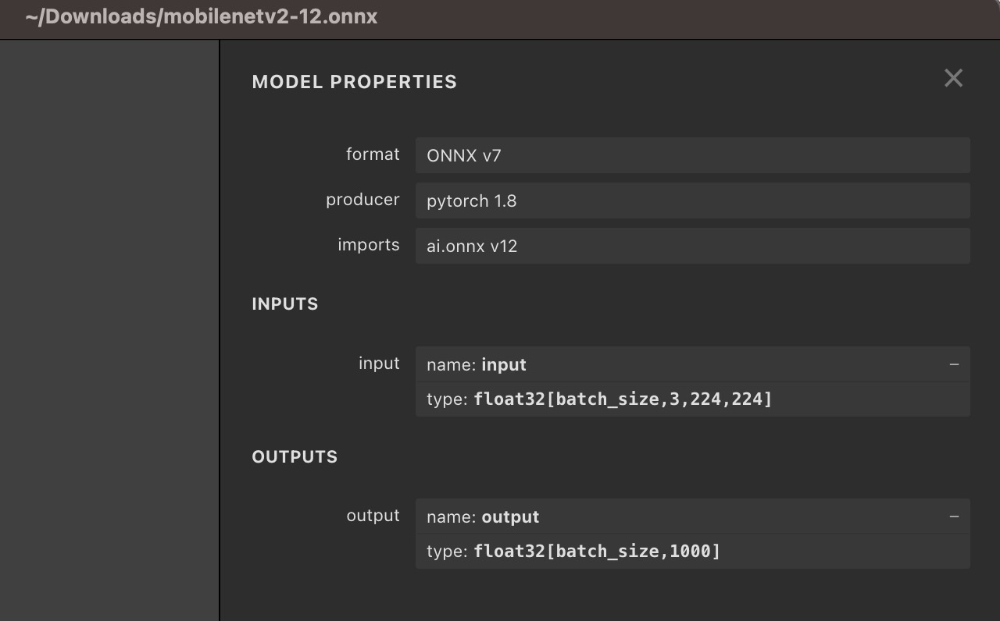
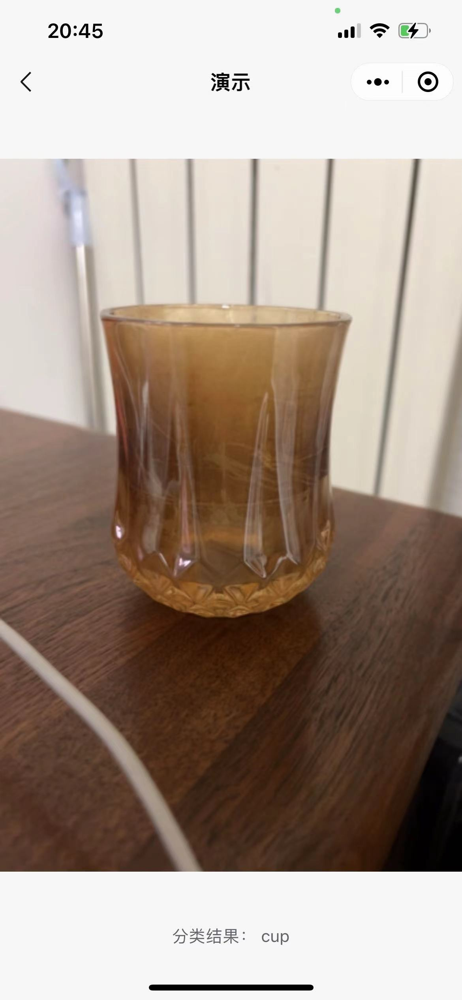

<!-- 来源: https://developers.weixin.qq.com/miniprogram/dev/framework/open-ability/inference/tutorial.html -->

## 小程序AI使用指南

### 开始

小程序AI通用接口是一套小程序官方提供的通用AI模型推理解决方案，内部使用充分优化的自研推理引擎，支持 CPU、GPU、NPU 推理。小程序开发者无需关注内部实现和模型转换，只需提供训练好的 ONNX 模型，小程序内部会将用户的 ONNX 模型自动转换为自研推理引擎可以识别的模型格式并完成推理。

本指南将展示如何从头开始使用小程序AI推理能力完成一个分类任务。我们将摄像头实时采集到的数据经过简单的前处理转换为AI推理的输入，完成推理后，再对模型运行输出进行简单的后处理，获取最终分类结果并展示在页面上。

示例使用 ONNX 官方 modelzoo 所提供的 mobileNetV2 模型。相关模型可以从 [官方github](https://github.com/onnx/models/blob/main/vision/classification/mobilenet/model/mobilenetv2-12.onnx) 获取；示例中使用的前后处理方式也与 ONNX 官方给出的 [imagenet\_validation](https://github.com/onnx/models/blob/main/vision/classification/imagenet_validation.ipynb) 一致。

### 1 创建session

首先我们需要创建一个 session 用于推理。 这里我们使用从 [官方github](https://github.com/onnx/models/blob/main/vision/classification/mobilenet/model/mobilenetv2-12.onnx) 下载的浮点模型，选择 precisionLevel 为0，这样 session 运行时，将会自动选择 fp16 存储中间 tensor 的结果，也会用 fp16 进行计算，并且会开启 fp16 计算的 Winograd，同时开启近似 math 计算。我们选择不使用量化推理，不使用 NPU。 创建 session 时除了必须提供参数 model 来指定 ONNX 模型路径外，其他设置都不是必须的。

**一般来说，使用的 precisionLevel 等级越低，推理速度越快，但可能带来精度损失。因此推荐开发者在使用时，在效果满足需求时优先使用更低精度以提高推理速度，节约能耗。**

除了使用 [wx.createInferenceSession()](https://developers.weixin.qq.com/miniprogram/dev/api/ai/inference/wx.createInferenceSession.html) 接口创建 session 外，此处我们还为 session 添加了2个事件，以监听 error 或者创建完成。 [onLoad()](https://developers.weixin.qq.com/miniprogram/dev/api/ai/inference/InferenceSession.onLoad.html) 函数中我们通过设置一个 isReady 变量，记录 session 完成了初始化，可以用来进行推理。

```js
// 这里 modelPath 为需要的 ONNX 模型，注意 model 目前只能识别后缀为.onnx 的文件作为参数。
const modelPath = `${wx.env.USER_DATA_PATH}/mobilenetv2-12.onnx`;

this.session = wx.createInferenceSession({
    model: modelPath,
    /* 0: 最低精度  使用 fp16 存储浮点，fp16 计算，Winograd 算法也采取 fp16 计算，开启近似 math 计算
       1: 较低精度  使用 fp16 存储浮点，fp16 计算，禁用 Winograd 算法，开启近似 math 计算
       2: 中等精度  使用 fp16 存储浮点，fp32 计算，开启 Winograd，开启近似 math 计算
       3: 较高精度  使用 fp32 存储浮点，fp32 计算，开启 Winograd，开启近似 math 计算
       4: 最高精度  使用 fp32 存储浮点，fp32 计算，开启 Winograd，关闭近似 math 计算

       通常更高的精度需要更长的时间完成推理
    */
    precisionLevel : 0,
    allowNPU : false,     // 是否使用 NPU 推理，仅针对 IOS 有效
    allowQuantize: false, // 是否产生量化模型
    });

// 监听error事件
session.onError((error) => {
  console.error(error);
});

// 监听模型加载完成事件
session.onLoad(() => {
  console.log('session load')
});
```

### 2 session推理

#### 2.1 处理摄像头采集数据

首先我们创建一个 camera context, 并调用 onCameraFrame 采集帧。此处的 classifier 封装了推理 session 相关的调用，具体完整代码可以参考 demo 示例。onCameraFrame 会持续采集摄像头图像，如果我们的 session 初始化成功的并且完成了上一帧的推理任务，就会传递摄像头采集的数据，执行新一次的推理任务。

```js
    const context = wx.createCameraContext(this);

    const listener = context.onCameraFrame(frame => {

        const fps = this.fpsHelper.getAverageFps();
        console.log(`fps=${fps}`);

        if (this.classifier && this.classifier.isReady() && !this.predicting) {
           this.executeClassify(frame);
        }
    });
```

#### 2.2 对摄像头的采集数据进行前处理

OnCameraFrame 返回的 frame 包含属性 width、height 和 data，分别表示二维图像数据的宽度，高度，以及图像像素点数据。其中 data 为一个 ArrayBuffer，存储数据类型为 Uint8，存储的数据 format 为 rgba，即每连续的4个值表示一个像素点的 rgba。 详细关于 onCameraFrame 的内容可以参考 [CameraContext.onCameraFrame](https://developers.weixin.qq.com/miniprogram/dev/api/media/camera/CameraContext.onCameraFrame.html) .

对于 frame 内容，我们首先进行前处理操作以转化为模型输入。

用 Netron 打开 ONNX 文件，我们可以看到 mobileNet 输入输出的描述信息。 可以看到，本模型的输入大小为[1, 3, 224, 224],数据类型为 float32。



为了将摄像头采集到的frame转换为模型需要的数据，我们需要丢弃 alpha 通道信息，将数据由 nhwc 变换成 nchw, 将 frame 的 width 和 height resize 成 224 x 224， 并且完成 normallize 操作。

以下代码通过 js 完成了所有前处理过程，将摄像头采集到 frame 转化为模型输入 dstInput。 其中 frame 为摄像头采集的数据， `var dstInput = new Float32Array(3 * 224 * 224);`

```js
  /* 原始输入为 rgba uint8 数据， 目标为 nchw float32 数据

     将camera 采集数据缩放到模型的 input 大小, 将 uint8 数据转换成 float32,
     并且从 NHWC 转换到 NCHW
  */
  preProcess(frame, dstInput) {

    return new Promise((resolve, reject) =>
    {
      const origData = new Uint8Array(frame.data);

      const hRatio = frame.height / modelHeight;

      const wRatio = frame.width / modelWidth;

      const origHStride = frame.width * 4;
      const origWStride = 4;

      const mean = [0.485, 0.456, 0.406]

      // Reverse of std = [0.229, 0.224, 0.225]
      const reverse_div = [4.367, 4.464, 4.444]
      const ratio = 1 / 255.0

      const normalized_div = [ratio / reverse_div[0], ratio * reverse_div[1], ratio * reverse_div[2]];

      const normalized_mean = [mean[0] * reverse_div[0], mean[1] * reverse_div[1], mean[2] * reverse_div[2]];

      var idx = 0;
      for (var c = 0; c < modelChannel; ++c)
      {
        for (var h = 0; h < modelHeight; ++h)
        {
          const origH = Math.round(h * hRatio);

          const origHOffset = origH * origHStride;

          for (var w = 0; w < modelWidth; ++w)
          {
            const origW = Math.round(w * wRatio);

            const origIndex = origHOffset + origW * origWStride + c;

            const val = origData[origIndex] * (normalized_div[c]) - normalized_mean[c];

            dstInput[idx] = val;

            idx++;
          }
        }
      }

      resolve();
    });
  }
```

#### 2.3 模型推理

对摄像头采集到的数据进行简单前处理后，我们就可以用来设置 input，进行模型推理了。 我们用前处理得到的 dstInput 来构造一个 xInput，将这个 xInput 作为模型推理的输入，传递给 session.run 即可。

```js
const xinput = {
    shape: [1, 3, 224, 224],  // 输入形状 NCHW 值
    data: dstInput.buffer,    // 为一个 ArrayBuffer
    type: 'float32',          // 输入数据类型
};

this.session.run({
    // 这里 "input" 必须与 ONNX 模型文件中的模型输入名保持严格一致
    "input": xinput,
})
.then((res) => {

    // 这里使用 res.outputname.data
    // 其中 outputname 需要严格与 ONNX 模型文件中的模型输出名保持一致
    let num = new Float32Array(res.output.data)
```

运行之后的结果我们通过 res.output 获取。 需要注意的是， 这里的 input/output 不是所有模型固定的，需要严格与具体 ONNX 文件中的输入，输出名字对应。 回到之前 Netron 看到的 mobilenet 模型描述信息：我们可以看到本模型有一个输入，名字叫做 “input”，有一个输出，名字就叫做 “output”。 因此我们设置输入时， `session.run({"input": xinput})` , "input" 即为 ONNX 模型中的 input name. 当有多个输入时，我们通过 `session.run({"input1": xxx, "input2": xxx})` 来分别对模型中名字为 “input1” 和 “input2” 的输入设置数据。 同样的，我们获取模型的输出时， `res.output` 指获取名字为 “output” 的输出。

不管是模型的输入还是输出 Tensor， 都是一个 Object，包含了 shape，type 和 data 三个属性。其中 data 是一块ArrayBuffer。


#### 2.4 后处理

本示例对后处理过程比较简单，获取到模型输出后，我们通过一个 argMax 操作，计算出分数最高的分类 Index， 并将这个 Index 转换为所表示的类别即可。

```js
let num = new Float32Array(res.output.data)

var maxVar = num[0];

var index = 0;

for (var i = 1; i < num.length; ++i)
{
if (maxVar < num[i])
{
    maxVar = num[i]
    index = i
}
}

this.getClass(index);
```

### 3 运行效果

扫描下方二维码，点击接口-通用AI推理能力-mobileNet, 可以查看运行效果。


运行 demo，可以看到摄像头在采集同时，将会实时地将分类结果写回到页面下方。



完整 demo 请参考 [官方github小程序示例](https://github.com/wechat-miniprogram/miniprogram-demo/tree/master/miniprogram/packageAPI/pages/ai)

### 算子支持列表

详细算子支持情况请参考 [算子支持列表](./supports.md)
