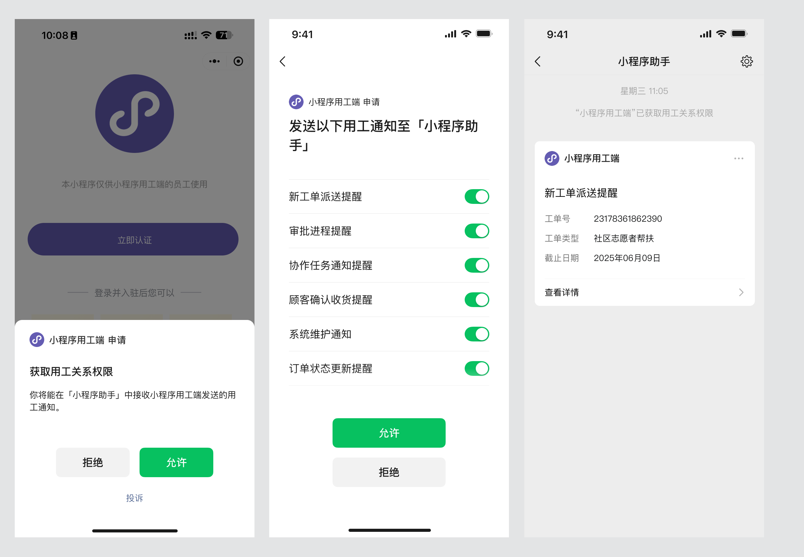
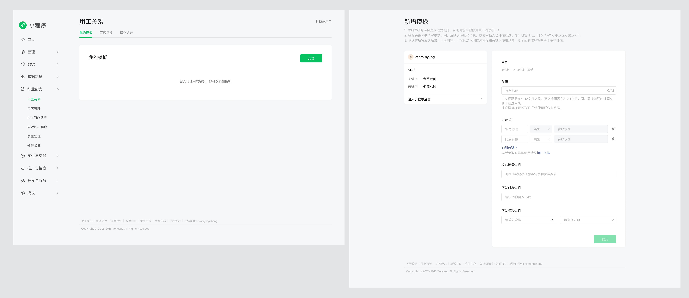

<!-- 来源: https://developers.weixin.qq.com/miniprogram/dev/framework/open-ability/laboruse/intro.html -->

# 用工关系

## 一、功能简介

用工关系功能，支持与小程序有用工关系的用户能与对应的小程序进行绑定。绑定后

1. 小程序可以向已绑定的用户推送用工关系消息通知
2. 绑定用户将能在微信「小程序助手」中接收用工关系消息通知

通过这个功能，确保小程序在用工场景下的关键业务信息高效触达。 

## 二、功能详情

> 支持基础库版本：3.10.0以上 支持微信版本：8.0.62以上

### 1、开通功能

- 此功能只支持非个人主体下的物流服务/医疗服务/政务民生/金融业/教育服务/交通服务/房地产服务/生活服务/IT科技/餐饮服务/旅游服务/商家自营/商业服务类目下的小程序
- 这些类目下的，可登录 [微信公众平台](https://mp.weixin.qq.com/) ，符合类目要求即可在侧边栏找到「用工关系」，点击开通，填写申请内容后，等待审核（审核时长平均<24h）。

### 2、新增用工消息模版

在微信公众平台开通了用工关系功能后，可以新增所需要的用工消息模版，模版审核通过后即可使用。 

### 3、用工关系管理接口

- 绑定用工关系接口： [wx.bindEmployeeRelation](https://developers.weixin.qq.com/miniprogram/dev/api/open-api/employee-relation/wx.bindEmployeeRelation.html) 开发者可以通过接口，给与小程序有用工关系的用户调用订阅弹窗，允许后的用户，可以在「小程序助手」插件中收到绑定系统消息。
- 解绑接口： [UnbindUserB2CAuthInfo](https://developers.weixin.qq.com/miniprogram/dev/OpenApiDoc/laboruse/api_unbinduserb2cauthinfo.html) 开发者可以通过接口，直接解绑已与小程序有用工关系的用户，用户可以在「小程序助手」插件中收到解绑的系统消息。
- 检查关系接口： [wx.checkEmployeeRelation](https://developers.weixin.qq.com/miniprogram/dev/api/open-api/employee-relation/wx.checkEmployeeRelation.html) 开发者可以通过接口，检查小程序用工关系功能和用户之间的绑定关系

### 4、用工消息订阅

拉起用工消息订阅有两个时机

1. 在用户确认绑定用工关系后，可直接让用户订阅消息，详细可见技术文档 [wx. bindEmployeeRelation](https://developers.weixin.qq.com/miniprogram/dev/api/open-api/employee-relation/wx.bindEmployeeRelation.html) 。
2. 已绑定用工关系后，可调用接口让用户订阅消息，详细可见技术文档 [wx.requestSubscribeEmployeeMessage](https://developers.weixin.qq.com/miniprogram/dev/api/open-api/employee-relation/wx.requestSubscribeEmployeeMessage.html) 。

### 5、发送用工消息

在用户已绑定用工关系，且订阅了对应用工消息的前提下，开发者可以通过 [SendEmployeeRelationMsg](https://developers.weixin.qq.com/miniprogram/dev/OpenApiDoc/laboruse/api_sendemployeerelationmsg.html) 向用户发送用工消息。用户将在「小程序助手」中接收到对应的消息。

## 三、注意事项

务必确保正确使用该功能

- 此功能 **仅支持小程序在用工场景下的消息传递诉求** ，若在开发者其他场景滥用，则功能会被回收。
- 绑定关系弹窗和订阅消息弹窗都为 **强监控** 行为场景，请提前告知用工关系的用户，确保绑定弹窗的通过率。请勿给无用工关系的用户滥发消息，滥发会回收该功能。
