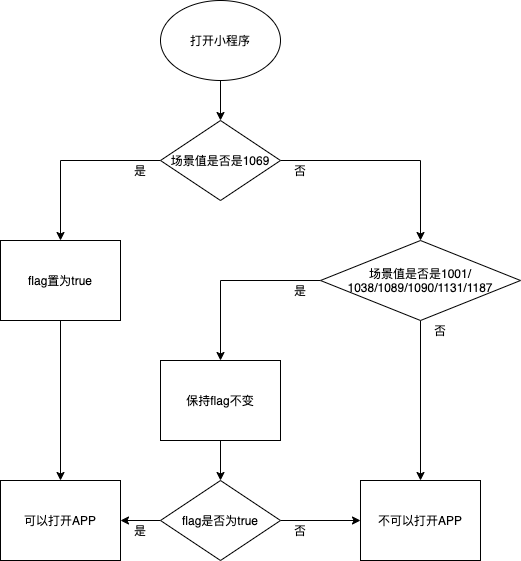

<!-- 来源: https://developers.weixin.qq.com/miniprogram/dev/framework/open-ability/launchApp.html -->

# 打开 App

此功能需要用户主动触发才能打开 APP，所以不由 API 来调用，需要用 `open-type` 的值设置为 `launchApp` 的 [button](https://developers.weixin.qq.com/miniprogram/dev/component/button.html) 组件的点击来触发。

当小程序从 APP 打开的场景打开时（场景值 1069），小程序会获得返回 APP 的能力，此时用户点击按钮可以打开拉起该小程序的 APP。即小程序不能打开任意 APP，只能 `跳回` APP。

在一个小程序的生命周期内，只有在特定条件下，才具有打开 APP 的能力，这个能力的规则如下：

当小程序从 1069 场景打开时，可以打开 APP。

当小程序从非 1069 的打开时，会在小程序框架内部会管理的一个状态，为 true 则可以打开 APP，为 false 则不可以打开 APP。这个状态的维护遵循以下规则：

- 当小程序从以下场景打开时，保持上一次打开小程序时打开 App 能力的状态：
    - 从其他小程序返回小程序（场景值1038）时（基础库 2.2.4 及以上版本支持）
    - 小程序从聊天顶部场景（场景值1089）中的「最近使用」内打开时
    - 长按小程序右上角菜单唤出最近使用历史（场景值1090）打开时
    - 发现栏小程序主入口，「最近使用」列表（场景值1001）打开时（基础库2.17.3及以上版本支持）
    - 浮窗（场景值1131、1187）打开时（基础库2.17.3及以上版本支持）
- 当小程序从非以上场景打开时，不具有打开 APP 的能力，该状态置为 false。



## 使用方法

### 小程序端

需要将 [button](https://developers.weixin.qq.com/miniprogram/dev/component/button.html) 组件 `open-type` 的值设置为 `launchApp` 。如果需要在打开 APP 时向 APP 传递参数，可以设置 `app-parameter` 为要传递的参数。通过 `binderror` 可以监听打开 APP 的错误事件。

#### 示例代码

```html
<button open-type="launchApp" app-parameter="wechat" binderror="launchAppError">打开APP</button>
```

```js
Page({
  launchAppError (e) {
    console.log(e.detail.errMsg)
  }
})
```

#### error 事件参数说明

<table><thead><tr><th>值</th> <th>说明</th></tr></thead> <tbody><tr><td>invalid scene</td> <td>调用场景不正确，即此时的小程序不具备打开 APP 的能力。</td></tr></tbody></table>

### APP 端

APP 需要接入 OpenSDK。 文档请参考 [iOS](https://developers.weixin.qq.com/doc/oplatform/Mobile_App/Access_Guide/iOS.html) / [Android](https://developers.weixin.qq.com/doc/oplatform/Mobile_App/Access_Guide/Android.html)

Android 第三方 app 需要处理 `ShowMessageFromWX.req` 的微信回调，iOS 则需要将 appId 添加到第三方 app 工程所属的 plist 文件 URL types 字段。 `app-parameter` 的获取方法，参数解析请参考 [Android SDKSample](https://open.weixin.qq.com/zh_CN/htmledition/res/dev/download/sdk/WeChatSDK_sample_Android.zip) 中 WXEntryActivity 中的 onResp 方法以及 [iOS SDKSample](https://open.weixin.qq.com/zh_CN/htmledition/res/dev/download/sdk/WeChatSDK_sample_iOS_1.4.2.1.zip) 中 WXApiDelegate 中的 onResp 方法。

#### iOS 示例代码

```
-(void)onResp:(BaseResp *)resp
{
     if ([resp isKindOfClass:[WXLaunchMiniProgramResp class]])
     {
          NSString *string = resp.extMsg;
          // 对应小程序组件 <button open-type="launchApp"> 中的 app-parameter 属性
     }
}
```

#### Android 示例代码

WXEntryActivity中

```java
public void onResp(BaseResp resp) {
    if (resp.getType() == ConstantsAPI.COMMAND_LAUNCH_WX_MINIPROGRAM) {
        WXLaunchMiniProgram.Resp launchMiniProResp = (WXLaunchMiniProgram.Resp) resp;
        String extraData =launchMiniProResp.extMsg; //对应小程序组件 <button open-type="launchApp"> 中的 app-parameter 属性
    }
}
```

如你的 App 是使用平台推出的 [多端框架](https://developers.weixin.qq.com/miniprogram/dev/platform-capabilities/miniapp/intro/intro) 开发的，即可只需要调用下方的 JSAPI 即可轻松实现，无需按照上述指引在 Android 或 iOS 工程中进行接入。

- [wx.miniapp.launchMiniProgram](https://developers.weixin.qq.com/miniprogram/dev/platform-capabilities/miniapp/api/miniapp/launchMiniProgram.html) 该接口已将从小程序返回 App 的回调内容进行封装，按照示例使用 `res.data` 即可获取
