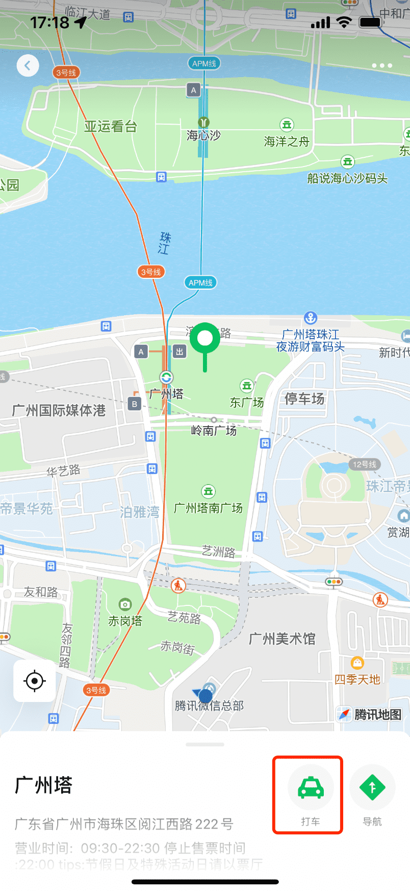

<!-- 来源: https://developers.weixin.qq.com/miniprogram/dev/framework/open-ability/location-message.html -->

# 位置消息打开

> 微信客户端 8.0.32 及以上版本支持

为了让用户更便捷地使用小程序的打车服务，我们在位置消息详情页的菜单中，新增了用小程序打车的入口，接入说明详见： [接入文档](https://open.go.qq.com/api/12-doc-takecar.html#%E6%8E%A5%E5%8F%A3%E8%B0%83%E7%94%A8%E8%AF%B4%E6%98%8E)

## 产品示意图

