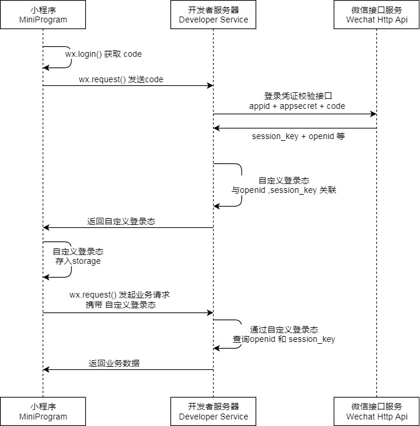

<!-- 来源: https://developers.weixin.qq.com/miniprogram/dev/framework/open-ability/login.html -->

# 小程序登录

小程序可以通过微信官方提供的登录能力方便地获取微信提供的用户身份标识，快速建立小程序内的用户体系。

## 登录流程时序

## 说明

1. 调用 [wx.login()](https://developers.weixin.qq.com/miniprogram/dev/api/open-api/login/wx.login.html) 获取 **临时登录凭证code** ，并回传到开发者服务器。
2. 调用 [auth.code2Session](https://developers.weixin.qq.com/miniprogram/dev/OpenApiDoc/user-login/code2Session.html) 接口，换取 **用户唯一标识 OpenID** 、 用户在微信开放平台账号下的 **唯一标识UnionID** （若当前小程序已绑定到微信开放平台账号） 和 **会话密钥 session\_key** 。

之后开发者服务器可以根据用户标识来生成自定义登录态，用于后续业务逻辑中前后端交互时识别用户身份。

## 注意事项

1. 会话密钥 `session_key` 是对用户数据进行 [加密签名](./signature.md) 的密钥。为了应用自身的数据安全，开发者服务器 **不应该把会话密钥下发到小程序，也不应该对外提供这个密钥** 。
2. 临时登录凭证 code 只能使用一次
