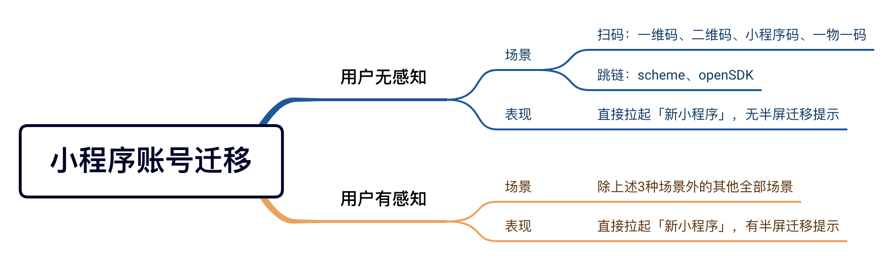

<!-- 来源: https://developers.weixin.qq.com/miniprogram/dev/framework/open-ability/migrateMiniprogram.html -->

# 小程序账号迁移

当需要废弃原小程序A，用目标小程序B承接服务时，小程序账号迁移可以高效率、低成本地将小程序A的用户迁移至小程序B中。 **完成账号迁移后，小程序A等同于注销，不能继续运营或提供相关功能及服务；用户通过任何方式访问小程序A时，会自动打开小程序B。**

**注意，小程序账号迁移和小程序主体变更为两种不同的能力** ，开发者可根据自己的实际诉求灵活选用这两种能力，具体区别如下：

-   1. [小程序账号迁移](https://kf.qq.com/product/wx_xcx.html#hid=3239) ：是在两个账号间进行的,小程序appid发生改变，主体可能相同也可为绑定在同一 [开放平台](./channels-activity.md) 账号下的 [关联主体](https://kf.qq.com/faq/190726rqmE7j190726BbeIFR.html) ,迁移完成后，原小程序将会被系统注销，无法恢复或使用;
-   1. [小程序主体变更](https://kf.qq.com/faq/180914RZVjyE180914YjMvAF.html) ：是在同一个账号里面进行的，小程序appid不变，运营权限、主体信息将发生变化，小程序不会被注销

## 申请流程

开发者可以在 [MP平台](https://mp.weixin.qq.com/wxamp/index/index?lang=zh_CN&token=161518159) 中的「设置 -> 基本设置 -> 账号信息 -> 原始ID -> 账号迁移」中发起小程序账号迁移申请。

### 准入条件

小程序账号为封号状态，海外主体账号，小游戏等暂不支持准入。

### 迁移限制

1. 一个目标小程序最多能被5个小程序迁移，已完成迁移的目标小程序，6个月内暂不支持再次发起账号迁移；
2. 原小程序和目标小程序主体必须为绑定在同一 [开放平台](./channels-activity.md) 账号下的相同主体或 [关联主体](https://kf.qq.com/faq/190726rqmE7j190726BbeIFR.html) 。

### 申请迁移流程

同意“小程序账号迁移协议” -> 选择目标小程序 -> 当前小程序管理员确认 -> 目标小程序管理员确认 -> 账号迁移冻结期(7天) -> 账号迁移完成 注意：在账号迁移冻结期内，开发者可撤销账号迁移流程；若未撤销流程，账号迁移一经完成，则不可撤销。

## 能力表现

### 用户无感知场景

#### 相关场景值

1. 扫码相关： 一维码（1025、1032）、二维码（1011、1013）、小程序码（1047、1049）、一物一码（1124、1126）
2. 外跳相关： scheme/URL Link（1065、1194）、openSDK（1069）

#### C端表现

无迁移提示，直接拉起小程序B

### 用户有感知场景

#### 相关场景值

除用户无感知场景值外的所有 [场景值](https://developers.weixin.qq.com/miniprogram/dev/reference/scene-list.html)

#### C端表现

1. 小程序A未被添加至「我的小程序」 从客户端8.0.32版本开始，用户打开小程序A，将直接拉起小程序B，并展示迁移半屏提示，用户点击「我知道了」后，后续该用户访问小程序A将自动拉起小程序B，不再出现提示，且小程序A的「最近使用」记录会被删除。

1. 小程序A已被添加至「我的小程序」 从客户端8.0.32版本开始，用户打开小程序A，将直接拉起小程序B，并展示迁移半屏提示，用户点击「我知道了」后，将「我的小程序」中的小程序A替换为小程序B；同时，后续该用户访问小程序A将自动拉起小程序B，不再出现提示，且小程序A的「最近使用」记录会被删除。

### 低版本客户端

低于8.0.32的客户端版本，不区分用户有感知和用户无感知场景，在任意场景下，用户打开小程序A，都将拉起H5页面展示迁移提示，用户点击「前往打开」后，将跳转打开小程序B。 若小程序A被添加至「我的小程序」，则打开小程序B后，页面出现Toast提示“已将当前小程序替换到「我的小程序」”。

### 调试流程

通过小程序账号迁移的方式打开的小程序， [场景值](https://developers.weixin.qq.com/miniprogram/dev/reference/scene-list.html) 均为1248。小程序发生账号迁移后，平台将默认拉起小程序B的首页，开发者若有打开特定页面的诉求，可根据启动参数自行调试。

#### 启动参数继承

小程序B可以通过以下2种方式，继承小程序A的appid、path、query和scene，对应字段分别为 `migrateSourceAppId` 、 `migrateSourcePath` 、 `migrateSourceQuery` 和 `migrateSourceScene`

1. 调用 [App.onLaunch](https://developers.weixin.qq.com/miniprogram/dev/reference/api/App.html#onLaunch-Object-object) 读取 `res.query` 参数
2. 调用 [wx.getLaunchOptionsSync](https://developers.weixin.qq.com/miniprogram/dev/api/base/app/life-cycle/wx.getLaunchOptionsSync.html) 读取 `query` 参数

除appid、path、query和scene外的其他全部启动参数（extraData等）均会以原有方式继承

### 其他注意事项

1. 当用户第一次命中小程序迁移时，若网络环境较差，客户端无法拿到迁移信息或小程序B无法正常Launch，此时会拉起小程序A。若业务有较大调整，建议开发者在小程序A中做好兼容逻辑；
2. 小程序账号迁移仅针对正式版小程序生效，对于体验版和开发版不生效;
3. 暂不支持将原小程序的管理员、项目成员和体验成员自动迁移至目标小程序，如有需要，开发者需自行添加。
