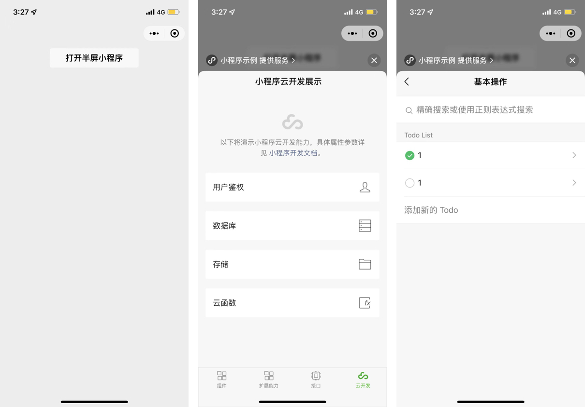

<!-- 来源: https://developers.weixin.qq.com/miniprogram/dev/framework/open-ability/openEmbeddedMiniProgram.html -->

# 打开半屏小程序

从基础库 [2.20.1](../compatibility.md) 开始支持

当小程序需要打开另一个小程序让用户进行快捷操作时，可将要打开的小程序以半屏的形态跳转。



## 调用流程

### 打开半屏小程序

1. **2.23.1以下版本基础库** ，开发者需要在全局配置 `app.json` 的 `embeddedAppIdList` 字段中声明需要半屏跳转的小程序，若不配置将切换为普通的小程序跳转小程序。 **2.23.1及以上版本起无需配置** 。

配置示例：

```json
{
  "embeddedAppIdList": ["wxe5f52902cf4de896"]
}
```

1. 开发者通过调用 [wx.openEmbeddedMiniProgram](https://developers.weixin.qq.com/miniprogram/dev/api/navigate/wx.openEmbeddedMiniProgram.html) 半屏跳转小程序。

### 半屏小程序环境判断

开发者可以通过调用 [wx.getEnterOptionsSync](https://developers.weixin.qq.com/miniprogram/dev/api/base/app/life-cycle/wx.getEnterOptionsSync.html) 读取 `apiCategory` 参数，当值为 `embedded` 时，可以判断此时小程序被半屏打开。

### 返回原小程序

被半屏打开的小程序可以以通过调用 [wx.navigateBackMiniProgram](https://developers.weixin.qq.com/miniprogram/dev/api/navigate/wx.navigateBackMiniProgram.html) 返回上一个小程序。

## 使用限制

使用过程有以下限制，若不符合以下所有条件将被自动切换为普通的小程序跳转小程序，不影响用户使用：

1. 被半屏跳转的小程序需要通过来源小程序的调用申请，开发者可在 小程序管理后台「设置」-「第三方设置」-「半屏小程序管理」板块发起申请，最多可以申请添加100个小程序（单个小程序最多可被 10000 个小程序添加）；
2. 2.23.1版本以下基础库，被半屏打开的小程序需要在 `app.json` 的 `embeddedAppIdList` 字段中声明；
3. 当前小程序需为竖屏；
4. 被半屏跳转的小程序需为非个人主体小程序（不含小游戏）。
