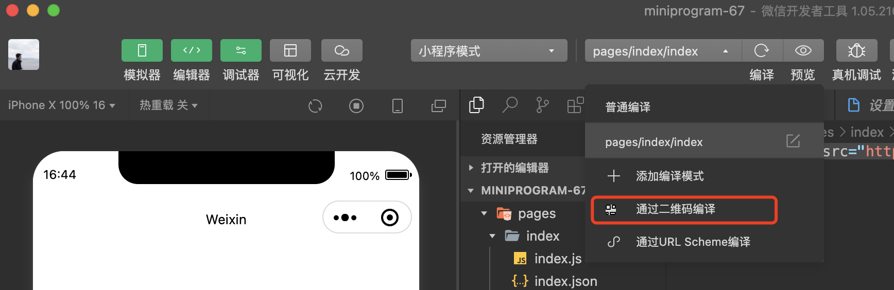

<!-- 来源: https://developers.weixin.qq.com/miniprogram/dev/framework/open-ability/qr-code.html -->

## 获取小程序码

通过后台接口可以获取小程序任意页面的小程序码，扫描该小程序码可以直接进入小程序对应的页面，所有生成的小程序码永久有效，可放心使用。 我们推荐生成并使用小程序码，它具有更好的辨识度，且拥有展示 [“公众号关注组件”](https://developers.weixin.qq.com/miniprogram/dev/component/official-account.html) 等高级能力。 生成的小程序码如下所示：

可以使用开发者工具 1.02.1803130 及以后版本通过 工具栏-自定义编译条件-通过二维码编译 功能来调试所获得的小程序码

为满足不同需求和场景，这里提供了两个接口，开发者可挑选适合自己的接口。

- [接口 A: 适用于需要的码数量较少的业务场景](https://developers.weixin.qq.com/miniprogram/dev/OpenApiDoc/qrcode-link/qr-code/getQRCode.html)
    - 生成小程序码，可接受 path 参数较长，生成个数受限，数量限制见 [注意事项](#%E6%B3%A8%E6%84%8F%E4%BA%8B%E9%A1%B9) ，请谨慎使用。
- [接口 B：适用于需要的码数量极多的业务场景](https://developers.weixin.qq.com/miniprogram/dev/OpenApiDoc/qrcode-link/qr-code/getUnlimitedQRCode.html)
    - 生成小程序码，可接受页面参数较短，生成个数不受限。

## 获取小程序二维码（不推荐使用）

通过后台接口可以获取小程序任意页面的小程序二维码，生成的小程序二维码如下所示：

- [接口 C：适用于需要的码数量较少的业务场景](https://developers.weixin.qq.com/miniprogram/dev/OpenApiDoc/qrcode-link/qr-code/createQRCode.html)
    - 生成二维码，可接受 path 参数较长，生成个数受限，数量限制见 [注意事项](#%E6%B3%A8%E6%84%8F%E4%BA%8B%E9%A1%B9) 。

## 获取小程序码（一物一码）

[微信一物一码](https://developers.weixin.qq.com/doc/offiaccount/Unique_Item_Code/Unique_Item_Code_Op_Guide.html) 支持生成小程序码。微信通过“一物一码”接口发放的二维码相比较普通链接二维码更安全、支持更小的印刷面积，支持跳转到指定小程序页面，且无数量限制。

- [接口 D：适用于“一物一码”的业务场景](https://developers.weixin.qq.com/doc/offiaccount/Unique_Item_Code/Unique_Item_Code_API_Documentation.html)

## 注意事项

1. 接口只能生成已发布的小程序的二维码
2. 接口 A 加上接口 C，总共生成的码数量限制为 100,000，请谨慎调用。
3. 接口 B 调用分钟频率受限(5000次/分钟)，如需大量小程序码，建议预生成。
