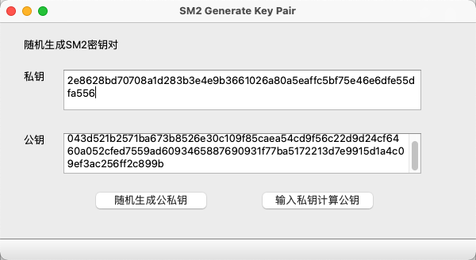
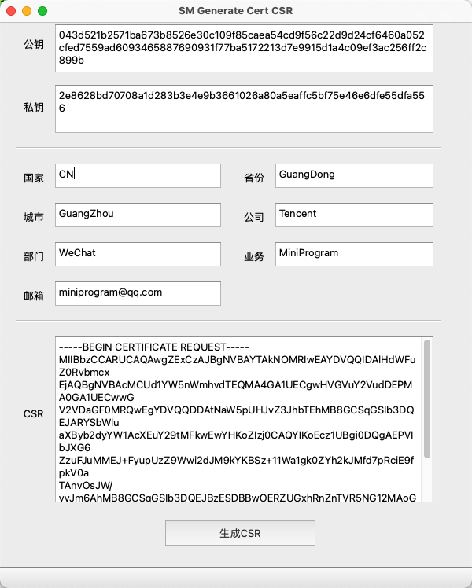
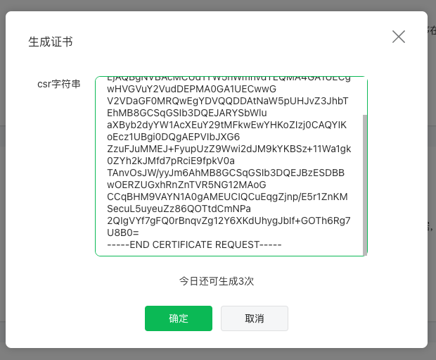

<!-- 来源: https://developers.weixin.qq.com/miniprogram/dev/framework/open-ability/safe-password.html -->

# 安全键盘

从基础库 [2.18.0](../compatibility.md) 开始支持

很多小程序业务需要输入一些敏感信息，比如密码口令，身份证，手机号等。不专业的做法是使用明文提交到业务后台，在网络传输中非常容易泄漏出去，同时也不满足合规要求。也有一些改进的做法，利用javascript对敏感信息进行加密，比如把明文的密码口令加密成为密文后再提交到业务后台。但因为小程序本质是基于H5技术，安全性不高，比如在H5上使用javascript比较容易能看到加密逻辑，或者加密强度不够，第三方输入法监听，内存遍历等，还是会造成口令泄露等问题。

为提高微信开放平台生态安全性，针对小程序内数字密码输入场景中可能存在的安全问题，微信侧在 [input](https://developers.weixin.qq.com/miniprogram/dev/component/input.html) 组件开放了安全键盘类型。通过引入安全键盘，小程序可以在用户输入过程中对关键信息时进行加密，防止键盘窃听，内存保护，有效保障用户数据资产的安全。

## 安全键盘保护原理

安全键盘采用非对称加解密算法，该算法需要两个密钥，一个叫公钥，可以公开，另一个叫私钥，需要私密保管。其中公钥加密的密文，只有私钥才能解开，而且通过公钥没办法计算出私钥，这样黑客即使拿到公钥也没办法解密密文。我们一般把公钥放到客户端上（比如小程序环境）做加密，私钥放到业务后台，这样就只有后台才能解密。黑客比较容易攻击本地客户端，但是攻破后台则难很多，甚至有些业务把私钥存储到硬件加密机芯片里面，这种情况黑客更是没办法获取得到私钥，因此采用非对称加解密算法是安全键盘推荐的模式，安全性可以得到保障。 为了保证私钥的私密性价值，我们要求不同的小程序业务使用自己独有的公钥私钥对，这样就可以完美的做到业务加密的数据隔离，业务A的公钥加密数据，就只有业务A自己的私钥可以解开，业务A的责任就是负责保护好自己的独有私钥即可。 为了证明一个公钥是属于业务A的，我们会颁发一个数字证书给到业务A的开发者，数字证书由腾讯官方签名，保证了可靠性与不可篡改性，数字证书里面会绑定一个业务独有的公钥， 业务的私钥是在向腾讯申请数字证书的过程中产生的，业务负责管理好自己的私钥，这个过程中，腾讯仅能接触到公钥，没办法得到业务自己的私钥，意味着即使是腾讯也没办法去解密小程序业务的用户输入的密码口令。为了国家合规的要求，我们颁发的是国产密码算法的数字证书，意味着非对称加解密算法是使用sm2算法，而非rsa等国际算法。

不同小程序业务，可能要加密的数据的格式可能有不同的要求，比如当用户输入的口令是“123456”，有些业务直接对明文做加密即可， 有些业务可能想先做一个哈希处理再加密，比如使用md5("123456"), 做了哈希后，能更有效的保护用户的明文密码，让业务都不好推测用户实际密码是什么， 另一些业务可能采用sha1哈希算法sha1("123456"), 也有业务采用更合规的国产密码哈希算法sm3（“123456”），甚至有些业务希望加上一些混淆字符（密码学中叫加盐）到口令明文里面，做更好的保护，就可能会变成sm3("123456+abc"), 这里面"+abc"就是额外加上的混淆字符示例。 所以为了能让不同的小程序业务有符合自己业务需求的加密格式，小程序安全键盘也开放了密码格式配置的能力，从而更好的跟自己的整体业务结合在一起，但是这个格式做不到万能兼容所有，所以当你应用小程序安全键盘的时候，可能会涉及部分后台验密服务的改造工作量，请提前评估可行性。

## 使用流程

### 1 生成证书签署请求

开发者可自行生成公钥私钥、证书签署请求，也可通过微信侧提供的工具生成证书签署请求。通过微信侧提供的工具（ [Windows](https://res.wx.qq.com/wxdoc/dist/assets/media/Windows_SMCryptoTools.00e25c9b.zip) / [Mac](https://res.wx.qq.com/wxdoc/dist/assets/media/Mac_SMCryptoTools.86f8d22d.zip) ）生成证书签署请求的步骤如下：

1. 通过SM2 Generate Key Pair功能生成公钥私钥



1. 通过SM Generate Cert CSR功能生成CSR



### 2 生成证书

在小程序管理后台「开发」-「开发管理」-「开发设置」-「安全键盘证书」板块填入CSR进行生成。



### 3 使用证书

1. 将生成的证书放入小程序代码包中。
2. 在 [input](https://developers.weixin.qq.com/miniprogram/dev/component/input.html) 组件中设置type=“safe-password”，并设置相关参数（safe-password-cert-path、safe-password-time-stamp、safe-password-length、safe-password-nonce、safe-password-salt、safe-password-custom-hash）。

#### 代码示例

```html
<input
  style="border: 1px solid blue;"
  type="safe-password"
  placeholder="123456"
  safe-password-cert-path="/minipro_test_cert.crt"
  safe-password-time-stamp="1618390369"
  safe-password-nonce="1618390369"
  safe-password-salt="zefengwang"
  safe-password-custom-hash="md5(sha1('foo' + sha256(sm3(password + 'bar'))))"
  bind:blur="onBlur"
  bind:input="onInput"
  value="{{value}}"
></input>
<button bind:tap="onClear">clear</button>

<view>{{detail}}</view>
```

```js
Page({
  data: {
    value: '123'
  },
  onInput(res) {
    console.log('onInput', res)
    this.setData({
      value: res.detail.value,
    })
  },
  onClear() {
    this.setData({
      value: '',
    })
  },
  onConfirm() {
    console.log('confirm')
  },
  onBlur(res) {
    console.log('onBlur', res)
    this.setData({
      detail: JSON.stringify(res.detail, null, 2)
    })
  },
})
```

## 密文

### 密文格式

安全键盘为了保护用户口令，采用了各种密码学算法来保护用户敏感信息，这些算法是可以根据小程序业务的实际需要做灵活配置的，因为不同的小程序，采用的口令加密格式不同，所以有必要做符合自己业务的配置。

小程序安全键盘对用户密码口令加密后的通用格式如下：

```js
'V02_' + sm2(header + timestamp + '\0' + pbkdf_hmac_hex(password, salt) + '\0' + nonce + '\0' + 随机数)
```

其中，pbkdf\_hmac\_hex()为安全键盘计算hash的算法表达式，可通过safe-password-custom-hash属性进行设置。 header前两个字节，用于标识密码hash算法：

1. 0x00 0x00: custom hash
2. 0x00 0x07: pbkdf\_hmac\_hex

这个格式考虑了几点安全因素：

1. 防重放：传入正确的时间戳timestamp，每次加密nonce 保持自增，保证了即使口令相同，每次加密密文也不相同
2. 防暴力破解：sm2非对称算法本身保证了防暴力破解的可能
3. 防追溯原文：内置pbkdf\_hmac\_hex 算法，也可以自定义hash算法；
4. 防彩虹表攻击：小程序开发者可以自定义动态salt；

小程序开发者如果打算使用安全键盘，首先在本地生成sm2 秘钥对，然后前往小程序管理后台申请小程序安全键盘数字证书。证书下发下来后，需要和小程序代码一起发布。 小程序调用安全键盘时，需要传入小程序安全键盘数字证书，完成证书合法性校验之后，再提取证书公钥并采用sm2 算法对用户数据进行加密。 由于采用证书公钥加密，只有用开发者自己持有的私钥才可以解密出数据明文。网络传输过程中，即使密文被恶意拦截，攻击者也无法拿到明文。

### 如何解密或验密

```js
'V02_' + sm2(header + timestamp + '\0' + hash(password, salt) + '\0' + nonce + '\0' + 随机数)
```

后台接收到密文后，参照以上格式进行解析： 1、 移除密文4字节前缀； 2、 使用小程序安全键盘证书对应的sm2 私钥解密，得到明文数据； 3、 解析明文数据，可以得到时间戳、密码hash、nonce 等字段；

首先，小程序开发者后台只能得到脱敏后的密码hash，无法得到明文。当然，根据合规要求，后台也不应该获取到用户密码明文。 其次，小程序开发者后台应妥善保存密码hash，作为匹配用户密码是否一致的依据。比如在用户注册或修改密码流程中，后台SM2 私钥解密出密码hash 之后，应当在数据库中（或者其它存储技术）持久化保存该密码hash。在后续用户登录或其它需要校验密码的场景，通过对比用户请求过来的密码hash 和之前保存的密码hash 是否一致，来确定密码是否验证通过。
