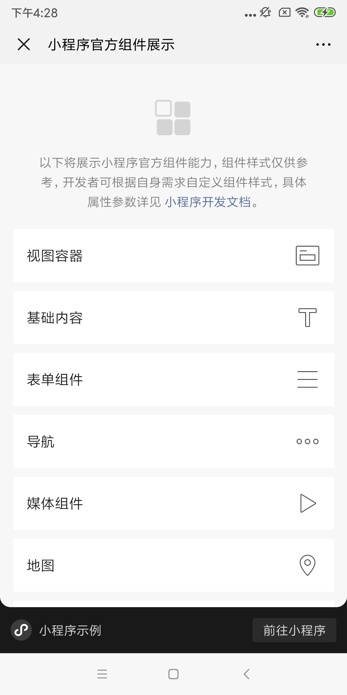

<!-- 来源: https://developers.weixin.qq.com/miniprogram/dev/framework/open-ability/share-timeline.html -->

# 分享到朋友圈

从基础库 [2.11.3](../compatibility.md) 开始支持

支持平台： Android 、 iOS：微信8.0.24及以上版本

可将小程序页面分享到朋友圈。适用于内容型页面的分享，不适用于有较多交互的页面分享。

## 设置分享状态

小程序页面默认不可被分享到朋友圈，开发者需主动设置“分享到朋友圈”。页面允许被分享到朋友圈，需满足两个条件：

1. 首先，页面需设置允许“发送给朋友”。具体参考 [`Page.onShareAppMessage`](https://developers.weixin.qq.com/miniprogram/dev/reference/api/Page.html#onShareAppMessage-Object-object) 接口文档
2. 满足条件 1 后，页面需设置允许“分享到朋友圈”，同时可自定义标题、分享图等。具体参考 [`Page.onShareTimeline`](https://developers.weixin.qq.com/miniprogram/dev/reference/api/Page.html#onShareTimeline) 接口文档

满足上述两个条件的页面，可被分享到朋友圈。

## 单页模式

用户在朋友圈打开分享的小程序页面，并不会真正打开小程序，而是进入一个“小程序单页模式”的页面，“单页模式”有以下特点：

1. “单页模式”下，页面顶部固定有导航栏，标题显示为当前页面 JSON 配置的标题。底部固定有操作栏，点击操作栏的“前往小程序”可打开小程序的当前页面。顶部导航栏与底部操作栏均不支持自定义样式。
2. “单页模式”默认运行的是小程序页面内容，但由于页面固定有顶部导航栏与底部操作栏，很可能会影响小程序页面的布局。因此，请开发者特别注意适配“单页模式”的页面交互，以实现流畅完整的交互体验。
3. “单页模式”下，一些组件或接口存在一定限制，详情见下文 [单页模式下的限制](#%E5%8D%95%E9%A1%B5%E6%A8%A1%E5%BC%8F%E4%B8%8B%E7%9A%84%E9%99%90%E5%88%B6) 章节

## 页面适配

可通过判断 [场景值](https://developers.weixin.qq.com/miniprogram/dev/reference/scene-list.html) 等于 1154 的方法来进行页面适配。另外，在单页模式下，可设置顶部导航栏与页面的相交状态，具体参考 [navigationBarFit](https://developers.weixin.qq.com/miniprogram/dev/reference/configuration/app.html#singlePage) 配置。

还需留意的是，在单页模式下， [wx.getSystemInfo](https://developers.weixin.qq.com/miniprogram/dev/api/base/system/wx.getSystemInfo.html) 接口返回的 safeArea 为整个屏幕空间。

## 单页模式下的限制

小程序“单页模式”适用于纯内容展示场景，可实现的交互与接口能力有限，因此存在如下限制：

1. 页面无登录态，与登录相关的接口，如 `wx.login` 均不可用；云开发资源需开启未登录访问方可在单页模式下使用，详见 [未登录模式](https://developers.weixin.qq.com/miniprogram/dev/wxcloud/basis/identityless.html) 。
2. 不允许跳转到其它页面，包括任何跳小程序页面、跳其它小程序、跳微信原生页面
3. 不允许横屏使用
4. 若页面包含 tabBar，tabBar 不会渲染，包括自定义 tabBar
5. 本地存储与小程序普通模式不共用

对于一些会产生交互的组件或接口，在点击后调用时，会弹 toast 提示“请前往小程序使用完整服务”。为达到良好的用户体验，请注意适配单页模式的接口能力，请勿大量使用被禁用的接口或组件。

禁用能力列表：

<table><thead><tr><th>分类</th> <th>功能点</th></tr></thead> <tbody><tr><td>组件</td> <td><a href="../../component/button.html">button open-type</a> 、 <a href="../../component/camera.html">camera</a> 、 <a href="../../component/editor.html">editor</a> 、 <a href="../../component/form.html">form</a> 、 <a href="../../component/functional-page-navigator.html">functional-page-navigator</a> 、 <a href="../../component/live-pusher.html">live-pusher</a> 、 <a href="../../component/navigator.html">navigator</a>  、 <a href="../../component/navigation-bar.html">navigation-bar</a>  、 <a href="../../component/official-account.html">official-account</a>  、 <a href="../../component/open-data.html">open-data</a>  、 <a href="../../component/web-view.html">web-view</a></td></tr> <tr><td>路由</td> <td><a href="../../api/route/wx.redirectTo.html">wx.redirectTo</a>  、 <a href="../../api/route/wx.reLaunch.html">wx.reLaunch</a>  、 <a href="../../api/route/wx.navigateTo.html">wx.navigateTo</a>  、 <a href="../../api/route/wx.switchTab.html">wx.switchTab</a>  、 <a href="../../api/route/wx.navigateBack.html">wx.navigateBack</a></td></tr> <tr><td>界面</td> <td><a href="../../api/ui/navigation-bar/wx.showNavigationBarLoading.html">导航栏</a> 、 <a href="../../api/ui/tab-bar/wx.showTabBarRedDot.html">Tab Bar</a></td></tr> <tr><td>网络</td> <td><a href="../../api/network/mdns/wx.startLocalServiceDiscovery.html">mDNS</a> 、 <a href="../../api/network/udp/wx.createUDPSocket.html">UDP 通信</a></td></tr> <tr><td>数据缓存</td> <td><a href="../../api/storage/background-fetch/wx.getBackgroundFetchData.html">周期性更新</a></td></tr> <tr><td>媒体</td> <td><a href="../../api/media/voip/wx.joinVoIPChat.html">VoIP</a> 、 <a href="../../api/media/video/wx.chooseMedia.html">wx.chooseMedia</a> 、 <a href="../../api/media/image/wx.chooseImage.html">wx.chooseImage</a> 、 <a href="../../api/media/image/wx.saveImageToPhotosAlbum.html">wx.saveImageToPhotosAlbum</a> 、 <a href="../../api/media/video/wx.chooseVideo.html">wx.chooseVideo</a> 、 <a href="../../api/media/video/wx.saveVideoToPhotosAlbum.html">wx.saveVideoToPhotosAlbum</a> 、 <a href="../../api/media/video/wx.getVideoInfo.html">wx.getVideoInfo</a> 、 <a href="../../api/media/video/wx.compressVideo.html">wx.compressVideo</a></td></tr> <tr><td>位置</td> <td><a href="../../api/location/wx.openLocation.html">wx.openLocation</a> 、 <a href="../../api/location/wx.chooseLocation.html">wx.chooseLocation</a> 、 <a href="../../api/location/wx.startLocationUpdateBackground.html">wx.startLocationUpdateBackground</a> 、 <a href="../../api/location/wx.startLocationUpdate.html">wx.startLocationUpdate</a></td></tr> <tr><td>转发</td> <td><a href="../../api/share/wx.getShareInfo.html">wx.getShareInfo</a> 、 <a href="../../api/share/wx.showShareMenu.html">wx.showShareMenu</a> 、 <a href="../../api/share/wx.hideShareMenu.html">wx.hideShareMenu</a> 、 <a href="../../api/share/wx.updateShareMenu.html">wx.updateShareMenu</a></td></tr> <tr><td>文件</td> <td><a href="../../api/file/wx.openDocument.html">wx.openDocument</a></td></tr> <tr><td>开放接口</td> <td><a href="../../api/open-api/login/wx.login.html">登录</a> 、 <a href="../../api/navigate/wx.navigateToMiniProgram.html">小程序跳转</a> 、 <a href="../../api/open-api/user-info/wx.getUserInfo.html">用户信息</a> 、 <a href="../../api/payment/wx.requestPayment.html">支付</a> 、 <a href="../../api/open-api/authorize/wx.authorize.html">授权</a> 、 <a href="../../api/open-api/setting/wx.openSetting.html">设置</a> 、 <a href="../../api/open-api/address/wx.chooseAddress.html">收货地址</a> 、 <a href="../../api/open-api/card/wx.openCard.html">卡券</a> 、 <a href="../../api/open-api/invoice/wx.chooseInvoiceTitle.html">发票</a> 、 <a href="../../api/open-api/soter/wx.startSoterAuthentication.html">生物认证</a> 、 <a href="../../api/open-api/werun/wx.getWeRunData.html">微信运动</a> 、 <a href="../../api/open-api/redpackage/wx.showRedPackage.html">微信红包</a></td></tr> <tr><td>设备</td> <td><a href="../../api/device/bluetooth/wx.startBluetoothDevicesDiscovery.html">蓝牙</a> 、 <a href="../../api/device/ibeacon/wx.startBeaconDiscovery.html">iBeacon</a> 、 <a href="(wx.startWiFi)">Wi-Fi</a> 、 <a href="../../api/device/nfc-hce/wx.startHCE.html">NFC</a> 、 <a href="../../api/device/contact/wx.addPhoneContact.html">联系人</a> 、 <a href="../../api/device/clipboard/wx.setClipboardData.html">剪贴板</a> 、 <a href="../../api/device/phone/wx.makePhoneCall.html">电话</a> 、 <a href="../../api/device/scan/wx.scanCode.html">扫码</a></td></tr> <tr><td>广告</td> <td><a href="../../component/ad.html">ad</a> 、 <a href="../../api/ad/wx.createRewardedVideoAd.html">wx.createRewardedVideoAd</a> 、 <a href="../../api/ad/wx.createInterstitialAd.html">wx.createInterstitialAd</a></td></tr></tbody></table>

## 运营须知

分享朋友圈能力是为了满足纯内容场景的分享诉求，滥用于营销、诱导等行为将会被打击。

1. 小程序提供的服务中，不得存在滥用分享违规行为。如强制用户分享行为；分享立即获得利益的诱导行为；以及通过明示或暗示的样式来达到诱导分享目的的行为等。详见 [《微信小程序平台运营规范》](https://developers.weixin.qq.com/miniprogram/product/#_5-1-%E6%BB%A5%E7%94%A8%E5%88%86%E4%BA%AB%E8%A1%8C%E4%B8%BA)
2. 在“单页模式”下，不得诱导或强制用户点击“打开小程序”，应在“单页模式”中尽可能呈现完整的内容

## 注意事项

1. 低版本微信客户端打开时，会进入一个升级提示页面
2. 不支持在小程序页面内直接发起分享
3. 自定义分享内容时不支持自定义页面路径
4. 存在 web-view 组件的页面不支持发起分享
5. 支持打开开发版、体验版，无权限人员进入时页面会提示无权限
