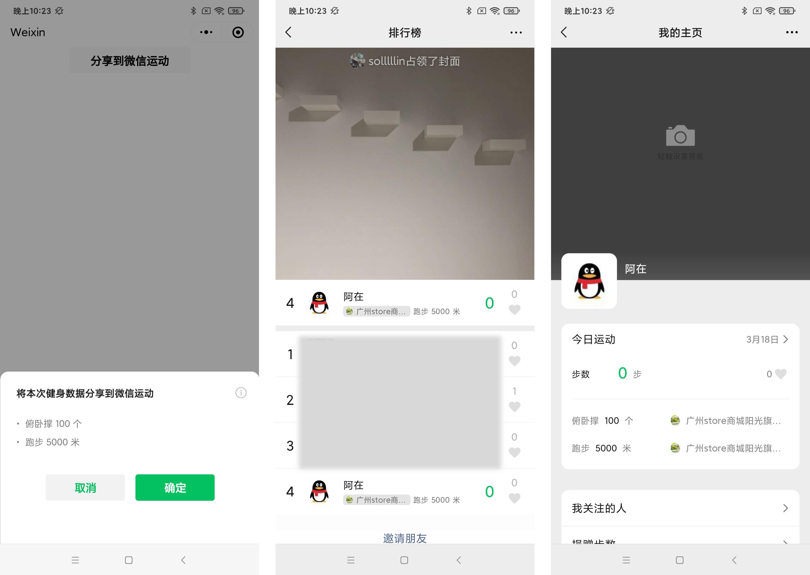

<!-- 来源: https://developers.weixin.qq.com/miniprogram/dev/framework/open-ability/share-werun.html -->

# 分享数据到微信运动

从基础库 [2.14.0](../compatibility.md) 开始支持

可将用户在小程序内的运动数据分享到微信运动。

## 申请开通

小程序管理后台，「开发」-「接口设置」中自助开通该组件权限。 只针对「体育-在线健身」类目的小程序开放。

## 调用流程

开发者通过调用 [wx.shareToWeRun](https://developers.weixin.qq.com/miniprogram/dev/api/open-api/werun/wx.shareToWeRun.html) 传入用户的运动数据，会触发弹窗，用户点击确定后即可在微信运动排行榜与详情页中展示运动数据。 

## 注意事项

1. 对于开发版和体验版小程序，可以在小程序内正常调用该接口，但不会展示到微信运动中。开发者在开发时可以以调用接口是否成功作为是否打卡成功的依据。
2. 用户每次打卡都会记录到微信运动中，请开发者妥善处理用户打卡成功的场景，避免重复打卡。
3. 微信运动排行榜中，展示的是最近一次打卡的第一条记录。

## 运动类型

当前支持以下运动类型的与不同运动类型支持传入的单位如下：

<table><thead><tr><th>运动类型</th> <th>typeId</th> <th>支持传入单位</th></tr></thead> <tbody><tr><td>锻炼</td> <td>1001</td> <td>time/calorie</td></tr> <tr><td>体能训练</td> <td>1002</td> <td>time/calorie</td></tr> <tr><td>功能性训练</td> <td>1003</td> <td>time/calorie</td></tr> <tr><td>瑜伽</td> <td>2001</td> <td>time/calorie</td></tr> <tr><td>钓鱼</td> <td>2002</td> <td>time/calorie</td></tr> <tr><td>广场舞</td> <td>2003</td> <td>time/calorie</td></tr> <tr><td>踢足球</td> <td>2004</td> <td>time/calorie</td></tr> <tr><td>打篮球</td> <td>2005</td> <td>time/calorie</td></tr> <tr><td>打羽毛球</td> <td>2006</td> <td>time/calorie</td></tr> <tr><td>打乒乓球</td> <td>2007</td> <td>time/calorie</td></tr> <tr><td>打网球</td> <td>2008</td> <td>time/calorie</td></tr> <tr><td>跑步</td> <td>3001</td> <td>time/distance/calorie</td></tr> <tr><td>登山</td> <td>3002</td> <td>time/distance/calorie</td></tr> <tr><td>骑车</td> <td>3003</td> <td>time/distance/calorie</td></tr> <tr><td>游泳</td> <td>3004</td> <td>time/distance/calorie</td></tr> <tr><td>滑雪</td> <td>3005</td> <td>time/distance/calorie</td></tr> <tr><td>跳绳</td> <td>4001</td> <td>number/calorie</td></tr> <tr><td>俯卧撑</td> <td>4002</td> <td>number/calorie</td></tr> <tr><td>深蹲</td> <td>4003</td> <td>number/calorie</td></tr></tbody></table>

设置时最多传入一个单位，不支持同时传入多个单位。不同单位支持传入的数量限制如下：

<table><thead><tr><th>单位</th> <th>说明</th> <th>有效值</th></tr></thead> <tbody><tr><td>number</td> <td>运动个数，单位：个</td> <td>有效值1-10000，需为整数</td></tr> <tr><td>distance</td> <td>运动距离，单位：米</td> <td>有效值1-100000，需为整数</td></tr> <tr><td>time</td> <td>运动时间，单位：分钟</td> <td>有效值1-1440，需为整数</td></tr></tbody></table>

## 代码示例

```js
wx.shareToWeRun({
      recordList: [{
        typeId: 4001,
        number: 180
      }, {
        typeId: 3001,
        distance: 100000
      }],
      success(res) {
        wx.showToast({
          title: '打卡成功',
        })
      },
      fail(res) {
        wx.showToast({
          icon: "none",
          title: '打卡失败',
        })
      }
    })
```
