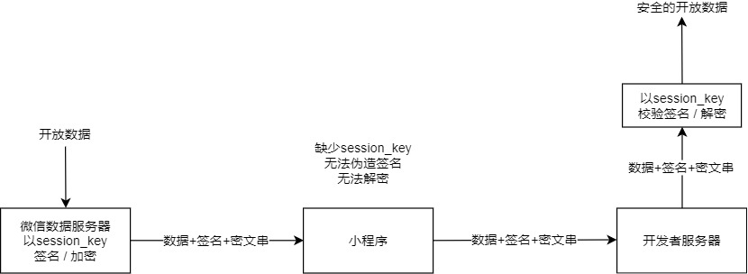

<!-- 来源: https://developers.weixin.qq.com/miniprogram/dev/framework/open-ability/signature.html -->

# 服务端获取开放数据

小程序可以通过各种前端接口获取微信提供的开放数据。考虑到开发者服务端也需要获取这些开放数据，微信提供了两种获取方式：

- [方式一](#method-decode) ：开发者后台校验与解密开放数据
- [方式二](#method-cloud) ： [云调用](https://developers.weixin.qq.com/miniprogram/dev/wxcloud/guide/openapi/openapi.html) 直接获取开放数据（ [云开发](https://developers.weixin.qq.com/miniprogram/dev/wxcloud/basis/getting-started.html) ）

## 方式一：开发者后台校验与解密开放数据

微信会对这些开放数据做签名和加密处理。开发者后台拿到开放数据后可以对数据进行校验签名和解密，来保证数据不被篡改。



签名校验以及数据加解密涉及用户的会话密钥 session\_key。 开发者应该事先通过 [wx.login](https://developers.weixin.qq.com/miniprogram/dev/api/open-api/login/wx.login.html) 登录流程获取会话密钥 session\_key 并保存在服务器。为了数据不被篡改，开发者不应该把 session\_key 传到小程序客户端等服务器外的环境。

### 数据签名校验

为了确保开放接口返回用户数据的安全性，微信会对明文数据进行签名。开发者可以根据业务需要对数据包进行签名校验，确保数据的完整性。

1. 通过调用接口（如 [wx.getUserInfo](https://developers.weixin.qq.com/miniprogram/dev/api/open-api/user-info/wx.getUserInfo.html) ）获取数据时，接口会同时返回 rawData、signature，其中 signature = sha1( rawData + session\_key )
2. 开发者将 signature、rawData 发送到开发者服务器进行校验。服务器利用用户对应的 session\_key 使用相同的算法计算出签名 signature2 ，比对 signature 与 signature2 即可校验数据的完整性。

**如 wx.getUserInfo的数据校验：**

接口返回的rawData：

```json
{
  "nickName": "Band",
  "gender": 1,
  "language": "zh_CN",
  "city": "Guangzhou",
  "province": "Guangdong",
  "country": "CN",
  "avatarUrl": "http://wx.qlogo.cn/mmopen/vi_32/1vZvI39NWFQ9XM4LtQpFrQJ1xlgZxx3w7bQxKARol6503Iuswjjn6nIGBiaycAjAtpujxyzYsrztuuICqIM5ibXQ/0"
}
```

用户的 session-key：

```
HyVFkGl5F5OQWJZZaNzBBg==
```

用于签名的字符串为：

```
{"nickName":"Band","gender":1,"language":"zh_CN","city":"Guangzhou","province":"Guangdong","country":"CN","avatarUrl":"http://wx.qlogo.cn/mmopen/vi_32/1vZvI39NWFQ9XM4LtQpFrQJ1xlgZxx3w7bQxKARol6503Iuswjjn6nIGBiaycAjAtpujxyzYsrztuuICqIM5ibXQ/0"}HyVFkGl5F5OQWJZZaNzBBg==
```

使用sha1得到的结果为

```
75e81ceda165f4ffa64f4068af58c64b8f54b88c
```

### 加密数据解密算法

接口如果涉及敏感数据（如 [wx.getUserInfo](https://developers.weixin.qq.com/miniprogram/dev/api/open-api/user-info/wx.getUserInfo.html) 当中的 openId 和 unionId），接口的明文内容将不包含这些敏感数据。开发者如需要获取敏感数据，需要对接口返回的 **加密数据(encryptedData)** 进行对称解密。 解密算法如下：

1. 对称解密使用的算法为 AES-128-CBC，数据采用PKCS#7填充。
2. 对称解密的目标密文为 Base64\_Decode(encryptedData)。
3. 对称解密秘钥 aeskey = Base64\_Decode(session\_key), aeskey 是16字节。
4. 对称解密算法初始向量 为Base64\_Decode(iv)，其中iv由数据接口返回。

微信官方提供了多种编程语言的示例代码（（ [点击下载](https://res.wx.qq.com/wxdoc/dist/assets/media/aes-sample.eae1f364.zip) ）。每种语言类型的接口名字均一致。调用方式可以参照示例。

另外，为了应用能校验数据的有效性，会在敏感数据加上数据水印( watermark )

**watermark参数说明：**

<table><thead><tr><th>参数</th> <th>类型</th> <th>说明</th></tr></thead> <tbody><tr><td>appid</td> <td>String</td> <td>敏感数据归属 appId，开发者可校验此参数与自身 appId 是否一致</td></tr> <tr><td>timestamp</td> <td>Int</td> <td>敏感数据获取的时间戳, 开发者可以用于数据时效性校验</td></tr></tbody></table>

如接口 [wx.getUserInfo](https://developers.weixin.qq.com/miniprogram/dev/api/open-api/user-info/wx.getUserInfo.html) 敏感数据当中的 watermark：

```json
{
    "openId": "OPENID",
    "nickName": "NICKNAME",
    "gender": GENDER,
    "city": "CITY",
    "province": "PROVINCE",
    "country": "COUNTRY",
    "avatarUrl": "AVATARURL",
    "unionId": "UNIONID",
    "watermark":
    {
        "appid":"APPID",
        "timestamp":TIMESTAMP
    }
}
```

注：

1. 解密后得到的json数据根据需求可能会增加新的字段，旧字段不会改变和删减，开发者需要预留足够的空间

### 会话密钥 session\_key 有效性

开发者如果遇到因为 session\_key 不正确而校验签名失败或解密失败，请关注下面几个与 session\_key 有关的注意事项。

1. [wx.login](https://developers.weixin.qq.com/miniprogram/dev/api/open-api/login/wx.login.html) 调用时，用户的 session\_key **可能** 会被更新而致使旧 session\_key 失效（刷新机制存在最短周期，如果同一个用户短时间内多次调用 [wx.login](https://developers.weixin.qq.com/miniprogram/dev/api/open-api/login/wx.login.html) ，并非每次调用都导致 session\_key 刷新）。开发者应该在明确需要重新登录时才调用 [wx.login](https://developers.weixin.qq.com/miniprogram/dev/api/open-api/login/wx.login.html) ，及时通过 [code2Session](https://developers.weixin.qq.com/miniprogram/dev/framework/open-ability/(user-login/code2Session)) 接口更新服务器存储的 session\_key。
2. 微信不会把 session\_key 的有效期告知开发者。我们会根据用户使用小程序的行为对 session\_key 进行续期。用户越频繁使用小程序，session\_key 有效期越长。
3. 开发者在 session\_key 失效时，可以通过重新执行登录流程获取有效的 session\_key。使用接口 [wx.checkSession](https://developers.weixin.qq.com/miniprogram/dev/api/open-api/login/wx.checkSession.html) 可以校验 session\_key 是否有效，从而避免小程序反复执行登录流程。
4. 当开发者在实现自定义登录态时，可以考虑以 session\_key 有效期作为自身登录态有效期，也可以实现自定义的时效性策略。

## 方式二：云调用直接获取开放数据

接口如果涉及敏感数据（如 [wx.getWeRunData](https://developers.weixin.qq.com/miniprogram/dev/api/open-api/werun/wx.getWeRunData.html) ），接口的明文内容将不包含这些敏感数据，而是在返回的接口中包含对应敏感数据的 `cloudID` 字段，数据可以通过云函数获取。完整流程如下：

**1. 获取 cloudID**

使用 2.7.0 或以上版本的基础库，如果小程序已开通云开发，在开放数据接口的返回值中可以通过 `cloudID` 字段获取（与 `encryptedData` 同级）， `cloudID` 有效期五分钟。

**2. 调用云函数**

调用云函数时，对传入的 `data` 参数，如果有顶层字段的值为通过 `wx.cloud.CloudID` 构造的 `CloudID` ，则调用云函数时，这些字段的值会被替换为 `cloudID` 对应的开放数据，一次调用最多可替换 5 个 `CloudID` 。

示例：

在小程序获取到 `cloudID` 之后发起调用：

```js
wx.cloud.callFunction({
  name: 'myFunction',
  data: {
    weRunData: wx.cloud.CloudID('xxx'), // 这个 CloudID 值到云函数端会被替换
    obj: {
      shareInfo: wx.cloud.CloudID('yyy'), // 非顶层字段的 CloudID 不会被替换，会原样字符串展示
    }
  }
})
```

在云函数收到的 `event` 示例：

```
// event
{
  // weRunData 的值已被替换为开放数据
  "weRunData": {
    "cloudID": "xxx",
    "data": {
      "stepInfoList": [
        {
          "step": 5000,
          "timestamp": 1554814312,
        }
      ],
      "watermark": {
        "appid": "wx1111111111",
        "timestamp": 1554815786
      }
    }
  },
  "obj": {
    // 非顶层字段维持原样
    "shareInfo": "yyy",
  }
}
```

如果 `cloudID` 非法或过期，则在 `event` 中获取得到的将是一个有包含错误码、错误信息和原始 `cloudID` 的对象。过期 `cloudID` 换取结果示例：

```
// event
{
  "weRunData": {
    "cloudID": "xxx",
    "errCode": -601006,
    "errMsg": "cloudID expired."
  },
  // ...
}
```
