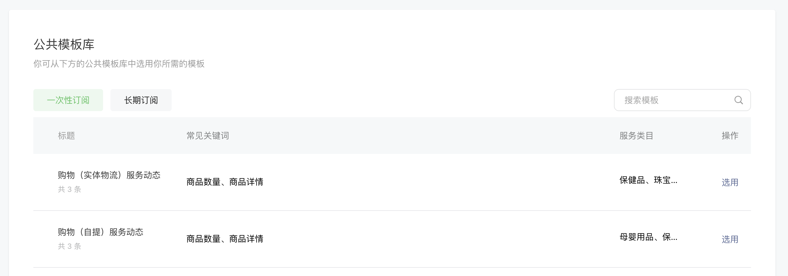

<!-- 来源: https://developers.weixin.qq.com/miniprogram/dev/framework/open-ability/subscribe-message-2.html -->

# 新版一次性订阅消息开发指南

## 1 接入指引

### 1.1 接入前准备

开发者首先需要明确自己的服务业态，选择对应的业态卡片进行接入。

开发者根据不同卡片的模版规则，向平台进行同步。每个卡片有若干状态模版（如“呼叫车辆中”、“司机赶往上车点中”等），每个模版有不同的必填字段与选填字段（如“司机车牌号”、“预计到达上车点时间”等），平台依据状态流转信息向用户下发通知。

### 1.2 申请模版

开发者需要登录 [小程序管理后台](https://mp.weixin.qq.com/) ，在「功能-订阅消息-公共模版库-一次性订阅」中查询可以申请的模板，审核通过后可使用。

模版有对应类目要求，符合类目要求的小程序可在公共模版库优先看到新版模版。

需要注意的是，添加此类模版后，模版id不支持通过原方式进行订阅与下发，请勿通过 [wx.requestSubscribeMessage](https://developers.weixin.qq.com/miniprogram/dev/api/open-api/subscribe-message/wx.requestSubscribeMessage.html) 向用户申请订阅该模版。



此外，开发者、代开发服务商可通过服务端接口 [addMessageTemplate](https://developers.weixin.qq.com/miniprogram/dev/OpenApiDoc/mp-message-management/subscribe-message/addMessageTemplate.html) 添加模版， `tid` 见下文， `kidList` 请传入空数组。

目前共支持支持模版情况如下：

<table><thead><tr><th>notify_type</th> <th>卡片业态</th> <th>类目</th> <th>下发code获取方式</th> <th>模版定义</th> <th>addMessageTemplate接口 tid</th></tr></thead> <tbody><tr><td>2001</td> <td>购物（实体物流）服务动态</td> <td>商家自营、电商平台/电商平台</td> <td>将微信支付订单号作为 code</td> <td><a href="./subscribe-message-template/2001.html">链接</a></td> <td>10000001</td></tr> <tr><td>2002</td> <td>购物（自提）服务动态</td> <td>商家自营、电商平台/电商平台</td> <td>将微信支付订单号作为 code</td> <td><a href="./subscribe-message-template/2002.html">链接</a></td> <td>10000002</td></tr> <tr><td>2003</td> <td>购物（虚拟发货）服务动态</td> <td>IT科技/基础电信运营商、IT科技/电信业务代理商、IT科技/转售移动通信、商家自营、电商平台/电商平台</td> <td>将微信支付订单号作为 code</td> <td><a href="./subscribe-message-template/2003.html">链接</a></td> <td>10000003</td></tr> <tr><td>2004</td> <td>快递寄送服务动态</td> <td>物流服务/邮政、物流服务/收件/派件、物流服务/快递柜、物流服务/货物运输</td> <td>将微信支付订单号作为 code</td> <td><a href="./subscribe-message-template/2004.html">链接</a></td> <td>10000004</td></tr> <tr><td>2005</td> <td>保险购买服务动态</td> <td>金融业/保险、金融业/银行</td> <td>将微信支付订单号作为 code</td> <td><a href="./subscribe-message-template/2005.html">链接</a></td> <td>10000005</td></tr> <tr><td>2006</td> <td>购物&amp;餐饮（同城配送）服务动态</td> <td>商家自营、电商平台/电商平台、餐饮服务/外卖平台、餐饮服务/餐饮服务场所/餐饮服务管理企业</td> <td>将微信支付订单号作为 code</td> <td><a href="./subscribe-message-template/2006.html">链接</a></td> <td>10000006</td></tr> <tr><td>2007</td> <td>购物&amp;餐饮&amp;本地生活（等候领取）服务动态</td> <td>餐饮服务/餐饮服务场所/餐饮服务管理企业</td> <td>将微信支付订单号作为 code</td> <td><a href="./subscribe-message-template/2007.html">链接</a></td> <td>10000007</td></tr> <tr><td>2008</td> <td>酒店预订服务动态</td> <td>旅游服务/住宿服务</td> <td>将微信支付订单号作为 code</td> <td><a href="./subscribe-message-template/2008.html">链接</a></td> <td>10000021</td></tr> <tr><td>2009</td> <td>机票服务动态</td> <td>交通服务/航空</td> <td>将微信支付订单号作为 code</td> <td><a href="./subscribe-message-template/2009.html">链接</a></td> <td>10000024</td></tr> <tr><td>2010</td> <td>火车票、汽车票、船票服务动态</td> <td>交通服务/火车/高铁/动车、交通服务/长途汽车</td> <td>将微信支付订单号作为 code</td> <td><a href="./subscribe-message-template/2010.html">链接</a></td> <td>10000022</td></tr> <tr><td>2011</td> <td>景区门票服务动态</td> <td>旅游服务/景区服务</td> <td>将微信支付订单号作为 code</td> <td><a href="./subscribe-message-template/2011.html">链接</a></td> <td>10000029</td></tr> <tr><td>1001</td> <td>打车服务动态</td> <td>交通服务/出租车、交通服务/网约车、交通服务/顺风车/拼车</td> <td>通过前端获取 code</td> <td><a href="./subscribe-message-template/1001.html">链接</a></td> <td>10000017</td></tr> <tr><td>1003</td> <td>同城配送服务动态</td> <td>商家自营/保健品、商家自营/珠宝玉石、商家自营/食品饮料、商家自营/成人用品 （医疗器械类）、商家自营/酒类、商家自营/成品油、商家自营/纪念币、商家自营/生鲜/初级食用农产品、商家自营/电话卡销售、商家自营/预付卡、商家自营/成人情趣用品、商家自营/百货商场/购物中心、商家自营/母婴食品、电商平台/电商平台、餐饮服务/外卖平台、餐饮服务/餐饮服务场所/餐饮服务管理企业</td> <td>通过前端获取 code</td> <td><a href="./subscribe-message-template/1003.html">链接</a></td> <td>10000019</td></tr> <tr><td>1004</td> <td>取餐等候服务动态</td> <td>餐饮服务/餐饮服务场所/餐饮服务管理企业</td> <td>通过前端获取 code</td> <td><a href="./subscribe-message-template/1004.html">链接</a></td> <td>10000020</td></tr> <tr><td>1005</td> <td>餐厅排队服务动态</td> <td>餐饮服务/餐饮服务场所/餐饮服务管理企业</td> <td>通过前端获取 code</td> <td><a href="./subscribe-message-template/1005.html">链接</a></td> <td>10000018</td></tr></tbody></table>

### 1.3 将微信支付订单号作为 code 的模版开发指南

#### 1.3.1 获取 code

当用户在小程序内进行支付后，根据下单渠道不同获取对应的 `code` ： （1）当前订单为 [普通微信支付订单](https://pay.weixin.qq.com/doc/v3/merchant/4012791894) 开发者可获得微信支付订单号，可直接作为 `code` 。 （2）当前订单为 [微信支付分订单](https://pay.weixin.qq.com/doc/v3/merchant/4012587050) 开发者可获得微信支付服务订单号，可直接作为 `code` 。

该 `code` 在当次服务进程中唯一，后续开发者更新用户的服务状态均通过此 `code` 进行。

注意事项：

1. **需要注意的是，微信支付订单号从生成到可被校验存在一定的时延可能，若收到报错为notify\_code 不存在，建议在1分钟后重试。**
2. 对于合单支付场景，需要使用子单的订单号作为 `code` ，多个子单可用于激活多个卡片，互不干扰。
3. 仅支持当前小程序的微信支付订单号/微信支付服务订单号，请勿使用其他小程序、公众号支付、APP支付的订单号。
4. 不同的下单渠道在调用服务端接口 `setUserNotify` 时，需要在传入的字段中进行相应的声明。

#### 1.3.2 激活卡片

开发者需在支付完成24小时内调用服务端接口 `setUserNotify` 传入初始化卡片状态与状态相关字段（见1.1中各模版定义链接），以首次激活 `code` ，后续才可以继续通过 `setUserNotify` 更新服务的动态。

#### 1.3.3 更新卡片状态

`code` 并激活后，开发者可在激活后30天内调用服务端接口 `setUserNotify` ，更新卡片状态与状态相关字段（见见1.1中各模版定义链接）。超过30天，或状态无可变更的下一状态时（如状态更新到“订单已完成”），不再允许开发者更新。

### 1.4 通过前端获取 code 的模版开发指南

#### 1.4.1 获取 code

从基础库 [2.26.2](../compatibility.md) 开始支持

开发者需要在前端将触发服务的 `button` 组件的 `open-type` 的值设置为 `liveActivity` ，设置 `activity-type` 参数为notify\_type。当用户点击 `button` 后，可以通过 `bindcreateliveactivity` 事件回调获取到 `code` 。

该 `code` 在当次服务进程中唯一，后续开发者更新用户的服务状态均通过此 `code` 进行。

注意事项：

1. 平台会对相关 `button` 组件进行检测，包括是否诱导用户点击、通过与卡片无关的按钮获取 `code` 等。

代码示例：

```
<button open-type="liveActivity" activity-type="1001" bindcreateliveactivity="onLiveActivityCreate">立即呼叫</button>
```

```
Page({
  onLiveActivityCreate (evt) {
    console.log(evt.detail.code)
  }
})
```

#### 1.4.2 激活卡片

开发者需要在获取后5分钟内调用服务端接口 `setUserNotify` 传入初始化卡片状态与状态相关字段（见1.1中各模版定义链接），以首次激活 `code` ，后续才可以继续通过 `setUserNotify` 更新服务的动态。

#### 1.4.3 更新卡片状态

`code` 激活后，可在激活后24小时内调用服务端接口 `setUserNotify` ，更新卡片状态与状态相关字段（见1.1中各模版定义链接）。超过24小时，或状态无可变更的下一状态时（如状态更新到“订单已完成”），不再允许开发者更新。

### 1.5 监听事件开发指南

开发者调用服务端接口 `setUserNotify` 后，会触发平台下发订阅消息，开发者可通过接入 [微信小程序消息推送服务](../server-ability/message-push.md) 接收订阅消息下发失败事件。

订阅消息下发失败事件参数如下：

<table><thead><tr><th>参数</th> <th>描述</th></tr></thead> <tbody><tr><td>ToUserName</td> <td>小程序账号ID</td></tr> <tr><td>FromUserName</td> <td>用户openid</td></tr> <tr><td>CreateTime</td> <td>时间戳</td></tr> <tr><td>MsgType</td> <td>消息类型，固定为"event"</td></tr> <tr><td>Event</td> <td>事件类型，固定为"notify_service_msg_send_result"</td></tr> <tr><td>openid</td> <td>用户openid</td></tr> <tr><td>notify_code</td> <td>动态更新令牌</td></tr> <tr><td>notify_type</td> <td>卡片id</td></tr> <tr><td>card_status</td> <td>状态id</td></tr> <tr><td>fail_ret</td> <td>错误码：-10001 系统错误；-10002 内容安全校验不通过；-1003 未添加订阅消息模版；-1004 用户拒收此 模版；-1005 消息下发过于频繁被拦截</td></tr> <tr><td>fail_msg</td> <td>错误信息</td></tr></tbody></table>

JSON格式示例如下：

```
{
    "ToUserName":"gh_e5e82d93a62a",
    "FromUserName":"o7esq5PHRGBQYmeNyfG064wEFVpQ",
    "CreateTime":1699428279,
    "MsgType":"event",
    "Event":"notify_service_msg_send_result",
    "openid":"o7esq5PHRGBQYmeNyfG064wEFVpQ",
    "notify_code":"p1.4200002043202311087295582095",
    "notify_type":2006,
    "card_status":4,
    "fail_ret":-1004,
    "fail_msg":"user reject message "
}
```

### 1.6 其他功能开发指南

#### 1.6.1 查询卡片状态

由于卡片状态的更新有一套严格的校验机制，在开发者向平台同步信息的过程中，存在信息丢失、更新不及时等场景，因此开发者可以通过服务端接口 `getUserNotify` 查询 `code` 对应在平台侧存储的状态与服务相关信息。

#### 1.6.2 传入扩展信息

开发者通过此功能除了可以向用户下发通知，还可以通过服务端接口 `getUserNotifyExt` 传入更多服务相关信息，实现更多功能，当前支持的能力包括：

1. 交易评价升级：https://docs.qq.com/doc/DV2J4U1ltSExScnBB

## 2 相关接口文档

激活与更新卡片： [setUserNotify](https://developers.weixin.qq.com/miniprogram/dev/OpenApiDoc/mp-message-management/subscribe-message/setUserNotify.html)

查询卡片状态： [getUserNotify](https://developers.weixin.qq.com/miniprogram/dev/OpenApiDoc/mp-message-management/subscribe-message/getUserNotify.html)

配置更多服务相关信息： [setUserNotifyExt](https://developers.weixin.qq.com/miniprogram/dev/OpenApiDoc/mp-message-management/subscribe-message/setUserNotifyExt.html)

## 3 Q&A

以下Q&A回答了部分开发者关心的内容，更多提问可前往 [微信开放社区](https://developers.weixin.qq.com/community/develop/question) 提问。

### 激活与更新机制

Q：激活时间与更新时间是否可以延长？ A：目前暂无计划延长实时类卡片激活时间与更新时间。对于交易类的卡片，考虑到存在预售、服务预约等场景，后续计划支持开发者设置一个「开始更新时间」，从「开始更新时间」起计算30天可更新时间。

### 通知机制

Q：为什么有的状态变更会下发通知，有的不会？对于不下发通知的状态，我是否没有必要按照模版传入？ A：微信将根据用户需求，动态调整下发内容，因此开发者可将所有的状态变按照模版传入，无需根据微信侧调整重新接入。

Q：为什么有的字段传入后会在卡片中展示，有的不会？对于不展示的字段，我是否没有必要按照模版传入？ A：微信将根据用户需求，动态调整下发内容，因此开发者可将所有的字段变按照模版传入，无需根据微信侧调整重新接入。

Q：通过此方案下发的通知，部分会与以前的订阅消息冲突，会不会重复打扰用户？ A：对于通过此方式下发的消息，建议开发者先手动不下发相似的订阅消息模版，且不再弹出相似的订阅消息申请弹窗。后续微信侧将上线一定的策略统一帮助开发者拦截。

### 模版

Q：我当前的业务形态没有被满足，后续是否还会开放更多的模版？ A：平台会不断根据用户、开发者反馈设计新的模版，也欢迎开发者 [提交模版设计](https://docs.qq.com/form/page/DTVNPbmllSEVGYVdz) 。
