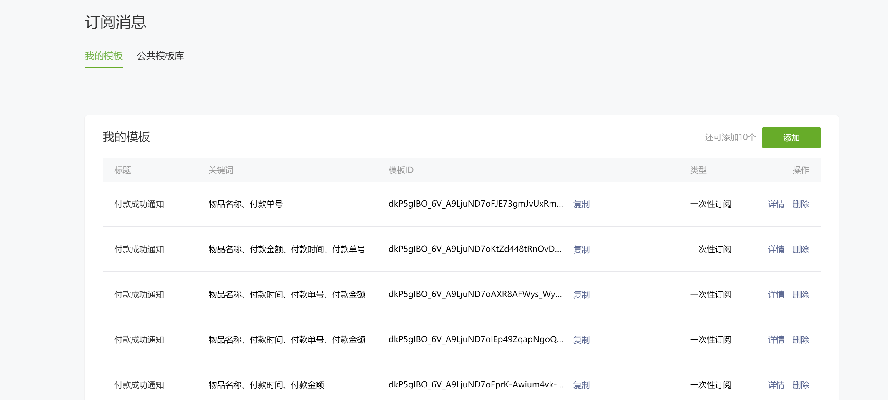
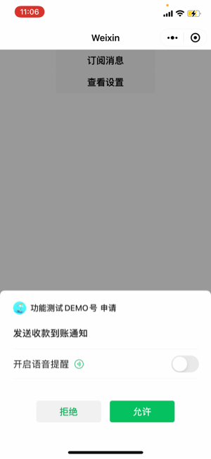
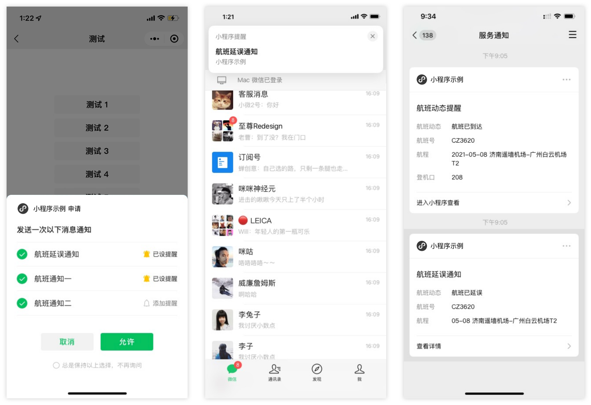

<!-- 来源: https://developers.weixin.qq.com/miniprogram/dev/framework/open-ability/subscribe-message.html -->

# 小程序订阅消息（用户通过弹窗订阅）开发指南

## 使用说明

### 步骤一：获取模板 ID

在微信公众平台手动配置获取模板 ID： 登录 [https://mp.weixin.qq.com](https://mp.weixin.qq.com/) 获取模板，如果没有合适的模板，可以申请添加新模板，审核通过后可使用。



### 步骤二：获取下发权限

一次性订阅消息、长期订阅消息，详见接口 [wx.requestSubscribeMessage](https://developers.weixin.qq.com/miniprogram/dev/api/open-api/subscribe-message/wx.requestSubscribeMessage.html)

设备订阅消息，详见接口 [wx.requestSubscribeDeviceMessage](https://developers.weixin.qq.com/miniprogram/dev/api/open-api/subscribe-message/wx.requestSubscribeDeviceMessage.html)

### 步骤三：调用接口下发订阅消息

一次性订阅消息、长期订阅消息，详见服务端接口 [subscribeMessage.send](https://developers.weixin.qq.com/miniprogram/dev/api-backend/open-api/subscribe-message/subscribeMessage.send.html) ，次数限制：开通支付能力的小程序下发上限是3kw/日，没开通的是1kw/日。

设备订阅消息，详见服务端接口 [hardwareDevice.send](https://developers.weixin.qq.com/miniprogram/dev/api-backend/open-api/hardware-device/hardwareDevice.send.html)

## 注意事项

- 用户勾选 “总是保持以上选择，不再询问” 之后，下次订阅调用 wx.requestSubscribeMessage 不会弹窗，保持之前的选择，修改选择需要打开小程序设置进行修改。

## 订阅消息事件推送

**1、当用户触发订阅消息弹框后，用户的相关行为事件结果会推送至开发者所配置的服务器地址或 [微信云托管](https://developers.weixin.qq.com/miniprogram/dev/wxcloudrun/src/guide/weixin/push.html) 服务。**

#### XML格式示例

```xml
<xml>
    <ToUserName><![CDATA[gh_123456789abc]]></ToUserName>
    <FromUserName><![CDATA[otFpruAK8D-E6EfStSYonYSBZ8_4]]></FromUserName>
    <CreateTime>1610969440</CreateTime>
    <MsgType><![CDATA[event]]></MsgType>
    <Event><![CDATA[subscribe_msg_popup_event]]></Event>
    <SubscribeMsgPopupEvent>
        <List>
            <TemplateId><![CDATA[VRR0UEO9VJOLs0MHlU0OilqX6MVFDwH3_3gz3Oc0NIc]]></TemplateId>
            <SubscribeStatusString><![CDATA[accept]]></SubscribeStatusString>
            <PopupScene>2</PopupScene>
        </List>
        <List>
            <TemplateId><![CDATA[9nLIlbOQZC5Y89AZteFEux3WCXRRRG5Wfzkpssu4bLI]]></TemplateId>
            <SubscribeStatusString><![CDATA[reject]]></SubscribeStatusString>
            <PopupScene>2</PopupScene>
        </List>
    </SubscribeMsgPopupEvent>
</xml>
```

#### JSON 格式示例

```json
{
  "ToUserName": "gh_123456789abc",
  "FromUserName": "o7esq5OI1Uej6Xixw1lA2H7XDVbc",
  "CreateTime": "1620973045",
  "MsgType": "event",
  "Event": "subscribe_msg_popup_event",
  "List": [   {
        "TemplateId": "hD-ixGOhYmUfjOnI8MCzQMPshzGVeux_2vzyvQu7O68",
        "SubscribeStatusString": "accept",
        "PopupScene": "0"
    }],
 }
```

若 "List" 只有一个对象，则只返回对象本身；若 "List" 多于一个对象，则返回一个包含所有对象的数组。

#### 参数说明

<table><thead><tr><th style="text-align:left">参数</th> <th style="text-align:left">说明</th></tr></thead> <tbody><tr><td style="text-align:left">ToUserName</td> <td style="text-align:left">小程序账号ID</td></tr> <tr><td style="text-align:left">FromUserName</td> <td style="text-align:left">用户openid</td></tr> <tr><td style="text-align:left">CreateTime</td> <td style="text-align:left">时间戳</td></tr> <tr><td style="text-align:left">TemplateId</td> <td style="text-align:left">模板id（一次订阅可能有多个id）</td></tr> <tr><td style="text-align:left">SubscribeStatusString</td> <td style="text-align:left">订阅结果（accept接收；reject拒收）</td></tr> <tr><td style="text-align:left">PopupScene</td> <td style="text-align:left">弹框场景，0代表在小程序页面内</td></tr></tbody></table>

**2、当用户在手机端服务通知里消息卡片右上角“...”管理消息时，相应的行为事件会推送至开发者所配置的服务器地址或 [微信云托管](https://developers.weixin.qq.com/miniprogram/dev/wxcloudrun/src/guide/weixin/push.html) 服务。（目前只推送取消订阅的事件，即对消息设置“拒收”）**

#### XML 格式示例

```xml
<xml>
    <ToUserName><![CDATA[gh_123456789abc]]></ToUserName>
    <FromUserName><![CDATA[otFpruAK8D-E6EfStSYonYSBZ8_4]]></FromUserName>
    <CreateTime>1610969440</CreateTime>
    <MsgType><![CDATA[event]]></MsgType>
    <Event><![CDATA[subscribe_msg_change_event]]></Event>
    <SubscribeMsgChangeEvent>
        <List>          <TemplateId><![CDATA[VRR0UEO9VJOLs0MHlU0OilqX6MVFDwH3_3gz3Oc0NIc]]></TemplateId>
            <SubscribeStatusString><![CDATA[reject]]></SubscribeStatusString>
        </List>
    </SubscribeMsgChangeEvent>
</xml>
```

#### JSON 格式示例

```json
{
      "ToUserName": "gh_123456789abc",
      "FromUserName": "o7esq5OI1Uej6Xixw1lA2H7XDVbc",
      "CreateTime": "1610968440",
      "MsgType": "event",
      "Event": "subscribe_msg_change_event",
      "List": [  {
                "TemplateId":"BEwX0BOT3MqK3Uc5oTU3CGBqzjpndk2jzUf7VfExd8",
                "SubscribeStatusString": "reject"
      }],
}
```

若 "List" 只有一个对象，则只返回对象本身；若 "List" 多于一个对象，则返回一个包含所有对象的数组。

#### 参数说明

<table><thead><tr><th style="text-align:left">参数</th> <th style="text-align:left">说明</th></tr></thead> <tbody><tr><td style="text-align:left">ToUserName</td> <td style="text-align:left">小程序账号ID</td></tr> <tr><td style="text-align:left">FromUserName</td> <td style="text-align:left">用户openid</td></tr> <tr><td style="text-align:left">CreateTime</td> <td style="text-align:left">时间戳</td></tr> <tr><td style="text-align:left">TemplateId</td> <td style="text-align:left">模板id（一次订阅可能有多个id）</td></tr> <tr><td style="text-align:left">SubscribeStatusString</td> <td style="text-align:left">订阅结果（reject拒收）</td></tr></tbody></table>

**3、调用订阅消息接口发送消息给用户的最终结果，会推送下发结果事件至开发者所配置的服务器地址或 [微信云托管](https://developers.weixin.qq.com/miniprogram/dev/wxcloudrun/src/guide/weixin/push.html) 服务。**

#### XML格式示例

```xml
<xml>
    <ToUserName><![CDATA[gh_123456789abc]]></ToUserName>
    <FromUserName><![CDATA[otFpruAK8D-E6EfStSYonYSBZ8_4]]></FromUserName>
    <CreateTime>1610969468</CreateTime>
    <MsgType><![CDATA[event]]></MsgType>
    <Event><![CDATA[subscribe_msg_sent_event]]></Event>
    <SubscribeMsgSentEvent>
        <List>       <TemplateId><![CDATA[VRR0UEO9VJOLs0MHlU0OilqX6MVFDwH3_3gz3Oc0NIc]]></TemplateId>
            <MsgID>1700827132819554304</MsgID>
            <ErrorCode>0</ErrorCode>
            <ErrorStatus><![CDATA[success]]></ErrorStatus>
        </List>
    </SubscribeMsgSentEvent>
</xml>
```

#### JSON 格式示例

```json
{
    "ToUserName": "gh_123456789abc",
    "FromUserName": "o7esq5PHRGBQYmeNyfG064wEFVpQ",
    "CreateTime": "1620963428",
    "MsgType": "event",
    "Event": "subscribe_msg_sent_event",
    "List": {
        "TemplateId": "BEwX0BO-T3MqK3Uc5oTU3CGBqzjpndk2jzUf7VfExd8",
        "MsgID": "1864323726461255680",
        "ErrorCode": "0",
        "ErrorStatus": "success"
      }

}
```

#### 参数说明

<table><thead><tr><th style="text-align:left">参数</th> <th style="text-align:left">说明</th></tr></thead> <tbody><tr><td style="text-align:left">ToUserName</td> <td style="text-align:left">小程序账号ID</td></tr> <tr><td style="text-align:left">FromUserName</td> <td style="text-align:left">用户openid</td></tr> <tr><td style="text-align:left">CreateTime</td> <td style="text-align:left">时间戳</td></tr> <tr><td style="text-align:left">TemplateId</td> <td style="text-align:left">模板id（一次订阅可能有多个id）</td></tr> <tr><td style="text-align:left">MsgID</td> <td style="text-align:left">消息id（调用接口时也会返回）</td></tr> <tr><td style="text-align:left">ErrorCode</td> <td style="text-align:left">推送结果状态码（0表示成功）</td></tr> <tr><td style="text-align:left">ErrorStatus</td> <td style="text-align:left">推送结果状态码对应的含义</td></tr></tbody></table>

**注意：失败仅包含因异步推送导致的系统失败**

## 订阅消息语音提醒

从基础库 [2.18.0](../compatibility.md) 开始支持

当前小程序订阅消息通知与微信消息的通知的提示音是一样的，对于部分订阅消息模板，增加语音提醒能力，播报语料部分字段支持开发者定义。

当开发者调用 [wx.requestSubscribeMessage](https://developers.weixin.qq.com/miniprogram/dev/api/open-api/subscribe-message/wx.requestSubscribeMessage.html) 时仅订阅1条消息且该模板支持开启语音提醒，用户在订阅时可以选择开启语音提醒。开启后将在接收订阅消息时会同步播报语音提醒。

当用户开启了语音提醒，开发者通过 [wx.getSetting](https://developers.weixin.qq.com/miniprogram/dev/api/open-api/setting/wx.getSetting.html) 获取的该模板的订阅状态为'acceptWithAudio'。

订阅弹窗样式如下：



当前支持开启语音提醒的模板及播报语料如下：

<table><thead><tr><th style="text-align:left">标题</th> <th style="text-align:left">类型</th> <th style="text-align:left">类目</th> <th style="text-align:left">播报语料</th></tr></thead> <tbody><tr><td style="text-align:left">收款到账通知</td> <td style="text-align:left">长期订阅</td> <td style="text-align:left">金融业-银行、金融业-收单商户服务</td> <td style="text-align:left">小程序示例收款10元，其中“小程序示例”会播报为下发小程序的小程序简称，10会播报为模版中的收款金额</td></tr></tbody></table>

以下情况会导致语音提醒无法播报：

1. 用户将服务通知设置为免打扰
2. 用户开启了手机静音模式或手机音量过低
3. 用户未打开微信新消息通知，可引导用户前往微信-“我”-“设置”-“新消息通知”中打开
4. 用户未打开系统对微信的通知
5. 用户开启了低电量模式
6. 用户版本过低：需要iOS 8.0.6与安卓8.0.3及以上

## 订阅消息添加提醒

从基础库 [2.22.0](../compatibility.md) 开始支持

用户在订阅小程序 **长期订阅消息** 时，可以根据自己的使用情况添加提醒。添加后，用户在收到消息时，在微信内将由横幅通知提醒。

当用户添加了提醒，开发者通过 [wx.getSetting](https://developers.weixin.qq.com/miniprogram/dev/api/open-api/setting/wx.getSetting.html) 获取的该模板的订阅状态为'acceptWithAlert'。

订阅弹窗样式如下：


